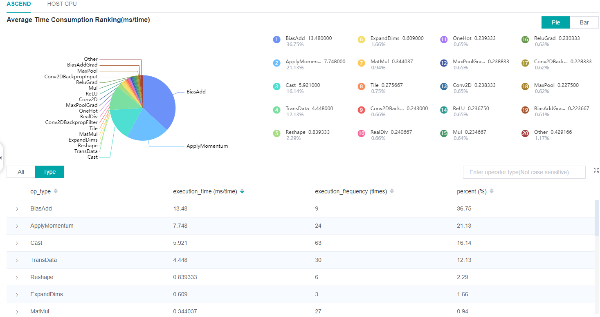
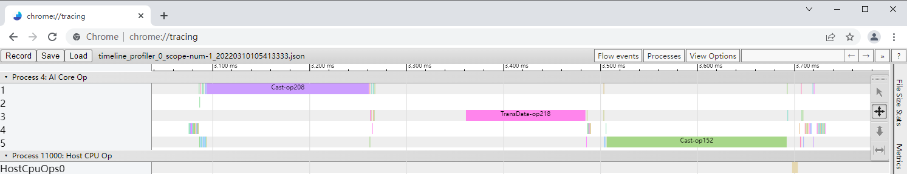

# Performance Profiling (Ascend-PyNative)

## Overview

This article describes how to use MindSpore Profiler for performance debugging on Ascend AI processors. PyNative mode currently supports three functions: Operator Performance Analysis, Timeline Analysis, Data Preparation Performance Analysis.

## 使用方式

Set the model running mode to PYNATIVE. Others are the same as GRAPH. You can refer to [Ascend-Graph to prepare the training script](https://www.mindspore.cn/mindinsight/docs/en/master/performance_profiling_ascend.html#preparing-the-training-script).

### Operator Performance Analysis

The operator performance analysis component is used to display the execution time of the operators(Ascend device/HOSTCPU) during MindSpore run, Ascend operator in PyNative mode does not distinguish between AICORE and AICPU.See below for data details. For data description, please refer to Ascend-Graph Operator Performance Analysis.

*Figure 1: Statistics for Operators*

### Timeline Analysis

The Timeline component displays the execution timing of operators, and PyNative mode is different from Graph mode as follows. Others can refer to [Ascend-Graph Timeline analysis](https://www.mindspore.cn/mindinsight/docs/en/master/performance_profiling_ascend.html#timeline-analysis).

- Ascend parallel execution operators in PyNative mode are distinguished by threads, and Graph mode by streams.
- PyNative mode only displays the time statistics of Ascend operators and HOSTCPU operators. Ascend operators do not distinguish between AICORE and AICPU operators.
- The step number of training(only supports dataset_sink_mode is set to True).

*Figure 2: Timeline Analysis*

### Data Preparation Performance Analysis

The Data preparation performance analysis component is used to analyse the execution of data input pipeline for the training. The function is consistent with the Graph mode. Refer to [Ascend-Graph Data Preparation Performance Analysis](https://www.mindspore.cn/mindinsight/docs/en/master/performance_profiling_ascend.html#data-preparation-performance-analysis).
