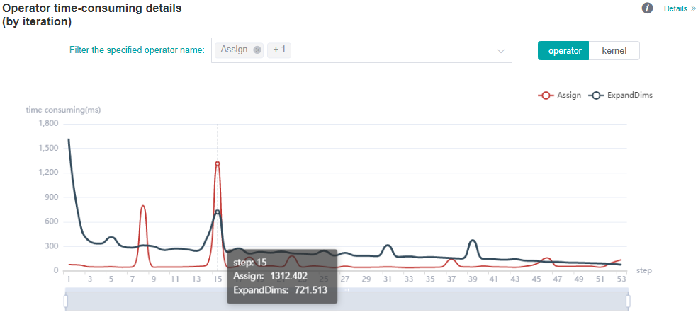

# Performance Profiling (GPU-Graph)

<a href="https://gitee.com/mindspore/docs/blob/r1.9/docs/mindinsight/docs/source_en/performance_profiling_gpu.md" target="_blank"></a>

## Overview

This article describes how to use MindSpore Profiler for performance debugging on GPU.

## Operation Process

- Prepare a training script, add profiler APIs in the training script and run the training script.
- Start MindInsight and specify the summary-base-dir using startup parameters, note that summary-base-dir is the parent directory of the directory created by Profiler. For example, the directory created by Profiler is `/home/user/code/data/`, the summary-base-dir should be `/home/user/code`. After MindInsight is started, access the visualization page based on the IP address and port number. The default access IP address is `http://127.0.0.1:8080`.
- Find the training in the list, click the performance profiling link and view the data on the web page.

> By default, common users do not have the permission to access the NVIDIA GPU performance counters on the target device.
>
> If common users need to use the profiler performance statistics capability in the training script, configure the permission by referring to the following description:
>
> <https://developer.nvidia.com/nvidia-development-tools-solutions-err-nvgpuctrperm-cupti>

## Preparing the Training Script

To enable the performance profiling of neural networks, MindSpore Profiler APIs should be added into the script.

- The MindSpore `Profiler` object needs to be initialized after `set_context` is set.

    > In multi-card training scene, `Profiler` object needs to be initialized after `set_auto_parallel_context`.
    >
    > Only the output_path in parameters is working in GPU now.

- At the end of the training, `Profiler.analyse` should be called to finish profiling and generate the performance analysis results.

For starting commands, refer to: [Example for performance debugging](https://www.mindspore.cn/mindinsight/docs/en/r1.9/performance_profiling_ascend.html#preparing-the-training-script).

In GPU scenarios, users can customize the callback mode to collect performance data. Data preparation stage and data sinking mode do not support this mode.

The following is the example：

```python
import mindspore as ms

class StopAtStep(ms.Callback):
    def __init__(self, start_step, stop_step):
        super(StopAtStep, self).__init__()
        self.start_step = start_step
        self.stop_step = stop_step
        self.profiler = Profiler(start_profile=False)
    def step_begin(self, run_context):
        cb_params = run_context.original_args()
        step_num = cb_params.cur_step_num
        if step_num == self.start_step:
            self.profiler.start()
    def step_end(self, run_context):
        cb_params = run_context.original_args()
        step_num = cb_params.cur_step_num
        if step_num == self.stop_step:
            self.profiler.stop()
    def end(self, run_context):
        self.profiler.analyse()
```

The code above is just an example. Users should implement callback by themselves.

## Launching MindInsight

The MindInsight launch command can refer to [MindInsight Commands](https://www.mindspore.cn/mindinsight/docs/en/r1.9/mindinsight_commands.html).

## Training Performance

Users can access the Training Performance by selecting a specific training from the training list, and click the performance profiling link. And the Training Performance only supports operation analysis, Timeline Analysis, Step Trace Analysis and Data Preparation Analysis now, other modules will be published soon.


*Figure 1: Overall Performance*

Figure 1 displays the overall performance of the training, including the overall data of Step Trace, Operator Performance, Data Preparation Performance and Timeline:  

- Operator Performance: It will collect the average execution time of operators and operator types. The overall performance page will show the pie graph for different operator types.
- Timeline: It will collect execution time for operations and CUDA activity. The tasks will be shown on the time axis. The overall performance page will show the statistics for tasks.
- Step Trace: It will divide the training steps into several stages and collect execution time for each stage. The overall performance page will show the step trace graph.
- Data Preparation Performance: It will analyse the performance of the data input stages. The overall performance page will show the number of steps that may be the bottleneck for these stages.

Users can click the detail link to see the details of each components.

### Operator Performance Analysis

#### Visual Analysis of Operator Performance

The operator performance analysis component is used to display the execution time of the operators (include GPU operator,CUDA kernel,HOSTCPU operator) when MindSpore is run.


*Figure 2: Statistics for Operator Types*

Figure 2 displays the statistics for the operator types, including:  

- Choose a pie or a bar graph to show the proportion time occupied by each operator type. The time of one operator type is calculated by accumulating the execution time of operators belong to this type.
- Display top 20 operator types with the longest average execution time, show the proportion of total time and average execution time (ms) of each operator type.

The bottom half of Figure 2 displays the statistics table for the operators' details, including:  

- Choose All: Display statistics for the operators, including operator position information, type, execution time, full scope time, etc. The table will be sorted by average execution time by default.
- Choose Type: Display statistics for the operator types, including operator type name, execution time, execution frequency and proportion of total time, average execution time. Users can click on each line to query for all the operators belong to this type.
- Search: There is a search box on the right, which supports fuzzy search for operators/operator types.


*Figure 3: Statistics for Kernel Activities*

Figure 3 displays the statistics for the Kernel, including:  

- A pie graph to show the proportion time occupied by each kernel activity and the execution time of each kernel activity.
- Kernel information list: information list includes information, such as activity name, operation name, execution frequency, total time, average time, and so on.
- Search: performs fuzzy search through name (activity name)/`op_full_name` (name of the operator).

#### Operator Interface Analysis

Users can query the performance data of the specified CUDA operator and HOSTCPU operator by using `profiler.op_analyze (op_name="XXX")` interface .The queried performance data is the operator execution side (`op_side`), execution times (`op_occurrences`), total operator execution time (`op_total_time(us)`) and average operator execution time (`op_avg_time(us)`) under different tensor input (`input_shape`). The data is in JSON format and can be quickly viewed by using the JSON parsing tool. The interface is used as follows:

Example 1:

```python
import mindspore as ms

# Profiler init.
profiler = ms.Profiler()
# Train or eval model.
train_net()
profiler.analyse()
operation_info = profiler.op_analyse('Conv2D')
print(operation_info)  # json
```

Example 2:

```python
import mindspore as ms
# Profiler init.
profiler = ms.Profiler(output_path="my_profiler_path")
operation_info = profiler.op_analyse(['Conv2D', 'BiasAdd'])  # str or list
print(operation_info)  # json
```

Description:

- The performance data obtained from the GPU platform by using this interface is CUDA kernel data. The performance data fields(`op_occurrences`, `op_total_time(us)`, `op_avg_time(us)`) data is derived from the (`occurrences(times)`, `total_duration(us)`, `avg_duration(us/time)`) information in the kernel information list shown in Figure 3. The difference is that CUDA operator performance data obtained by using the operator performance interface will be summarized according to the type of the operator(Primitive operator type) and distinguished according to the input tensor information of the operator. To view specific operator information, launch MindInsight to view detailed CUDA kernel performance data.
- In heterogeneous scenarios, the CPU performance data fields (`op_occurrences`, `op_total_time(us)`, `op_avg_time(us)`) came from the information (`op_occurrences(times)`, `op_total_time(us)`, `op_avg_time(us/time)`) on the HOST CPU page. The difference is that the CPU operator performance data obtained by using the operator performance interface is summarized according to the type of the operator (Primitive operator type) and distinguished according to the input tensor information of the operator. To view specific operator information, launch MindInsight to view detailed CPU kernel performance data.
- For the `op_analyse()` interface, the device_id parameter is used to specify which card's operator performance data to parse, which defaults to `device_id=0` when the interface is parsing based on offline data.

### Dynamic shape iterative analysis

When the training network is a dynamic shape network, the operator performance in the operation process of MindSpore can be analyzed by combining the iterative trajectory module and the operator time consumption (by iteration) analysis component. The operator time consumption (by iteration) analysis component displays the execution time of each type of operator in different iterations, including GPU operator information, kernel information, and HOSTCPU operator information, so as to quickly understand the detailed time consumption of each type of operator in each iteration.



*Figure 4: Operator category time consumption (by iteration) statistics*

Figure 4 shows the statistical analysis results of operator category time consumption, including the following contents:

- You can filter operator types through the filter to see the iteration time curve for the operator of a specified type. (The time shown here is the average time for the execution of different operator types.)
- You can use the `operator/kernel` switcher to switch the dimensions. The operator dimension displays information about various types of GPU operators (including the time consumption of various types of CPU operators in heterogeneous cases), while the kernel dimension displays information about the GPU kernel.


*Table 1: Operator time consumption (by iteration) statistics*

Table 1 shows the details of operator time consumption expanded by iteration, including the following contents:

- Display dimension: When the switcher is operator dimension, the information list displays step, operator execution side, operator type, operator name, execution time, and operator shape information. When the switcher is kernel dimension, the information list displays step, kernel operator type, operator name, execution time, and other kernel-related information. By default, sort by operator execution time.
- Select Step: You can filter the specified step to see the details of operator time consumption within a specific step.
- Search: Enter a string in the search box on the right and support fuzzy search for operator categories.

### Timeline Analysis

The usage is almost the same as that in Ascend. The difference is GPU Timeline displays the operation information and CUDA activity.

Refer to [Method of use](https://www.mindspore.cn/mindinsight/docs/en/r1.9/performance_profiling_ascend.html#timeline-analysis).

### Step Trace Analysis

The usage is almost the same as that in Ascend. (**Note that step trace do not support heterogeneous training scene.**)

Refer to [Method of use](https://www.mindspore.cn/mindinsight/docs/en/r1.9/performance_profiling_ascend.html#step-trace-analysis)

### Data Preparation Analysis

The usage is almost the same as that in Ascend.

Refer to [Method of use](https://www.mindspore.cn/mindinsight/docs/en/r1.9/performance_profiling_ascend.html#data-preparation-performance-analysis)

## Resource Utilization

Resource utilization includes cpu usage analysis.


*Figure 4：Overview of resource utilization*

Overview of resource utilization：Including CPU utilization analysis. You can view the details by clicking the View Details button in the upper right corner.

### CPU Utilization Analysis

The usage is almost the same as that in Ascend.

Refer to [Method of use](https://www.mindspore.cn/mindinsight/docs/en/r1.9/performance_profiling_ascend.html#cpu-utilization-analysis)

## Notices

- Currently the performance debugging is not supported in PyNative mode.
- Currently the training and inference process does not support performance debugging, and only the performance debugging for the individual training or inference is supported.
- GPU does not support memory performance data collection.
- To use performance debugging in GPU scenarios, you must use the root permission.
- GPU performance debugging does not support dynamic Shape scenarios, multi-subgraph scenarios, and control flow scenarios.
- Performance debugging in GPU scenarios depends on CUDA environment variables. Please `export LD_LIBRARY_PATH=${CUDA_HOME}/extras/CUPTI/lib64:$LD_LIBRARY_PATH` before using Profiler. The CUDA_HOME needs to be replaced with the local CUDA path.
