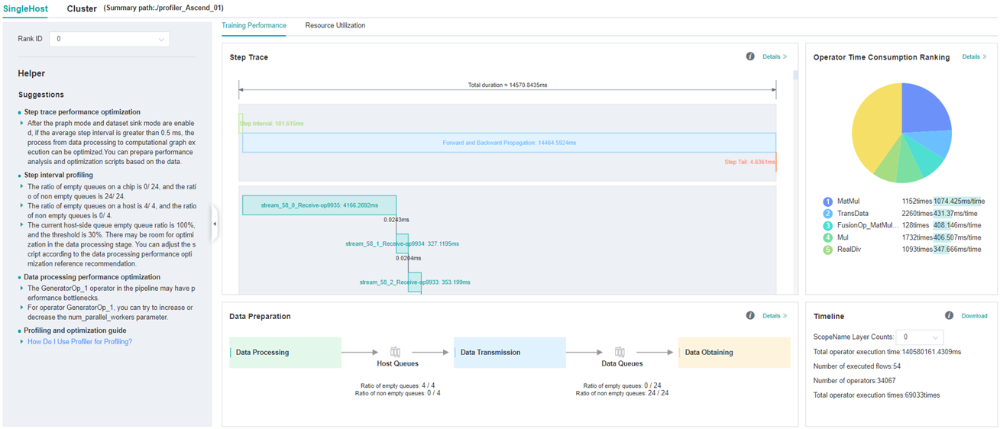
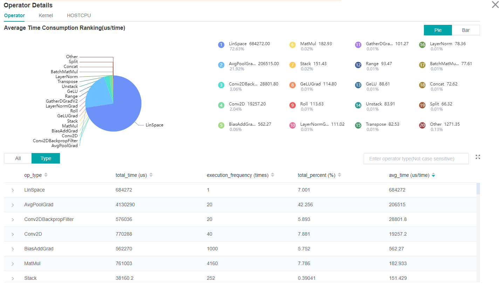
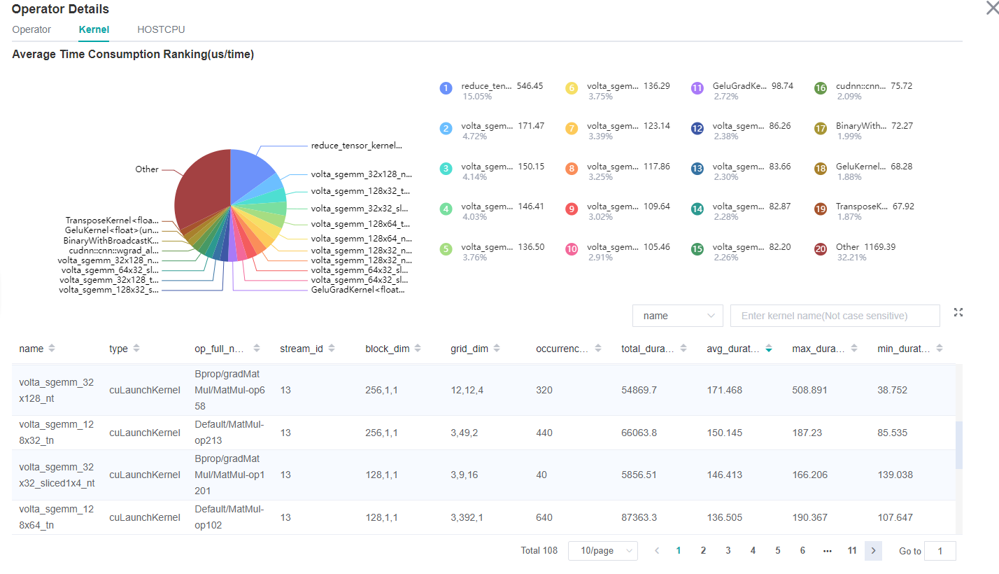
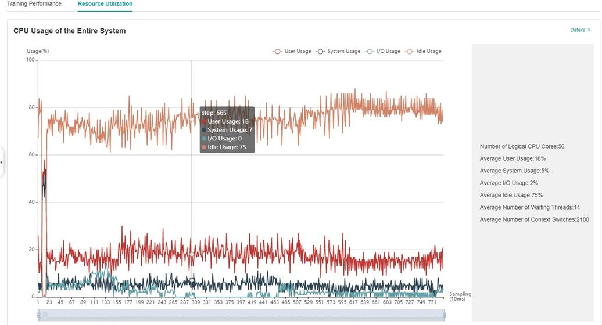

# Performance Profiling (GPU-Graph)

<a href="https://gitee.com/mindspore/docs/blob/master/docs/mindinsight/docs/source_en/performance_profiling_gpu.md" target="_blank"></a>

## Overview

This article describes how to use MindSpore Profiler for performance debugging on GPU.

## Operation Process

- Prepare a training script, add profiler APIs in the training script and run the training script.
- Start MindInsight and specify the summary-base-dir using startup parameters, note that summary-base-dir is the parent directory of the directory created by Profiler. For example, the directory created by Profiler is `/home/user/code/data/`, the summary-base-dir should be `/home/user/code`. After MindInsight is started, access the visualization page based on the IP address and port number. The default access IP address is `http://127.0.0.1:8080`.
- Find the training in the list, click the performance profiling link and view the data on the web page.

> By default, common users do not have the permission to access the NVIDIA GPU performance counters on the target device.
>
> If common users need to use the profiler performance statistics capability in the training script, configure the permission by referring to the following description:
>
> <https://developer.nvidia.com/nvidia-development-tools-solutions-err-nvgpuctrperm-cupti>

## Preparing the Training Script

To enable the performance profiling of neural networks, MindSpore Profiler APIs should be added into the script.

- The MindSpore `Profiler` object needs to be initialized after `set_context` is set.

    > In multi-card training scene, `Profiler` object needs to be initialized after `set_auto_parallel_context`.
    >
    > Only the output_path in parameters is working in GPU now.

- At the end of the training, `Profiler.analyse` should be called to finish profiling and generate the performance analysis results.

The sample code is the same as that in the Ascend chip: <https://www.mindspore.cn/mindinsight/docs/en/master/performance_profiling_ascend.html#preparing-the-training-script>.

In GPU scenarios, users can customize the callback mode to collect performance data. Data preparation stage and data sinking mode do not support this mode.

The following is the example：

```python
from mindspore.train.callback import Callback
class StopAtStep(Callback):
    def __init__(self, start_step, stop_step):
        super(StopAtStep, self).__init__()
        self.start_step = start_step
        self.stop_step = stop_step
        self.profiler = Profiler(start_profile=False)
    def step_begin(self, run_context):
        cb_params = run_context.original_args()
        step_num = cb_params.cur_step_num
        if step_num == self.start_step:
            self.profiler.start()
    def step_end(self, run_context):
        cb_params = run_context.original_args()
        step_num = cb_params.cur_step_num
        if step_num == self.stop_step:
            self.profiler.stop()
    def end(self, run_context):
        self.profiler.analyse()
```

The code above is just an example. Users should implement callback by themselves.

## Launching MindInsight

The MindInsight launch command can refer to [MindInsight Commands](https://www.mindspore.cn/mindinsight/docs/en/master/mindinsight_commands.html).

## Training Performance

Users can access the Training Performance by selecting a specific training from the training list, and click the performance profiling link. And the Training Performance only supports operation analysis, Timeline Analysis, Step Trace Analysis and Data Preparation Analysis now, other modules will be published soon.



*Figure 1: Overall Performance*

Figure 1 displays the overall performance of the training, including the overall data of Step Trace, Operator Performance, Data Preparation Performance and Timeline:  

- Operator Performance: It will collect the average execution time of operators and operator types. The overall performance page will show the pie graph for different operator types.
- Timeline: It will collect execution time for operations and CUDA activity. The tasks will be shown on the time axis. The overall performance page will show the statistics for tasks.
- Step Trace: It will divide the training steps into several stages and collect execution time for each stage. The overall performance page will show the step trace graph.
- Data Preparation Performance: It will analyse the performance of the data input stages. The overall performance page will show the number of steps that may be the bottleneck for these stages.

Users can click the detail link to see the details of each components.

### Operator Performance Analysis

The operator performance analysis component is used to display the execution time of the operators when running MindSpore(include GPU operator,CUDA kernel,HOSTCPU operator).



*Figure 2: Statistics for Operator Types*

Figure 2 displays the statistics for the operator types, including:  

- Choose a pie or a bar graph to show the proportion time occupied by each operator type. The time of one operator type is calculated by accumulating the execution time of operators belong to this type.
- Display top 20 operator types with the longest average execution time, show the proportion of total time and average execution time (ms) of each operator type.

The bottom half of Figure 2 displays the statistics table for the operators' details, including:  

- Choose All: Display statistics for the operators, including operator position information, type, execution time, full scope time, etc. The table will be sorted by average execution time by default.
- Choose Type: Display statistics for the operator types, including operator type name, execution time, execution frequency and proportion of total time, average execution time. Users can click on each line to query for all the operators belong to this type.
- Search: There is a search box on the right, which supports fuzzy search for operators/operator types.



*Figure 3: Statistics for Kernel Activities*

Figure 3 displays the statistics for the Kernel, including:  

- A pie graph to show the proportion time occupied by each kernel activity and the execution time of each kernel activity.
- The statistical table's column includes activity name, operation name, execution frequency, total time and average time.
- The search box on the right, which supports fuzzy search for the activity name/operator full name.

### Timeline Analysis

The usage is almost the same as that in Ascend. The difference is GPU Timeline displays the operation information and CUDA activity.

The usage is described as follows:

<https://www.mindspore.cn/mindinsight/docs/en/master/performance_profiling_ascend.html#timeline-analysis>

### Step Trace Analysis

The usage is almost the same as that in Ascend. (**Note that step trace do not support heterogeneous training scene.**)

The usage is described as follows:

<https://www.mindspore.cn/mindinsight/docs/en/master/performance_profiling_ascend.html#step-trace-analysis>

### Data Preparation Analysis

The usage is almost the same as that in Ascend.

The usage is described as follows:

<https://www.mindspore.cn/mindinsight/docs/en/master/performance_profiling_ascend.html#data-preparation-performance-analysis>

## Resource Utilization

Resource utilization includes cpu usage analysis.



*Figure 4：Overview of resource utilization*

Overview of resource utilization：Including CPU utilization analysis. You can view the details by clicking the View Details button in the upper right corner.

### CPU Utilization Analysis

The usage is almost the same as that in Ascend.

The usage is described as follows:

<https://www.mindspore.cn/mindinsight/docs/en/master/performance_profiling_ascend.html#cpu-utilization-analysis>

## Notices

- Currently the performance debugging is not supported in PyNative mode.
- Currently the training and inference process does not support performance debugging, and only the performance debugging for the individual training or inference is supported.
- GPU does not support memory performance data collection.
- To use performance debugging in GPU scenarios, you must use the root permission.
- GPU performance debugging does not support dynamic Shape scenarios, multi-subgraph scenarios, and control flow scenarios.
- Performance debugging in GPU scenarios depends on CUDA environment variables. Please `export LD_LIBRARY_PATH=${CUDA_HOME}/extras/CUPTI/lib64:$LD_LIBRARY_PATH` before using Profiler. The CUDA_HOME needs to be replaced with the local CUDA path.
