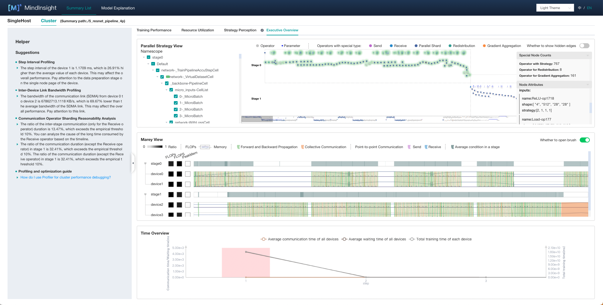
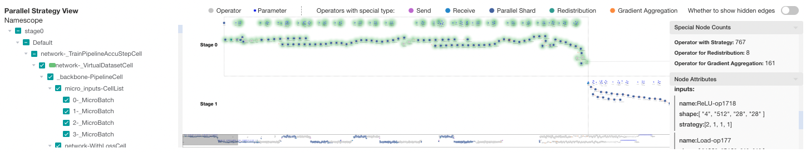
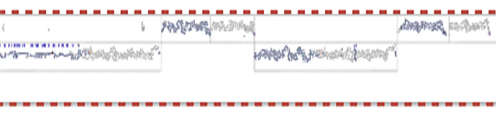
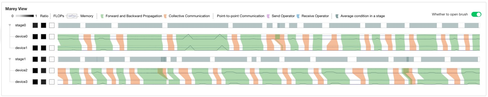
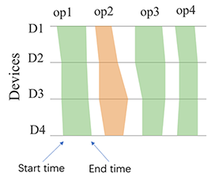
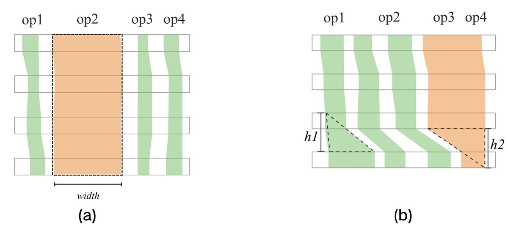
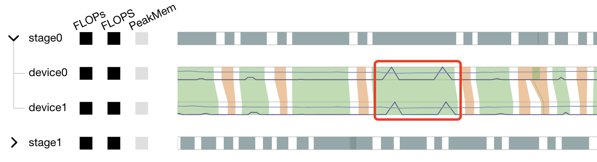
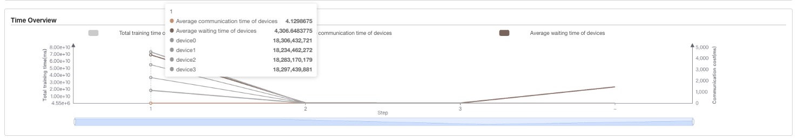

# Parallel Training Execution Analysis

## Overview

This article describes how to use MindSpore Profiler for parallel training execution analysis on Ascend AI processors.

## Operation Process

  .. note::
     For parallel model construction on Ascend AI processors, please refer to:
     https://www.mindspore.cn/tutorials/experts/zh-CN/r1.8/parallel/train_ascend.html
     For enabling MindSpore Profiler, please refer to：
     https://www.mindspore.cn/mindinsight/docs/zh-CN/r1.8/performance_profiling_ascend.html

## Execution Overview

The user can select the specified training from the training list, click performance debugging, and click the `cluster` tab to display the performance data of this training from the cluster perspective.
The execution overview tab includes the analysis of the execution sequence of the operators in the computational graph, the analysis of the execution timeline of the operators on each device, and a time overview displaying the time information of each step and each device.

*Figure 1：execution overview of a cluster*

### Analysis of the computational graph

The parallel strategy view is displayed on the top of the page.

*Figure 2：parallel strategy view*

In this computational graph, the operators are laid out from left to right according to the sequence of execution. The canvas can be dragged, scaled to observe. Each type of operator is distinguished with different colors, with a legend at the top of the view.

On the left is the namespace selector. After checking the namespace, the corresponding operators will be enveloped with a certain color.

When pipeline parallel strategy is adopted, computational graphs of all stages are displayed. Each computational graph is arranged horizontally according to the correspondence of `Send` and `Receive` operators. Users can get an overall perception of the parallel execution process.

*Figure 3：timeline minimap*

The right side is the special nodes counting panel and the node attribute panel.
There are three types of special operators: operators with strategy, operators for redistribution, and operators for gradient aggregation.

### Operators execution timeline analysis on each device

The Marey view is displayed in the middle of the page.

*Figure 4：Marey view*

In the Marey view, each device has three color blocks and a timeline. The three color blocks show each device's FLOPs(the number of floating-point operations, used to measure model/algorithm complexity), FLOPS(the number of floating-point operations per second, used to measure hardware performance) and PeakMem(peak memory). For FLOPs and FLOPS, the shades represents the ratio of the value(the value of the current device / max value of all devices). For PeakMem, the shades represents the memory utilization(peak memory / memory capacity).

*Figure 5：Marey timeline*

As show in Figure 5, green block represents computation operator and orange block represents communication operator. The operators executed on devices in the same pipeline stage are basically the same. Each device has a timeline. We mark the start and end time of operator execution on the timeline, then connect polygons and fill in colors. This view can help locate the following two types of problems:

*Figure 6：Marey timeline pattern of exceptions*

As shown in Figure 6(a), when the execution time of an operator on each device is significantly longer than that of other operators, it may be that the parameter `all_reduce_fusion_config` is unreasonable.
As shown in Figure 6(b), when the execution time of an operator on one device is significantly longer than that on other devices, there may be a slow node.

The marey timeline supports the following interactions: brush to zoom in, double-click to zoom out, and hover to show the corresponding operators.

The stage tree on the left side can be aggregated or expanded as needed. The timeline of the stage shows the union of the execution time of the same operator on all devices in the stage.

A line chart is shown on the timeline. The purple line indicates the FLOPs change, the blue line indicates the memory change.

*Figure 7：line chart on the Marey timeline*

As shown in Figure 7, the memory usage has a clear peak in the red box, which can be further analyzed with the operators on the marey timeline.

### Time overview of each device

The time overview is displayed at the bottom of the page.

*Figure 8：ime overview*

The time overview is a double y-axis graph, showing the training time on the left and the communication time on the right. This view displays the training time of each device in each step, the average communication time and waiting time of each device. When user hovers on one step, the specific statistics can be seen in a pop-up card. This view serves as an entry for analysis. If user determines that the training process in a certain step is abnormal, he can click the certain step and the Marey view will show the execution details on the selected step for further analysis.