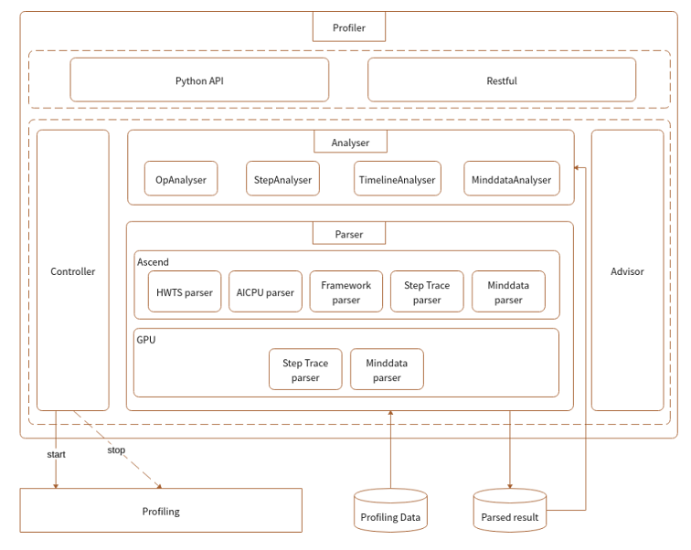

# Performance Profiling Design

## Background

To support model development and performance debugging in MindSpore, an easy-to-use profile tool is required to intuitively display the performance information of each dimension of a network model, provide users with easy-to-use and abundant profiling functions, and help users quickly locate network performance faults.

## Profiler Architecture Design

The Profiler architecture design is introduced from the following three aspects: the overall context interaction relationship of Profiler; the internal structure of Profiler, including the module structure and module layers; the interactive calling relationship between modules.

### Context

Profiler is a part of the MindSpore debugging and optimization tool. The following figure shows the tool context.

*Figure 1 Context relationship*

As shown in the preceding figure, the interaction between the Profiler and other components is as follows:

1. In the training script, MindSpore Profiler is called to send the command to the MindSpore ada(Ascend device) or CUPTI(GPU device) module for starting performance data collection. Finally, the ada or CUPTI generates original performance data.

2. MindSpore Profiler parses the original data in the user script and generates the intermediate data results in the specified folder.

3. MindInsight Profiler connects to the intermediate data and provides the visualized Profiler function for users.

### Module Structure

Modules are classified into the following layers:

*Figure 2 Relationships between modules at different layers*

Module functions are as follows:

1. ProfilerAPI is a calling entry provided by code, including the performance collection startup API and analysis API.
2. Controller is a module at a layer lower than that of ProfilerAPI. It is called by the startup API of ProfilerAPI to start or stop the performance collection function. The original data is written to a fixed position by ada.
3. Parser is a module for parsing original performance data which is collected on the device and cannot be directly understood by users. Parser parses, combines, and converts the data to generate intermediate results that can be understood by users and analyzed by upper layers.
4. Analyser obtains the intermediate results parsed by the lower-layer Parser, encapsulates, filters, and sorts the intermediate results, and returns the various information to the upper-layer Profiler API and RESTful.
5. RESTful is used to call the common API provided by the backend Analyser to obtain objective data and use RESTful to connect to the frontend.

### Internal Module Interaction

Users can use API or RESTful to complete internal module interaction process. The following uses the API as an example:

*Figure 3 Module interaction*

The interaction process of each module is as follows:

1. ProfilerAPI calls the control function of the lower-layer Controller to control the lower-layer collection module to collect performance information. Currently, the collection module (ada on Ascend or CUPTI on GPU) receives commands and independently collects performance information.

2. After the training is complete, users call the analysis API of ProfilerAPI.

3. Profiler API analysis API uses the Parser module to parse performance data, generates intermediate results, calls the Aalayser module to analyze the results, and returns various information to users.

## Sub-Module Design

### ProfilerAPI and Controller

#### Description

ProfilerAPI provides an entry API in the training script for users to start performance collection and analyze performance data.
ProfilerAPI delivers commands through Controller to control the startup of ada/CUPTI.

#### Design

ProfilerAPI belongs to the API layer of upper-layer application and is integrated by the training script. The function is divided into two parts:

- Before training, call the bottom-layer Controller API to deliver a command to start a profiling task.

- After training, call the bottom-layer Controller API to deliver commands to stop the profiling task, call the Analyser and Parser APIs to parse data files and generate result data such as operator performance statistics and training trace statistics.

Controller provides an API for the upper layer, calls API of the lower-layer performance collection module, and delivers commands for starting and stopping performance collection.

The generated original performance data includes:

Ascend:

- `hwts.log.data.45.dev.profiler_default_tag` file: stores operator execution information, including the start and end of a task and stream ID.
- `DATA_PREPROCESS.dev.AICPU` file: specifies AI CPU operator execution time at each stage.
- `Framework.host.task_desc_info` file: stores the mapping between operator IDs and operator names and the input and output information of each operator.
- `training_trace.46.dev.profiler_default_tag` file: stores the start and end time of each step and time of step interval, forward and backward propagation, and step tail.

GPU:

- `step_trace_profiling_0.txt` file: stores the start and end operator of each step.

### Parser

#### Description

Parser is a module for parsing original performance data which is collected on the device and cannot be directly understood by users. Parser parses, combines, and converts the data to generate intermediate results that can be understood by users and analyzed by upper layers.

#### Design

*Figure 4 Parser module*

As shown in the preceding figure, there are HWTS Parser, AI CPU Parser, Framework Parser, and Training Trace Parser modules. Each module parses a type of original data to obtain the intermediate file that can be read by users.

Ascend:

- HWTS Parser: parses the `hwts.log.data.45.dev.profiler_default_tag` file to obtain the task-based statistics of the device, such as the start and end of each task and stream ID, which are used to compute the operator execution time.
- AI CPU Parser: parses the `DATA_PREPROCESS.dev.AICPU` file to obtain the AI CPU operator execution time at each stage.
- Framework Parser: parses the `Framework.host.task_desc_info` file to obtain the mapping between AI Core operator and task, and key operator information.
- Training Trace Parser: parses the `training_trace.46.dev.profiler_default_tag` file to analyze the time at each training stage.

GPU:

- Training Trace Parser: parses the `step_trace_profiling_0.txt` file to analyze the time at each training stage.

### Analyser

#### Description

Analyzer is used to filter, sort, query, and page the intermediate results generated at the parsing stage.

#### Design

This module parses the intermediate files generated by Parser, provides a general API for upper-layer data analysis, and returns the analyzed data to the upper layer for display. Various intermediate files have certain common points which can be abstracted. Therefore, following figure shows the design of the Analyser class.

*Figure 5 Analyser class*

As shown in the preceding figure, multiple Analysers are implemented for different contents to be queried. Filter, sorting, and pagination conditions can be defined for each Analyser. Each Analyser knows which intermediate files are required to merge, filter, and sort data. Analyser is associated with Parser through the intermediate files generated by Parser, and no function is called. In this way, Analyser and Parser are decoupled.

Currently, there are two types of analyzers for operator information:

- Filter the average information of operator types.
- Filter the detailed average information of each operator in two Analysers (AicoreTypeAnalyser and AicoreDetailAnalyser for Ascend, GpuOpTypeAnalyser and GpuOpInfoAnalyser for GPU).

To hide the internal implementation of Analyser and facilitate calling, the simple factory mode is used to obtain the specified Analyser through AnalyserFactory.

### Proposer

#### Description

Proposer is a Profiler performance optimization suggestion module. Proposer calls the Analyser module to obtain performance data, analyzes the performance data based on optimization rules, and displays optimization suggestions for users through the UI and API.

#### Design

Modules are classified into the following layers:

*Figure 6 Proposer module*

As shown in the preceding figure:

- Proposer provides API for calling the API and RESTful to obtain optimization suggestions.
- Proposer calls the Analyser API to obtain performance data and obtain optimization suggestions based on optimization rules.
- Proposer calls Analyser factory to obtain the Analyser object.

You can call the query API of the Analyser object to obtain information, including the top N operators that are sorted by time and the time information of each training trace stage.

The following figure shows the module class design:

*Figure 7 Proposer class*

As shown in the preceding figure:

- Proposers of various types inherit the abstract class Proposer and implement the analyze methods.
- API and CLI call the ProposerFactory to obtain the Proposer and call the Proposer.analyze function to obtain the optimization suggestions of each type of Proposer.
