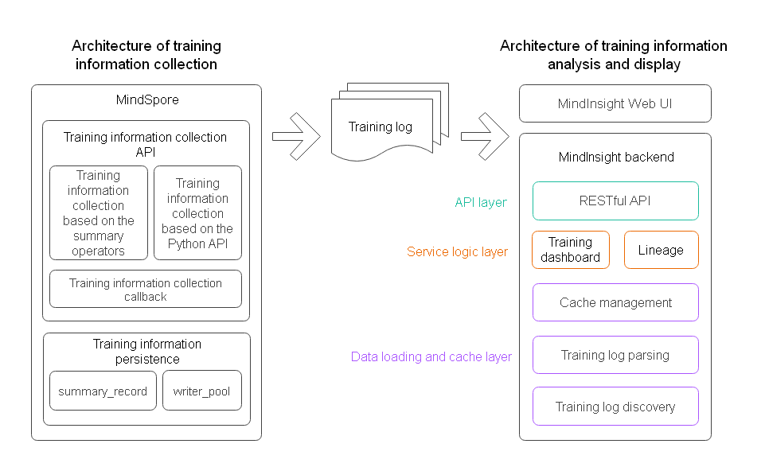
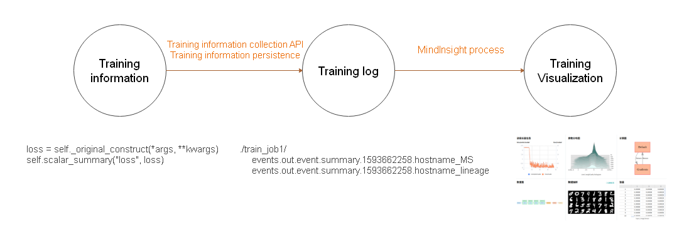
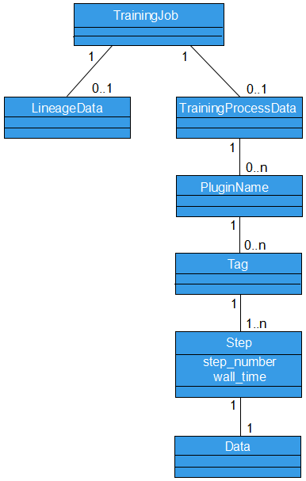

# Overall Design of Training Visualization

[MindInsight](https://gitee.com/mindspore/mindinsight) is a visualized debugging and tuning component of MindSpore. MindInsight can be used to complete tasks such as training visualization, performance tuning, and precision tuning.

Training visualization includes functions such as training dashboard, model lineage, and data lineage. Training dashboard includes functions such as scalar, parameter distribution, computational graph, data graph, and data sampling.

This document describes the logical architecture, code organization, and data model of the MindInsight training visualization function.

## Logical Architecture of Training Visualization

The logical architecture of training visualization is divided into two parts: architecture of training information collection and architecture of training information analysis and display.

*Figure 1 Logical architecture of MindInsight training visualization*

### Architecture of Training Information Collection

The training information collection function in MindSpore consists of training information collection API module and training information persistence module.

Training information collection APIs include:

- Training information collection API based on the summary operator. This API contains four summary operators, that is, the ScalarSummary operator for recording scalar data, the ImageSummary operator for recording image data, the HistogramSummary operator for recording parameter distribution histogram data, and the TensorSummary operator for recording tensor data. For details about the operators, see [Operator List](https://www.mindspore.cn/docs/note/en/master/operator_list.html).

- Training information collection API based on the Python API. You can use the [SummaryRecord.add_value](https://www.mindspore.cn/docs/api/en/master/api_python/mindspore.train.html#mindspore.train.summary.SummaryRecord.add_value) method to collect training information in Python code.

- Easy-to-use training information collection callback. The [SummaryCollector](https://www.mindspore.cn/docs/api/en/master/api_python/mindspore.train.html#mindspore.train.callback.SummaryCollector) callback function can be used to conveniently collect common training information to training logs.

The training information persistence module mainly includes a summary_record module used to manage a cache and a write_pool module used to process data in parallel and write data into a file. After the training information is made persistent, it is stored in the training log file (summary file).

### Architecture of Training Information Analysis and Display

The architecture of training information analysis and display in MindInsight consists of the WebUI and backend. The backend can be divided into the data loading and cache layer, service logic layer, and API layer from bottom to top. The data loading and cache layer consists of the training log discovery module, training log parsing module, and cache management module. The service logic layer consists of the training dashboard service module and lineage service module. The API layer consists of the RESTful API module. Functions of each module are as follows:

- Training log discovery module: scans and discovers training log directories that contain training log files in the specified training log root directory (summary-base-dir). Only directories containing training log files are identified as training log directories.

- Training log parsing module: parses training log files.

- Cache management module: manages training log parsing tasks and caches the parsing results. It periodically calls the training log discovery module to scan the latest training log directory list. Then, it calls the parsing module to parse the file content and stores the parsing result in the cache for query on the UI.

- Training dashboard module: provides the service logic of the training dashboard function to support the training dashboard data query on the UI.

- Lineage module: provides service logic of model lineage and data lineage to support lineage data query on the UI.

- RESTful API module: encapsulates an API provided by a service module into a RESTful API.

## Code Organization

The following describes some important directories in MindInsight code repository.

|Level-1 Directory|Level-2 Directory|Level-3 Directory|Description|
|---|---|---|---|
|build|||Code related to compilation and building |
|mindinsight|||
||backend||RESTful API |
|||datavisual|RESTful API related to training dashboard |
|||lineagemgr|RESTful API related to lineage |
||datavisual||Training dashboard module, including the data loading and cache layer code |
|||data_transform|Data loading and cache layer |
||lineagemgr||Lineage module |
||ui||MindInsight WebUI |
|tests|||Test case directory |

## Training Visualization Data Model

### Training Information Data Flow

The training information is generated during training process. You can use the training information collection API to collect the training information and save it to a disk using the training information persistence module to generate a training log file (summary file). After the training log file is generated, you can use MindInsight to visualize the file information.

*Figure 2 Training information data flow*

### Data Model

Figure 3 shows a brief data model of MindInsight. MindInsight identifies a training log directory as a training job. A training job is the minimum management unit of MindInsight. A training job can be associated with 0 to 1 piece of lineage data and 0 to 1 piece of training process data. The training process data has a rich structure. Each piece of specific data can be uniquely determined based on the given plugin name, tag, and step. These concepts are described in the following.

*Figure 3 Data model represented by a UML class diagram*

#### Training Job

MindInsight uses directories to distinguish different training jobs. To distinguish training log files of different training jobs, you need to specify the directory for storing training log files for both `SummaryCollector` and `SummaryRecord`. Training log files in the same directory are considered as the training data generated in the same training job. Training log files in different directories are considered as the training data generated in different training jobs.

In MindInsight code, a training job is called a TrainJob. A TrainJob ID is the name of the directory where the training log is located, for example, ./train_my_lenet_1.

During a training process, a lineage data file (whose name ends with _lineage) and a training process data file (whose name ends with_MS) are generated. The lineage data mainly describes an invariant attribute of the training from a global perspective, for example, a dataset path used for training, an optimizer used for training, and user-defined lineage information. The most prominent feature of the lineage data file is that it does not change during the training process. The training process data mainly describes a change status of the training, for example, a loss value, parameter distribution, and image data sent to the model in a step. The most prominent feature of the training process data file is that each step changes.

It should be noted that the classification about whether the training information changes is not absolute. For example, the training process data file contains computational graph data, which is determined when the training starts.

#### Lineage Data

The lineage data describes the invariant attribute of a training from a global perspective. When MindInsight identifies multiple training log directories, the lineage data of these trainings is organized and displayed in a table for comparison and analysis.

#### Training Process Data

- Plugin Name (plugin_name)

    The training data is classified into scalar, histogram, image, and tensor by type. In MindInsight, these types are called plugin names (plugin_name) which are defined in the `mindinsight.datavisual.common.enums.PluginNameEnum` file.

- Tag

    No matter which type the data belongs to, the data is further divided into different sequences according to the tag. Generally, tags are named by users to distinguish data. For example, the tag of a scalar that records a loss value can be named loss. When processing data, MindInsight automatically adds a suffix to the tag based on the plugin name. For example, if a scalar's tag is loss, the tag is automatically renamed loss/scalar.

- Step

    The training process data is generated in each training step. To distinguish them, data is marked with the corresponding step number.

- Data Query and Display

    When displaying data, you might want to see how the data under a tag changes with the training process. Therefore, when querying data, you do not need to specify the step number. Instead, you can specify the training job, plugin name, and tag to query data of all steps under the tag.
