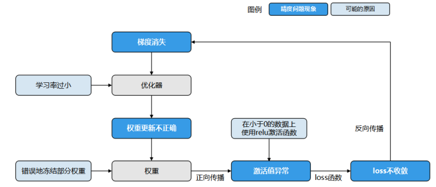
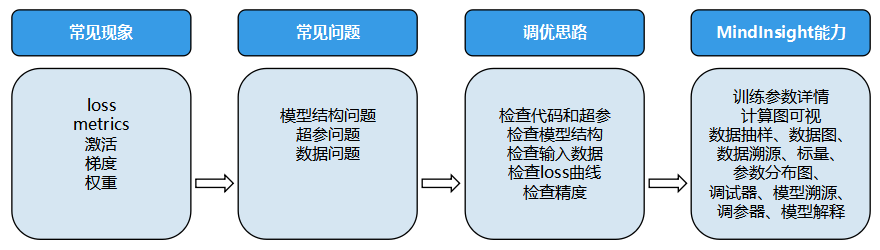
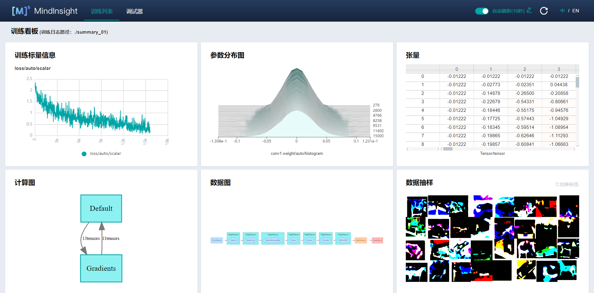
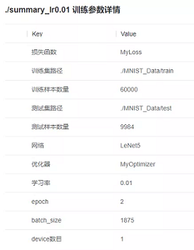
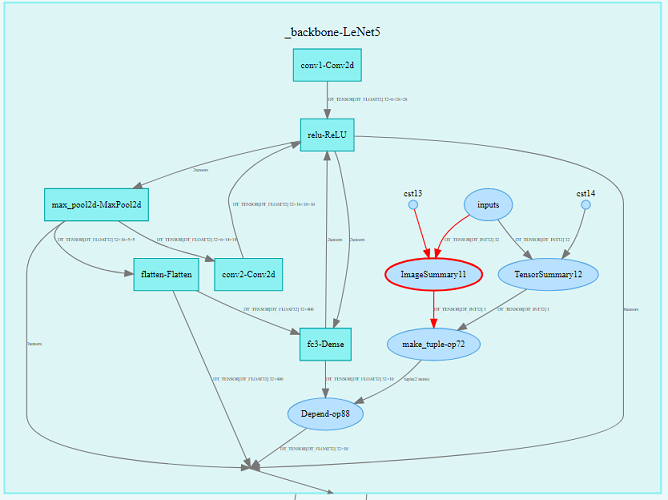
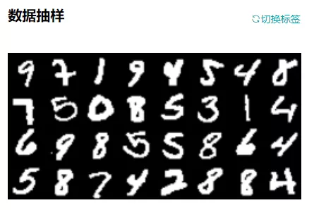
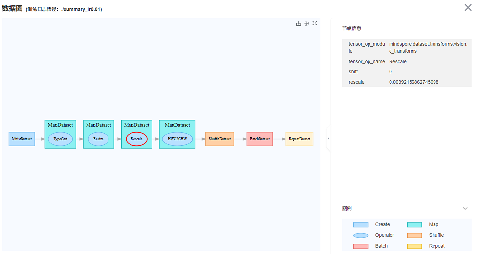
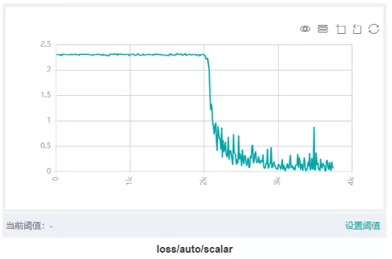
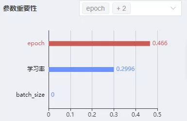
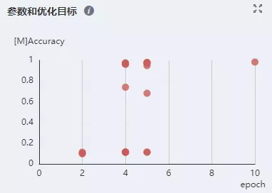

# 精度问题详细定位和调优指南

<a href="https://gitee.com/mindspore/docs/blob/master/docs/mindinsight/docs/source_zh_cn/accuracy_optimization.md" target="_blank"></a>

模型训练的最终结果是为了得到一个精度达标的模型，而在AI训练过程中有时会遇到loss（模型损失值）无法下降，或者发散，metrics（模型度量指标）达不到预期等，造成无法得到一个理想精度的模型，这时候需要去进行分析训练过程中出现了什么样的问题，针对性地采用包括调整数据、调整超参、重构模型结构等方法，去解决模型精度调优过程中遇到的各种问题。

本文介绍MindSpore团队总结的精度调优的方法，及解决精度调优过程中问题的分析思路，并且将MindSpore中用于精度调优的工具做分类介绍。

## 常见精度问题分析

在精度调优实践中，发现异常现象是比较容易的。但是，如果我们对异常现象不够敏感、不会解释，还是会同问题根因失之交臂。下面对常见精度问题进行了解释，能够提高你对异常现象的敏感度，帮你更快定位精度问题。

### 精度问题的常见现象和原因

模型精度问题和一般的软件问题不同，定位周期一般也更长。在通常的程序中，程序输出和预期不符意味着存在bug（编码错误）。但是对一个深度学习模型来说，模型精度达不到预期，有着更复杂的原因和更多的可能性。由于模型精度要经过长时间的训练才能看到最终结果，定位精度问题通常会花费更长的时间。

#### 常见现象

精度问题的直接现象一般体现在loss（模型损失值）和metrics（模型度量指标）上。loss现象一般表现为：

1. loss跑飞，出现NAN，+/- INF，极大值。
2. loss不收敛、收敛慢。
3. loss为0等。

模型metrics一般表现为模型的accuracy、precision等metric达不到预期。

精度问题的直接现象较容易观察，借助MindInsight等可视化工具，还可以在梯度、权重、激活值等张量上观察到更多现象。常见现象如：

1. 梯度消失。
2. 梯度爆炸。
3. 权重不更新。
4. 权重变化过小。
5. 权重变化过大。
6. 激活值饱和等。

#### 常见原因

对精度问题的原因分析，可以简单分为超参问题、模型结构问题、数据问题、算法设计问题等类别：

- 超参问题

    超参是模型和数据之间的润滑剂，超参的选择直接影响了模型对数据拟合效果的优劣。超参方面常见的问题如下：

    1. 学习率设置不合理（过大、过小）。

        学习率可以说是模型训练中最重要的超参了。学习率过大，会导致loss震荡，不能收敛到预期值。学习率过小，会导致loss收敛慢。应根据理论和经验合理选择学习率策略。
    2. loss_scale参数不合理。
    3. 权重初始化参数不合理等。
    4. epoch过大或过小。

        epoch数目直接影响模型是欠拟合还是过拟合。epoch过小，模型未训练到最优解就停止了训练，容易欠拟合；epoch过大，模型训练时间过长，容易在训练集上过拟合，在测试集上达不到最优的效果。应根据训练过程中验证集上模型效果的变化情况，合理选择epoch数目。
    5. batch size过大。

        batch size过大时，模型可能不能收敛到较优的极小值上，从而降低模型的泛化能力。

- 数据问题

    - 数据集问题

        数据集的质量决定了算法效果的上限，如果数据质量差，再好的算法也难以得到很好的效果。常见数据集问题如下：

        1. 数据集中缺失值过多。

            数据集中存在缺失值、异常值，会导致模型学习到错误的数据关系。一般来说，应该从训练集中删除存在缺失值或异常值的数据，或者设置合理的默认值。数据标签错误是异常值的一种特殊情况，但是这种情况对训练的破坏性较大，应通过抽查输入模型的数据等方式提前识别这类问题。
        2. 每个类别中的样本数目不均衡。

            数据集中每个类别的样本数目不均衡，是指数据集中每个类别中的样本数目有较大差距。例如，图像分类数据集（训练集）中，大部分类别都有1000个样本，但是“猫”这一类别只有100个样本，就可以认为出现了样本数目不均衡的情况。样本数目不均衡会导致模型在样本数目少的类别上预测效果差。如果出现了样本数目不均衡，应该酌情增加样本量小的类别的样本。一般来说，有监督深度学习算法在每类5000个标注样本的情况下将达到可以接受的性能，当数据集中有1000万个以上的已标注样本时，模型的表现将会超过人类。
        3. 数据集中存在异常值。
        4. 训练样本不足。

            训练样本不足是指相对于模型容量，训练集中的样本数量太少。训练样本不足会导致训练不稳定，且容易出现过拟合。如果模型的参数量同训练样本数量不成比例，应该考虑增加训练样本或者降低模型复杂度。

        5. 数据的标签错误。

    - 数据处理问题

        常见数据处理问题如下：

        1. 数据处理参数不正确。
        2. 未对数据进行归一化或标准化。

            未对数据进行归一化或标准化，是指输入模型的数据，各个维度不在一个尺度上。一般来说，模型要求各个维度的数据在-1到1之间，均值为0。如果某两个维度的尺度存在数量级的差异，可能会影响模型的训练效果，此时需要对数据进行归一化或标准化。

        3. 数据处理方式和训练集不一致。

            数据处理方式和训练集不一致是指在使用模型进行推理时，处理方式和训练集不一致。例如对图片的缩放、裁切、归一化参数和训练集不同，会导致推理时的数据分布和训练时的数据分布产生差异，可能会降低模型的推理精度。

            > 一些数据增强操作（如随机旋转，随机裁切等）一般只应用在训练集，推理时无需进行数据增强。

        4. 没有对数据集进行shuffle。

            没有对数据集进行shuffle，是指训练时未对数据集进行混洗。未进行shuffle，或者混洗不充分，会导致总是以相同的数据顺序更新模型，严重限制了梯度优化方向的可选择性，导致收敛点的选择空间变少，容易过拟合。

- 算法问题

    - API使用问题

         常见API使用问题如下：

         1. 使用API没有遵循MindSpore约束。

             使用API未遵循MindSpore约束，是指使用的API和真实应用的场景不匹配。例如，在除数中可能含有零的场景，应该考虑使用DivNoNan而非Div以避免产生除零问题。又例如，MindSpore中，DropOut第一个参数为保留的概率，和其它框架正好相反（其它框架为丢掉的概率），使用时需要注意。

         2. 构图时未遵循MindSpore construct约束。

             构图未遵循mindspore construct约束，是指图模式下的网络未遵循MindSpore静态图语法支持中声明的约束。例如，MindSpore目前不支持对带键值对参数的函数求反向。完整约束请见[静态图语法支持](https://www.mindspore.cn/docs/zh-CN/master/note/static_graph_syntax_support.html)。

    - 计算图结构问题

         计算图结构是模型计算的载体，计算图结构错误一般是实现算法时代码写错了。计算图结构方面常见的问题有：

         1. 算子使用错误（使用的算子不适用于目标场景）。

         2. 权重共享错误（共享了不应共享的权重）。

             权重共享错误，是指应该共享的权重未共享，或者不应该共享的权重共享了。通过MindInsight计算图可视，可以检查这一类问题。

         3. 节点连接错误（应该连接到计算图中的block未连接）。

             节点连接错误，是指计算图中各block的连接和设计不一致。如果发现节点连接错误，应该仔细检查脚本是否编写出错。

         4. 节点模式不正确。

             节点模式不正确，是指节点所处的训练/推理模式和实际情况不一致。请参考[使用API时根据训练/推理场景对应设置模式](https://www.mindspore.cn/mindinsight/docs/zh-CN/master/accuracy_problem_preliminary_location.html#api-02-api)以合理设置节点模式。

         5. 权重冻结错误（冻结了不应冻结的权重）。

             权重冻结错误，是指应该冻结的权重未冻结，或者不应该冻结的权重冻结了。在MindSpore中，冻结权重可以通过控制传入优化器的`params`参数来实现。未传入优化器的Parameter将不会被更新。可以通过检查脚本，或者查看MindInsight中的参数分布图确认权重冻结情况。

         6. loss函数有误。

             loss函数有误，是指loss函数算法实现错误，或者未选择合理的loss函数。例如，`BCELoss`和`BCEWithLogitsLoss`是不同的，应根据是否需要`sigmoid`函数合理选择。

         7. 优化器算法错误（如果自行实现了优化器）等。

    - 权重初始化问题

        权重初始值是模型训练的起点，不合理的初始值将会影响模型训练的速度和效果。权重初始化方面常见问题如下：

        1. 权重初始值全部为0。

            权重初始值全为0，是指初始化后，权重值为0。这一般会导致权重更新问题，应使用随机值初始化权重。

        2. 分布式场景不同节点的权重初始值不同。

            分布式场景不同节点的权重初始值不同，是指初始化后，不同节点上的同名权重初始值不同。正常来说，MindSpore会对梯度做全局AllReduce操作。确保每个step结尾，权重更新量是相同的，从而保证每个step中，各个节点上的权重一致。如果初始化时各节点的权重不同，就会导致不同节点的权重在接下来的训练中处于不同的状态，会直接影响模型精度。分布式场景应通过固定相同的随机数种子等方式，确保权重的初始值一致。

- 相同现象存在多个可能原因导致精度问题定位难

    以loss不收敛为例（下图），任何可能导致激活值饱和、梯度消失、权重更新不正确的问题都可能导致loss不收敛。例如错误地冻结了部分权重，使用的激活函数和数据不匹配（使用relu激活函数，输入值全部小于0），学习率过小等原因都是loss不收敛的可能原因。

    

    *图1：相同现象存在多个可能原因导致精度问题定位难*

#### 精度问题checklist

| 常见数据集问题 |  常见超参问题  | 常见计算图结构问题 |    常见数据处理算法问题    |           常见API使用问题           |         常见权重初始化问题         |
| :------------ | :------------ | :---------------- | :------------------------ | :--------------------------------- | :-------------------------------- |
| 数据集中缺失值过多 |   学习率设置不合理（过大、过小）   |    权重共享错误    | 未对数据进行归一化或标准化 |    使用API没有遵循MindSpore约束     |         权重初始值全部为0          |
| 每个类别中的样本数目不均衡 |   loss_scale参数不合理   |    权重冻结错误    | 数据处理方式和训练集不一致 | 构图时未遵循MindSpore construct约束 | 分布式场景不同节点的权重初始值不同 |
| 数据集中存在异常值 |   权重初始化参数不合理    |    节点连接错误    |  没有对数据集进行shuffle   |                                     |                                    |
|  训练样本不足  |   epoch过大或过小    |   节点模式不正确   |   数据处理参数不合理      |                                     |                                    |
| 数据的标签错误 | batch size过大 |    loss函数有误    |                            |                                     |                                    |
|              |               |    算子使用错误     |                            |                                     |                                    |
|              |               |    优化器算法错误    |                            |                                     |                                    |

### 常用的精度调试调优思路

遇到精度问题时，常用调试调优思路如下：

1. 检查代码和超参。

    代码是精度问题的重要源头，检查代码重在对脚本和代码做检查，力争在源头发现问题；模型结构体现了MindSpore对代码的理解。
2. 检查模型结构。

    检查模型结构重在检查MindSpore的理解和算法工程师的设计是否一致。
3. 检查输入数据。
4. 检查loss曲线。

    有的问题要到动态的训练过程中才会发现，检查输入数据和loss曲线正是将代码和动态训练现象结合进行检查。
5. 检查精度是否达到预期。

    检查精度是否达到预期则是对整体精度调优过程重新审视，并考虑调整超参、解释模型、优化算法等调优手段。

检查模型结构和超参重在检查模型的静态特征；检查输入数据和loss曲线则是将静态特征和动态训练现象结合检查；检查精度是否达到预期则是对整体精度调优过程重新审视，并考虑调整超参、解释模型、优化算法等调优手段。此外，熟悉模型和工具也很重要，为了帮助用户高效实施上述的精度调优思路，MindInsight提供了配套的能力，如下图。



*图2 精度问题定位思路及MindInsight对应能力*

下面将分别介绍这些思路。

#### 精度调优准备

1. 回顾算法设计，全面熟悉模型。

    精度调优前，要先对算法设计做回顾，确保算法设计明确。如果参考论文实现模型，则应回顾论文中的全部设计细节和超参选择情况；如果参考其它框架脚本实现模型，则应确保有一个唯一的、精度能够达标的标杆脚本；如果是新开发的算法，也应将重要的设计细节和超参选择明确出来。这些信息是后面检查脚本步骤的重要依据。

    精度调优前，还要全面熟悉模型。只有熟悉了模型，才能准确理解MindInsight提供的信息，判断是否存在问题，查找问题源头。因此，花时间理解模型算法和结构、理解模型中算子的作用和参数的含义、理解模型所用优化器的特性等模型要素是很重要的。动手分析精度问题细节前，建议先带着问题加深对这些模型要素的了解。

2. 熟悉[MindInsight](https://www.mindspore.cn/mindinsight/docs/zh-CN/master/index.html)工具。

    定位精度问题时，建议使用MindInsight的[Summary训练信息收集](https://www.mindspore.cn/mindinsight/docs/zh-CN/master/summary_record.html)功能，在脚本中加入`SummaryCollector`。如下训练代码片段所示，初始化`SummaryCollector`并加入到`model.train`的`callbacks`参数中：

    ```python
    # Init a SummaryCollector callback instance, and use it in model.train or model.eval
    summary_collector = SummaryCollector(summary_dir='./summary_dir', collect_freq=1)

    # Note: dataset_sink_mode should be set to False, else you should modify collect freq in SummaryCollector
    model.train(epoch=1, train_dataset=ds_train, callbacks=[summary_collector], dataset_sink_mode=False)

    ds_eval = create_dataset('./dataset_path')
    model.eval(ds_eval, callbacks=[summary_collector])
    ```

    > dataset_path为用户本地的训练数据集路径。

    使用训练看板[可视化功能](https://www.mindspore.cn/mindinsight/docs/zh-CN/master/dashboard.html)查看训练过程数据：

    

    *图3 训练看板*

    需要在线调试模型时，参考[使用调试器](https://www.mindspore.cn/mindinsight/docs/zh-CN/master/debugger.html)功能。

#### 检查代码和超参

代码是精度问题的重要源头，超参问题、模型结构问题、数据问题、算法设计和实现问题会体现在脚本中，对脚本做检查是定位精度问题很有效率的手段。检查代码主要依赖代码走读，建议使用小黄鸭调试法：在代码走读的过程中，耐心地向没有经验的“小黄鸭”解释每一行代码的作用，从而激发灵感，发现代码问题。检查脚本时，要注意检查脚本实现（包括数据处理、模型结构、loss函数、优化器等实现）同设计是否一致，如果参考了其它脚本，要重点检查脚本实现同其它脚本是否一致，所有不一致的地方都应该有充分合理的理由，否则就应修改。

检查脚本时，也要关注超参的情况，超参问题主要体现为超参取值不合理，例如

1. 学习率设置不合理；
2. `loss_scale`参数不合理；
3. 权重初始化参数不合理等。

MindInsight可以辅助用户对超参做检查，大多数情况下，`SummaryCollector`会自动记录常见超参，您可以通过MindInsight的训练参数详情功能和溯源分析功能查看超参。结合MindInsight模型溯源分析模块和脚本中的代码，可以确认超参的取值，识别明显不合理的超参。如果有标杆脚本，建议同标杆脚本一一比对超参取值，如果有默认参数值，则默认值也应一并比对，以避免不同框架的参数默认值不同导致精度下降或者训练错误。



*图4 通过MindInsight训练参数详情查看模型超参*

#### 检查模型结构

在模型结构方面，常见的问题有：

1. 算子使用错误（使用的算子不适用于目标场景，如应该使用浮点除，错误地使用了整数除）。
2. 权重共享错误（共享了不应共享的权重）。
3. 权重冻结错误（冻结了不应冻结的权重）。
4. 节点连接错误（应该连接到计算图中的block未连接）。
5. loss函数错误。
6. 优化器算法错误（如果自行实现了优化器）等。

建议通过检查模型代码的方式对模型结构进行检查。此外，MindInsight也可以辅助用户对模型结构进行检查。大多数情况下，`SummaryCollector`会自动记录计算图，通过MindInsight，用户可以方便地对计算图进行查看。



*图5 通过MindInsight训练看板中的计算图模块查看模型结构*

模型脚本运行后，建议使用MindInsight计算图可视模块查看模型结构，加深对计算图的理解，确认模型结构符合预期。若有标杆脚本，还可以同标杆脚本对照查看计算图，检查当前脚本和标杆脚本的计算图是否存在重要的差异。

考虑到模型结构一般都很复杂，期望在这一步就能发现所有的模型结构问题是不现实的。只要通过可视化的模型结构加深对计算图的理解，发现明显的结构问题即可。后面的步骤中，发现了更明确的精度问题现象后，我们还会回到这一步重新检查确认。

> MindInsight支持查看`SummaryCollector`记录的计算图和MindSpore context的`save_graphs`参数导出的pb文件计算图。请参考我们教程中的[计算图可视化](https://www.mindspore.cn/mindinsight/docs/zh-CN/master/dashboard.html)部分了解更多信息。
>
> 脚本迁移工具可以将PyTorch、TensorFlow框架下编写的模型转换为MindSpore脚本，请访问教程[使用工具迁移模型定义脚本](https://www.mindspore.cn/mindinsight/docs/zh-CN/master/migrate_3rd_scripts_mindconverter.html)以了解更多信息。

#### 检查输入数据

通过检查输入模型的数据，可以结合脚本判断数据处理流水线和数据集是否存在问题。输入数据的常见问题有：

1. 数据缺失值过多；
2. 每个类别中的样本数目不均衡；
3. 数据中存在异常值；
4. 数据标签错误；
5. 训练样本不足；
6. 未对数据进行标准化，输入模型的数据不在正确的范围内；
7. finetune和pretrain的数据处理方式不同；
8. 训练阶段和推理阶段的数据处理方式不同；
9. 数据处理参数不正确等。

MindInsight可以辅助用户对输入数据、数据处理流水线进行检查。大多数情况下，`SummaryCollector`会自动记录输入模型的数据（数据处理后的数据）和数据处理流水线参数。输入模型的数据会展示在“数据抽样”模块，数据处理流水线参数会展示在“数据图”模块和“数据溯源”模块。

通过MindInsight的数据抽样模块，可以检查输入模型的（数据处理流水线处理后的）数据。若数据明显不符合预期（例如数据被裁剪的范围过大，数据旋转的角度过大等），可以判断输入数据出现了一定的问题。

通过MindInsight的数据图和数据溯源模块，可以检查数据处理流水线的数据处理过程和具体参数取值，从而发现不合理的数据处理方法。



*图6 通过MindInsight训练看板中的数据抽样模块查看输入模型的数据*



*图7 通过MindInsight训练看板中的数据图查看数据处理流水线*

如果有标杆脚本，还可以同标杆脚本对照，检查数据处理流水线输出的数据是否和当前脚本的数据相同。例如，将数据处理流水线输出的数据保存为`npy`文件，然后使用`numpy.allclose`方法对标杆脚本和当前脚本的数据进行对比。如果发现不同，则数据处理阶段可能存在精度问题。

若数据处理流水线未发现问题，可以手动检查数据集是否存在分类不均衡、标签匹配错误、缺失值过多、训练样本不足等问题。

#### 检查loss曲线

很多精度问题会在网络训练过程中发现，常见的问题或现象有：

1. 权重初始化不合理（例如初始值为0，初始值范围不合理等）；
2. 权重中存在过大、过小值；
3. 权重变化过大；
4. 权重冻结不正确；
5. 权重共享不正确；
6. 激活值饱和或过弱（例如Sigmoid的输出接近1，Relu的输出全为0）；
7. 梯度爆炸、消失；
8. 训练epoch不足；
9. 算子计算结果存在NAN、INF等。

上述这些问题或现象，有的可以通过loss表现出来，有的则难以观察。MindInsight提供了针对性的功能，可以观察上述现象、自动检查问题，帮助您更快定位问题根因。例如：

- MindInsight的参数分布图模块可以展示模型权重随训练过程的变化趋势；
- MindInsight的张量可视模块可以展示张量的具体取值，对不同张量进行对比；
- [MindInsight调试器](https://www.mindspore.cn/mindinsight/docs/zh-CN/master/debugger.html)内置了种类丰富，功能强大的检查能力，可以检查权重问题（例如权重不更新、权重更新过大、权重值过大/过小）、梯度问题（例如梯度消失、梯度爆炸）、激活值问题（例如激活值饱和或过弱）、张量全为0、NAN/INF等问题。



*图8 通过MindInsight训练看板中的标量可视模块查看loss曲线*

大多数情况下，`SummaryCollector`会自动记录模型的loss曲线，可以通过MindInsight的标量可视模块查看。loss曲线能够反映网络训练的动态趋势，通过观察loss曲线，可以得到模型是否收敛、是否过拟合等信息。


*图9 通过MindInsight参数分布图可以查看训练过程中的权重变化情况*

大多数情况下，`SummaryCollector`会自动记录模型参数变化情况（默认记录5个参数），可以通过MindInsight的参数分布图模块查看。如果想要记录更多参数的参数分布图，请参考[SummaryCollector](https://www.mindspore.cn/docs/zh-CN/master/api_python/mindspore.train.html#mindspore.train.callback.SummaryCollector)的`histogram_regular`参数，或参考[HistogramSummary](https://www.mindspore.cn/mindinsight/docs/zh-CN/master/summary_record.html#summarysummarycollector)算子。


*图10 通过MindInsight训练看板中的张量可视模块查看特定张量的具体取值*

张量不会被自动记录，如果想要通过MindInsight查看张量的具体取值，请使用[TensorSummary](https://www.mindspore.cn/mindinsight/docs/zh-CN/master/summary_record.html#summarysummarycollector)算子。

下面结合loss曲线的常见现象介绍使用MindInsight进行精度问题定位的思路。

- loss跑飞。

    loss跑飞是指loss中出现了NAN、+/-INF或者特别大的值。loss跑飞一般意味着算法设计或实现存在问题。定位思路如下：

    1. 回顾脚本、模型结构和数据：

        1）检查超参是否有不合理的特别大/特别小的取值；

        2）检查模型结构是否实现正确，特别是检查loss函数是否实现正确；

        3）检查输入数据中是否有缺失值、是否有特别大/特别小的取值。

    2. 观察训练看板中的参数分布图，检查参数更新是否有明显的异常。若发现参数更新异常，可以结合调试器定位参数更新异常的原因。
    3. 使用调试器模块对训练现场进行检查。

        1）若loss值出现NAN、+/-INF，可使用“检查张量溢出”条件添加全局监测点，定位首先出现NAN、+/-INF的算子节点，检查算子的输入数据是否会导致计算异常（例如除零）。若是算子输入数据的问题，则可以针对性地加入小数值epsilon避免计算异常。

        2）若loss值出现特别大的值，可使用“检查过大张量”条件添加全局监测点，定位首先出现大值的算子节点，检查算子的输入数据是否会导致计算异常。若输入数据本身存在异常，则可以继续向上追踪产生该输入数据的算子，直到定位出具体原因。

        3）若怀疑参数更新、梯度等方面存在异常，可使用“检查权重变化过大”、“检查梯度消失”、“检查梯度过大”等条件设置监测点，定位到异常的权重或梯度，然后结合张量检查视图，逐层向上对可疑的正向算子、反向算子、优化器算子等进行检查。

- loss收敛慢。

    loss收敛慢是指loss震荡、收敛速度慢，经过很长时间才能达到预期值，或者最终也无法收敛到预期值。相较于loss跑飞，loss收敛慢的数值特征不明显，更难定位。定位思路如下：

    1. 回顾脚本、模型结构和数据：

        1）检查超参是否有不合理的特别大/特别小的取值，特别是检查学习率是否设置过小或过大，学习率设置过小会导致收敛速度慢，学习率设置过大会导致loss震荡、不下降；

        2）检查模型结构是否实现正确，特别是检查loss函数、优化器是否实现正确；

        3）检查输入数据的范围是否正常，特别是输入数据的值是否过小。

    2. 观察训练看板中的参数分布图，检查参数更新是否有明显的异常。若发现参数更新异常，可以结合调试器定位参数更新异常的原因。
    3. 使用调试器模块对训练现场进程检查。

        1）可使用“检查权重变化过小”、“检查未变化权重”条件对可训练（未固定）的权重进行监测，检查权重是否变化过小。若发现权重变化过小，可进一步检查学习率取值是否过小、优化器算法是否正确实现、梯度是否消失，并做针对性的修复。

        2）可使用“检查梯度消失”条件对梯度进行监测，检查是否存在梯度消失的现象。若发现梯度消失，可进一步向上检查导致梯度消失的原因。例如，可以通过“检查激活值范围”条件检查是否出现了激活值饱和、Relu输出为0等问题。

    4. 其它loss现象。

        若训练集上loss为0，一般说明模型出现了过拟合，请尝试增大训练集大小。

#### 检查精度是否达到预期

MindInsight可以为用户记录每次训练的精度结果。在`model.train`和`model.eval`中使用同一个`SummaryCollector`实例时，会自动记录模型评估（metrics）信息。训练结束后，可以通过MindInsight的模型溯源模块检查训练结果精度是否达标。


*图11 通过MindInsight溯源分析功能查看模型评估信息*

- 检查训练集上的精度。

    若训练集上模型的loss值、metric值未达到预期，可以参考以下思路进行定位和优化：

    1. 回顾代码、模型结构、输入数据和loss曲线，

        1）检查脚本，检查超参是否有不合理的值

        2）检查模型结构是否实现正确

        3）检查输入数据是否正确

        4）检查loss曲线的收敛结果和收敛趋势是否存在异常

    2. 尝试使用MindInsight溯源分析功能优化超参。溯源分析页面会对超参的重要性进行分析，用户应优先考虑调整重要性高的超参，从散点图中可以观察出超参和优化目标的关系，从而针对性地调整超参取值。

        

        *图12 通过MindInsight溯源分析查看参数重要性*

        

        *图13 通过MindInsight溯源分析以散点图形式查看参数和优化目标的关系*

    3. 尝试使用[MindInsight调参器](https://www.mindspore.cn/mindinsight/docs/zh-CN/master/hyper_parameters_auto_tuning.html)优化超参。请注意，调参器通过执行多次完整训练的方式进行超参搜索，消耗的时间为网络一次训练用时的若干倍，如果网络一次训练耗时较长，则超参搜索将需要很长的时间。
    4. 尝试使用[MindInsight模型解释](https://www.mindspore.cn/mindinsight/docs/zh-CN/master/model_explanation.html)功能优化模型和数据集。模型解释功能可以通过显著图可视化展示对分类结果最重要的区域，还可以通过评分体系提示应该对哪类标签进行优化。
    5. 尝试下文介绍的常用调优建议。

- 检查验证集上的精度。

    若训练集精度和验证集精度都未达到预期，则应首先参考上一节检查训练集精度。若训练集精度已达到预期，但是验证集精度未达到预期，大概率是模型出现了过拟合，处理思路如下：

    1. 检查验证集评估脚本的评估逻辑有无错误。特别是数据处理方式是否与训练集一致，推理算法有无错误，是否加载了正确的模型checkpoint。
    2. 增加数据量。包括增加样本量，进行数据增强和扰动等。
    3. 正则化。常见的技术如参数范数惩罚（例如向目标函数中添加一个正则项），参数共享（强迫模型的两个组件共享相同的参数值），提前中止训练等。
    4. 适当降低模型的规模。例如减少卷积层数等。

- 检查测试集上的精度.

    若验证集和测试集精度都未达到预期，则应首先参考上一节检查验证集精度。若验证集精度已达到预期，但是测试集精度未达到预期，考虑到测试集的数据是模型从未见过的新数据，原因一般是测试集的数据分布和训练集的数据分布不一致。处理思路如下：

    1. 检查测试集评估脚本的评估逻辑有无错误。特别是数据处理方式是否与训练集一致，推理算法有无错误，是否加载了正确的模型CheckPoint。
    2. 检查测试集中的数据质量，例如数据的分布范围是否明显同训练集不同，数据是否存在大量的噪声、缺失值或异常值。

## 常用调优建议

本节提供了数据、算法、超参等领域的常用精度调优建议。当精度距离标杆脚本差距较小（例如只差几个百分点时）时，根据场景的不同，您可以尝试不同的优化建议。

在有标杆脚本的场景，例如模型迁移或者论文复现场景，您应该参照本指南前面的章节排查MindSpore脚本中是否存在问题。若已参照上述指南排查完毕，未发现问题，则您应优先考虑优化超参。

在没有标杆脚本的场景，例如新算法研发时，请逐条参考以下调优建议。

### 数据优化

#### 确保各个分类中的样本数目相近

当数据集中各分类的样本数目不均衡时，需要进行调整以使每个分类对训练有程度相近的影响。可以考虑以下方法：

基于数据重采样的方法：

1. 对样本数较少的类过采样
2. 对样本数目较多的类欠采样
3. 混用上面两种方案。

通过上述重采样，使得训练过程中每个类出现的样本数相对均衡。需要注意的是，过采样有过拟合的风险(Cao et al., 2019)。

基于代价的方法：

1. loss函数不变，根据每个类中的样本数目重新设置loss权重，其中，权重为每一类别样本数的平方根的倒数。
2. 在loss函数中直接反映类不均衡的情况，迫使样本数较小的类同决策边界间的范围扩大。

#### 获取更多数据

让模型效果更好的最直接方法就是获取更多数据，训练集越大，模型效果一般越好。

#### 归一化数据

归一化数据是指将数据映射到同一尺度，常见的操作方法包括Resize、Rescale、Normalize等。按照激活函数的值域上下界来归一化数据通常可以取得不错的效果。例如，当使用sigmoid激活函数时，建议将输入归一化到0到1之间；当使用tanh激活函数时，推荐将输入数据归一化到-1到1之间。

此外，可以系统性地尝试不同的数据归一化方法，包括把数据归一化到0-1、归一化到-1到1之间，或者是将数据标准化到均值为0，方差为1的分布上。然后针对每种数据归一化方法评估模型的表现。

#### 对数据做变换以使数据服从均匀分布

对于数值类型的数据，可以考虑对数据进行转换以调整数据的分布。例如某列数据是指数分布，可以通过一个log变换将该列数据变换为均匀分布。

### 算法优化

#### 参考领域中的已有工作

如果所要实现的算法已经有很多相关的研究工作，不妨参考一下相关的论文，并把论文中使用的各种方法记录下来，根据经验尝试各种可能的组合。例如，你可能在训练GAN网络时发现精度差几个百分点难以达标，此时你可以多参考一些研究工作，尝试它们使用的技巧，例如更改loss函数（例如WGAN，WGAN-GP等），修改训练方法（例如将每个step内Generator和Discriminator各训练1次改为各训练3次）等。

#### 优化模型中每一层的大小

在设计模型时，可以在一开始将每一层的尺寸（例如卷积层的输入输出大小）设计为相同的。有研究证明，将所有层的尺寸设置为相同的，其模型表现一般不会差于正金字塔（层的尺寸逐层增大）或者倒金字塔（层的尺寸逐层减小）的模型结构。

推荐将第一个隐层的大小大于输入尺寸。相较于第一个隐层的大小小于输入大小的情况，第一个隐层的大小大于输入大小时模型的表现更好。

#### 模型层数的选择和优化

层数更多的模型有更大的机会来对数据中的抽象特征进行表达和重组，提供更强的表征能力，但是也更容易过拟合。层数较少的模型则容易出现欠拟合。

#### 权重初始值的选择和优化

权重初始值对训练效果的影响较大，在MindSpore的模型交付实践中， 常常有因为权重初始值引起的精度差异。在有标杆脚本时，应该确保MindSpore脚本的权重初始化方式和标杆脚本的权重初始化方式一致。特别要小心未指定权重初始化方式的场景，此时使用的是各个框架的默认初始化方式，而MindSpore、PyTorch、TensorFlow等框架的默认权重初始化方式常常不同。

常见的权重初始化方式包括：

1. 随机初始化
2. Xavier初始化(Glorot & Bengio, 2010)
3. Kaiming初始化(He et al., 2015) 等

其中，Xavier初始化适用于使用tanh作为激活函数的网络而不适用于使用ReLU作为激活函数的网络，Kaiming初始化适合于使用ReLU作为激活函数的网络。不推荐使用常数初始化、全零初始化（bias除外），因为权重初始化为统一的常数（例如0/1）时，所有神经元学到的特征相同（梯度相同），进而导致模型表现较差。不推荐使用过大或过小的权重初始值。当权重初始值过小时，模型的收敛可能会很慢，在比较深的网络可能完全不能收敛。这是由于过小的权重容易导致激活值太小，梯度消失。当权重初始值过大时，模型可能完全无法收敛，这是由于较大的权重容易导致梯度爆炸，扰乱参数更新的方向。

在Batch Normalization提出前，权重初始值的均值和方差是需要着重考虑的因素。简单来说，模型输出的大小和权重的乘积（以及激活函数的输出范围）相关，当权重值过小时，模型输出的大小也会变得很小，当权重值过大时，模型输出的大小也会变得很大，Xavier和Kaiming初始化都是基于稳定权重方差和激活函数输出范围的目的推到得到的。当网络中使用Batch Normalization时，一定程度上能减缓对权重初始值的依赖，但仍然建议使用前述推荐的权重初始化方式。

如果不确定使用哪种权重初始化方式，可以固定其它因素，对多种权重初始化方式进行对比。

#### 激活函数的选择和优化

对于卷积神经网络（Convolutional Neural Network, CNN）等大部分网络，ReLU激活函数通常是一个不错的选择。如果ReLU效果不是很好，可以尝试Leaky ReLU或Maxout等变种。对于循环神经网络（Recurrent Neural Network，RNN），tanh函数也是一个不错的选择。除非您是这方面的专家，有明确的动机或者理论分析的支撑，通常不建议自行尝试学术界尚未证明效果的激活函数。

在深度不是特别深的CNN中，激活函数的影响一般不会太大。

#### 优化器的选择和优化

优化器对模型精度和收敛速度（收敛所需的参数更新次数）都会有影响。通常Adam优化器是一个不错的选择。带有动量的优化器有助于提升大batch size下的训练速度。

在选择优化器时，一方面要注意优化器之间有功能上的包含关系(Choi et al., 2019)。例如[RMSProp](https://mindspore.cn/docs/zh-CN/master/api_python/nn/mindspore.nn.RMSProp.html#mindspore.nn.RMSProp)优化器功能包含了[Momentum](https://mindspore.cn/docs/zh-CN/master/api_python/nn/mindspore.nn.Momentum.html#mindspore.nn.Momentum)优化器的功能。这是因为，令RMSProp中的decay参数取1，epsilon参数取0，则RMSProp即等效于动量为momentum/learning_rate的Momentum优化器。[Adam](https://mindspore.cn/docs/zh-CN/master/api_python/nn/mindspore.nn.Adam.html#mindspore.nn.Adam)优化器同样也包含了Momentum优化器的功能。MindSpore的Momentum优化器和[SGD](https://mindspore.cn/docs/zh-CN/master/api_python/nn/mindspore.nn.SGD.html#mindspore.nn.SGD)优化器的功能是类似的。另一方面也要注意，功能更强大的优化器，一般有更多参数，要花费更长时间才能找到合适的超参。

#### 早停法

一旦验证集上的表现下降时，就应该停止训练以免过拟合，也即早停法。

### 超参优化

狭义上讲，超参是指在训练开始前即手工确定好的变量。广义上讲，上文讨论过的模型设计选择也可以认为是超参，例如网络层数设计，激活函数选择等。需要说明的是，训练得到的结果不能算作超参，例如训练后得到的权重数据就不是超参。本节主要讲狭义超参的优化，下文中如没有特殊说明，指的都是狭义超参。

进行超参优化时要注意：没有通用的最佳超参。选择最优超参没有一劳永逸的方法，既需要经验，也需要不断试错。

#### 学习率的选择和优化

学习率是控制如何使用损失函数的梯度调整网络权重的超参数。学习率的取值对模型能否收敛，模型收敛的速度有重要影响。相较于固定学习率，在训练过程中循环变化学习率总体来说是有益于模型收敛的。循环变化学习率的最大值和最小值可以这样确定(Smith, 2017)：选定一个足够大的学习率范围（例如从0到5），设置训练运行几个epoch（例如10个），在训练运行过程中，逐迭代地线性（或指数）增大学习率，就可以得到一个准确率和学习率的关系曲线，如下图。关注曲线中准确率开始上升和不再上升的的部分所对应的学习率，可以将准确率开始上升时的学习率当做学习率的下限，将准确率不再上升时的学习率当做学习率的上限，在上下限之间的学习率都可以认为是合理的。此外，在Neural Networks: Tricks of the Trade这本书中提供了一个经验法则：最优学习率一般为可以使网络收敛的最大学习率的二分之一。另一个经验法则是，0.01的学习率通常适用于大多数网络 。当然这些经验法则是否正确就需要各位读者自行判断了。


*图14 学习率与准确率的关系 此曲线通过8个epoch的训练得到 图片引用自(Smith, 2017)*

以上文所述的合理学习率为起点，每个网络的最优值都需要根据具体情况（网络类型、batch size、优化器、其他相关超参等）实验和调整。

#### batch size的选择和优化

batch size是指一次训练，也即一次前向传播、反向传播、权重更新过程所使用的样本数目。batch size越大，就越有潜力达到快的训练速度，但是batch size不能无限增大。一方面，batch size越大，所需要的硬件内存就越多，硬件内存为可能的最大batch size设置了上界。另一方面，当batch size过大时，模型的泛化能力将下降(Keskar et al., 2016)。batch size较小时，可以起到正则化的效果，有助于减少过拟合(Masters & Luschi, 2018)，但是不能充分发挥硬件的运算能力。

基于上面的描述，需要较快的训练速度和正则化效果之间进行权衡。一般来讲，32是一个比较好的默认值(Bengio, 2012)，64、128、256 也都值得尝试。batch size 学习率之间存在相互影响，将在下一节阐述。

#### 学习率和batch size的联合优化

一旦在某个batch size下找到最优的学习率后，后续调整batch size时，应该同步调整学习率，使得batch size和学习率的比值保持固定，这被成为linear scaling rule。基于郎之万动力学，学习率和batch size在满足linear scaling rule时可以得到相等的动力学演化时间(Xie et al., 2020)。在做出一些假设后，当学习率同batch size的比值固定时，只需要训练相同的epoch数，训练效果应该是一样的。并行场景下利用这一点同步增大batch size和学习率能够有效缩短训练时间。但是需要注意的是，batch size及学习率过大时，会破坏一些假设，例如中心极限定理成立要求batch size远小于训练数据集大小，连续时间近似成立要求学习率足够小等。当这些假设被破坏时，linear scaling rule也就不成立了，此时需要适当降低batch size或学习率。

#### 动量值的选择和优化

当使用带有动量的优化器（例如[Momentum](https://www.mindspore.cn/docs/zh-CN/master/api_python/nn/mindspore.nn.Momentum.html#mindspore.nn.Momentum)）时，动量和学习率一般应朝相反的方向调整，不同动量下的最佳学习率不同。当使用循环学习率时，同样推荐按照相反的方向循环变化动量值 ，也即，当学习率从大到小变化时，动量应从小到大变化。当学习率固定时，动量值也应保持固定。

#### 权重衰减参数的选择和优化

权重衰减（weight decay）是指在在模型训练过程中对目标代价函数增加一个L2参数范数惩罚，权重衰减参数控制这一惩罚项的系数，请参考[SGD](https://www.mindspore.cn/docs/zh-CN/master/api_python/nn/mindspore.nn.SGD.html#mindspore.nn.SGD)优化器的weight_decay参数。实验证明，权重衰减参数最好在训练过程中保持恒定。0.001/0.0001/0.00001都是常见的取值。当数据集较小、模型深度较浅时，推荐使用大一些的参数值，当数据集较大、模型深度较深时，推荐使用小一些的参数值。这可能是因为，较大的数据集本身便提供了某种程度的正则化，从而降低了需要权重衰减提供的正则化。

### 多卡训练调优建议

#### 同时调整global batch size和学习率

global batch size是指多卡训练时的全局batch size。以单机4卡数据并行训练为例，若每一路数据并行的batch size为32，则global batch size为4*32=128。多卡训练时，应使global batch size和学习率的比值保持固定，若global batch size增大为原来的4倍，一般学习率也应增大为原来的4倍。细节请见上文“学习率和batch size的联合优化”。

#### 确保数据并行的权重初始值在每各路间一致

多路（多卡）数据并行时，结果的正确性依赖于各路（各卡）的权重初始值一致。请通过加载相同的checkpoint，或者提前固定随机种子等方法确保权重初始值一致。固定随机种子的操作方法请参考[固定随机性文档](https://www.mindspore.cn/tutorials/experts/zh-CN/master/debug/fixing_randomness.html)。

### 精度调优相关参考文献

Bengio, Y. (2012). Practical Recommendations for Gradient-Based Training of Deep Architectures.

Cao, K., Wei, C., Gaidon, A., Arechiga, N., & Ma, T. (2019). Learning Imbalanced Datasets with Label-Distribution-Aware Margin Loss. Advances in Neural Information Processing Systems, 32. <https://arxiv.org/abs/1906.07413v2>

Choi, D., Shallue, C. J., Nado, Z., Lee, J., Maddison, C. J., & Dahl, G. E. (2019). On Empirical Comparisons of Optimizers for Deep Learning. <https://www.tensorflow.org/>

Glorot, X., & Bengio, Y. (2010). Understanding the difficulty of training deep feedforward neural networks. Journal of Machine Learning Research, 9, 249–256.

He, K., Zhang, X., Ren, S., & Sun, J. (2015). Delving deep into rectifiers: Surpassing human-level performance on imagenet classification. Proceedings of the IEEE International Conference on Computer Vision, 2015 Inter, 1026–1034. <https://doi.org/10.1109/ICCV.2015.123>

Keskar, N. S., Mudigere, D., Nocedal, J., Smelyanskiy, M., & Tang, P. T. P. (2016). On Large-Batch Training for Deep Learning: Generalization Gap and Sharp Minima. 5th International Conference on Learning Representations, ICLR 2017 - Conference Track Proceedings, 1–16. <http://arxiv.org/abs/1609.04836>

Masters, D., & Luschi, C. (2018). Revisiting small batch training for deep neural networks. ArXiv, 1–18.

Montavon, G., Orr, G. B., & Müller, K.-R. (Eds.). (2012). Neural Networks: Tricks of the Trade. 7700. <https://doi.org/10.1007/978-3-642-35289-8>

Nwankpa, C., Ijomah, W., Gachagan, A., & Marshall, S. (2018). Activation Functions: Comparison of trends in Practice and Research for Deep Learning. <http://arxiv.org/abs/1811.03378>

Smith, L. N. (2017). Cyclical learning rates for training neural networks. Proceedings - 2017 IEEE Winter Conference on Applications of Computer Vision, WACV 2017, 464–472. <https://doi.org/10.1109/WACV.2017.58>

Xie, Z., Sato, I., & Sugiyama, M. (2020). A Diffusion Theory For Deep Learning Dynamics: Stochastic Gradient Descent Exponentially Favors Flat Minima. <https://arxiv.org/abs/2002.03495v14>

## 参考文档

### 可视化调试调优工具

训练过程中进行可视化数据采集时，可参考资料[收集Summary数据](https://www.mindspore.cn/mindinsight/docs/zh-CN/master/summary_record.html)。

训练过程中进行可视化数据分析时，可参考资料[训练看板](https://www.mindspore.cn/mindinsight/docs/zh-CN/master/dashboard.html)和[溯源和对比看板](https://www.mindspore.cn/mindinsight/docs/zh-CN/master/lineage_and_scalars_comparison.html)。

### 数据问题处理

对数据进行标准化、归一化、通道转换等操作，在图片数据处理上，增加随机视野图片，随机旋转度图片等，另外数据混洗、batch和数据倍增等操作，可参考[数据处理](https://www.mindspore.cn/tutorials/zh-CN/master/advanced/dataset.html)、[数据增强](https://www.mindspore.cn/tutorials/zh-CN/master/advanced/dataset.html)和[自动数据增强](https://www.mindspore.cn/tutorials/experts/zh-CN/master/dataset/augment.html)。

> 如何将数据增强增强操作应用到自定义数据集中，可以参考[mindspore.dataset.GeneratorDataset.map](https://www.mindspore.cn/docs/zh-CN/master/api_python/dataset/mindspore.dataset.GeneratorDataset.html#mindspore.dataset.GeneratorDataset.map)算子。

### 超参问题处理

AI训练中的超参包含全局学习率，epoch和batch等，如果需要在不同的超参下，训练过程进行可视化时，可参考资料：[可视化的超参调优](https://www.mindspore.cn/mindinsight/docs/zh-CN/master/hyper_parameters_auto_tuning.html)；如果需要设置动态学习率超参时，可参考资料：[学习率的优化算法](https://www.mindspore.cn/tutorials/zh-CN/master/advanced/network/optim.html#id5)。

### 模型结构问题处理

一般的处理模型结构问题，需要用到的操作有：模型结构的重构，选择合适的优化器或者损失函数等。

需要重构模型结构时，可参考资料：[Cell构建及其子类](https://www.mindspore.cn/docs/zh-CN/master/api_python/nn/mindspore.nn.Cell.html)。

选择合适的损失函数，可参考资料：[损失函数算子支持列表](https://www.mindspore.cn/docs/zh-CN/master/api_python/mindspore.nn.html#loss-functions)。

选择合适的优化器时，可参考资料：[优化器算子支持列表](https://www.mindspore.cn/docs/zh-CN/master/api_python/mindspore.nn.html#optimizer-functions)。
