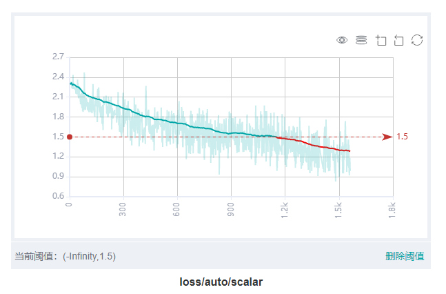
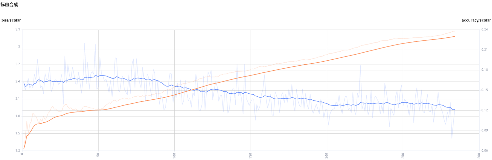
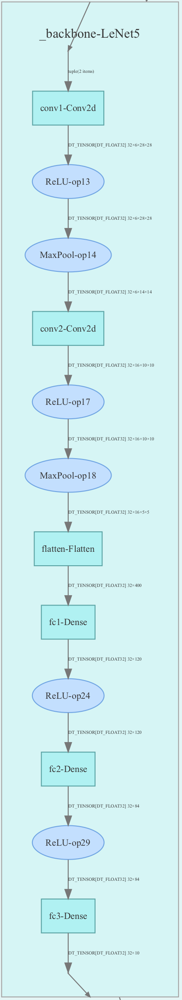
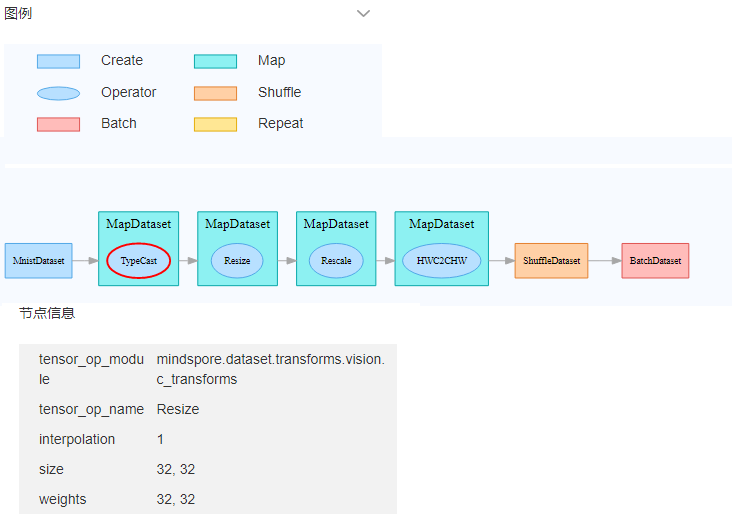
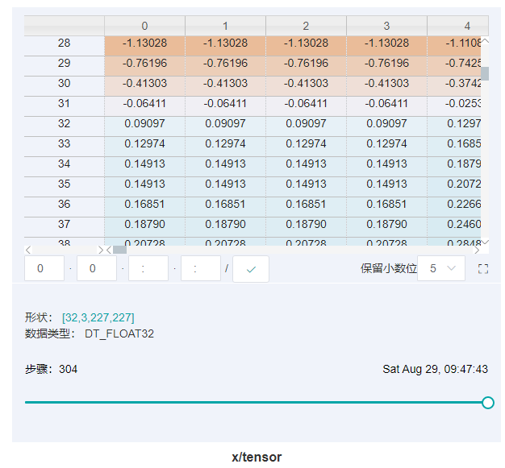

# 查看训练看板

## 概述

训练看板是MindInsight的可视化组件的重要组成部分，而训练看板的标签包含：标量可视化、参数分布图可视化、计算图可视化、数据图可视化、图像可视化、张量可视化和优化过程可视化等。

用户从训练列表中选择指定的训练，进入训练看板。

> 收集可视化数据及进入训练看板方法可参考《[收集Summary数据](https://www.mindspore.cn/mindinsight/docs/zh-CN/master/summary_record.html)》。

## 标量可视化

标量可视化用于展示训练过程中，标量的变化趋势情况。

*图1：标量趋势图*

图1展示了神经网络在训练过程中损失值的变化过程。横坐标是训练步骤，纵坐标是损失值。

图中右上角有几个按钮功能，从左到右功能分别是全屏展示，切换Y轴比例，开启/关闭框选，分步回退和还原图形。

- 全屏展示即全屏展示该标量曲线，再点击一次即可恢复。
- 切换Y轴比例是指可以将Y轴坐标进行对数转换。
- 开启/关闭框选是指可以框选图中部分区域，并放大查看该区域， 可以在已放大的图形上叠加框选。
- 分步回退是指对同一个区域连续框选并放大查看时，可以逐步撤销操作。
- 还原图形是指进行了多次框选后，点击此按钮可以将图还原回原始状态。

图中右下角可以设置阈值并高亮显示或者删除阈值。如图所示，设置的阈值为小于1.5，红色高亮部分显示出不超出阈值的部分，能够直观地看到预期的数据值或者一些异常的数值。

*图2：标量可视化功能区*

图2展示的标量可视化的功能区，提供了根据选择不同标签，水平轴的不同维度和平滑度来查看标量信息的功能。

- 标签选择：提供了对所有标签进行多项选择的功能，用户可以通过勾选所需的标签，查看对应的标量信息。
- 水平轴：可以选择“步骤”、“相对时间”、“绝对时间”中的任意一项，来作为标量曲线的水平轴。
- 平滑度：可以通过调整平滑度，对标量曲线进行平滑处理。
- 标量合成：可以选中两条标量曲线进行合成并展示在一个图中，以方便对两条曲线进行对比或者查看合成后的图。

*图3：Accuracy和Loss的标量合成图*

图3展示Accuracy曲线和Loss曲线的标量合成图。标量合成的功能区与标量可视化的功能区相似。其中与标量可视化功能区不一样的地方，在于标签选择时，标量合成功能最多只能同时选择两个标签，将其曲线合成并展示。

## 参数分布图可视化

参数分布图用于将用户所指定的张量以直方图的形式进行展示。

*图4：参数分布图功能区*

图4展示参数分布图的功能区，包含以下内容:

- 标签选择：提供了对所有标签进行多项选择的功能，用户可以通过勾选所需的标签，查看对应的直方图。
- 纵轴：可以选择`步骤`、`相对时间`、`绝对时间`中的任意一项，来作为直方图纵轴显示的数据。
- 视角：可以选择`正视`和`俯视`中的一种。`正视`是指从正面的角度查看直方图，此时不同步骤之间的数据会覆盖在一起。`俯视`是指偏移以45度角俯视直方图区域，这时可以呈现不同步骤之间数据的差异。

*图5：直方图展示*

图5以`俯视`视角展示了`conv1.weight`张量中的数值分布[直方图](https://en.m.wikipedia.org/wiki/Histogram)
其中x轴为取值区间，y轴为`步骤`、`相对时间`、`绝对时间`中的任意一项，z轴为在对应取值区间的概率分布。例如在step 4，`conv1.weight`中的值主要分布在0和0.015附近，在step 7，该张量的值主要分布在-0.01附近。点击图中右上角，可以将图放大。

## 计算图可视化

计算图可视化用于展示计算图的图结构，数据流以及控制流的走向，支持展示summary日志文件与通过`context`的`save_graphs`参数导出的`pb`文件。

*图6：计算图展示区*

图6展示了计算图的网络结构。如图中所展示的，在展示区中，选中其中一个算子（图中圈红算子），可以看到该算子有两个输入和一个输出（实线代表算子的数据流走向）。

*图7：计算图功能区*

图7展示了计算图可视化的功能区，包含以下内容：

- 文件选择框：可以选择查看不同文件的计算图。
- 搜索框：可以对节点进行搜索，输入节点名称点击回车，即可展示该节点。
- 缩略图：展示整个网络图结构的缩略图，在查看超大图结构时，方便查看当前浏览的区域。
- 节点信息：展示选中的节点的基本信息，包括节点的名称、属性、输入节点、输出节点等信息。
- 图例：展示的是计算图中各个图标的含义。

*图8：计算图优化*

图8展示了优化可读性功能，该功能优化了计算图的可读性，降低计算图的复杂度，图中大部分的梯度计算逻辑和优化器计算逻辑将会被移除。

注意：

- 为达到最清晰的计算图可视化效果，请勿使用跨Cell的公共函数。
- 收集计算图时设置`jit_level`为`o0`，详细请参考[mindspore.Model.build接口定义](https://www.mindspore.cn/docs/zh-CN/master/api_python/mindspore/mindspore.Model.html#mindspore.Model.build) 。
- 在计算图优化时，不同命名空间中的多个算子可能会因为功能一致而融合，这种情况会导致命名空间之间的连线成环，影响可读性。
- 暂不支持展示完整的控制流，如需展示请在脚本中指定控制分支。

## 数据图可视化

数据图可视化用于展示单次模型训练的数据处理和数据增强信息。

*图9：数据图功能区*

图9展示的数据图功能区包含以下内容：

- 图例：展示数据溯源图中各个图标的含义。
- 数据处理流水线：展示训练所使用的数据处理流水线，可以选择图中的单个节点查看详细信息。
- 节点信息：展示选中的节点的基本信息，包括使用的数据处理和增强算子的名称、参数等。

## 图像可视化

图像可视化用于展示用户所指定的图片。

*图10：图像可视化*

图10展示通过滑动图中“步骤”滑条，查看不同步骤的图片。

*图11：图像可视化功能区*

图11展示图像可视化的功能区，提供了选择查看不同标签，不同亮度和不同对比度来查看图片信息。

- 标签：提供了对所有标签进行多项选择的功能，用户可以通过勾选所需的标签，查看对应的图片信息。
- 亮度调整：可以调整所展示的所有图片亮度。
- 对比度调整：可以调整所展示的所有图片对比度。

## 张量可视化

张量可视化用于将张量以表格以及直方图的形式进行展示。

*图12：张量可视化功能区*

图12展示张量可视化的功能区，包含以下内容：

- 标签选择：提供了对所有标签进行多项选择的功能，用户可以通过勾选所需的标签，查看对应的表格数据或者直方图。
- 视图：可以选择`表格`或者`直方图`来展示tensor数据。在`直方图`视图下存在`纵轴`和`视角`的功能选择。
- 纵轴：可以选择`步骤`、`相对时间`、`绝对时间`中的任意一项，来作为直方图纵轴显示的数据。
- 视角：可以选择`正视`和`俯视`中的一种。`正视`是指从正面的角度查看直方图，此时不同步骤之间的数据会覆盖在一起。`俯视`是指偏移45度角俯视直方图区域，这时可以呈现不同步骤之间数据的差异。

*图13：表格展示*

图13将用户所记录的张量以表格的形式展示，包含以下功能：

- 点击表格右边小方框按钮，可以将表格放大。
- 表格中白色方框显示当前展示的是哪个维度下的张量数据，其中冒号`:`表示当前维度索引范围，和Python索引含义基本一致，不指定具体索引表示当前维度所有值，`2:5`表示索引2到5（不包括5）的值，可以在方框输入对应的索引或者含有`:`的索引范围后按`Enter`键或者点击后边的打勾按钮来查询特定维度的张量数据。假设某维度是32，则其索引范围是-32到31。注意：可以查询0维到2维的张量数据，不支持查询超过两维的张量数据，即不能设置超过两个冒号`:`的查询条件。
- 拖拽表格下方的空心圆圈可以查询特定步骤的张量数据。

*图14：直方图展示*

图14将用户所记录的张量以直方图的形式进行展示。点击图中右上角，可以将图放大。

## 优化过程可视化

优化过程可视化可以将将神经网络训练路径周围的优化空间展示出来，更多信息请查阅[训练优化过程可视化](https://www.mindspore.cn/mindinsight/docs/zh-CN/master/landscape.html)。

## 注意事项

1. 目前MindSpore仅支持在Ascend 910 AI处理器上导出算子融合后的计算图。
2. 在训练中使用Summary算子收集数据时，`HistogramSummary` 算子会影响性能，所以请尽量少地使用。
3. 为了控制内存占用，MindInsight对标签（tag）数目和步骤（step）数目进行了限制：
    - 每个训练看板的最大标签数量为300个标签。标量标签、图片标签、计算图标签、参数分布图（直方图）标签、张量标签的数量总和不得超过300个。特别地，每个训练看板最多有10个计算图标签、6个张量标签。当实际标签数量超过这一限制时，将依照MindInsight的处理顺序，保留最近处理的300个标签。
    - 每个训练看板的每个标量标签最多有1000个步骤的数据。当实际步骤的数目超过这一限制时，将对数据进行随机采样，以满足这一限制。
    - 每个训练看板的每个图片标签最多有10个步骤的数据。当实际步骤的数目超过这一限制时，将对数据进行随机采样，以满足这一限制。
    - 每个训练看板的每个参数分布图（直方图）标签最多有50个步骤的数据。当实际步骤的数目超过这一限制时，将对数据进行随机采样，以满足这一限制。
    - 每个训练看板的每个张量标签最多有20个步骤的数据。当实际步骤的数目超过这一限制时，将对数据进行随机采样，以满足这一限制。
4. 由于`TensorSummary`会记录完整Tensor数据，数据量通常会比较大，为了控制内存占用和出于性能上的考虑，MindInsight对Tensor的大小以及返回前端展示的数值个数进行以下限制：
    - MindInsight最大支持加载含有1千万个数值的Tensor。
    - MindInsight对Tensor的前端展示每次查询最大支持1000列。
    - Tensor加载后，在张量可视的表格视图下，最大支持查看10万个数值，如果所选择的维度查询得到的数值超过这一限制，则无法显示。

5. 由于张量可视（`TensorSummary`）会记录原始张量数据，需要的存储空间较大。使用`TensorSummary`前和训练过程中请注意检查系统存储空间充足。

    通过以下方法可以降低张量可视功能的存储空间占用：

    1）避免使用`TensorSummary`记录较大的Tensor。

    2）减少网络中`TensorSummary`算子的使用个数。

   功能使用完毕后，请及时清理不再需要的训练日志，以释放磁盘空间。

   备注：估算`TensorSummary`空间使用量的方法如下：

   一个`TensorSummary数据的大小 ＝ Tensor中的数值个数 * 4 bytes`。假设使用`TensorSummary`记录的Tensor大小为`32 * 1 * 256 * 256`，则一个`TensorSummary`数据大约需要`32 * 1 * 256 * 256 * 4 bytes = 8,388,608 bytes = 8MiB`。`TensorSummary`默认会记录20个步骤的数据，则记录这20组数据需要的空间约为`20 * 8 MiB ＝ 160MiB`。需要注意的是，由于数据结构等因素的开销，实际使用的存储空间会略大于160MiB。
6. 当使用`TensorSummary`时，由于记录完整Tensor数据，训练日志文件较大，MindInsight需要更多时间解析训练日志文件，请耐心等待。
