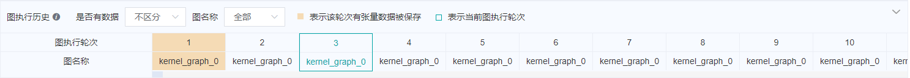
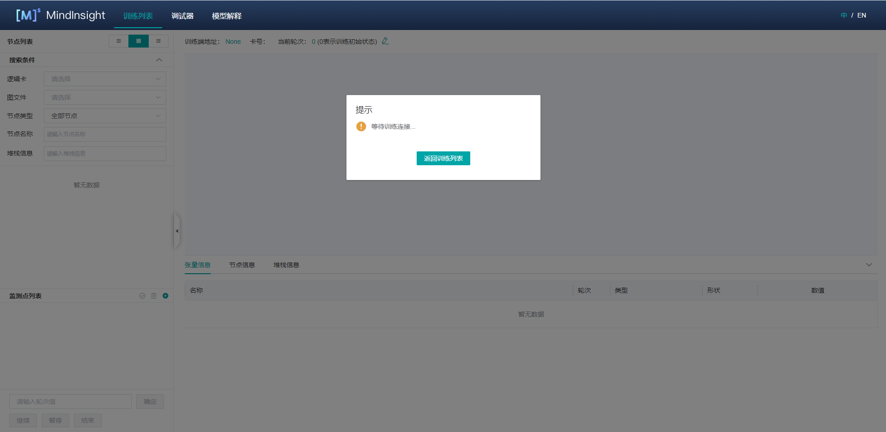

# 使用离线调试器

<a href="https://gitee.com/mindspore/docs/blob/r1.6/docs/mindinsight/docs/source_zh_cn/debugger_offline.md" target="_blank"></a>

## 概述

本教程介绍如何在离线模式下使用调试器。

## 操作流程

1. 准备Dump数据。Dump的使用方式详见[使用Dump功能在Graph模式调试](https://www.mindspore.cn/docs/programming_guide/zh-CN/r1.6/dump_in_graph_mode.html) ；
2. 使用离线调试器进行调试分析。

   如果需要UI页面，可以通过MindInsight的离线调试器入口启动调试器。操作流程为：

    1）启动MindInsight，并通过启动参数指定summary-base-dir为某一次训练的summary-dir或多次训练的summary-dir的父目录（summary-dir为dump配置中的{path}的父目录）；

    2）从训练列表中找到离线调试器入口，点击“离线调试器”，进入调试器页面，开始进行调试分析。

   如果不需要UI页面，也可以通过离线调试器的API接口来分析。离线调试器的API详见[mindinsight.debugger](https://www.mindspore.cn/mindinsight/docs/zh-CN/r1.6/mindinsight.debugger.html) 。操作流程为：

    1）通过`mindinsight.debugger.DumpAnalyzer`实例化离线调试器，将dump_dir指定为某一次训练的dump路径（dump配置中的{path}）；

    2）使用离线调试器API调试分析。

   如果没有特别说明，下文中的离线调试器均指的是有UI页面的离线调试器。

## 离线调试器环境准备

使用MindSpore的Dump功能准备离线数据。Dump的使用方式详见[使用Dump功能在Graph模式调试](https://www.mindspore.cn/docs/programming_guide/zh-CN/r1.6/dump_in_graph_mode.html) 。

需要注意的是，一个summary-dir目录下只能存放一个dump目录。例如，某一次训练的Dump配置文件中的path为“/home/workspace/data/dump_dir”，那么本次训练dump数据保存以后，再启动其它训练时，Dump配置文件中的path就不能指定为“/home/workspace/data”的子目录。

然后，启动MindInsight，指定summary-base-dir为某一次训练的summary-dir或多次训练的summary-dir的父目录，即可在UI页面中查询到离线调试器的入口。

MindInsight启动命令：

```text
mindinsight start --port {PORT} --summary-base-dir {SUMMARY_BASE_DIR} --offline-debugger-mem-limit {OFFLINE_DEBUGGER_MEMORY_LIMIT} --max-offline-debugger-session-num {MAX_OFFLINE_DEBUGGER_SESSION_NUMBER}
```

参数含义如下:

|参数名|属性|功能描述|参数类型|默认值|取值范围|
|---|---|---|---|---|---|
|`--port {PORT}`|可选|指定Web可视化服务端口。|Integer|8080|1~65535|
|`--summary-base-dir {SUMMARY_BASE_DIR}`|必选|Dump配置中的{path}路径的上一层或上两层。例如，Dump配置文件中的path为“/home/workspace/data/dump_dir”，summary-base-dir可以设置为“/home/workspace/data”或“/home/workspace”。|String|./|-|
|`--offline-debugger-mem-limit <OFFLINE_DEBUGGER_MEMORY_LIMIT>`|可选|指定单个离线调试器会话内存使用上限（单位MB），当出现内存不足导致MindInght离线调试器运行问题时，需要用户根据内存情况设置。|Integer|16*1024|6*1024~int32上限|
|`--max-offline-debugger-session-num <MAX_OFFLINE_DEBUGGER_SESSION_NUMBER>`|可选|指定离线调试器会话数上限，会话数指的是能同时使用离线调试器调试的训练作业个数。|Integer|2|1~2|

更多启动参数请参考[MindInsight相关命令](https://www.mindspore.cn/mindinsight/docs/zh-CN/r1.6/mindinsight_commands.html)。

然后，打开MindInsight页面，从离线调试器入口进入调试器界面。


*图1： 离线调试器入口*

## 离线调试器页面介绍

离线调试器界面与在线调试器大致相同。在线调试器的页面介绍详见[在线调试器页面介绍](https://www.mindspore.cn/mindinsight/docs/zh-CN/r1.6/debugger_online.html#id6) 。不同的是，离线调试器会在计算图的上方显示图执行历史，并且可以重置训练轮次。

### 图执行历史

离线调试器在计算图的上方显示图执行历史，显示离线数据情况和轮次信息，如图2所示。在`是否有数据`下拉框可以选择展示全部图执行历史或者只展示有数据的执行历史。在`图名称`下拉框可以选择只展示对应图名称的执行历史。



*图2：图执行历史*

### 训练轮次重置

如图3所示，点击当前轮次右边的编辑图标，就会出现一个编辑框，如图4所示，输入需要重置的轮次，点击对钩符号即可。重置之后，可以查看新轮次的`张量`值、对已设置的监测点`重新检查`等。


*图3： 重置训练轮次*


*图4：重置训练轮次编辑状态*

## 使用离线调试器进行调试

1. 在调试器环境准备完成后，打开调试器界面，如下图所示：

    

    *图5： 调试器等待训练连接*

    此时，调试器处于加载离线数据的状态。

2. 稍等片刻，在MindInsight UI上可以看到弹窗，提示选择是否使用推荐监测点，接下来的使用步骤与在线调试相同。[使用调试器进行调试](https://www.mindspore.cn/mindinsight/docs/zh-CN/r1.6/debugger_online.html#id17) 。

3. 如果需要重置训练轮次，可以参考[训练轮次重置](https://www.mindspore.cn/mindinsight/docs/zh-CN/r1.6/debugger_offline.html#id7) 来重置训练轮次。每个轮次的数据保存情况可以参考[图执行历史](https://www.mindspore.cn/mindinsight/docs/zh-CN/r1.6/debugger_offline.html#id6) 来查看。

## 离线调试器API使用样例

```python
import mindinsight.debugger as debugger
from mindinsight.debugger import DumpAnalyzer as DumpAnalyzer
from mindinsight.debugger import Watchpoint as Watchpoint

# Init DumpAnalyzer with the dump_dir
analyzer = DumpAnalyzer("/path/to/dump_dir")
# Select the tensors generated by the code in 'lenet.py', line 49
tensors = analyzer.select_tensors(query_string="/path/to/src/of/lenet.py:49", select_by="code_stack")
# Create a watchpoint for tensors with condition TensorTooLarge, set the parameter abs_mean_gt=0.001
watchpoint1 = Watchpoint(tensors, debugger.TensorTooLargeCondition(abs_mean_gt=0.001))
# Create another watchpoint for tensors with condition TensorAllZero, set the parameter zero_percentage_ge=99.9
watchpoint2 = Watchpoint(tensors, debugger.TensorAllZeroCondition(zero_percentage_ge=99.9))
# Check the given watchpoints
hits = analyzer.check_watchpoints([watchpoint1, watchpoint2])
# Show the result
for hit in hits:
    print("The hit detail is: {}".format(hit.get_hit_detail()))
    tensor = hit.tensor
    print("The hit tensor info is: iteration: {}, graph_name: {}, node_name: {}, rank: {}, slot: {}"
          .format(tensor.iteration, tensor.node.graph_name, tensor.node.name, tensor.node.name, tensor.rank, tensor.slot))
```

## 注意事项

- 场景支持：
    - 离线调试器暂不支持CPU场景。
    - 离线调试器支持单机多卡场景。若要分析多机多卡的场景。需要自行把多机数据汇总到一起。
    - 离线调试器暂不支持初始权重和计算过程溢出的检查。
    - 离线调试器暂不支持PyNative模式。

- GPU场景：
    - 与在线调试器不同，离线调试器不支持逐节点执行。

- 使用离线调试器时要保证MindInsight和MindSpore的版本号相同。
- 如果同一路径下存在多个相同张量的Dump文件，离线调试器只会显示最新的张量。
- 重新检查只检查当前有张量值的监测点。
- 调试器展示的图是优化后的最终执行图。调用的算子可能已经与其它算子融合，或者在优化后改变了名称。
- 如果Dump数据对象为Ascend异步Dump产生的bin文件，则解析过程中会产生npy文件，占用磁盘空间。
- 如果使用Ascend场景下的异步Dump数据，可以使用MindInsight的数据解析工具DumpParser的`convert_all_data_to_host`接口将异步Dump数据转换为`.npy`文件，从而提高数据分析效率。DumpParser的使用方式详见[DumpParser介绍](https://gitee.com/mindspore/mindinsight/tree/r1.6/mindinsight/parser) 。