# 使用在线调试器

<!-- TOC -->

- [使用在线调试器](#使用在线调试器)
    - [概述](#概述)
    - [操作流程](#操作流程)
    - [调试器环境准备](#调试器环境准备)
        - [以调试模式启动MindInsight](#以调试模式启动mindinsight)
        - [以调试模式运行训练脚本](#以调试模式运行训练脚本)
    - [调试器页面介绍](#调试器页面介绍)
        - [计算图](#计算图)
        - [节点列表](#节点列表)
        - [节点信息](#节点信息)
        - [监测点列表](#监测点列表)
        - [设置监测点](#设置监测点)
        - [堆栈列表](#堆栈列表)
        - [堆栈信息](#堆栈信息)
        - [重新检查](#重新检查)
        - [训练控制](#训练控制)
        - [张量检查视图](#张量检查视图)
    - [使用调试器进行调试](#使用调试器进行调试)
    - [注意事项](#注意事项)

<!-- /TOC -->

<a href="https://gitee.com/mindspore/docs/blob/master/docs/mindinsight/docs/source_zh_cn/debugger_online.md" target="_blank"></a>

## 概述

本教程介绍如何在在线模式下使用调试器。

## 操作流程

- 以调试模式启动MindInsight，等待训练连接；
- 配置相关环境变量，运行训练脚本；
- 训练连接成功，在MindInsight调试器界面设置监测点；
- 在MindInsight调试器界面分析训练执行情况。

## 调试器环境准备

### 以调试模式启动MindInsight

开始训练前，请先安装MindInsight，并以调试模式启动。调试模式下，MindSpore会将训练信息发送给MindInsight调试服务，用户可在MindInsight调试器界面进行查看和分析。

MindInsight调试服务启动命令：

```text
mindinsight start --port {PORT} --enable-debugger True --debugger-port {DEBUGGER_PORT}
```

参数含义如下:

|参数名|属性|功能描述|参数类型|默认值|取值范围|
|---|---|---|---|---|---|
|`--port {PORT}`|可选|指定Web可视化服务端口。|Integer|8080|1~65535|
|`--enable-debugger {ENABLE_DEBUGGER}`|可选|取值为True或1, 开启MindInsight侧调试器；默认为False，不开启。|Boolean|False|True/False/1/0|
|`--debugger-port {DEBUGGER_PORT}`|可选|指定调试服务端口。|Integer|50051|1~65535|

更多启动参数请参考[MindInsight相关命令](https://www.mindspore.cn/mindinsight/docs/zh-CN/master/mindinsight_commands.html)。

### 以调试模式运行训练脚本

以调试模式运行训练脚本，需要设置环境变量`export ENABLE_MS_DEBUGGER=1`或`export ENABLE_MS_DEBUGGER=True`，将训练指定为调试模式，并设置训练要连接的调试服务和端口：
`export MS_DEBUGGER_HOST=127.0.0.1`(该服务地址需与MindInsight host一致)；
`export MS_DEBUGGER_PORT=50051`(该端口需与MindInsight debugger-port一致)。

如果用户设备的内存空间有限，可在运行训练前开启部分内存复用模式，以降低运行内存占用：`export MS_DEBUGGER_PARTIAL_MEM=1`。

此外，训练时不要使用数据下沉模式（需设置`model.train`中的`dataset_sink_mode`为`False`），以保证调试器可以获取每个轮次的训练信息。

环境变量和训练脚本准备完成后，运行训练脚本。

## 调试器页面介绍

训练连接成功后，可以在MindInsight调试器界面查看计算图等训练元信息，调试器页面布局由计算图、节点列表、节点信息、监测点列表、监测点命中列表、堆栈列表、堆栈信息等部分组成。

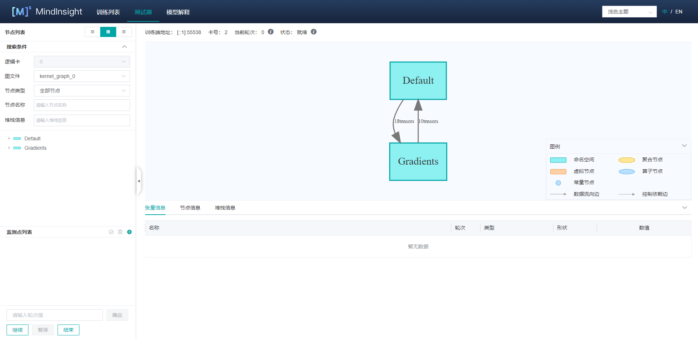

图1： 调试器初始页面

### 计算图

调试器将优化后的最终执行图展示在UI的中上位置，用户可以双击打开图上的方框 (代表一个`scope`) 将计算图进一步展开，查看`scope`中的节点信息。

面板的最上方展示了`训练端地址`（训练脚本所在进程的地址和端口），训练使用的`卡号`, 训练的`当前轮次`等元信息。

在GPU环境下，训练执行图面板的右上角会有`当前节点`和`下一个节点`两个按钮，分别用于回到当前执行节点和执行下一个节点。
用户可以方便地执行单个节点。

### 节点列表

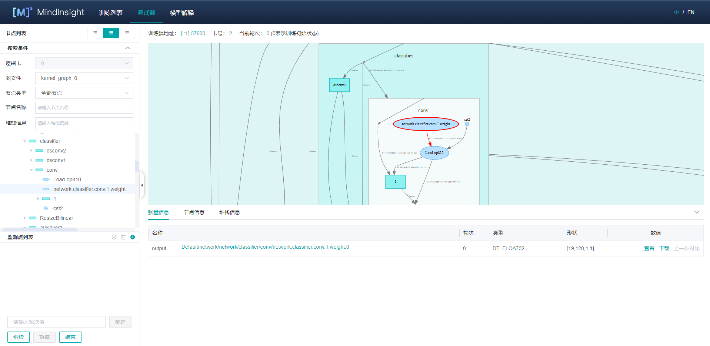

图2： 节点列表按节点类型过滤

如图1所示，在UI的左侧会展示计算图`节点列表`，可以将计算图中的节点按`scope`分层展开。点击`节点列表`中的节点，计算图也会联动展开到选中节点的位置。
用户也可以使用`节点列表`上方的`图文件`以及`节点类型`对节点按图文件和类型进行过滤，如图2所示。用户还可以使用`节点类型`下方的搜索框按名称进行节点的搜索。

### 节点信息

点击计算图上的节点后，可以在UI下方查看该节点的详细信息，如图2所示。该部分展示了节点的输出和输入，训练的`轮次`数目，`张量`的`类型`、`形状`和`数值`等信息。点击`数值`信息里的`下载`，可以将该张量数据下载为.npy文件，默认在download文件夹下。

在GPU环境下，选中图上的某个可执行节点后，单击鼠标右键，可选择`运行到该节点`，代表将训练脚本运行到被选中节点（不超过一个`轮次`）。

### 异常现象检查列表

异常现象检查列表展示了设置的所有异常现象检查规则。异常现象检查规则，简称监测点。

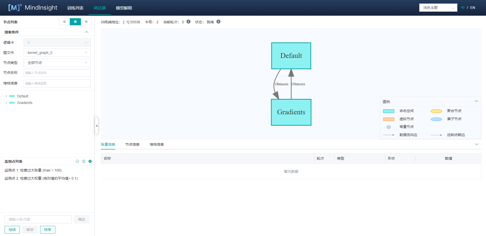

图3： 异常现象检查列表

如图3所示，异常现象检查列表位于页面的左下方。监测点列表上方的三个按钮从左到右依次为`重新检查`、`清空监测点`和`创建监测点`。

### 设置监测点

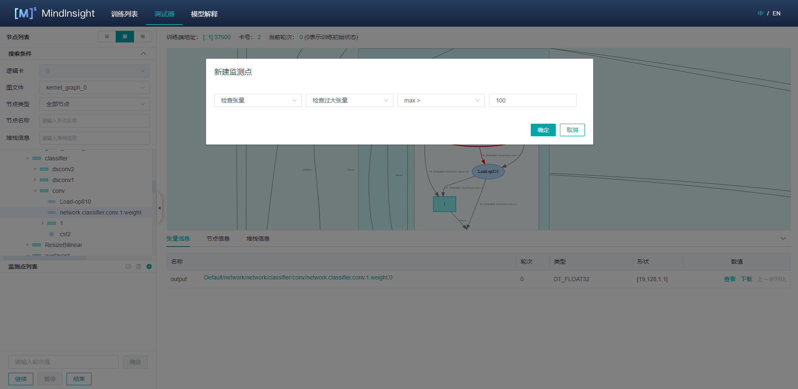

图4： 创建监测点

为了方便地对节点的计算结果进行监测分析，用户可以给计算图中的节点设置监测点。图4展示了监测点的设置方法，用户首先点击监测点列表右上角的 `+` 按钮新增监测点并选择检查条件，比如检查过大张量，选择一个要检查的条件并输入阈值，点击“确定”以创建监测点。
监测点创建后，请手动勾选要检查的节点，最后点击监测点旁边的`√`确认。如果创建监测点时，选择的检查对象为“检查权重”、“检查梯度”、“检查激活”，则监测点创建时，会自动勾选权重、梯度、激活节点，用户可以在点击“确定”后手动修改节点勾选状态。

支持的条件包括（括号中为缩写）：

- 检查张量
    - 检查计算过程溢出（OO）：检查算子计算过程中是否存在溢出现象，仅支持昇腾AI处理器。
    - 检查张量是否全为0（TZ）：通过对条件参数设置阈值来检查张量的0值比例，可选参数为`0值比例>=`。
    - 检查张量溢出（TO）：检查张量值是否存在溢出现象。
    - 检查张量值范围（TR）：通过对条件参数设置阈值来检查张量值的范围，可选参数为`在范围中的值所占百分比>`、`在范围中的值所占百分比<`、`MAX-MIN>`和`MAX-MIN<`。其中在设置`在范围中的值所占百分比>`和`在范围中的值所占百分比<`时需要同时设置支持参数`范围上界（含）`和`范围下界（含）`。
    - 检查过大张量（TL）：通过对条件参数设置阈值来检查张量值是否过大，可选参数为`绝对值的平均值>`、`max >`、`min >`和`mean >`。
    - 检查过小张量（TS）：通过对条件参数设置阈值来检查张量值是否过小，可选参数为`绝对值的平均值<`、`max <`、`min <`和`mean <`。

- 检查权重
    - 检查权重变化过大（WCL）：通过对条件参数设置阈值来检查权重值的变化是否过大，可选参数为`平均变化比例值>`。
        - 其中`平均变化比例值`的计算方式为 `mean(abs(当前权重值 - 上一轮次权重值)) / (mean(abs(上一轮次权重值)) + 偏移量)`。
    - 检查权重变化过小（WCS）：通过对条件参数设置阈值来检查权重值的变化是否过小，可选参数为`平均变化比例值<`。
    - 检查权重初始值（WI）：通过对条件参数设置阈值来检查权重的初始值，可选参数为`0值比例>=`、`max >`和`min <`。
    - 检查未变化权重（WNC）：通过对条件参数设置阈值来检查权重值是否更新，可选参数为`相对容忍度`。
    - 检查权重溢出（WO）：检查权重值是否存在溢出现象。
    - 检查过大权重（WL）：通过对条件参数设置阈值来检查权重值是否过大，可选参数为`绝对值的平均值>`、`max >`、`min >`和`mean >`。
    - 检查过小权重（WS）：通过对条件参数设置阈值来检查权重值是否过小，可选参数为`绝对值的平均值<`、`max <`、`min <`和`mean <`。

- 检查激活值
    - 检查激活值范围（AR）：通过对条件参数设置阈值来检查激活值的范围，可选参数为`在范围中的值所占百分比>`、`在范围中的值所占百分比<`、`MAX-MIN>`和`MAX-MIN<`。其中在设置`在范围中的值所占百分比>`和`在范围中的值所占百分比<`时需要同时设置支持参数`范围上界（含）`和`范围下界（含）`。

- 检查梯度
    - 检查梯度爆炸（GE）：检查梯度值是否存在溢出现象。
    - 检查梯度过大（GL）：通过对条件参数设置阈值来检查梯度值是否过大，可选参数为`绝对值的平均值>`、`max >`、`min >`和`mean >`。
    - 检查梯度消失（GV）：通过对条件参数设置阈值来检查梯度值是否过小，可选参数为`绝对值的平均值<`、`max <`、`min <`和`mean <`。

检测点生成后用户还可以在节点列表添加或取消要监控的节点（勾选节点前的方框），如图3所示。除此之外，用户可以通过点击`清空监测点`按钮或者点击监测点旁边的`x`来删除监测点。

训练时，调试器会对这些监控节点的输出进行实时分析，一旦监控条件触发，训练暂停，用户可在UI上查看触发的监测节点信息。

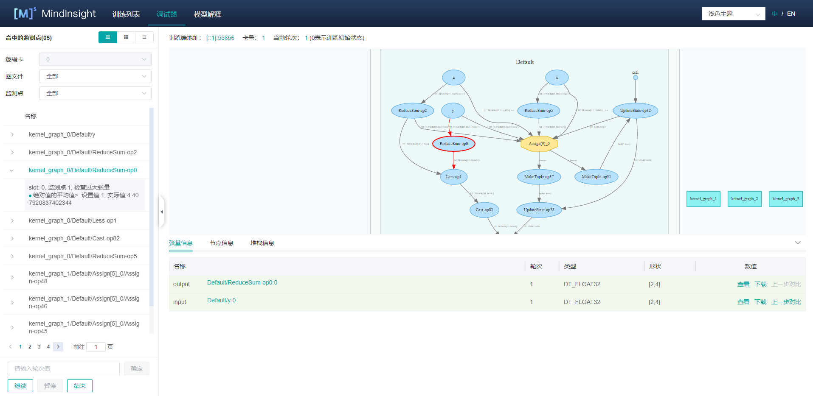

图5： 查看触发的监测节点

图5展示了触发了监测点的节点列表，该页面和`节点列表`所在位置相同。如果设置了多个监测点，可以在监测点的下拉框中选择监测点id号，就会只展示触发了选中监测点的节点列表。
如果是多子图的网络，还可以在图文件的下拉框中选择图名称，就会只展示选中的子图中触发了监测点的节点列表。
如果是多卡训练，还可以选择逻辑卡号来展示对应逻辑卡上触发了监测点的节点列表（目前只支持离线调试，在线调试器暂不支持多卡训练）。

同一张子图上的触发了监测点的节点会按照节点的执行序排列，点击节点名左侧的展开图标，显示该节点触发的监测点和监控条件，监控条件上会显示该条件的设置值以及触发该条件的实际值。
另外，用户点击某一行，会在计算图中跳转到对应节点，可以进一步查看节点信息分析异常结果出现的原因。点击`查看`进入张量检查视图可以查看触发的监测点信息以及调优向导，如图8所示。

### 堆栈列表

通过调试器页面左上方的切换按钮，可以从`节点列表`或`命中的监测点`切换到`堆栈列表`。

在调试器的堆栈信息列表页，可以看到所有的堆栈信息列表，搜索框输入关键字，可以显示匹配的堆栈信息列表。列表分页显示。点击底部的页码，可以快速跳转到对应页。

点击列表中的某一项，可以自动跳转到节点列表，在节点列表可以看到与这一行代码相关的节点。

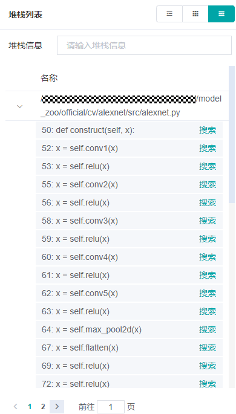

图6： 堆栈列表

### 堆栈信息

在图上定位到某一个节点时，点击计算图下方的`堆栈信息`标签，会看到该节点对应的堆栈信息。

在堆栈信息标签下，点击某一行的搜索，可以搜索与这一行相关的所有节点，搜索结果会自动展示在节点列表中。

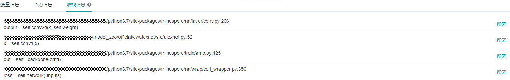

图7： 堆栈信息

注意：有部分算子由框架生成，例如`TupleGetItem`、`Depend`、`UpdateState`等，可能关联到框架本身的代码，或者没有代码可以关联，均为正常现象。

### 重新检查

为了更详细地对节点进行监测分析，用户可以在修改监测点的节点，添加删除监测点后对当前轮次重新检查。`重新检查`按钮位于监测点列表右上角，如图3所示。

### 训练控制

监测点设置面板的下方是训练控制面板，该面板展示了调试器的训练控制功能，有`继续`、`暂停`、`结束`和`确定`四个按钮。

- `确定`代表训练向前执行若干个`轮次`，需要用户在上方的输入框内指定执行的`轮次`数目，直到监测点触发、或`轮次`执行完毕后暂停；
- `继续`代表训练一直执行，直到监测点触发后暂停、或运行至训练结束；
- `暂停`代表训练暂停；
- `结束`代表终止训练。

### 张量检查视图

一些`张量`的维度过多，无法直接在主页进行展示。用户可以点击对应的`查看`按钮，在弹出的张量检查视图中查看`张量`值的详细信息。

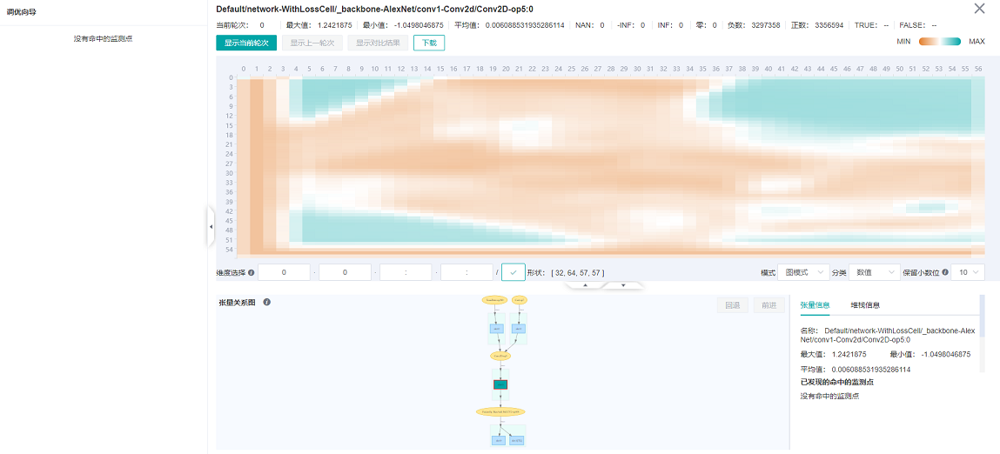

图8：查看张量热力图

如图8所示，张量检查视图将`张量`值展示在UI的中上位置，默认显示热力图，可以显示当前数值的分布情况。鼠标移动到图上某一个位置时，会显示当前坐标的具体值。在热力图下方的`模式`下拉框选择`表格模式`，即以表格的形式展示`张量`值，如图9所示。

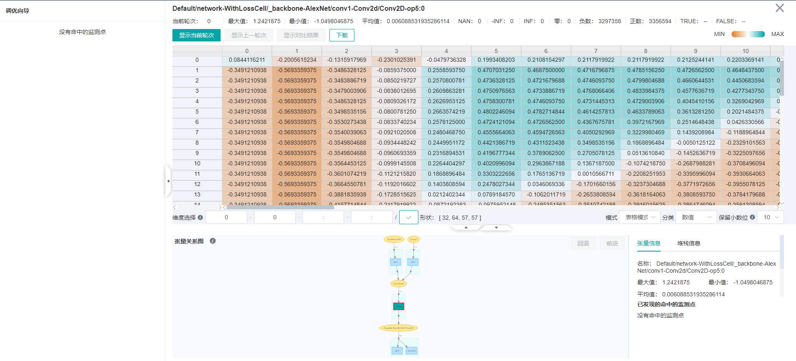

图9： 查看张量值

在张量检查视图，用户可以进行`维度选择`，点击`显示当前step`，`显示上一step`和`显示对比结果`对张量进行显示和对比（当前仅支持参数节点与上一轮次对比）。此外，用户可以设置切片进行`维度选择`来显示相应维度的`张量`。

视图的最上方展示了`节点信息`、`当前轮次`以及`统计信息`；视图的左侧展示了调优向导，当监测点命中时，将显示命中信息和相关的调优建议；视图的下方展示了张量关系图以及详细的`节点信息`。

通过张量关系图，可以分析当前张量是通过哪些张量计算出来的，还可以分析当前张量影响到了哪些常量。张量图中标注了命中监测点的条件的缩写，方便用户快速识别张量问题的传播路径。每个条件的缩写可以在“设置监测点”一节中查到。

张量检查视图也提供了下载功能，用户可以将需要的张量下载，进行深入的处理分析。

## 使用调试器进行调试

1. 在调试器环境准备完成后，打开调试器界面，如下图所示：

    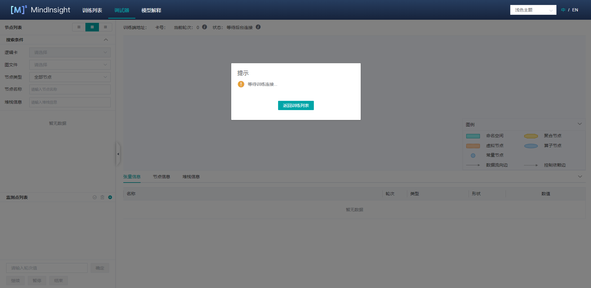

    图10： 调试器等待训练连接

    此时，调试器处于等待训练启动和连接的状态。

2. 在终端运行训练脚本。

3. 稍等片刻，在MindInsight UI上可以看到弹窗，提示选择是否使用推荐监测点，如下图所示：

    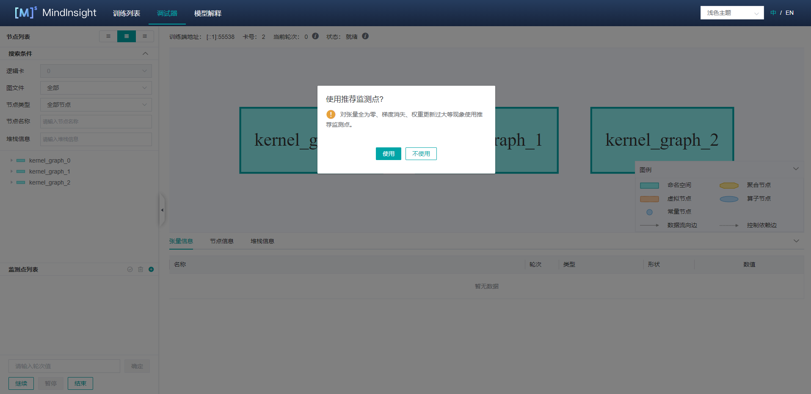

    图11： 等待用户选择是否使用推荐监测点

4. 稍后可以看到计算图显示在调试器界面，见图1。

5. 设置监测点，见图4。

    按图4所示，选中检测条件，并按图3添加或取消部分节点，调试器将监控这些节点在计算过程中是否存在满足监控条件的输出。
    设置完监测点后，可以在控制面板设置轮次并点击`确定`向前训练指定轮次，或者直接点击`继续`继续训练。

6. 监测点触发，见图5。

    监测点触发后，用户查看对应的节点信息和堆栈信息，通过张量检查视图找出异常原因，或者下载张量以后再通过离线分析来找出异常原因，修改脚本，修复问题。

## 注意事项

- 场景支持：
    - 调试器暂不支持分布式训练场景。
    - 调试器暂不支持推断场景。
    - 调试器暂不支持单机多卡/集群场景。
    - 调试器暂不支持连接多个训练进程。
    - 调试器暂不支持CPU场景。
    - 调试器暂不支持PyNative模式。
    - 调试器暂不支持多网络场景。

- 性能影响：
    - 使用调试器时，会对训练性能产生一定影响。
    - 设置的监测点数目过多时，可能会出现系统内存不足（Out-of-Memory）的异常。

- GPU场景：
    - 在GPU场景下，只有满足条件的参数节点可以与自身的上一轮次结果作对比：使用`下一个节点`执行过的节点、使用`运行到该节点`时选中的节点、作为`监测点`输入的参数节点。其他情况均无法使用`上一轮次对比`功能。

- 使用调试器时要保证MindInsight和MindSpore的版本号相同。
- 重新检查只检查当前有张量值的监测点。
- 检查计算过程溢出需要用户开启异步Dump的全部溢出检测功能，开启方式请参照[异步Dump功能介绍](https://www.mindspore.cn/docs/programming_guide/zh-CN/master/custom_debugging_info.html#id5)
- 调试器展示的图是优化后的最终执行图。调用的算子可能已经与其它算子融合，或者在优化后改变了名称。
- 开启调试器会关闭内存复用，在训练网络过大时有可能导致'out of memory'错误。
