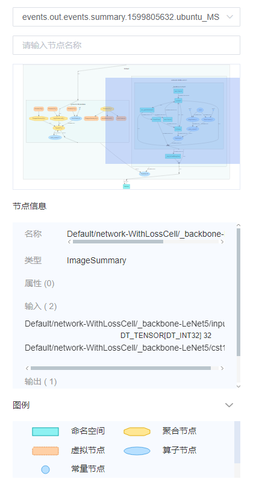
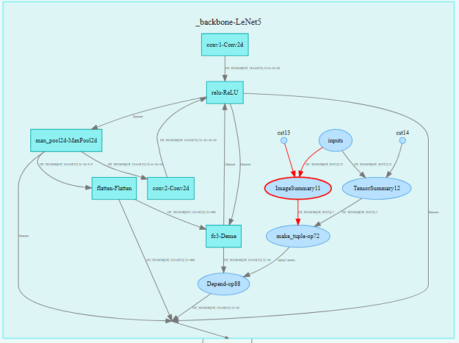

# 计算图可视设计

## 特性背景

计算图可视的功能，主要协助开发者在下面这些场景中使用。

- 开发者在编写深度学习神经网络的代码时，可以使用计算图的功能查看神经网络中算子的数据流走向，以及模型结构。
- 计算图还可以方便开发者查看指定节点的输入和输出节点，以及所查找的节点的属性信息。
- 开发者在调试网络时，可以通过可视化的计算图，轻易跟踪数据，包括数据维度、类型的变更等。

## 总体设计

### 概念设计

 |概念|说明|
 |--|--|
 |根节点、父节点、子节点|我们根据算子名称中的斜线，对节点划分层级。比如节点A 'Network' 和节点B 'Network/Conv2D'，我们称节点A为根节点，称节点B为节点A的子节点，同时节点A也是节点B的父节点。|
 |作用域|每个节点都存在一个作用域，子节点的作用域即为父节点的节点名称，比如算子节点A 'Network/Conv2D'，它的作用域为 'Network'，即父节点 'Network' 的名称。而根节点的作用域为空字符串。|
 |算子节点|节点类型。从保存了计算图的文件中解析出来的原始节点，其对应神经网络代码中一个操作算子，比如Add操作算子。|
 |常量节点|节点类型。表明算子的常量输入。从保存了计算图的文件中解析出来的常量，并根据其他节点的输入，决定它的作用域，比如常量A，原始名称为 'Const1'，由于算子节点B 'Network/Conv2D' 有一个输入是常量A，则复制一个常量A，并将其名称命名为 'Network/Const1'，使其作用域与算子节点B一样。|
 |参数节点|节点类型。表明算子的参数输入。|
 |命名空间|节点类型，也是作用域类型。以算子节点名字中的斜线（/）进行分割而得到的一种节点类型。比如存在一个名字为 'Network/Conv2D' 的节点 A，根据斜线分割，可以产生一个命名空间节点B，名称为 'Network'，在图中展示时，A是B的一个子节点，A的作用域即为B的名称。展开B节点后，才可以看到A节点。|
 |聚合节点|节点类型，也是作用域类型。在同一个作用域下，当同一种类型的节点过多时，我们会新建一个聚合节点，用来代替这些类型的节点，而这些类型的节点则作为该聚合节点的子节点折叠起来。|
 |代理节点|节点类型。为了优化图中的连线，当节点A与节点B之间的连线过于曲折，我们会在A的旁边新建一个能够代理表示B的节点C，并连线A和C，表明A的数据流向B，而避免了直接连线A和B，导致布局过乱。|
 |数据边|连线类型。表明数据的流向，用带箭头的实线表示。比如A->B，表明A有数据流向B。|
 |控制边|连线类型。表明算子节点之间执行的依赖关系，用带箭头的虚线表示。比如A-->B，表明A先执行，再执行B。|
 |独立布局|在一些连线比较复杂的场景下，我们将某个节点从原来的连线中提出来，避免其他节点与它相连，相对的在其他节点新建代理节点，使节点与代理节点相连，达到简化连线的关系。比如将参数类型的节点进行聚合，简化了参数节点与其他节点的连线关系。|

### 后端设计

后端的类图如下，主要分为Graph基类和Node两个类，其中MsGraph是继承了Graph基类，用于解析MindSpore ANF的计算图文件。Node类聚合成一张图，与Graph为聚合关系。

### 前端设计

数据将通过Web UI进行绘图并展示，前端采用d3-graph-viz 3.x插件进行绘图辅助。

*图1：辅助功能*

如图1所示，提供选择文件、查询节点、查看节点信息、节点输入输出等辅助功能。

*图2：计算图主体展示*

计算图中，根据斜线（/）对节点的名称划分层次，并逐层展示，参考图2计算图主体展示。双击一个作用域节点后，将会展示它的子节点。

### 接口设计

计算图中，主要有文件接口和RESTful API接口，其中文件接口为`summary.proto`文件，是MindInsight和MindSpore进行数据对接的接口。
RESTful API接口是MindInsight前后端进行数据交互的接口。

#### 文件接口设计

MindSpore与MindInsight之间的数据交互，采用[protobuf](https://developers.google.cn/protocol-buffers/docs/pythontutorial?hl=zh-cn)定义数据格式。
[summary.proto文件](https://gitee.com/mindspore/mindinsight/blob/master/mindinsight/datavisual/proto_files/mindinsight_summary.proto)为总入口，计算图的消息对象定义为 `GraphProto`。`GraphProto`的详细定义可以参考[anf_ir.proto文件](https://gitee.com/mindspore/mindinsight/blob/master/mindinsight/datavisual/proto_files/mindinsight_anf_ir.proto)。
