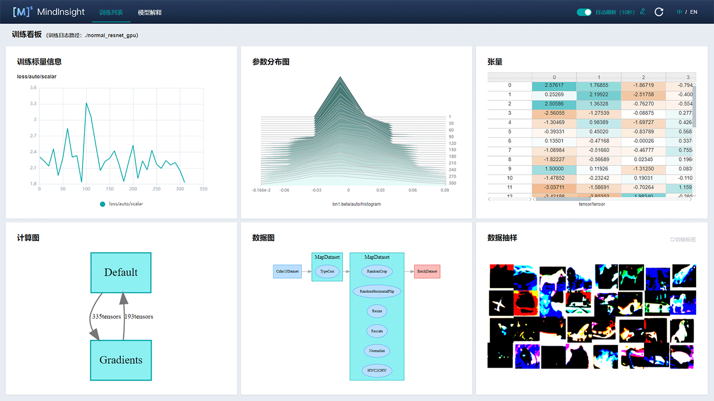

MindInsight文档
================

MindInsight是昇思MindSpore的可视化调试调优工具。利用MindInsight，您可以可视化地查看训练过程、优化模型性能、调试精度问题、解释推理结果。您还可以通过MindInsight提供的命令行方便地搜索超参，迁移模型。在MindInsight的帮助下，您可以更轻松地获得满意的模型精度和性能。

MindInsight包括以下内容：

- 训练过程可视 (`收集Summary数据、查看训练看板 <https://www.mindspore.cn/mindinsight/docs/zh-CN/master/summary_record.html>`_)
- `训练溯源及对比 <https://www.mindspore.cn/mindinsight/docs/zh-CN/master/lineage_and_scalars_comparison.html>`_
- `性能调优 <https://www.mindspore.cn/mindinsight/docs/zh-CN/master/performance_profiling.html>`_
- `精度调试 <https://www.mindspore.cn/mindinsight/docs/zh-CN/master/debugger.html>`_
- `超参调优 <https://www.mindspore.cn/mindinsight/docs/zh-CN/master/hyper_parameters_auto_tuning.html>`_
- `模型迁移 <https://www.mindspore.cn/mindinsight/docs/zh-CN/master/migrate_3rd_scripts_mindconverter.html>`_

使用MindInsight可视化训练过程
------------------------------

1. `收集可视化训练数据 <https://www.mindspore.cn/mindinsight/docs/zh-CN/master/summary_record.html>`_

   在训练脚本中使用SummaryCollector记录训练信息，再执行训练。

2. `启动MindInsight可视化训练 <https://www.mindspore.cn/mindinsight/docs/zh-CN/master/mindinsight_commands.html#id3>`_

   启动MindInsight，并通过 ``--summary-base-dir`` 参数指定summary日志文件目录。

3. `查看训练看板 <https://www.mindspore.cn/mindinsight/docs/zh-CN/master/mindinsight_commands.html#id3>`_

   在浏览器中打开MindInsight访问地址，点击“训练看板”按钮查看详细信息。

使用MindInsight分析模型性能
---------------------------

1. `收集模型分析数据 <https://www.mindspore.cn/mindinsight/docs/zh-CN/master/performance_profiling_ascend.html#id3>`_

   在训练脚本中调用MindSpore Profiler相关接口，再执行训练。

2. `启动MindInsight分析模型 <https://www.mindspore.cn/mindinsight/docs/zh-CN/master/mindinsight_commands.html>`_

   启动MindInsight服务，并通过 ``--summary-base-dir`` 参数指定性能数据目录。

3. `分析性能数据 <https://www.mindspore.cn/mindinsight/docs/zh-CN/master/performance_profiling_ascend.html#id4>`_

   在浏览器中打开MindInsight访问地址，点击“性能分析”按钮查看并分析训练性能数据。

使用MindInsight调试模型精度
----------------------------

1. `以调试模式启动MindInsight <https://www.mindspore.cn/mindinsight/docs/zh-CN/master/debugger_online.html#mindinsight>`_

   通过配置 ``--enable-debugger True`` ``--debugger-port 50051`` 参数使MindInsight以调试模式启动。

2. `以调试模式运行训练脚本 <https://www.mindspore.cn/mindinsight/docs/zh-CN/master/debugger_online.html#id5>`_

   设置环境变量 ``export ENABLE_MS_DEBUGGER=True`` ，将训练指定为调试模式，并设置训练要连接的调试服务和端口： ``export MS_DEBUGGER_HOST=127.0.0.1；`` ``export MS_DEBUGGER_PORT=50051`` ，然后执行训练脚本。

3. `在MindInsight界面设置监测点并分析 <https://www.mindspore.cn/mindinsight/docs/zh-CN/master/debugger_online.html#id11>`_

   在浏览器中打开MindInsight访问地址，点击“调试器”页签，等待训练连接后，设置监测点，分析计算图、张量、监测点命中等数据，识别精度问题根因。

使用MindConverter迁移模型
--------------------------

1. 导出ONNX模型

   在原始脚本中导出ONNX模型，参见TensorFlow或PyTorch提供的相关说明。

2. `迁移模型 <https://www.mindspore.cn/mindinsight/docs/zh-CN/master/migrate_3rd_scripts_mindconverter.html#id4>`_

   执行mindconverter命令以迁移模型，迁移后查看迁移报告并修复报告中指出的错误。

3. 补充脚本

   基于MindConverter生成的骨干模型定义，补齐数据处理、loss函数、训练循环等脚本代码，组成完整脚本。

.. toctree::
   :glob:
   :maxdepth: 1
   :caption: 安装部署

   mindinsight_install

.. toctree::
   :glob:
   :maxdepth: 1
   :caption: 使用指南

   summary_record
   dashboard
   lineage_and_scalars_comparison
   hyper_parameters_auto_tuning
   migrate_3rd_scripts_mindconverter
   performance_profiling
   debugger
   model_explanation
   landscape
   mindinsight_commands

.. toctree::
   :maxdepth: 1
   :caption: 精度调优指南

   accuracy_problem_preliminary_location
   accuracy_optimization

.. toctree::
   :maxdepth: 1
   :caption: 性能调优指南

   performance_tuning_guide

.. toctree::
   :glob:
   :maxdepth: 1
   :caption: 参考文档

   training_visual_design
   graph_visual_design
   tensor_visual_design
   profiler_design
