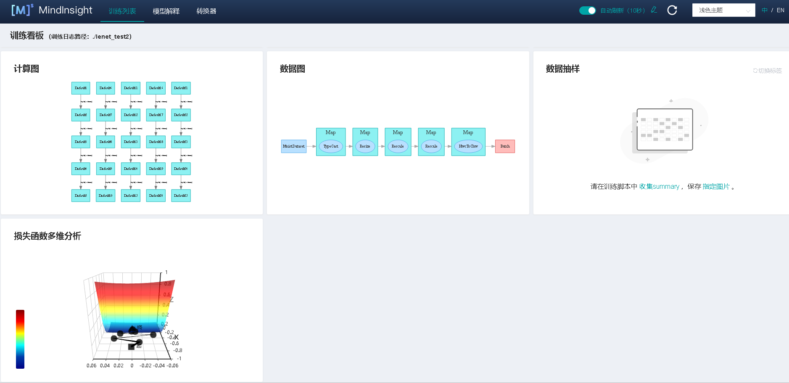
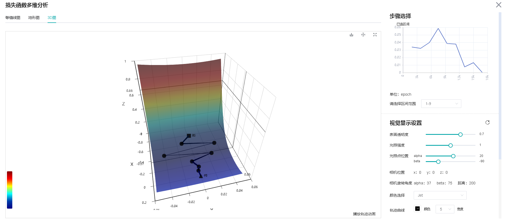
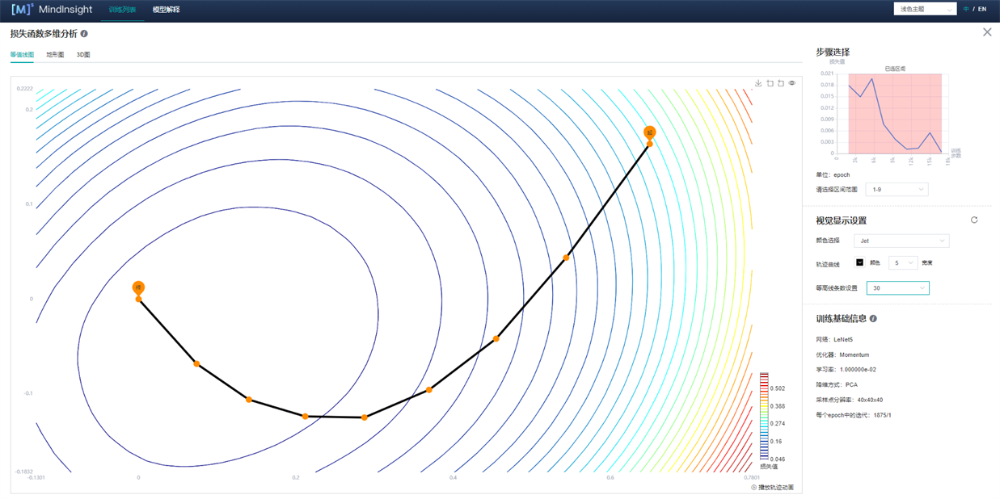
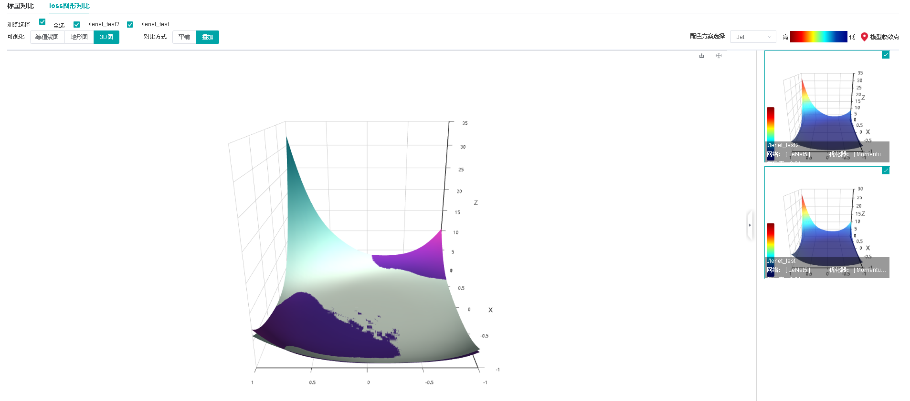
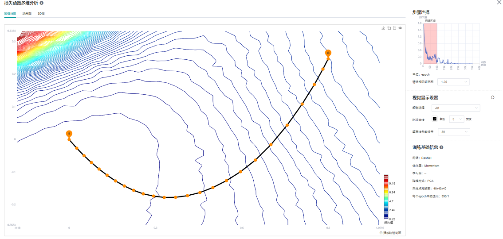
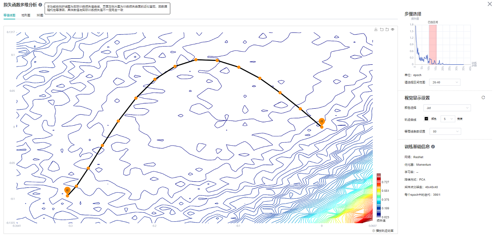
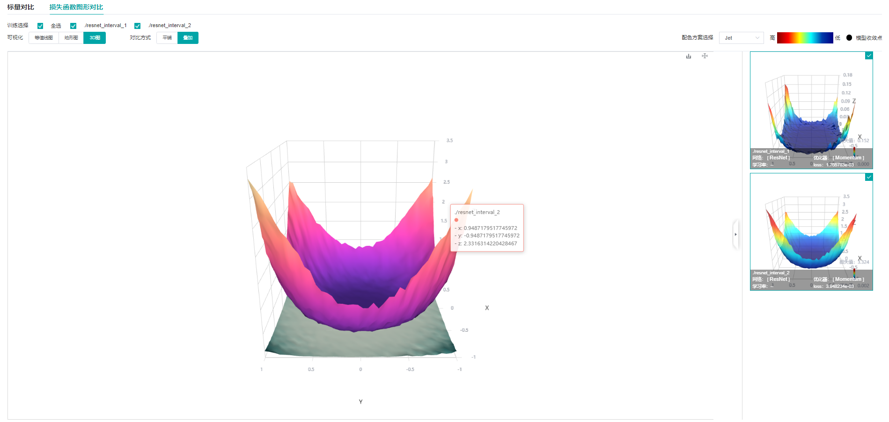
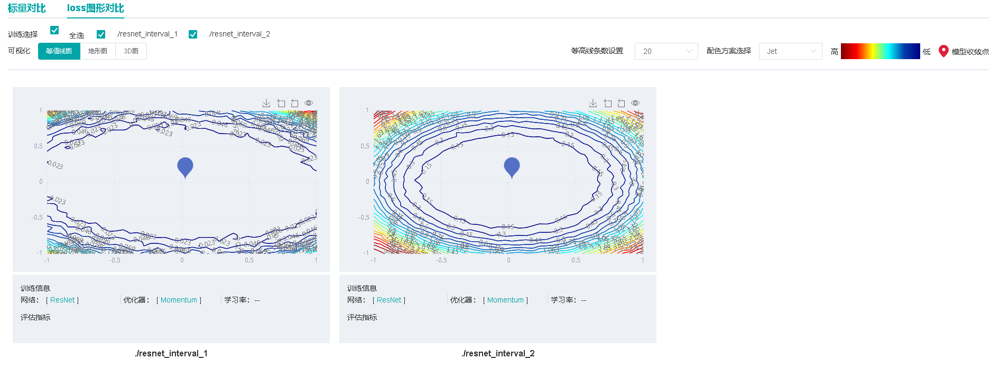

# 训练优化过程可视化

<a href="https://gitee.com/mindspore/docs/blob/master/docs/mindinsight/docs/source_zh_cn/landscape.md" target="_blank"></a>&nbsp;&nbsp;

## 概述

神经网络训练本质上是高维非凸函数的优化过程，一般可以通过梯度下降方法发现最小值点(如图1所示)。而一般的神经网络参数多达几万甚至几十万，较难直接在三维空间展示其优化地形。用户通过本功能，能够基于方向降维和绘制计算，将神经网络训练路径周围的优化空间展示出来。


图1 梯度下降方法（图片来源<https://www.pianshen.com/article/81321136968/>）

## 使用步骤

具体使用步骤共分为两步，以LeNet为例，分类任务，数据集为MNIST，样例代码如下：

1. 训练数据收集：在训练过程中，利用SummaryCollector的形式收集多个模型前向网络权重，地形图绘制所需参数（如期望绘制区间，地形图分辨率等），SummaryCollector的其他具体使用方法可参考[收集Summary数据](https://www.mindspore.cn/mindinsight/docs/zh-CN/master/summary_record.html)。

   ```python
   import mindspore.dataset as ds
   import mindspore.dataset.vision.c_transforms as CV
   import mindspore.dataset.transforms.c_transforms as C
   from mindspore.dataset.vision import Inter
   from mindspore import dtype as mstype
   import mindspore.nn as nn

   from mindspore.common.initializer import Normal
   from mindspore import context
   from mindspore.train.callback import ModelCheckpoint, CheckpointConfig, LossMonitor, TimeMonitor, SummaryCollector
   from mindspore import Model
   from mindspore.nn import Accuracy
   from mindspore import set_seed

   set_seed(1)

   def create_dataset(data_path, batch_size=32, repeat_size=1,
                      num_parallel_workers=1):
       """
       create dataset for train or test
       """
       # define dataset
       mnist_ds = ds.MnistDataset(data_path, shuffle=False)

       resize_height, resize_width = 32, 32
       rescale = 1.0 / 255.0
       shift = 0.0
       rescale_nml = 1 / 0.3081
       shift_nml = -1 * 0.1307 / 0.3081

       # define map operations
       resize_op = CV.Resize((resize_height, resize_width), interpolation=Inter.LINEAR)  # Bilinear mode
       rescale_nml_op = CV.Rescale(rescale_nml, shift_nml)
       rescale_op = CV.Rescale(rescale, shift)
       hwc2chw_op = CV.HWC2CHW()
       type_cast_op = C.TypeCast(mstype.int32)

       # apply map operations on images
       mnist_ds = mnist_ds.map(operations=type_cast_op, input_columns="label", num_parallel_workers=num_parallel_workers)
       mnist_ds = mnist_ds.map(operations=resize_op, input_columns="image", num_parallel_workers=num_parallel_workers)
       mnist_ds = mnist_ds.map(operations=rescale_op, input_columns="image", num_parallel_workers=num_parallel_workers)
       mnist_ds = mnist_ds.map(operations=rescale_nml_op, input_columns="image", num_parallel_workers=num_parallel_workers)
       mnist_ds = mnist_ds.map(operations=hwc2chw_op, input_columns="image", num_parallel_workers=num_parallel_workers)

       # apply DatasetOps
       buffer_size = 10000
       mnist_ds = mnist_ds.shuffle(buffer_size=buffer_size)  # 10000 as in LeNet train script
       mnist_ds = mnist_ds.batch(batch_size, drop_remainder=True)
       mnist_ds = mnist_ds.repeat(repeat_size)

       return mnist_ds

   class LeNet5(nn.Cell):
       """
       Lenet network

       Args:
           num_class (int): Number of classes. Default: 10.
           num_channel (int): Number of channels. Default: 1.

       Returns:
           Tensor, output tensor
       Examples:
           >>> LeNet(num_class=10)

       """
       def __init__(self, num_class=10, num_channel=1, include_top=True):
           super(LeNet5, self).__init__()
           self.conv1 = nn.Conv2d(num_channel, 6, 5, pad_mode='valid', weight_init=Normal(0.02))
           self.conv2 = nn.Conv2d(6, 16, 5, pad_mode='valid', weight_init=Normal(0.02))
           self.relu = nn.ReLU()
           self.max_pool2d = nn.MaxPool2d(kernel_size=2, stride=2)
           self.include_top = include_top
           if self.include_top:
               self.flatten = nn.Flatten()
               self.fc1 = nn.Dense(16 * 5 * 5, 120)
               self.fc2 = nn.Dense(120, 84)
               self.fc3 = nn.Dense(84, num_class)

       def construct(self, x):
           x = self.conv1(x)
           x = self.relu(x)
           x = self.max_pool2d(x)
           x = self.conv2(x)
           x = self.relu(x)
           x = self.max_pool2d(x)
           if not self.include_top:
               return x
           x = self.flatten(x)
           x = self.relu(self.fc1(x))
           x = self.relu(self.fc2(x))
           x = self.fc3(x)
           return x

   def train_lenet():
       context.set_context(mode=context.GRAPH_MODE, device_target="GPU")
       data_path = YOUR_DATA_PATH
       ds_train = create_dataset(data_path)

       network = LeNet5(10)
       net_loss = nn.SoftmaxCrossEntropyWithLogits(sparse=True, reduction="mean")
       net_opt = nn.Momentum(network.trainable_params(), 0.01, 0.9)
       time_cb = TimeMonitor(data_size=ds_train.get_dataset_size())
       config_ck = CheckpointConfig(save_checkpoint_steps=1875, keep_checkpoint_max=10)
       ckpoint_cb = ModelCheckpoint(prefix="checkpoint_lenet", config=config_ck)
       model = Model(network, net_loss, net_opt, metrics={"Accuracy": Accuracy()})
       summary_dir = "./summary/lenet_test2"
       interval_1 = [x for x in range(1, 4)]
       interval_2 = [x for x in range(7, 11)]
       ##Collector landscape information
       summary_collector = SummaryCollector(summary_dir, keep_default_action=True,
                                            collect_specified_data={'collect_landscape': {'landscape_size': 40,
                                                                                          'unit': "epoch",
                                                                                          'create_landscape': {'train': True,
                                                                                                               'result': True},
                                                                                          'num_samples': 512,
                                                                                           'intervals': [interval_1,
                                                                                                         interval_2
                                                                                                         ]
                                                                                           }
                                                                   },
                                           collect_freq=1)

       print("============== Starting Training ==============")
       model.train(10, ds_train, callbacks=[time_cb, ckpoint_cb, LossMonitor(), summary_collector])

   if __name__ == "__main__":
       train_lenet()
   ```

   summary_dir设置了参数的保存路径。summary_collector为初始化的SummaryCollector实例。其中collector_specified_data中的collect_landscape以字典的形式包含了绘制地形图所需要的所有参数设置：

   - `landscape_size`： 表示地形图的分辨率。40表示地形图的分辨率是40*40。分辨率越大，地形图纹理越细致，同时计算消耗时间也会越久。默认为40。

   - `unit`: 表示训练过程中保存参数的间隔单位，分为`epoch`/`step`。使用`step`时，须在`model.train`中设置`dataset_sink_model=False`。默认为`step`。

   - `create_landscape`: 表示绘制地形图的方式，目前支持训练过程地形图(带训练轨迹)与训练结果地形图(不带轨迹)。默认`{’train‘: True, ’result‘: True}`

   - `num_samples`:  表示绘制地形图数据集的样本数量。512表示地形图所需样本是512。样本数越大，地形图越精确，同时计算消耗时间也会越久。默认为2048。

   - `intervals`: 表示绘制地形图的区间。如`interval_1`表示绘制带训练轨迹1-5epoch地形图。

2. 地形图绘制：利用训练过程中保存的模型参数，模型与数据集与训练一致，启动新的脚本，正向计算生成地形图信息，不用再次进行训练。（适用于单卡或多卡并行计算绘制地形图）

   ```python
   from mindspore.nn import Loss
   from mindspore.train.callback import SummaryLandscape

   def callback_fn():
       network = LeNet5(10)
       net_loss = nn.SoftmaxCrossEntropyWithLogits(sparse=True, reduction="mean")
       metrics = {"Loss": Loss()}
       model = Model(network, net_loss, metrics=metrics)
       data_path = YOUR_DATA_PATH
       ds_eval = create_dataset(data_path)
       return model, network, ds_eval, metrics

   if __name__ == "__main__":
       interval_1 = [x for x in range(1, 4)]
       interval_2 = [x for x in range(7, 11)]
       summary_landscape = SummaryLandscape('./summary/lenet_test2')
       # generate loss landscape
       summary_landscape.gen_landscapes_with_multi_process(callback_fn,
                                                           collect_landscape={"landscape_size": 40,
                                                                              "create_landscape": {"train": True,
                                                                                                   "result": True},
                                                                              "num_samples": 512,
                                                                              "intervals": [interval_1, interval_2
                                                                                           ]},
                                                           device_ids=[1, 2])
   ```

   - `callback_fn`: 用户需要定义函数`callback_fn`，该函数没有输入，返回`model(mindspore.train.Model)`，`network(mindspore.nn.Cell)`，`dataset(mindspore.dataset)`，`metrics(mindspore.nn.Metrics)` 。
   - `collect_landscape`: 参数定义与`SummaryCollector`一致，这里用户可以自由修改绘图参数。
   - `device_ids`: 指定地形图绘制所需要`device_ids`，支持单机多卡计算。

绘制结束后，启动MindInsight，具体命令参照[MindInsight相关命令](https://www.mindspore.cn/mindinsight/docs/zh-CN/master/mindinsight_commands.html)界面。

出现如图2所示，展示训练列表及相应信息：


图2 训练列表

## 损失函数多维分析

损失函数多维分析描述了训练过程中模型的运动轨迹情况，用户可以通过查看损失函数多维分析来了解模型训练过程的运动轨迹。

点击图2序号1的训练看板，进入如图3所示页面：



图3 训练看板

点击图3损失函数多维分析，进入如下界面：



图4 损失函数多维分析-3D图

图4展示了损失函数多维分析的功能区，包含以下信息：

1. 等值线图、地形图、3D图：分别表示同一组数据的不同展示形式，用户可以自由选择查看。
2. 步骤选择：用户可以通过"请选择区间范围”来选择展示不同区间的图像。
3. 视觉显示设置：通过调整其中参数，用户可通过不同角度，不同地形图颜色以及不同轨迹颜色和宽度来查看图像。其中，在等值线图（图5）和地形图可以调节等高线条数用来展示图像的密集程度。
4. 训练基础信息（图5）：训练基础信息中会展示模型的基本信息，如网络名称、优化器、学习率（目前显示固定学习率）、降维方式、采样点分辨率、step/epoch。



图5 损失函数多维分析-等值线图

## 损失函数图形对比

损失函数图形对比描述了训练结束时收敛点周围的情况，用户可以通过损失函数图形对比观察训练结束时收敛点周围的地形，并进行比较。

点击图2的对比分析，选择损失函数图形对比，进入如图6所示页面：


图6 损失函数图形对比-3D图-平铺

图6展示了损失函数图形对比的功能区，包含以下信息：

1. 训练选择：用户通过选择不同的标签查看不同的图像。
2. 可视化：等值线图、地形图、3D图分别表示同一组数据的不同展示形式，用户可自由选择查看。
3. 对比方式：用户可以选择平铺或者叠加方式（图7）来对比不同地形图。



图7 损失函数图形对比-3D图-叠加

## 使用示例分析

这里以ResNet-50为例，分类任务，数据集为CIFAR-10，分析损失函数多维分析与损失函数图形对比。



图8 ResNet-50网络1-25epoch等值线图



图9 ResNet-50网络26-40epoch等值线图

从图8中可以看出，在训练初期，当loss标量曲线迅速下降时，loss轨迹与等值线几乎垂直；从图9中可以看出在训练中期阶段，此时loss曲线下降趋于平缓，等值线图存在多个局部最优点。想要达到教程展示效果，选择区间尽可能多才能更好展示效果。

论文[Visualizing the Loss Landscape of Neural Nets](https://papers.nips.cc/paper/2018/file/a41b3bb3e6b050b6c9067c67f663b915-Paper.pdf)中提到，模型收敛点附近越平缓，模型泛化能力越强，针对不同宽度的ResNet网络（这里的宽度指的是网络每个block的输入输出的通道数的大小，通道数越大，模型越宽。）



图10 损失函数图形对比-3D图-叠加-ResNet网络不同宽度叠加（上（resnet_interval_1）-宽度4，下（resnet_interval_2）-宽度1）



图11 损失函数图形对比-等值线图-ResNet网络不同宽度对比（左-宽度4，右-宽度1）

通过图10与图11的损失函数图形对比可以看出，训练同样的epoch，宽度较宽的网络收敛点周围更平缓，广阔，实验证明泛化能力也更强。

## 注意事项

1. 在进行地形图绘制时，绘制时间与模型参数大小、数据集`num_sample`大小以及分辨率`landscape_size`大小有直接关系。模型、`num_sample`以及`landscape_size`越大，需要时间越长。例如，一个LeNet网络，40*40分辨率，一张图耗时4分钟，使用2张卡计算时，一张图的耗时可缩短为2分钟。ResNet-50网络，同样分辨率情况下，使用4张卡绘制计算，一张图耗时20分钟。
2. 在MindInsight启动界面，训练日志文件较大，MindInsight需要更多时间解析训练日志文件，请耐心等待。
3. 该功能目前仅支持通过mindspore.Model定义的模型。
4. 目前仅支持后端：Ascend/GPU/CPU，模式：静态图模式，平台：LINUX。
5. 该功能目前仅支持单机单卡和单机多卡模式。
6. 该功能在绘制地形图时目前不支持数据下沉模式。
