# 性能调试（Ascend）

<a href="https://gitee.com/mindspore/docs/blob/r1.6/docs/mindinsight/docs/source_zh_cn/performance_profiling_ascend.md" target="_blank"></a>

## 概述

本教程介绍如何在Ascend AI处理器上使用MindSpore Profiler进行性能调试。

## 操作流程

- 准备训练脚本，并在训练脚本中调用性能调试接口，接着运行训练脚本。
- 启动MindInsight，并通过启动参数指定summary-base-dir目录(summary-base-dir是Profiler所创建目录的父目录)，例如训练时Profiler创建的文件夹绝对路径为`/home/user/code/data`，则summary-base-dir设为`/home/user/code`。启动成功后，根据IP和端口访问可视化界面，默认访问地址为 `http://127.0.0.1:8080`。
- 在训练列表找到对应训练，点击性能分析，即可在页面中查看训练性能数据。

## 准备训练脚本

为了收集神经网络的性能数据，需要在训练脚本中添加MindSpore Profiler相关接口。  

- `set_context`之后，初始化网络、以及初始化HCCL之前，需要初始化MindSpore `Profiler`对象。

  > Profiler支持的参数可以参考：
  >
  > <https://www.mindspore.cn/docs/api/zh-CN/r1.6/api_python/mindspore.profiler.html>

- 在训练结束后，调用`Profiler.analyse()`停止性能数据收集并生成性能分析结果。

Profiler可以通过start_profile参数控制是否基于step（epoch）开启、关闭收集性能数据。对于图模式的数据下沉模式，只有在每个epoch结束后才有机会告知CANN开启和停止，因此对于数据下沉模式，需要基于epoch开启和关闭。

正常场景样例代码如下：

```python
import numpy as np
from mindspore import nn, context
from mindspore import Model
import mindspore.dataset as ds
from mindspore.profiler import Profiler


class Net(nn.Cell):
    def __init__(self):
        super(Net, self).__init__()
        self.fc = nn.Dense(2, 2)

    def construct(self, x):
        return self.fc(x)


def generator():
    for i in range(2):
        yield (np.ones([2, 2]).astype(np.float32), np.ones([2]).astype(np.int32))


def train(net):
    optimizer = nn.Momentum(net.trainable_params(), 1, 0.9)
    loss = nn.SoftmaxCrossEntropyWithLogits(sparse=True)
    data = ds.GeneratorDataset(generator, ["data", "label"])
    model = Model(net, loss, optimizer)
    model.train(1, data)


if __name__ == '__main__':

    context.set_context(mode=context.GRAPH_MODE, device_target="Ascend")

    # Init Profiler
    # Note that the Profiler should be initialized after context.set_context and before model.train
    # If you are running in parallel mode on Ascend, the Profiler should be initialized before HCCL
    # initialized.

    profiler = Profiler(output_path = './profiler_data')
    # Train Model
    net = Net()
    train(net)
    # Profiler end
    profiler.analyse()
```

图模式：

- 对于非数据下沉，需要基于step开启

    ```python
    from mindspore.train.callback import Callback
    class StopAtStep(Callback):
        def __init__(self, start_step, stop_step):
            super(StopAtStep, self).__init__()
            self.start_step = start_step
            self.stop_step = stop_step
            self.profiler = Profiler(start_profile=False)
        def step_begin(self, run_context):
            cb_params = run_context.original_args()
            step_num = cb_params.cur_step_num
            if step_num == self.start_step:
                self.profiler.start()
        def step_end(self, run_context):
            cb_params = run_context.original_args()
            step_num = cb_params.cur_step_num
            if step_num == self.stop_step:
                self.profiler.stop()
        def end(self, run_context):
            self.profiler.analyse()
    ```

- 对于数据下沉，需要基于epoch开启

    ```python
    class StopAtEpoch(Callback):
        def __init__(self, start_epoch, stop_epoch):
            super(StopAtEpoch, self).__init__()
            self.start_epoch = start_epoch
            self.stop_epoch = stop_epoch
            self.profiler = Profiler(start_profile=False)
        def epoch_begin(self, run_context):
            cb_params = run_context.original_args()
            epoch_num = cb_params.cur_epoch_num
            if epoch_num == self.start_epoch:
                self.profiler.start()
        def epoch_end(self, run_context):
            cb_params = run_context.original_args()
            epoch_num = cb_params.cur_epoch_num
            if epoch_num == self.stop_epoch:
                self.profiler.stop()
        def end(self, run_context):
            self.profiler.analyse()
    ```

自定义训练：

```python
profiler = Profiler(start_profile=False)
data_loader = ds.create_dict_iterator()

for i, data in enumerate(data_loader):
    train()
    if i==100:
        profiler.start()
    if i==200:
        profiler.stop()

profiler.analyse()
```

## 启动MindInsight

启动命令请参考[MindInsight相关命令](https://www.mindspore.cn/mindinsight/docs/zh-CN/r1.6/mindinsight_commands.html)。

## 训练性能

用户从训练列表中选择指定的训练，点击性能调试，可以查看该次训练的性能数据。

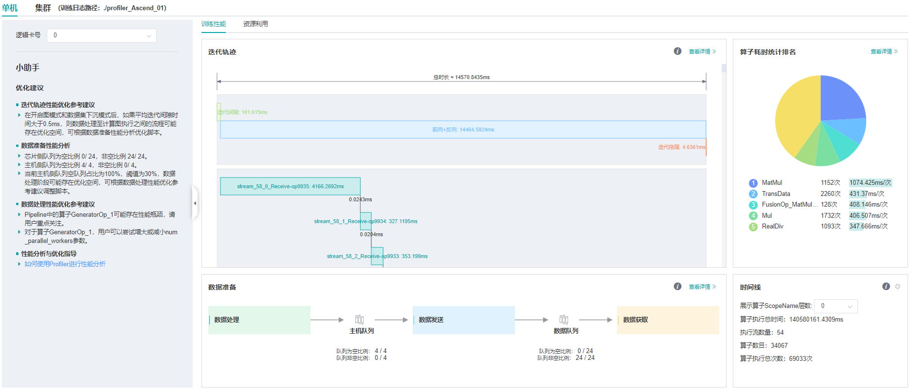

*图1：性能数据总览*

图1展示了性能数据总览页面，包含了迭代轨迹（Step Trace）、算子性能、数据准备性能和Timeline等组件的数据总体呈现。各组件展示的数据如下：  

- 迭代轨迹：将训练step划分为几个阶段，统计每个阶段的耗时，按时间线进行展示；总览页展示了迭代轨迹图。
- 算子性能：统计单算子以及各算子类型的执行时间，进行排序展示；总览页中展示了各算子类型时间占比的饼状图。
- 数据准备性能：统计训练数据准备各阶段的性能情况；总览页中展示了各阶段性能可能存在瓶颈的step数目。
- Timeline：按设备统计每个stream中task的耗时情况，在时间轴排列展示；总览页展示了Timeline中stream和task的汇总情况。

用户可以点击查看详情链接，进入某个组件页面进行详细分析。MindInsight也会对性能数据进行分析，在左侧的智能小助手中给出性能调试的建议。

### 迭代轨迹分析

使用迭代轨迹分析组件可以快速了解训练各阶段在总时长中的占比情况。迭代轨迹将训练的一个step划分为迭代间隙 (两次step执行的间隔时间)、前向与反向执行、all reduce、参数更新等几个阶段，并显示出每个阶段的时长，帮助用户定界出性能瓶颈所在的执行阶段。

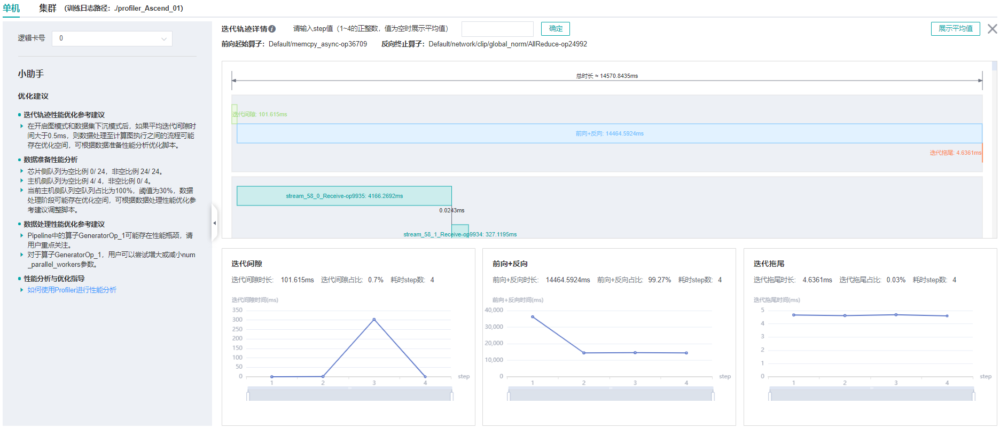

*图2：迭代轨迹分析*

图2展示了迭代轨迹分析页面。在迭代轨迹详情中，会展示各阶段在训练step中的起止时间，默认显示的是各step的平均值，用户也可以在下拉菜单选择某个step查看该step的迭代轨迹情况。  

页面下方显示了迭代间隙、前后向计算、迭代拖尾时间随着step的变化曲线等，用户可以据此判断某个阶段是否存在性能优化空间。其中：

- **迭代间隙：** 主要负责从数据队列中读取数据，如果该部分耗时较长，建议前往数据准备部分进一步分析。
- **前后向计算：** 执行网络中的前向算子以及反向算子，承载了一个step主要的计算工作，如果该部分耗时较长，建议前往算子统计或时间线中进一步分析。
- **迭代拖尾：** 主要在多卡场景下执行参数聚合、参数更新操作，包括前后向计算结束到参数更新完成的时间。如果该部分耗时较长，建议查看`all_reduce`耗时以及并行情况。

> 迭代轨迹暂不支持异构训练场景。

迭代轨迹在做阶段划分时，需要识别前向计算开始的算子和反向计算结束的算子。为了降低用户使用Profiler的门槛，MindSpore会对这两个算子做自动识别，方法为：  
前向计算开始的算子指定为`get_next`算子之后连接的第一个算子，反向计算结束的算子指定为最后一次all reduce之前连接的算子。**Profiler不保证在所有情况下自动识别的结果和用户的预期一致，用户可以根据网络的特点自行调整**，调整方法如下：  

- 设置`PROFILING_FP_START`环境变量指定前向计算开始的算子，如`export PROFILING_FP_START=fp32_vars/conv2d/BatchNorm`。
- 设置`PROFILING_BP_END`环境变量指定反向计算结束的算子，如`export PROFILING_BP_END=loss_scale/gradients/AddN_70`。

### 算子性能分析

使用算子性能分析组件可以对MindSpore运行过程中的各个算子的执行时间进行统计展示(包括AICORE、AICPU、HOSTCPU算子)。

- AICORE算子：AI Core 算子是昇腾 AI 处理器计算核心的主要构成，负责执行向量和张量相关的计算密集型算子。TBE（Tensor Boost Engine）是一种在TVM（Tensor Virtual Machine）框架基础上扩展的算子开发工具，用户可使用 TBE 进行 AI Core 算子信息注册。
- AICPU算子：AI CPU算子是AI CPU负责执行昇腾处理器中海思 SoC 的CPU类算子（包括控制算子、标量和向量等通用计算）。MindSpore中同一个算子可能会同时拥有 AI Core 算子和AI CPU算子，框架会优先选择 AI Core 算子，没有 AI Core 算子或者不满足选择的场景下，会调用AI CPU算子。
- HOSTCPU算子：Host侧CPU主要负责将图或者算子下发到昇腾芯片，根据实际需求也可以在Host侧CPU上开发算子。HOSTCPU算子特指运行在Host侧CPU上的算子。

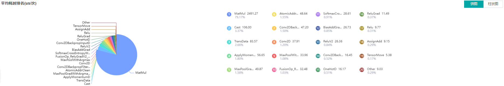

*图3：算子类别统计分析*

图3展示了按算子类别进行统计分析的结果，包含以下内容：  

- 可以选择饼图/柱状图展示各算子类别的时间占比，每个算子类别的执行时间会统计属于该类别的算子执行时间总和。
- 统计前20个占比时间最长的算子类别，展示其时间所占的百分比以及具体的执行时间（毫秒）。

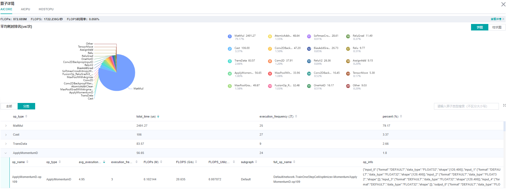

*图4：算子统计分析*

图4展示了算子性能统计表，包含以下内容：  

- 选择全部：按单个算子的统计结果进行排序展示，展示维度包括算子名称、算子类型、算子执行时间、算子全scope名称、算子信息等；默认按算子执行时间排序。
- 选择分类：按算子类别的统计结果进行排序展示，展示维度包括算子分类名称、算子类别执行时间、执行频次、占总时间的比例等。点击每个算子类别，可以进一步查看该类别下所有单个算子的统计信息。
- 搜索：在右侧搜索框中输入字符串，支持对算子名称/类别进行模糊搜索。

### 计算量分析

计算量分析模块可展示实际计算量相关数据，包括算子粒度、scope层级粒度、模型粒度的计算量数据。实际计算量是指在设备上运行时的计算量，区别于理论计算量，例如Ascend910设备上矩阵运算单元处理的是16x16大小的矩阵，所以实际运行时会对原始数据做补齐到16等操作。
目前仅支持AICORE设备上的计算量统计。计算量相关数据包括如下三个指标：

- FLOPs：浮点运算次数，单位为M（10^6次）。
- FLOPS：每秒浮点运算次数，单位为G/秒（10^9次/秒）。
- FLOPS利用率：通过FLOPS除以AICORE设备峰值FLOPS得到。

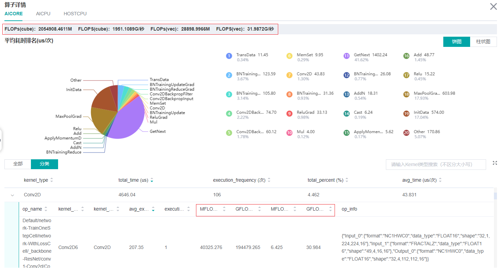

*图5：计算量统计分析*

图5的红框中包括了算子粒度、scope层级粒度、模型粒度的计算量数据。其中点击查看详情可以看到scope层级粒度的计算量。

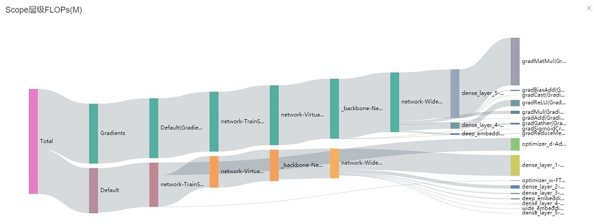

*图6：Scope层级FLOPs*

图6是一个桑基图，以一种树的结构展示数据，其中光标选中某个scope能看到具体的FLOPs值。

### 数据准备性能分析

使用数据准备性能分析组件可以对训练数据准备过程进行性能分析。数据准备过程可以分为三个阶段：数据处理pipeline、数据发送至Device以及Device侧读取训练数据。数据准备性能分析组件会对每个阶段的处理性能进行详细分析，并将分析结果进行展示。

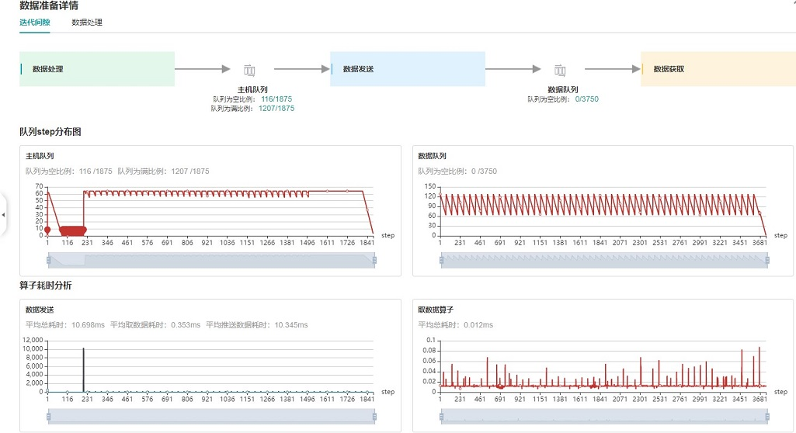

*图7：数据准备性能分析*

图7展示了数据准备性能分析页面，包含迭代间隙、数据处理两个TAB页面。

迭代间隙TAB页主要用来分析数据准备三个阶段是否存在性能瓶颈，数据队列图是分析判断的重要依据：  

- 数据队列Size代表Device侧从队列取数据时队列的长度，如果数据队列Size为0，则训练会一直等待，直到队列中有数据才会开始某个step的训练；如果数据队列Size大于0，则训练可以快速取到数据，数据准备不是该step的瓶颈所在。
- 主机队列Size可以推断出数据处理和发送速度，如果主机队列Size为0，表示数据处理速度慢而数据发送速度快，需要加快数据处理。
- 如果主机队列Size一直较大，而数据队列的Size持续很小，则数据发送有可能存在性能瓶颈。

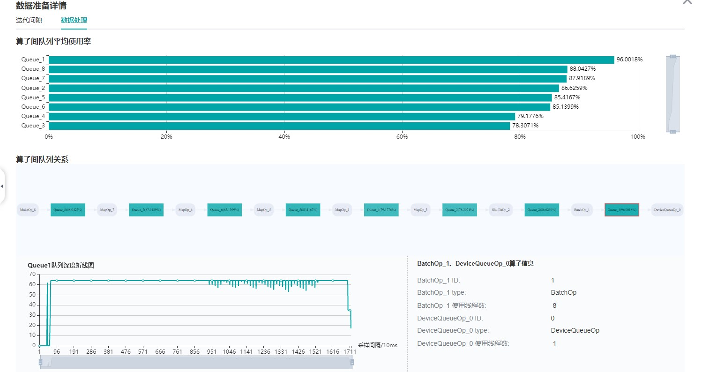

*图8：数据处理pipeline分析*

图8展示了数据处理TAB页面，可以对数据处理pipeline做进一步分析。不同的数据算子之间使用队列进行数据交换，队列的长度可以反映出算子处理数据的快慢，进而推断出pipeline中的瓶颈算子所在。

算子队列的平均使用率代表队列中已有数据Size除以队列最大数据Size的平均值，使用率越高说明队列中数据积累越多。算子队列关系展示了数据处理pipeline中的算子以及它们之间的连接情况，点击某个队列可以在下方查看该队列中数据Size随着时间的变化曲线，以及与数据队列连接的算子信息等。对数据处理pipeline的分析有如下建议：  

- 当算子左边连接的Queue使用率都比较高，右边连接的Queue使用率比较低，该算子可能是性能瓶颈。
- 对于最左侧的算子，如果其右边所有Queue的使用率都比较低，该算子可能是性能瓶颈。
- 对于最右侧的算子，如果其左边所有Queue的使用率都比较高，该算子可能是性能瓶颈。

对于不同的类型的数据处理算子，有如下优化建议：  

- 如果Dataset算子是性能瓶颈，建议增加`num_parallel_workers`。
- 如果GeneratorOp类型的算子是性能瓶颈，建议增加`num_parallel_workers`，并尝试将其替换为`MindRecordDataset`。
- 如果MapOp类型的算子是性能瓶颈，建议增加`num_parallel_workers`，如果该算子为Python算子，可以尝试优化脚本。
- 如果BatchOp类型的算子是性能瓶颈，建议调整`prefetch_size`的大小。

### Timeline分析

Timeline组件可以展示：  

- 算子分配到哪个设备（AICPU、AICORE、HOSTCPU）执行。
- MindSpore对该网络的流切分策略。
- 算子在Device上的执行序列和执行时长。
- 训练的Step数（暂不支持动态Shape场景、多图场景和异构训练场景，这些场景下Step数据可能不准确）。
- 算子的`Scope Name`信息，可以选择展示多少层`Scope Name`信息并下载对应的timeline文件。例如某算子的全名为：`Default/network/lenet5/Conv2D-op11`，则该算子的第一层Scope Name为`Default`、第二层为`network`。如果选择展示两层`Scope Name`信息，则会展示`Default`和`network`。

通过分析Timeline，用户可以对训练过程进行细粒度分析：从High Level层面，可以分析流切分方法是否合理、迭代间隙和拖尾时间是否过长等；从Low Level层面，可以分析算子执行时间等。

用户可以点击总览页面Timeline部分的下载按钮，将Timeline数据文件 (json格式) 保存至本地，再通过工具查看Timeline的详细信息。推荐使用 `chrome://tracing` 或者 [Perfetto](https://ui.perfetto.dev/#!/) 做Timeline展示。  

- Chrome tracing：点击左上角"load"加载文件。
- Perfetto：点击左侧"Open trace file"加载文件。


*图9：Timeline分析*

Timeline主要包含如下几个部分：  

- Device及其stream list：包含Device上的stream列表，每个stream由task执行序列组成，一个task是其中的一个小方块，大小代表执行时间长短。

  各个颜色块表示算子执行的起始时间及时长。timeline的详细解释如下：
    - Process AI Core Op：包含在AI Core上执行的算子的时间线。
        - Step：训练迭代数。
        - Scope Name：算子的Scope Name。
        - Stream #ID：在该stream上执行的算子。
    - Process AI CPU Op：在AI CPU上执行的算子的时间线。
    - Process Communication Op：包含通信算子执行的时间线。
    - Process Host CPU Op：在Host CPU上执行的算子的时间线。
    - Process Op Overlap Analyse：所有计算算子与通信算子合并后的时间线，可用于分析通信时间占比。
        - Merged Computation Op：为所有计算（AI Core、AI CPU、Host CPU）算子合并后的时间线。
        - Merged Communication Op：为所有通信算子合并后的时间线。
        - Pure Communication Op：纯通信时间（通信算子的执行时间去除与计算算子时间重叠部分后的时间线）。
        - Free Time：空闲时间（既没有通信算子也没有计算算子在执行的时间线）。

- 算子信息：选中某个task后，可以显示该task对应算子的信息，包括名称、type等。

可以使用W/A/S/D来放大、缩小地查看Timeline图信息。

## 资源利用

资源利用包括CPU利用率和内存使用情况分析。

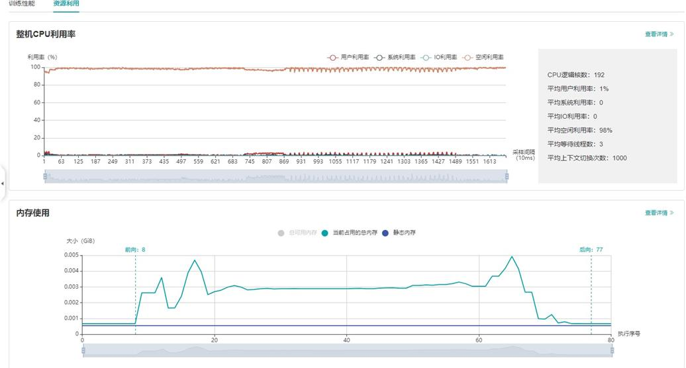

*图10：资源利用总览*

图10展示了资源利用总览页面，包括CPU利用率分析与内存使用情况分析。通过点击右上角的`查看详情`按钮可以查看详细信息。

### CPU利用率分析

CPU利用率分析，主要起到辅助性能调试的作用。根据Queue size确定了性能瓶颈后，可以根据CPU利用率辅助对性能进行调试（用户利用率过低，增加线程数；系统利用率过大，减小线程数）。
CPU利用率包含整机CPU利用率、进程CPU利用率、Data pipeline算子CPU利用率。

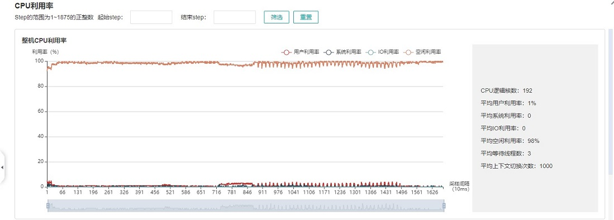

*图11: 整机CPU利用率*

整机CPU利用率：展示设备在训练过程中整体的CPU使用情况，包含用户利用率、系统利用率、空闲利用率、IO利用率、当前活跃进程数、上下文切换次数。如果用户利用率较低，可以尝试增大算子线程数，增加CPU使用情况；如果系统利用率较大，同时上下文切换次数、CPU等待处理的进程较大，说明需要相应减少线程个数。


*图12: 进程利用率*

进程利用率：展示单个进程的CPU占用情况。整机利用率和进程利用率结合，可以确定训练过程中是否有其他进程影响训练。

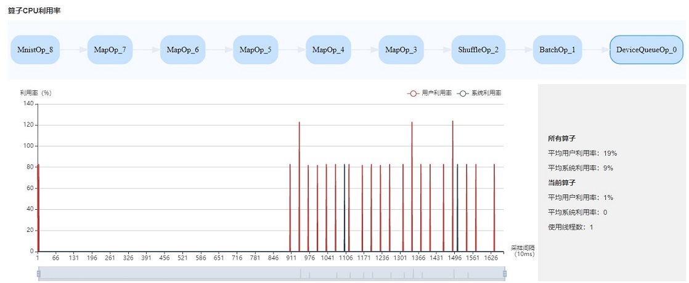

*图13: 算子利用率*

算子利用率：展示Data pipeline单个算子占用的CPU利用率。可以根据实际情况，调整对应算子的线程数。如果线程数不大，占用CPU较多，可以考虑优化代码。

CPU利用率常用场景:

- 网络调试人员根据Queue size判断是Data性能有瓶颈，可以结合整机利用率和算子利用率作为辅助尝试调整线程数。
- 开发人员可以查看算子利用率，如果某一个算子比较耗CPU利用率，可以考虑优化该算子。

> 默认采样间隔为1000ms，用户可以通过`mindspore.dataset.config.get_monitor_sampling_interval()`来改变采样间隔。详情参考：
>
> <https://www.mindspore.cn/docs/api/zh-CN/r1.6/api_python/mindspore.dataset.config.html#mindspore.dataset.config.set_monitor_sampling_interval>

### 内存使用情况分析

该页面用于展示模型在**Device侧**的内存使用情况，是**基于理论值的理想预估**。页面内容包括：

- 模型的内存分配概览，包括总可用内存、峰值内存等信息。
- 模型运行过程中，占用内存大小随执行顺序的变化。
- 模型运行过程中，每个执行算子的内存使用分解情况。

> 内存使用情况分析暂不支持异构训练场景。

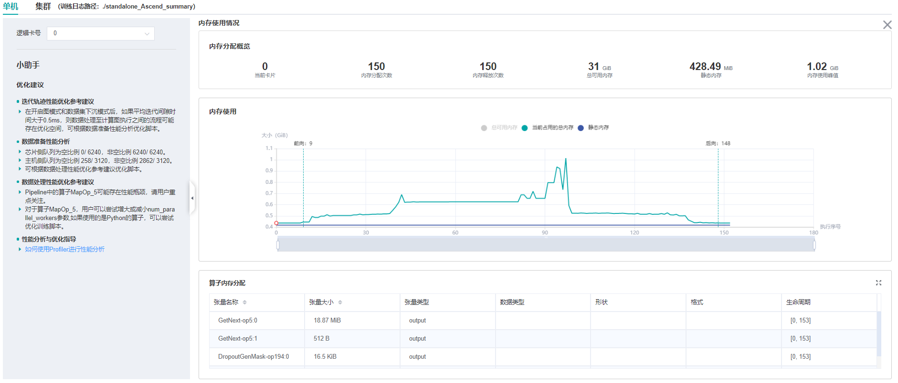

*图14：内存使用情况页面*

用户可以结合```内存分配概览```提供的信息以及折线图的变化趋势来了解内存使用的大致情况，除此之外，从折线图里还可以获得更多细节信息，包括：

- 局部缩放：折线图下方有缩放滚动条，用户可以通过调节其大小对折线图进行放大或缩小，以便观察细节。
- 前向开始和反向结束位置：通常情况下，用户可以在折线图上观察到模型的前向开始和反向结束的执行位置。
- 执行算子信息：鼠标悬浮在折线图上的某处，可以看到对应位置的执行算子信息，包括算子执行顺序编号、算子名称、算子占用内存、模型在当前位置占用的总内存，以及与前一执行位置的相对内存变化。
- 算子内存分配情况：鼠标点击折线图上的某一位置，位于折线图下方的```算子内存分配```模块会将该执行位置的内存使用分解情况展示出来。```算子内存分配```模块展示了对应执行位置的内存分解情况，也即，当前执行位置的已占用内存分配给了哪些算子的输出张量。该模块给用户提供了更丰富的信息，包括张量名称、张量大小、张量类型、数据类型、形状、格式，以及张量内存活跃的生命周期。

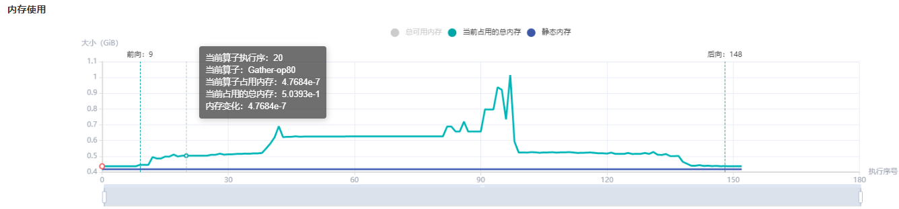

*图15：内存使用折线图*

## 规格

- 为了控制性能测试时生成数据的大小，大型网络建议性能调试的step数目限制在10以内。

  > 控制step数目可以通过控制训练数据集的大小来实现，如`mindspore.dataset.MindDataset`类中的`num_samples`参数可以控制数据集大小，详情参考：
  >
  > <https://www.mindspore.cn/docs/api/zh-CN/r1.6/api_python/dataset/mindspore.dataset.MindDataset.html>

- Timeline数据的解析比较耗时，且一般几个step的数据即足够分析出结果。出于数据解析和UI展示性能的考虑，Profiler最多展示20M数据（对大型网络20M可以显示10+条step的信息）。

## 注意事项

- PyNative模式下暂不支持性能调试。
- 训练加推理过程暂不支持性能调试，目前支持单独训练或推理的性能调试。
- Ascend性能调试暂不支持动态shape场景、多子图场景和控制流场景。
