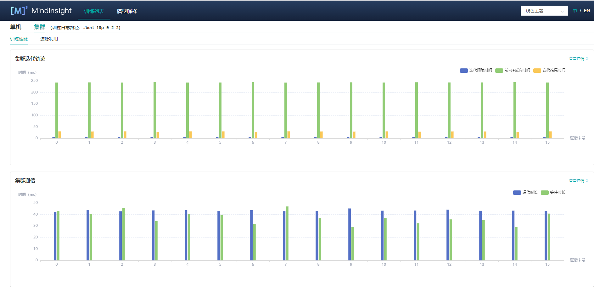
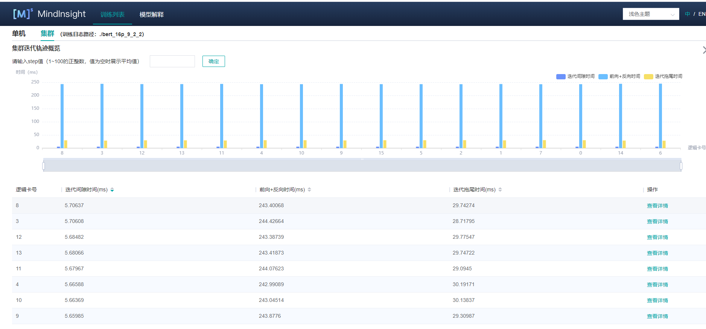
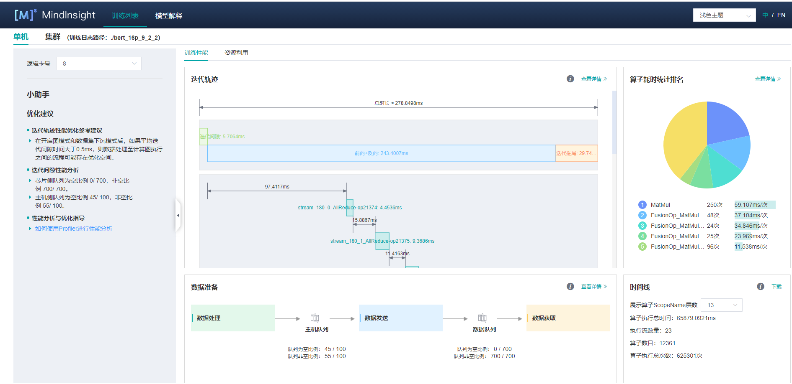
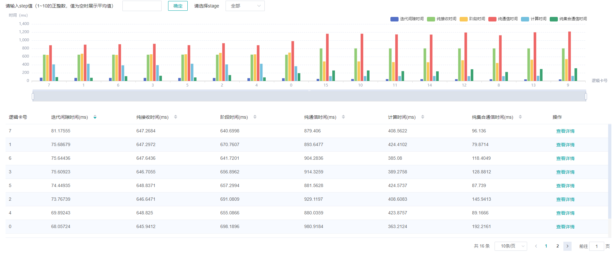
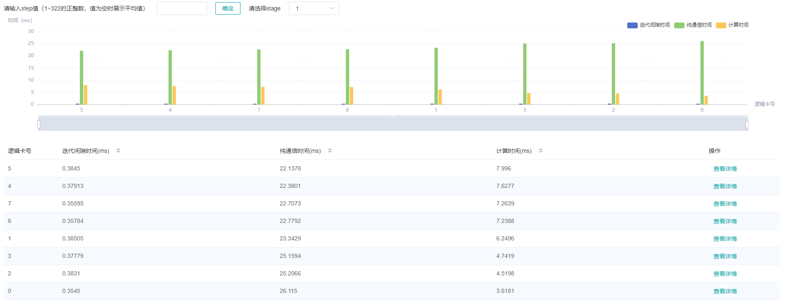
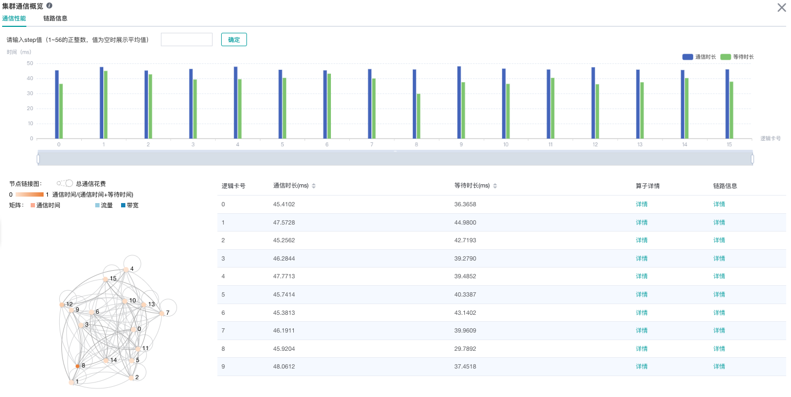
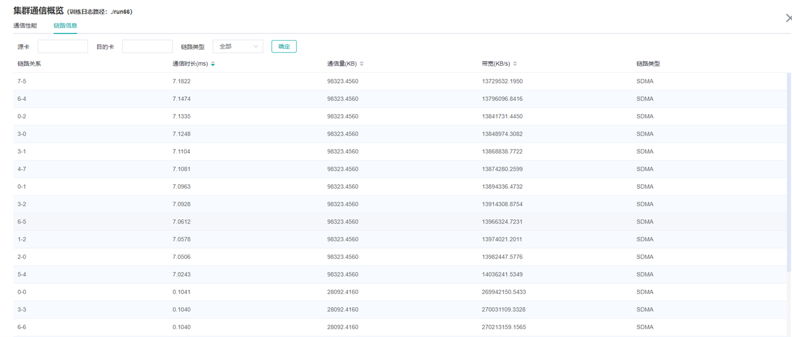
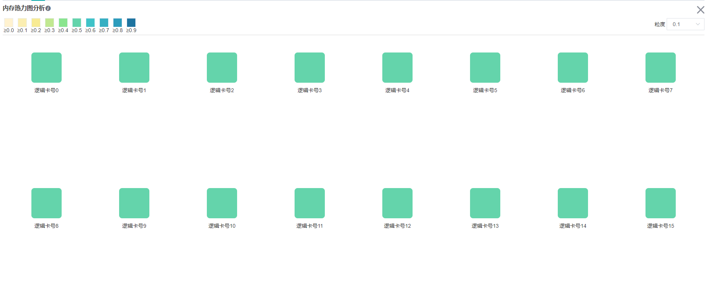
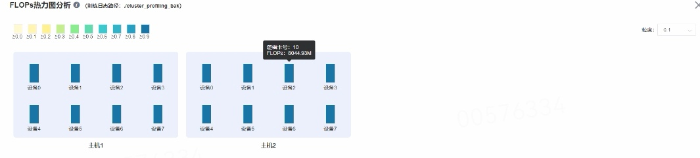

# 集群性能调试（Ascend）

`Linux` `Ascend` `集群调优` `中级` `高级`

<a href="https://gitee.com/mindspore/docs/blob/master/docs/mindinsight/docs/source_zh_cn/performance_profiling_ascend_of_cluster.md" target="_blank"></a>

## 概述

本教程介绍如何在Ascend AI处理器上使用MindSpore Profiler进行集群训练性能调试。

## 操作流程

- 搭建分布式训练环境，准备分布式训练脚本，并在训练脚本中调用性能调试接口，接着运行训练脚本。
- 收集集群训练性能数据。
- 启动MindInsight，并通过启动参数指定summary-base-dir目录(summary-base-dir是Profiler所创建目录的父目录)，例如训练时Profiler创建的文件夹绝对路径为`/home/user/code/data`，则summary-base-dir设为`/home/user/code`。启动成功后，根据IP和端口访问可视化界面，默认访问地址为 `http://127.0.0.1:8080`。
- 在训练列表找到对应集群训练，点击性能分析，即可在页面中查看集群性能数据。

## 分布式训练

分布式训练请参考[分布式训练教程](https://www.mindspore.cn/docs/programming_guide/zh-CN/master/distributed_training_ascend.html)。

## 收集集群性能数据

多机多卡训练的时候，一次集群训练后，性能数据分布在各个主机上（host节点）。要进行集群性能分析，需要将所有主机上的性能数据收集到一台主机上进行分析。考虑到集群运行环境的复杂以及相关的权限问题、登录问题，比较合理的方式是让用户去收集集群性能数据。
下面是一次分布式集群训练后，使用脚本收集性能数据的过程，用户可以参照此脚本进行集群性能数据收集。

脚本程序说明：脚本程序首先创建了集群作业文件夹，然后利用SSHPass技术进行非交互式的远程拷贝（避免了手动认证，手动输入密码），将集群中各个host节点的数据拷贝到集群作业文件夹中。

```bash
#!/bin/bash

echo "=============================================================================================================="
echo "Please run the script as: "
echo "bash collect_cluster_profiler_data.sh"
echo "for example: bash collect_cluster_profiler_data.sh cluster_hccl_config_path cluster_account_config_path cluster_train_id host_train_id is_absolute_path"
echo "=============================================================================================================="

SSH="ssh -o StrictHostKeyChecking=no"
SCP="scp -o StrictHostKeyChecking=no"

# Get the node list in the cluster.
get_cluster_list()
{
        local cluster_config=$1
        cat ${cluster_config} | python3 -c 'import sys,json;[print(node) for node in json.load(sys.stdin)["cluster"].keys()]'
}

# Get the account number of node.
get_node_user()
{
        local cluster_config=$1
        local node=$2
        cat ${cluster_config} | python3 -c 'import sys,json;print(json.load(sys.stdin)["cluster"]['\"${node}\"']["user"])'
}

# Get the password of node.
get_node_passwd()
{
        local cluster_config=$1
        local node=$2
        cat ${cluster_config} | python3 -c 'import sys,json;print(json.load(sys.stdin)["cluster"]['\"${node}\"']["passwd"])'
}

# Copy data from remote node to local node.
rscp_pass()
{
        local node="$1"
        local user="$2"
        local passwd="$3"
        local src="$4"
        local target="$5"
        sshpass -p "${passwd}" ${SCP} -r "${user}"@"${node}":"${src}" "${target}"
}

cluster_hccl_config_path=$1
cluster_account_config_path=$2
cluster_train_id=$3
host_train_id=$4
is_absolute_path=$5

node_list=$(get_cluster_list ${cluster_account_config_path})
echo "-----begin----"

target_dir=${cluster_train_id}/profiler/
if [ ! -d "${target_dir}" ]; then
mkdir -p ${target_dir}
fi

for node in ${node_list}
do
 user=$(get_node_user ${cluster_account_config_path} ${node})
 passwd=$(get_node_passwd ${cluster_account_config_path} ${node})
 echo "------------------${user}@${node}---------------------"

 # Eight devices data
 if [ $is_absolute_path = '0' ];then
 device_regex=$(basename $(dirname $host_train_id))
 output=$(basename $host_train_id)
 grandfather_host_train_id=$(dirname $(dirname $host_train_id))
 for((i=0;i<8;i++));
 do
   src_dir=${grandfather_host_train_id}/${device_regex}${i}/${output}*/profiler/*.*
   $(rscp_pass ${node} ${user} ${passwd} "${src_dir}" ${target_dir})
 done
 elif [ $is_absolute_path = '1' ];then
 src_dir=${host_train_id}/profiler/*.*
 for((i=0;i<8;i++));
 do
   $(rscp_pass ${node} ${user} ${passwd} "${src_dir}" ${target_dir})
 done
 else
 echo "The value of is_absolute_path can only be 0 or 1."
 exit 1
 fi
done
```

脚本参数说明：

- `cluster_hccl_config_path` 为多卡环境的组网信息文件路径。内容格式如下：

    ```json
    {
        "version": "1.0",
        "server_count": "1",
        "server_list": [
            {
            "server_id": "10.xxx.xxx.1",
            "device": [
                {"device_id": "0","device_ip": "192.1.27.6","rank_id": "0"},
                {"device_id": "1","device_ip": "192.2.27.6","rank_id": "1"},
                {"device_id": "2","device_ip": "192.3.27.6","rank_id": "2"},
                {"device_id": "3","device_ip": "192.4.27.6","rank_id": "3"},
                {"device_id": "4","device_ip": "192.1.27.7","rank_id": "4"},
                {"device_id": "5","device_ip": "192.2.27.7","rank_id": "5"},
                {"device_id": "6","device_ip": "192.3.27.7","rank_id": "6"},
                {"device_id": "7","device_ip": "192.4.27.7","rank_id": "7"}],
             "host_nic_ip": "reserve"
            }
    ],
    "status": "completed"
    }
    ```

- `cluster_account_config_path` 为各主机账号密码配置文件路径，内容格式如下：

    ```json
    {
      "rank_size": 16,
      "cluster": {
                    "10.xxx.xxx.1": {
                    "user": "root",
                    "passwd": "xxx"
                    },
                    "10.xxx.xxx.2": {
                    "user": "root",
                    "passwd": "xxx"
                    }
                  }
    }
    ```

- `cluster_train_id` 集群性能数据汇总保存的路径，比如`/home/summary/run1`、`/home/summary/run2` 其中`run1`和`run2`分别保存两次集群训练的所有性能数据。
- `host_train_id` 集群训练中，用户设置的性能数据保存路径。当性能数据保存路径设置为绝对路径时，`host_train_id`的值即为用户设置的值。比如值为`/data/run`时，多卡性能数据均保存在`/data/run/profiler`中（`profliler`文件夹由程序自动创建），`host_train_id`值应该设置为`/data/run`。当性能数据保存路径设置为相对路径时，多卡性能数据可能保存在不同的文件夹中。比如`/data/run/device0/data/profiler`、`/data/run/device1/data/profiler`。它们的共性路径为`/data/run/device/data/profiler`，每张卡的性能数据保存路径为`/data/run/device{device_id}/data/profiler`。`host_train_id`值应该设置为`/data/run/device/data`。
- `is_absolute_path` 在需要收集的集群性能数据中，单机多卡数据是否保存在同一个目录中。若是，设置为1；不是，设置为0。

通过脚本收集到的集群性能目录结构为：

```text
|-- run
    |-- profiler
        |-- step_trace_raw_{rank_id}_detail_time.csv
```

> 集群性能目录和单卡性能目录格式进行了统一。

在MindInsight r1.3以及之前的版本中，集群性能目录结构如下：

```text
|-- run
    |-- hccl.json
    |-- host_ips_mapping.txt
    |-- cluster_profiler
        |-- 1
        |   |-- profiler
        |       |-- step_trace_raw_0_detail_time.csv
```

通过数据转换脚本，可以将用户使用MindInsight r1.3以及之前的版本创建的集群性能目录转换为当前支持的集群性能目录。可以从官网下载[集群目录转换脚本](https://gitee.com/mindspore/docs/blob/master/docs/sample_code/transform_cluster_profiler_data.py)。

## 启动MindInsight

启动命令请参考[MindInsight相关命令](https://www.mindspore.cn/mindinsight/docs/zh-CN/master/mindinsight_commands.html)。

## 训练性能

用户从训练列表中选择指定的训练，点击性能调试，点击`集群`Table标签，可以以集群视角展示本次训练性能数据。集群训练性能包括集群迭代轨迹分析、集群通信性能分析。



图1：集群训练性能总览

图1为集群训练性能总揽，是对集群迭代轨迹组件、集群通信性能组件的总体呈现。各组件展示内容如下：

- 集群迭代轨迹：展示集群中所有卡的迭代轨迹信息；总览页面展示了集群迭代轨迹性能。
- 集群通信性能: 展示集群中所有卡的通信性能以及全网链路性能；总览页面展示了集群通信性能。

### 集群迭代轨迹分析

使用集群迭代轨迹分析组件，可以找出集群训练中的慢主机、慢卡。
集群迭代轨迹分析组件展示所有卡的迭代信息，包括迭代间隙、前反向、迭代拖尾，均支持排序操作。其中迭代间隙反映了数据处理阶段的快慢，通过卡的迭代间隙时间可以反映出对应主机处理数据的快慢。卡的前反向时间反映了卡的计算能力。迭代拖尾反映了all_reduce耗时以及并行情况。



图2：集群迭代轨迹

图2展示了集群迭代轨迹分析页面，默认展示卡的性能平均值，支持查询特定step下的卡的迭代轨迹信息。通过点击单卡中的详情连接，也可以跳转到单卡的详细性能展示页面，查询详细的单卡性能数据。



图3：单卡性能信息

图3展示集群中单卡性能信息，单卡性能信息请参考[单卡性能信息](https://www.mindspore.cn/mindinsight/docs/zh-CN/master/performance_profiling_ascend.html)。

### 集群通信与计算重叠时间分析

集群通信与计算重叠时间分析组件用于流水并行和模型并行场景，可以找出集群训练中的慢主机、慢卡。

集群通信与计算重叠时间分析组件新增了五项指标：纯通信时间（仅包含Receive算子）、state时间、纯通信时间、计算时间、纯通信时间（不包含Receive算子）。

- 纯通信时间（仅包含Receive算子）：只有点对点（Receive）通信算子执行、计算算子不执行的时间段。该时间反应的是Pipeline并行各stage间的不同步情况。
- state时间：各个stage的耗时时长，该值为step时长减去该step内receive通信算子的时长。通过该指标可以查看哪个stage的耗时最长。
- 纯通信时间：只有通信算子执行、计算算子不执行的时间段。如果该部分耗时较长，说明通信耗时对性能影响较大。
- 计算时间：AI Core算子执行的时间总和，用于判断是否有慢的卡。时间越长，说明对应的卡执行速度越慢。
- 纯通信时间（不包含Receive算子）：只有除Receive通信算子外的其它通信算子执行、计算算子不执行的时间段。该时间段占的比例越大，需要考虑是否可以调整该stage内算子的切分策略，降低该时间段的耗时时长。



图4：流水并行模式分析

图4展示了流水并行场景下页面展示的内容，默认展示所有step的平均数值。页面中展示了迭代间隙时间、纯接收时间、阶段时间、纯通信时间、计算时间、纯集合通信时间。由于整个网络的计算图被切分为多个阶段的子图，阶段时间可用于定位慢的阶段，通过选择阶段编号可以筛选出同一阶段的卡，在阶段内部可用模型并行场景的思路定位瓶颈。



图5：模型并行模式分析

图5展示了模型并行场景（此处指层内模型并行）下页面展示的内容，默认展示所有step的平均数值。页面中展示了迭代间隙时间、纯通信时间、计算时间。计算时间可用于定位慢卡，如果没有慢卡，查看通信时间与计算时间占比，若通信时间占比较大，考虑是否有慢链路。

### 集群通信性能分析

集群通信性能组件从两个维度来展示集群通信性能信息，以卡为粒度展示和全网链路展示。



图6：集群通信性能分析

图6展示了集群通信性能分析页面，包含逻辑卡通信性能以及全网链路信息（所有逻辑卡链路信息）。

逻辑卡通信性能TAB页主要用来展示逻辑卡的通信性能，包括通信时间、等待时间、算子详情、逻辑卡链路信息。

- 通信时间：表示通信算子的通信耗时。如果通信耗时过长，有可能是某条链路有问题，可以通过链路带宽定位到具体的链路。通信时间计算方式为统计SDMA链路（server内通信）和RDMA链路（server间通信）的通信算子总耗时。如果是SDMA链路，取`Reduce inline`和`Memcpy`算子总时间作为通信时间；如果是RDMA链路，取连续三个算子`RDMASendPayload`、`RDMASendNotify`、`Notify Wait`的总时间为通信时间。
- 等待时间：也可称为同步时间。卡间进行通信前，首先会进行同步，确保通信的两张卡同步完成，再进行通信。等待时间计算方式为统计所有`Notify Wait`算子总耗时并减去RDMA链路通信时间中的`Notify Wait`算子耗时。
- 算子详情：以算子粒度展示通信性能，包括该通信算子的通信时长、等待时长、链路信息。
- 逻辑卡链路信息：显示源卡为该卡或者目的卡为该卡的链路信息。链路信息包括通信时间、通信量、带宽（通信量除以通信时间）、链路类型。其中链路类型包含SDMA链路（server内通信链路）和RDMA链路（server间通信链路）。点击详情后，通过弹窗的方式展示。


图7：算子性能信息


图8:逻辑卡链路信息

全网链路信息TAB页面展示所有逻辑卡的链路信息，提供源卡、目的卡、链路类型的选择。



图9：全网链路信息

默认不收集通信性能数据，需要通过`mindspore.profiler.Profiler`中的`profile_communication`参数像`Profiler(profile_communication=True)`一样打开通信性能数据开关。只有多卡训练才能产生通信算子性能数据，在单卡训练场景中设置该参数是无效的。

使用MindInsight可视化通信性能数据需要安装Ascend 910 AI处理器配套软件包提供的通信性能数据解析whl包，whl包随配套软件包发布，参考如下命令完成安装。

```bash
pip install /usr/local/Ascend/tools/hccl_parser-{version}-py3-none-any.whl
```

## 资源利用

### 集群内存使用情况分析

该页面展示了并行场景下，模型在**Device侧**的内存使用情况，是**基于理论值的理想预估**。页面内容包括：

- 集群设备的分布情况，使用了哪些服务器的哪些设备。
- 集群设备的内存峰值情况，即内存峰值与可用内存占比。
- 点击某个设备，可以跳转至该设备的内存详情页面。



图10：集群内存概览页面

> 内存使用情况分析暂不支持异构训练场景。

### 集群FLOPs热力图分析

该页面展示了并行场景下，每个设备的FLOPs（浮点运算次）数据，热力图反映了设备之间FLOPs的相对大小。页面内容包括：

- 集群设备的分布情况，使用了哪些服务器的哪些设备。
- 集群设备之间FLOPs的相对大小，每个设备对应矩形块颜色代表当前设备FLOPs与所有设备中最大FLOPs的比值。
- 点击某个设备，可以跳转至该设备的算子耗时详情页面，含有FLOPs的详细数据。



图11：集群FLOPs概览页面

## 规格

- 为了控制性能测试时生成数据的大小，大型网络建议性能调试的step数目限制在10以内。

  > 控制step数目可以通过控制训练数据集的大小来实现，如`mindspore.dataset.MindDataset`类中的`num_samples`参数可以控制数据集大小，详情参考：
  >
  > <https://www.mindspore.cn/docs/api/zh-CN/master/api_python/dataset/mindspore.dataset.MindDataset.html>

## 注意事项

- PyNative模式下暂不支持性能调试。
- 训练加推理过程暂不支持性能调试，目前支持单独训练或推理的性能调试。
