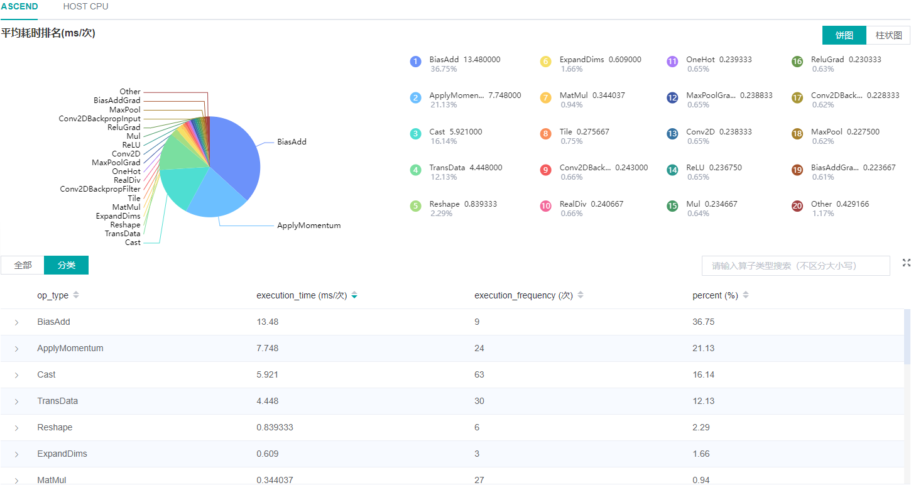
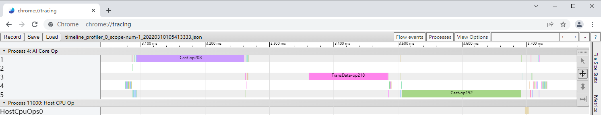

# 性能调试（Ascend-PyNative）

## 概述

本教程介绍如何在Ascend AI处理器上使用MindSpore Profiler在PyNative模式下进行性能调试。PyNative模式目前支持算子性能分析、算子时间线、数据准备三部分功能。

## 使用方式

设置模型运行模式为PYNATIVE，其他和GRAPH一致，可参考[Ascend-Graph准备训练脚本](https://www.mindspore.cn/mindinsight/docs/zh-CN/master/performance_profiling_ascend.html#准备训练脚本)。

### 算子性能分析

使用算子性能分析组件可以对MindSpore运行过程中的各个算子的执行时间进行统计展示(包括Ascend device算子、HOSTCPU算子)，PyNative模式下Ascend算子没有区分AICORE算子和AICPU算子。数据详情见下图，数据说明可参考[Ascend-Graph算子性能分析](https://www.mindspore.cn/mindinsight/docs/zh-CN/master/performance_profiling_ascend.html#算子性能分析)。

*图1：算子性能分析*

### Timeline分析

Timeline组件展示算子的执行时序，PyNative模式与Graph模式有以下不同，其他可参考[Ascend-Graph Timeline分析](https://www.mindspore.cn/mindinsight/docs/zh-CN/master/performance_profiling_ascend.html#timeline分析)。

- PyNative模式Ascend并行执行算子通过线程区分，Graph模式通过stream区分。
- PyNative模式只显示Ascend算子和HOSTCPU算子的时间统计，Ascend算子不区分AICORE和AICPU算子。
- 训练的Step数（只支持数据下沉场景）。

*图2：时间线*

### 数据准备性能分析

使用数据准备性能分析组件可以对训练数据准备过程进行性能分析。功能和Graph模式一致，可参考[Ascend-Graph数据准备性能分析](https://www.mindspore.cn/mindinsight/docs/zh-CN/master/performance_profiling_ascend.html#数据准备性能分析)。
