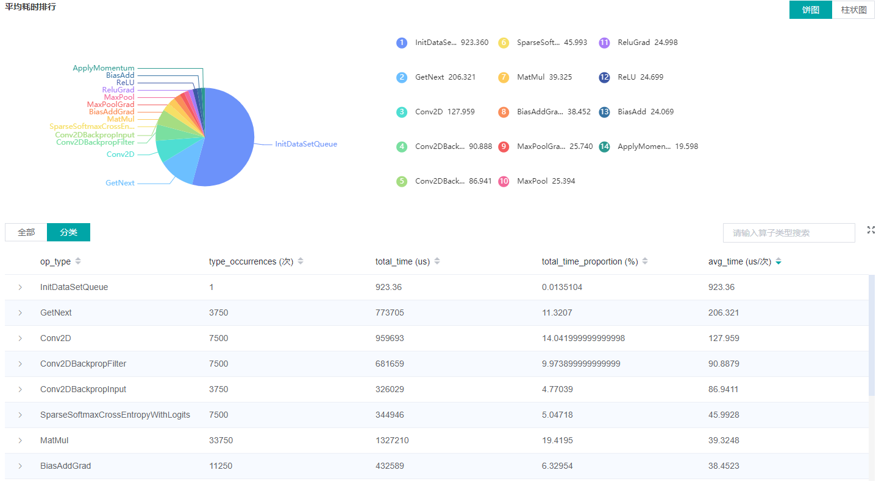
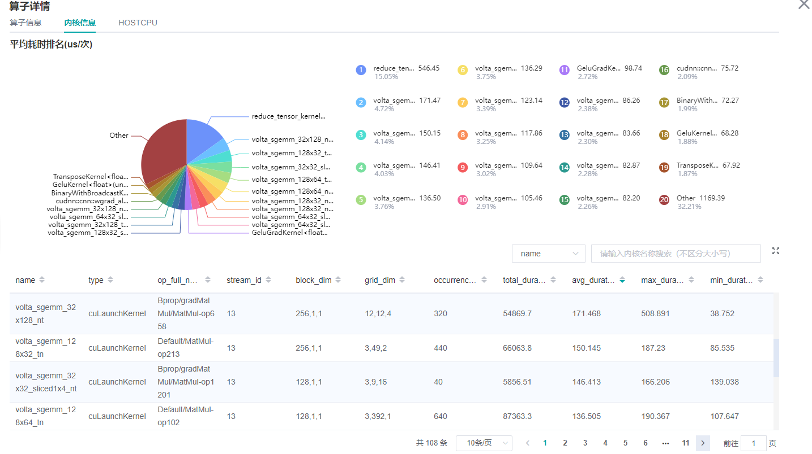
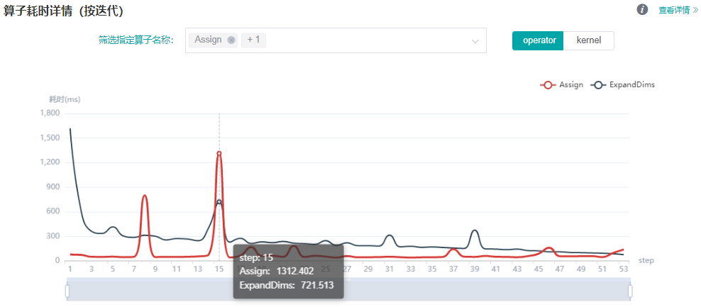
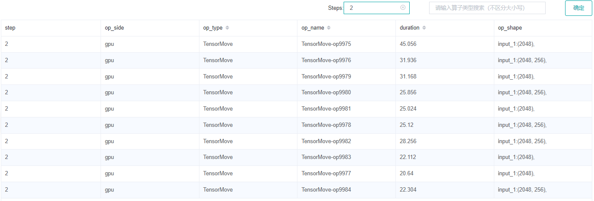
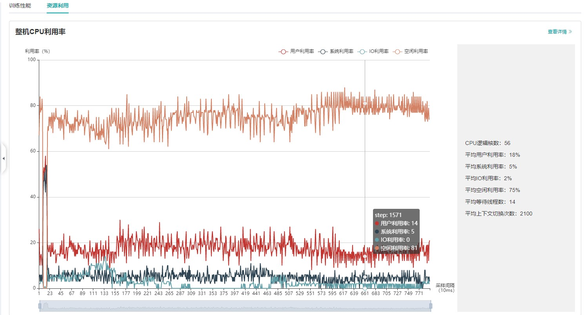

# 性能调试（GPU）

<a href="https://gitee.com/mindspore/docs/blob/master/docs/mindinsight/docs/source_zh_cn/performance_profiling_gpu.md" target="_blank"></a>

## 概述

本教程介绍如何在GPU上使用MindSpore Profiler进行性能调试。

## 操作流程

- 准备训练脚本，并在训练脚本中调用性能调试接口，接着运行训练脚本。
- 启动MindInsight，并通过启动参数指定summary-base-dir目录(summary-base-dir是Profiler所创建目录的父目录)，例如训练时Profiler创建的文件夹绝对路径为`/home/user/code/data`，则summary-base-dir设为`/home/user/code`。启动成功后，根据IP和端口访问可视化界面，默认访问地址为 `http://127.0.0.1:8080`。
- 在训练列表找到对应训练，点击性能分析，即可在页面中查看训练性能数据。

> 普通用户在默认情况下无权访问目标设备上的NVIDIA GPU性能计数器。
>
> 如果普通用户需要在训练脚本中使用profiler性能统计能力，则需参考以下网址的说明进行权限配置。
>
> <https://developer.nvidia.com/nvidia-development-tools-solutions-err-nvgpuctrperm-cupti>

## 准备训练脚本

为了收集神经网络的性能数据，需要在训练脚本中添加MindSpore Profiler相关接口。  

- `set_context`之后，需要初始化MindSpore `Profiler`对象。

    > GPU多卡场景需要在`set_auto_parallel_context`之后初始化`Profiler`对象。
    >
    > GPU场景下初始化Profiler对象时只有output_path参数有效。

- 在训练结束后，调用`Profiler.analyse`停止性能数据收集并生成性能分析结果。

启动命令请参考[性能调试使用样例](https://www.mindspore.cn/mindinsight/docs/zh-CN/master/performance_profiling_ascend.html#准备训练脚本)。

GPU场景可自定义callback方式收集性能，但数据准备阶段、数据下沉模式不支持该方式收集性能数据。

示例如下：

```python
import mindspore as ms
class StopAtStep(ms.Callback):
    def __init__(self, start_step, stop_step):
        super(StopAtStep, self).__init__()
        self.start_step = start_step
        self.stop_step = stop_step
        self.profiler = Profiler(start_profile=False)
    def step_begin(self, run_context):
        cb_params = run_context.original_args()
        step_num = cb_params.cur_step_num
        if step_num == self.start_step:
            self.profiler.start()
    def step_end(self, run_context):
        cb_params = run_context.original_args()
        step_num = cb_params.cur_step_num
        if step_num == self.stop_step:
            self.profiler.stop()
    def end(self, run_context):
        self.profiler.analyse()
```

以上代码仅供参考，用户可根据所需场景自由实现。

## 启动MindInsight

启动命令请参考[MindInsight相关命令](https://www.mindspore.cn/mindinsight/docs/zh-CN/master/mindinsight_commands.html)。

## 训练性能

用户从训练列表中选择指定的训练，点击性能调试，可以查看该次训练的性能数据（目前GPU场景支持算子耗时统计排名、Timeline、迭代轨迹分析以及数据准备性能分析，其他功能敬请期待）。


*图1：性能数据总览*

图1展示了性能数据总览页面，包含了迭代轨迹（Step Trace）、算子性能、数据准备性能和Timeline等组件的数据总体呈现：  

- 算子性能：统计单算子以及各算子类型的执行时间，进行排序展示；总览页中展示了各算子类型平均执行时间占比的饼状图。
- Timeline：统计了算子以及CUDA activity，在时间轴排列展示；总览页展示了Timeline中执行情况汇总。
- 迭代轨迹：将训练step划分为几个阶段，统计每个阶段的耗时，按时间线进行展示；总览页展示了迭代轨迹图。
- 数据准备性能：统计训练数据准备阶段各阶段的性能情况；总览页中展示了各阶段性能可能存在瓶颈的step数目。

用户可以点击查看详情链接，进入组件页面进行详细分析。

### 算子性能分析

#### 算子性能可视化分析

使用算子性能分析组件可以对MindSpore运行过程中的各个算子的执行时间进行统计展示(包括GPU算子、CUDA内核、HOSTCPU算子)。



*图2：算子类别统计分析*

图2展示了按算子类别进行统计分析的结果，包含以下内容：  

- 可以选择饼图/柱状图展示各算子类别的时间占比，每个算子类别的执行时间会统计属于该类别的算子执行时间总和以及平均执行时间。
- 统计前20个平均执行时间最长的算子类别。

图2下半部分展示了算子性能统计表，包含以下内容：  

- 选择全部：按单个算子的统计结果进行排序展示，展示维度包括算子位置（Device/Host）、算子类型、算子执行时间、算子全名等；默认按算子平均执行时间排序。
- 选择分类：按算子类别的统计结果进行排序展示，展示维度包括算子分类名称、算子类别执行时间、执行频次、执行总时间的比例、平均执行时间。点击每个算子类别，可以进一步查看该类别下所有单个算子的统计信息。
- 搜索：在右侧搜索框中输入字符串，支持对算子名称/类别进行模糊搜索。



*图3：内核信息分析*

图3展示了CUDA activity信息统计，包含以下内容：

- 统计图表：展示了各个kernel activity的占比以及算子的耗时信息。
- 内核信息列表：信息列表展示activity的名称、所属算子名称、执行次数、总时间、平均时间等信息。
- 搜索：可以通过name(activity名称)以及`op_full_name`（所属算子名称）进行部分匹配的搜索。

#### 算子接口分析

可通过`profiler.op_analyse(op_name="xxx")`接口查询指定的CUDA内核算子、HOSTCPU算子的性能数据。查询的性能数据为算子在不同的张量（`input_shape`）输入下的算子执行侧（`op_side`）、执行次数（`op_occurrences`）、算子执行总耗时（`op_total_time(us)`）以及算子执行平均耗时（`op_avg_time(us)`），其数据格式为JSON数据，可借助JSON解析工具快速查看，接口使用示例如下：

使用方式1：

```python
import mindspore as ms
# Profiler init.
profiler = ms.Profiler()
# Train or eval model.
train_net()
profiler.analyse()
operation_info = profiler.op_analyse('Conv2D')
print(operation_info)  # json
```

使用方式2：

```python
import mindspore as ms
# Profiler init.
profiler = ms.Profiler(output_path="my_profiler_path")
operation_info = profiler.op_analyse(['Conv2D', 'BiasAdd'])  # str or list
print(operation_info)  # json
```

说明：

- GPU平台下使用该接口获取的性能数据为CUDA内核数据，获取的性能数据字段（`op_occurrences`，`op_total_time(us)`，`op_avg_time(us)`）数据来源于图3所示内核信息列表的（`occurrences(次)`, `total_duration(us)`, `avg_duration(us/次)`）信息，不同点在于使用算子性能接口获取的CUDA算子性能数据会依据算子的类型（Primitive算子类型）进行数据汇总，并根据算子的输入张量信息进行区分。若需要查看具体算子的信息，可启动MindInsight查看详细的CUDA内核性能数据。
- 异构场景下，获取的CPU性能数据字段信息（`op_occurrences`，`op_total_time(us)`，`op_avg_time(us)`）来源于算子耗时统计排名HOST CPU页面的（`op_occurrences(次)`, `op_total_time(us)`, `op_avg_time(us/次)`）信息，不同点在于使用算子性能接口获取的CPU算子性能数据会依据算子的类型（Primitive算子类型）进行数据汇总，并根据算子的输入张量信息进行区分。若需要查看具体算子的信息，可启动MindInsight查看详细的HOST CPU算子性能数据。
- 对于`op_analyse()`接口，可使用device_id参数指定解析哪张卡的算子性能数据，当接口基于离线数据进行解析时，默认`device_id=0`。

### 动态shape迭代分析

当训练网络为动态shape网络时，可以综合迭代轨迹模块与算子耗时（按迭代）分析组件，对MindSpore运行过程中的算子性能进行分析。算子耗时（按迭代）分析组件对不同迭代中各类型算子的执行时间进行统计展示（包括GPU算子信息、内核信息、HOSTCPU算子信息），可以快速了解训练各迭代中各类型算子的耗时详情。



*图4：算子类别耗时（按迭代）统计*

图4展示了算子类别耗时统计分析的结果，包含以下内容：

- 可通过筛选器筛选算子类型，查看指定类型算子的迭代耗时曲线（这里展示的耗时是不同算子类型执行的平均耗时）。
- 可通过`operator/kernel`切换器切换查看的维度，operator维度展示的数据是GPU各类型算子信息（异构时包括CPU各类型算子的耗时），kernel维度展示的是GPU内核信息。



*表1：算子耗时（按迭代）统计*

表1展示了算子耗时按迭代展开的耗时详情，包含以下内容：

- 展示维度：当切换器为operator维度时，信息列表展示step、算子执行侧、算子类型、算子名称、执行时间、算子shape信息；当切换器为kernel维度时，信息列表展示step、内核算子类型、所属算子名称、执行时间及其他内核相关信息。默认按算子执行时间排序。
- 选择step：可以筛选指定的step，查看特定step内的算子耗时详情。
- 搜索：在右侧搜索框中输入字符串，支持对算子类别进行模糊搜索。

### Timeline分析

GPU场景下，Timeline分析的使用方法和Ascend场景相同，不同之处是，GPU Timeline展示的是算子信息(包括GPU算子和CPU算子)和CUDA activity的信息。

可参考：[使用方法](https://www.mindspore.cn/mindinsight/docs/zh-CN/master/performance_profiling_ascend.html#timeline分析)。

### 迭代轨迹分析

GPU场景下，迭代轨迹分析的使用方法和Ascend场景相同。（注意：**迭代轨迹暂不支持异构训练场景**）

可参考：[使用方法](https://www.mindspore.cn/mindinsight/docs/zh-CN/master/performance_profiling_ascend.html#迭代轨迹分析)。

### 数据准备性能分析

GPU场景下，数据准备性能分析的使用方法和Ascend场景相同。

可参考：[使用方法](https://www.mindspore.cn/mindinsight/docs/zh-CN/master/performance_profiling_ascend.html#数据准备性能分析)。

## 资源利用

资源利用包括CPU利用率分析。



*图4：资源利用总览*

图4展示了资源利用总览页面，展示了CPU利用率的情况。通过点击右上角的`查看详情`按钮可以查看详细信息。

### CPU利用率分析

GPU场景下，CPU利用率分析的使用方法和Ascend场景相同。

可参考：[使用方法](https://www.mindspore.cn/mindinsight/docs/zh-CN/master/performance_profiling_ascend.html#cpu利用率分析)。

## 注意事项

- 训练加推理过程暂不支持性能调试，目前支持单独训练或推理的性能调试。
- GPU暂不支持收集内存性能数据。
- 在GPU场景下使用性能调试，必须使用root权限。
- GPU场景下使用性能调试依赖CUDA环境变量，在使用Profiler前请执行`export LD_LIBRARY_PATH=${CUDA_HOME}/extras/CUPTI/lib64:$LD_LIBRARY_PATH`，其中CUDA_HOME需要替换为本地CUDA路径。
- 迭代轨迹目前仅支持Graph模式单图场景，暂不支持PyNative、异构、多子图等场景。
- 基于step开启、基于epoch开启、迭代轨迹分析和集群分析仅支持Graph模式。
