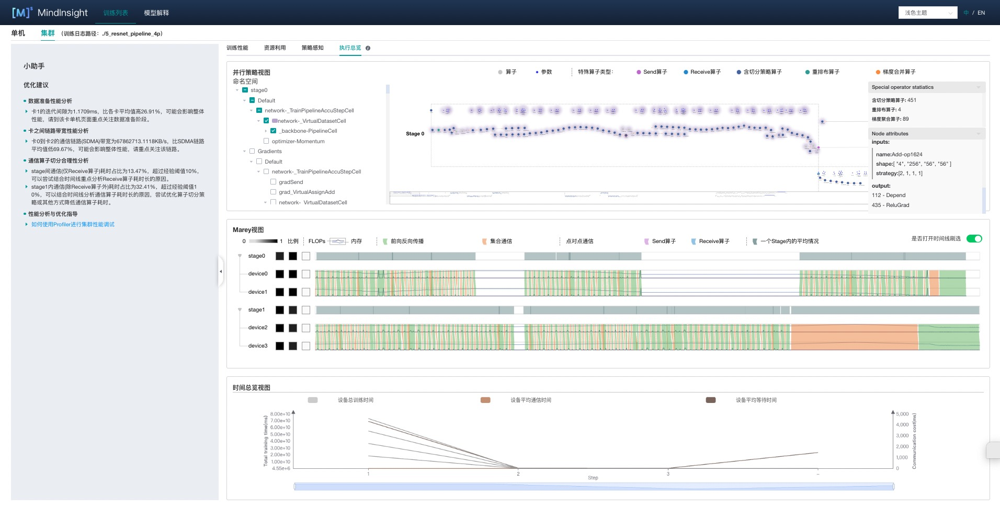
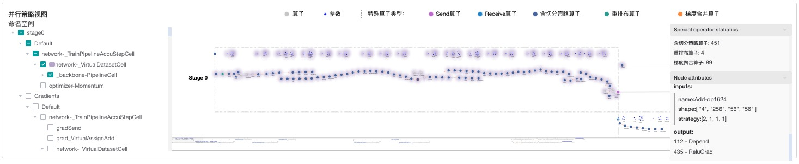
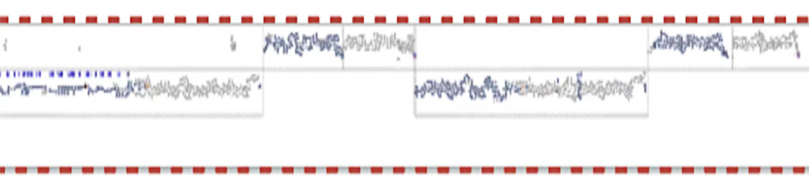
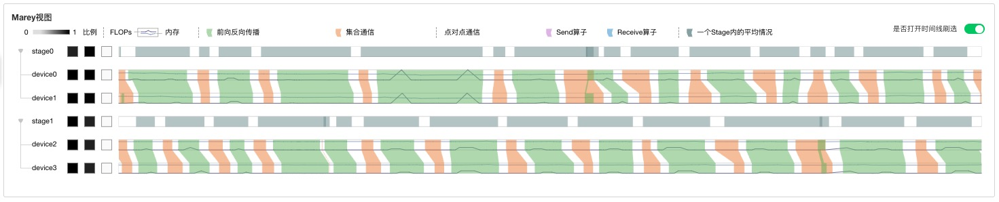
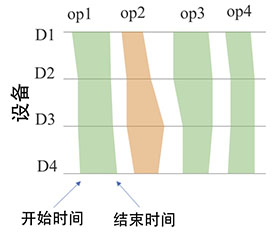
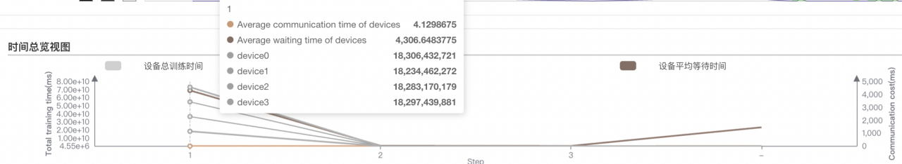

# 并行训练执行分析

## 概述

本教程介绍如何在（Ascend） AI处理器上使用MindSpore Profiler进行并行训练执行分析。

## 操作流程

  .. note::
     Ascend并行模型搭建可参考：
     https://www.mindspore.cn/tutorials/experts/zh-CN/r1.8/parallel/train_ascend.html
     启用Profiler性能调试的方法可参考：
     https://www.mindspore.cn/mindinsight/docs/zh-CN/r1.8/performance_profiling_ascend.html

## 执行总览

用户从训练列表中选择指定的训练，点击性能调试，点击`集群`标签，可以以集群视角展示本次训练性能数据。
执行总览包括计算图执行序分析、各设备算子执行时间线分析、各step各设备时间信息概览。

*图1：集群执行总览*

### 计算图执行序分析

执行总览页面上方即为并行策略视图。

*图2：并行策略视图*

在此计算图中，算子依据执行序，从左向右布局。画布支持拖动，放缩观察。各类算子用不同颜色区分，视图最上方显示图例。

左侧为命名空间选择器，勾选命名空间后，计算图中对应算子会产生颜色光晕标识。

当并行训练采用流水线并行模式，该视图上会呈现所有stage的计算图，各stage计算图之间通过Send、Receive算子对应，进行横向排布。用户能够在计算图缩略图获得对流水线并行执行流程的整体感知。

*图3：时间线缩略图*

右侧提供特殊算子统计功能及结点属性面板。
特殊算子包括三类：含切分策略算子、重排布算子、梯度聚合算子。

### 各设备算子执行时间线分析

执行总览页面中部为Marey视图。

*图4：Marey视图*

在Marey视图中，每个设备对应三个色块和一条时间线。三个色块展示各stage各设备FLOPs（浮点运算次数，用于衡量模型/算法复杂度），FLOPS（每秒浮点运算次数，用于衡量硬件的性能）与PeakMem（峰值内存）。对于FLOPs和FLOPS，展示当前设备值/各设备最大值，对于PeakMem，展示设备峰值占用内存/设备总内存。

*图5：Marey时间线*

如图5所示，时间线中，绿色表示计算算子，橙色表示通信算子。同在一个pipeline stage中的设备，在其上执行的算子基本相同，每个设备有一条时间轴，我们在时间轴上标注出算子执行的开始和结束时间，然后连接多边形，填充颜色。该视图可以定位如下两类问题：

*图6：Marey时间线异常*

如图6(a)所示，当一个算子在各设备上的执行时间都显著长于其它的算子，可能是该算子融合切分策略不合理。
如图6(b)所示，当一个算子在某个设备上执行时间显著长于其它设备，可能是训练设备出现了慢节点。

时间线支持的交互有刷选放大，双击缩小，鼠标悬浮查看算子执行时间戳信息等。

视图左侧stage设备树可以根据需要进行聚合或展开。stage的时间线上展示的是同一个stage中各设备相同算子实际执行时间的并集。

每条时间线上扩展出折线图，紫线表示FLOPs变化，蓝线表示内存变化。

*图7：Marey时间线中的折线*

如上图所示，内存占用量在红框内有明显峰值，可结合时间线分析设备执行情况。

### 各设备时间信息概览

执行总览页面底部为时间总览视图。

*图8：时间总览视图*

时间总览视图为双y轴图，左侧展示的训练时间，右侧展示的通信的耗时。本视图展示各个step所有设备的训练时间，每个设备的平均通信时间与等待时间，用户将鼠标悬浮在对应step上，弹出的小卡片中可以看到具体的数值。该视图作为用户的分析入口，若用户判定某个step统计数据存在异常，用户可选中对应step，Marey视图将显示对应step各设备执行时间线，用户可进行进一步分析。