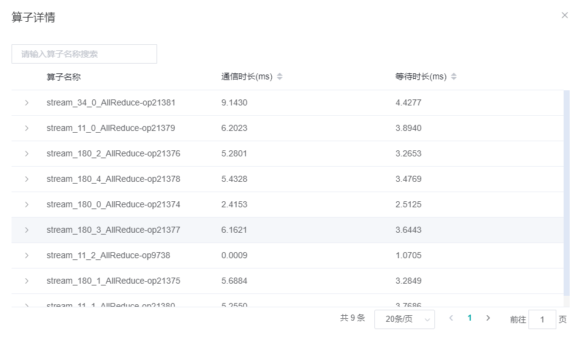
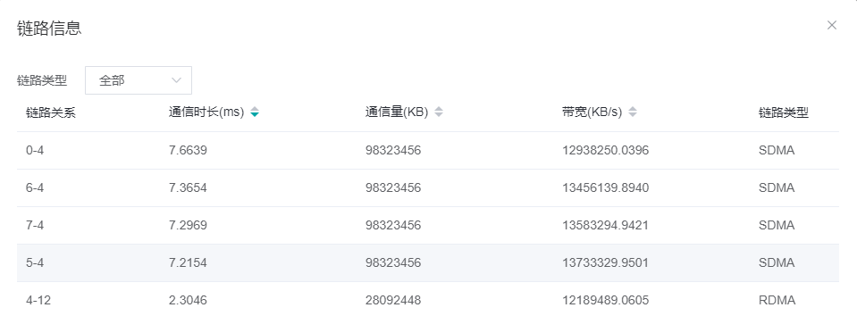

# 性能调优指南

<!-- TOC -->

- [性能调优指南](#性能调优指南)
    - [概述](#概述)
    - [单卡性能调优](#单卡性能调优)
        - [分析入口](#分析入口)
        - [迭代间隙耗时长](#迭代间隙耗时长)
            - [Feed模式](#Feed模式)
            - [图模式](#图模式)
        - [前反向耗时长](#前反向耗时长)
        - [迭代拖尾耗时长](#迭代拖尾耗时长)
    - [集群性能调优](#集群性能调优)
        - [分析入口](#分析入口)
        - [数据并行](#数据并行)
        - [模型并行](#模型并行)
        - [流水线并行](#流水线并行)

<!-- /TOC -->

<a href="https://gitee.com/mindspore/docs/blob/master/docs/mindinsight/docs/source_zh_cn/performance_tuning_guide.md" target="_blank"></a>

## 概述

MindInsight从单机和集群的角度分别提供了多项指标，用于帮助用户进行性能调优。本文侧重于方法论的讲解，目的是指导用户如何运用这些指标，逐层递进地快速找到网络中存在的性能瓶颈点。
对于各项指标的具体含义，用户可参考如下文档：

[性能调试（Ascend）](https://www.mindspore.cn/mindinsight/docs/zh-CN/master/performance_profiling_ascend.html)

[性能调试（GPU）](https://www.mindspore.cn/mindinsight/docs/zh-CN/master/performance_profiling_gpu.html)

[集群性能调试（Ascend）](https://www.mindspore.cn/mindinsight/docs/zh-CN/master/performance_profiling_ascend_of_cluster.html)

用户可以结合实际的[调优案例](https://www.mindspore.cn/docs/migration_guide/zh-CN/master/performance_optimization.html) 阅读本文，理解起来更加直观。

## 单卡性能调优

本章节从单卡的性能调优指导入手，帮助用户快速找到单卡训练过程中的性能瓶颈点。

### 分析入口

MindInsight在性能调优的单卡页面为用户提供了`迭代轨迹`标签页作为单卡性能调优的入口。迭代轨迹将训练过程分为三个阶段，用户可首先观察迭代轨迹各阶段的耗时，确定性能瓶颈点在哪个阶段，然后再针对该阶段进行详细分析。

- 迭代间隙：该阶段反映的是每个迭代开始时等待训练数据的时间。如果该阶段耗时长，说明数据处理的速度跟不上训练的速度。
- 前反向计算：该阶段主要执行网络中的前向及反向算子，承载了一个迭代主要的计算工作。
- 迭代拖尾：主要包含参数更新等操作，在多卡场景下还包括集合通信等操作。

如图1所示：


图1：迭代轨迹页面

### 迭代间隙耗时长

理想情况下，某个迭代开始前向训练时，其所需要的训练数据已经在Host侧完成了加载及增强并发送到了Device侧，反映到迭代间隙耗时通常在1毫秒内，否则就会由于等待训练数据而造成芯片算力的浪费。迭代间隙耗时长，说明该迭代开始前向计算时等待了较长的时间后训练数据才发送到了Device侧。用户需要到`数据准备`页面进一步确认是数据增强还是数据发送过程存在性能问题。


图2： 数据准备页面

#### Feed模式

步骤1：跳转到`数据准备详情`页的`迭代间隙`标签页，观察主机队列中Size曲线的变化情况。若该队列中Size在大部分情况下都是0，说明数据处理流程是性能瓶颈点，请参考步骤2继续定位数据处理哪个算子存在问题；否则说明从dataset模块的迭代器获取数据后将数据发送到Device的流程为性能瓶颈点，用户可按照如下两步继续确认：

- 确认脚本中从dataset模块的迭代器获取到数据后有没有自定义的逻辑比较耗时，如对数据进行清洗、转换等（由于该逻辑在用户的脚本中自定义，MindInsight无法获取该阶段的耗时，需要用户自行打点确认），如果有，需要用户针对该自定义逻辑进行优化。示意代码如下：

    ```python
    iterator = dataset.create_dict_iterator()
    for item in iterator:
        start = time.time()
        item = transform_data(item) # 用户自定义函数，需用户自行打点确认该逻辑是否耗时较长
        end = time.time()
        transform_time = end - start # 自定义逻辑的耗时时长

        network(item) #  将数据喂给网络进行训练
    ```

- 若用户脚本中不存在耗时的自定义逻辑，说明框架将数据从Host侧发送到Device侧耗时较长，请到[MindSpore社区](https://gitee.com/mindspore/mindspore/issues) 进行反馈。

步骤2：跳转到`数据准备详情`页的`数据处理`标签页，观察算子间队列，确定数据处理具体哪个算子存在性能瓶颈。判断原则请见[性能调试](https://www.mindspore.cn/mindinsight/docs/zh-CN/master/performance_profiling_ascend.html#id8) 页面的`数据准备性能分析`部分。找到存在性能问题的算子后，可参考[优化数据处理](https://www.mindspore.cn/docs/programming_guide/zh-CN/master/optimize_data_processing.html) 页面尝试提高数据处理算子的性能。

#### 图模式

步骤1：跳转到`数据准备详情`页的`迭代间隙`标签页，观察数据队列中Size曲线的变化情况。

- 若数据队列中Size一直都不是0，说明数据已经提前发送到了Device侧并缓存到了数据队列里，此时数据不是瓶颈。按日常的调优经验，数据不是瓶颈但迭代间隙长大概率是GetNext算子耗时有问题，用户可以到算子耗时页面，查看AICPU标签页中的GetNext算子耗时，若确认是GetNext算子耗时长，请到[MindSpore社区](https://gitee.com/mindspore/mindspore/issues) 反馈。
- 若数据队列中Size存在0的情况，请到步骤2继续定位。

步骤2：查看主机队列中Size曲线的变化情况。若该队列中Size都不是0，说明训练数据从Host发往Device的流程为性能瓶颈点，请到[MindSpore社区](https://gitee.com/mindspore/mindspore/issues) 反馈；否则说明数据处理流程是性能瓶颈点，请参照步骤3继续定位数据处理哪个算子存在性能问题。

步骤3：跳转到数据准备详情页的数据处理标签页，观察算子间队列，确定数据处理具体哪个算子存在性能瓶颈。判断原则请见[性能调试](https://www.mindspore.cn/mindinsight/docs/zh-CN/master/performance_profiling_ascend.html#id8) 页面的“数据准备性能分析"部分。找到存在性能问题的算子后，可参考[优化数据处理](https://www.mindspore.cn/docs/programming_guide/zh-CN/master/optimize_data_processing.html) 页面尝试提高数据处理算子的性能。

### 前反向耗时长

该阶段主要包含网络中前向及反向算子的执行时间。若该时间段耗时较长，建议按如下几个步骤进行分析：

步骤1：跳转到`算子耗时统计排名`标签页，查看训练过程中各算子的耗时情况，重点关注耗时排名靠前的部分算子。解决算子耗时长的思路主要有以下几个：

- 在不影响精度的前提下，将float32类型修改为float16类型；
- 存在转换算子过多（TransData、Cast类算子）且耗时明显时，如果是用户手动加入的算子，可分析其必要性，如果对精度没有影响，可去掉冗余的Cast、TransData算子；如果是MindSpore自动生成的转换算子过多，可能是MindSpore框架针对某些特殊情况没有充分优化，请到[MindSpore社区](https://gitee.com/mindspore/mindspore/issues) 反馈。
- 若有某个算子耗时明显不合理，请到[MindSpore社区](https://gitee.com/mindspore/mindspore/issues) 反馈。

步骤2：用户可以查看时间线页面，观察算子的起始时间、耗时时长、执行序以及算子间的并发情况等信息。用户可重点关注如下两点：

- GetNext算子有没有与AICore算子并行执行。正常情况下，GetNext算子会在对应迭代开始前执行，以保证训练数据可以被提前拿到。若通过时间线页面发现GetNext算子没有提前执行，说明框架对GetNext的调度存在问题，请到[MindSpore社区](https://gitee.com/mindspore/mindspore/issues) 反馈。
- AICore算子间有没有空闲时间。通常AI CORE算子的间隙是由于AI CPU算子和通信算子在执行导致的，属于正常情况（当然也需要结合用户的具体网络分析）；若遇到某一时间段内任何类型的算子都没有执行的情况，说明框架对AICore算子的调度存在问题，请到[MindSpore社区](https://gitee.com/mindspore/mindspore/issues) 反馈。

### 迭代拖尾耗时长

该阶段在单卡场景主要包含参数更新等操作。从实际的调优经验来看，在单卡训练场景下该阶段耗时都很短，不会存在性能瓶颈。如果用户遇到单卡场景下该阶段耗时长，可到`时间线`页面观察参数更新相关的算子耗时是否有异常，并到[MindSpore社区](https://gitee.com/mindspore/mindspore/issues) 反馈。

## 集群性能调优

影响集群性能的主要因素有如下几点：

- 慢节点：由于集合通信算子是同步执行的，若集群中存在慢节点，则会由于木桶效应，拖累整个集群的性能。
- 慢链路：若集群中某些链路存在问题，带宽较小，会影响集群通信的时长从而拖累整个集群的性能。
- 切分合理性：主要针对模型并行和流水线并行。对于模型并行，基于算子切分后，由于算子[重排布](https://www.mindspore.cn/docs/programming_guide/zh-CN/master/design/distributed_training_design.html) 会插入通信算子用于数据交换，而过多的通信是影响集群性能的主要因素。理想情况下，通信耗时越短越好，当纯通信时长(只有通信算子执行的时间段，通信算子与计算算子并行执行的时间段由于通信时间隐藏在了计算算子执行的时间内可不用关注)占据总时长的比例较大时，用户需要考虑算子切分是否可以优化，避免因为重排布而插入通信算子，从而减少通信的耗时；针对流水线并行，由于会将不同的层切分到不同的stage里，若因为切分不合理使得各stage上的计算量不均衡，则会导致stage间由于不同步而产生额外的数据等待时间（表现为Receive通信算子的耗时长，该通信算子用于接收其他stage发送的数据）。

针对如上影响集群性能的主要因素，MindInsight为数据并行、模型并行、流水线并行及其混合并行分别提供了不同的指标，以帮助用户快速发现集群中的性能瓶颈点。

### 分析入口

集群迭代轨迹页面作为集群性能调优的入口，针对不同的并行策略分别提供了不同的性能指标，用于帮助用户确认集群中是否存在上述提到的影响集群性能的因素存在。用户可根据自己的场景，分别到以下对应的并行策略处进行查看。注意，对于混合并行的场景，若存在流水线并行，请到流水线并行小节继续查看；否则，若存在模型并行，请到模型并行小节继续查看。

对于设备较少的集群，用户可以直接观察页面中提供的柱状图，确认各张卡不同阶段的耗时情况。对于设备较多的集群，柱状图无法在一个页面展示所有卡的数据，用户可以对不同的指标列进行排序，观察所有卡各指标的耗时分布情况。

### 数据并行

针对数据并行，集群迭代轨迹页面提供了集群中所有卡的迭代间隙、前反向计算、迭代拖尾耗时指标。

步骤1：观察集群迭代轨迹页面的迭代间隙耗时

- 观察是否有某张卡的迭代间隙耗时明显比其他卡长，如果有，说明该卡的数据准备阶段存在性能问题，属于慢的节点，用户可跳转到该卡的单卡页面，参考`单卡性能调优`的`迭代间隙耗时长`小节继续定位该阶段耗时长的原因；
- 若所有卡该阶段耗时都比较长，说明该阶段存在优化的空间。用户可到任意一张卡的单卡页面，参考`单卡性能调优`的`迭代间隙耗时长`小节继续定位该阶段耗时长的原因。

步骤2：观察集群迭代轨迹页面的前反向计算耗时

- 观察是否有某张卡的前反向耗时明显比其它卡长，如果有，说明该卡的前反向计算阶段存在性能问题，属于慢的节点，用户可跳转到该卡的单卡页面，参考`单卡性能调优`的`前反向耗时长`小节继续定位该阶段耗时长的原因；
- 若所有卡该阶段耗时都比较长，，说明该阶段存在优化的空间。用户可到任意一张卡的单卡页面，参考`单卡性能调优`的`前反向耗时长`小节继续定位该阶段耗时长的原因。

步骤3：观察集群页面的迭代拖尾耗时

- 观察是否有某张卡的迭代拖尾耗时明显比其它卡长，通常该情况是由于集群中存在慢节点导致，用户可参考步骤1和步骤2确定是否有慢节点并修复。
- 若所有卡的迭代拖尾耗时基本相同，且该阶段耗时较长，通常是由于AllReduce集合通信算子耗时长导致。用户可尝试通过修改all_reduce_fusion_config参数，改变[AllReduce融合切分策略](https://www.mindspore.cn/docs/programming_guide/zh-CN/master/auto_parallel.html?highlight=all_reduce_fusion_config) 降低该阶段的耗时。

### 模型并行

针对模型并行，集群迭代轨迹页面提供了集群中所有卡的迭代间隙、纯通信时间、计算时间三个指标。

步骤1：观察集群页面的迭代间隙耗时

处理方法可参考`数据并行`的步骤1，此处不再赘述。

步骤2：观察集群页面的计算时间

模型并行在前反向阶段中，计算算子与通信算子是穿插执行的，因此通过前反向阶段耗时无法直接找到慢的节点。因此将前反向拆分出计算时间耗时，该阶段反映的是每张卡只执行AICore算子的执行时间，如果某张卡的算子执行时间有问题导致该卡属于慢节点，可通过该指标反映出来。
若某张卡的该指标明显比其他卡长，处理方法可参考`数据并行`的步骤2，此处不再赘述。

步骤3：观察集群页面的纯通信时间

在通过步骤1和步骤2确认没有慢节点的前提下，集群中各卡的纯通信时间应该基本相同。如果该阶段耗时较短，说明由于算子重排布导致的通信时间对性能的影响较小，用户无需考虑对算子切分策略进行优化。否则，用户需要重点分析算子的切分策略是否可以优化。
在参考如下步骤继续分析前，用戶需要對模型并行原理有一定的了解，请参考[分布式训练](https://www.mindspore.cn/tutorials/zh-CN/master/distributed_training.html) 了解其基本原理，如下步骤只是辅助用户进行合理性分析，算子切分策略是否有优化空间、如何优化需要用户了解模型并行原理后，结合各自的网络具体分析进行判断。

- 若该阶段耗时较长，用户可任意选其中的一张卡，观察其时间线。在时间线中，MindInsight对纯通信时间做了标记，参考下图中的`Pure Communication Op`:

    

    图3：纯通信时间

    分析过程中，用户只需要关注纯通信时间段即可，重点分析通信算子的插入是否合理（可通过观察通信算子的位置确认其插入原因，并分析其插入是否合理）、通信算子耗时是否正常等。

- 若分析后发现某个算子切分后理论上不应该插入通信算子，但通过时间线查看却插入了，说明框架插入通信算子的逻辑可能存在问题，请到[MindSpore社区](https://gitee.com/mindspore/mindspore/issues) 反馈。
- 若分析后发现在其他算子处切分能满足并行的诉求，同时不会因为重排布插入通信算子，请优化算子切分策略，尽量选择在不会插入通信算子的算子处进行切分。
- 若分析后发现某个通信算子不可避免要插入，但耗时却明显异常，用户可到步骤4继续分析耗时异常的原因。

步骤4：针对通信算子耗时，用户可到`集群通信概览`页面，查看该通信算子的各耗时阶段，如下图：



图4：通信算子耗时分析

- 若通信时长较长，说明该通信算子大部分时间在做通信，用户可以到链路信息页面观察带宽确认是否有慢链路导致了通信耗时长，若发现某条链路带宽有问题，用户需要针对该链路进行排查，修复链路问题。如下图：

    

    图5:逻辑卡链路信息

- 若等待时长较长，说明集群中存在慢节点，用户可通过步骤1和步骤2确认并修复慢节点。
- 除了通信和等待时长，对于AllReduce通信算子还会存在Reduce时长，若该时间段较长，说明执行Reduce的逻辑存在异常，请到[MindSpore社区](https://gitee.com/mindspore/mindspore/issues) 反馈。

### 流水线并行

针对流水线并行，集群迭代轨迹页面提供了集群中所有卡的迭代间隙、stage时间、纯计算时间、纯通信时间、纯通信时间（除Receive通信算子）、纯通信时间（仅包含Receive通信算子）等指标，用于帮助用户确认是否有慢节点、慢链路以及分析模型的切分合理性。

步骤1: 观察集群迭代轨迹页面的迭代间隙耗时

处理方法可参考`数据并行`的步骤1，此处不再赘述。

步骤2: 观察集群迭代轨迹页面的stage时间

理想情况下，各stage的耗时应该基本一致，否则会出现快的stage等待慢的stage发送数据而拖累集群的性能。导致各stage耗时不一致的原因主要有如下几个，用户可逐一进行确认。

- 计算量分配不均衡：用户可到集群`资源利用页面`的`集群FLOPs热力图分析`，查看计算量的分布情况，若存在各stage的计算量差异较大的情况，用户需要重新调整切分到各stage的算子，尽量保证各stage分到的计算量均衡。
- 存在处理速度慢的节点：用户可以筛选耗时长的stage，并对纯计算时间进行排序，查看该stage内是否有某张卡的该指标存在明显的异常。如果有，用户可跳转到单卡页面，参考`单卡性能调优`的`前反向耗时长`小节继续继续定位。
- 某个stage内由于算子切分，导致插入较多的通信算子，从而拉长了该stage的整体时间。用户可以筛选耗时长的stage，观察该stage内纯通信时间(除Receive通信算子)占整个迭代耗时的比例。若比例较高，可参考`模型并行`步骤3，分析是否可以对算子切分进行优化。

步骤3: 观察集群迭代轨迹页面的纯通信时间（仅包含Receive通信算子）：

该指标反映的是当前stage等待接收其他stage发来的数据的时间。理论上当各stage的耗时基本相同时，不会出现该时间段耗时很长的现象。因此用户看到该指标后，可以先按步骤2进行分析，确认stage间是否存在耗时差异过大的问题。若不存在步骤2提到的任何问题，说明该耗时是正常的，用户可不需要关注；用户也可以到`时间线`页面，查看Receive通信算子的执行序，结合各自网络分析该算子耗时的合理性。