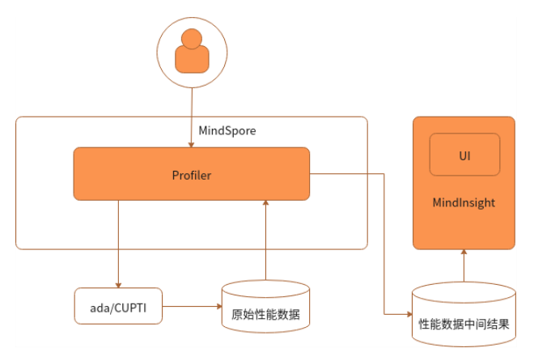
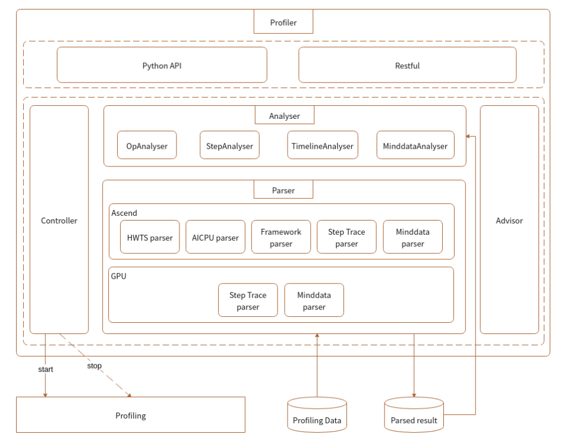
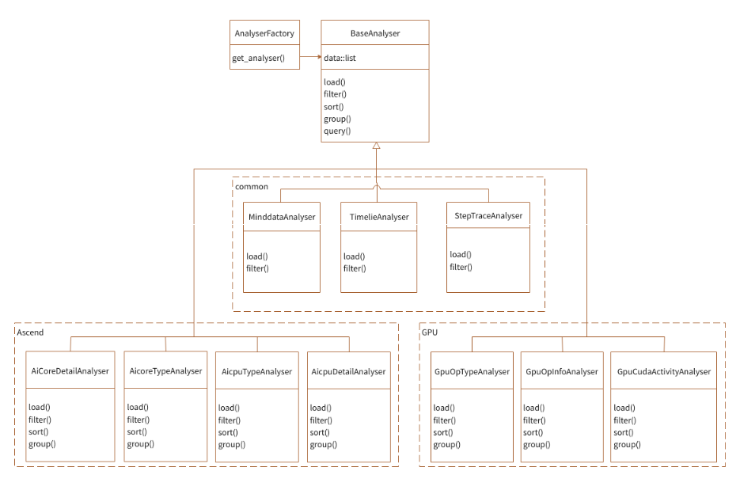

# 性能调试设计

<!-- TOC -->

- [性能调试设计](#性能调试设计)
    - [背景](#背景)
    - [Profiler架构设计](#profiler架构设计)
        - [上下文](#上下文)
        - [模块层级结构](#模块层级结构)
        - [内部模块交互](#内部模块交互)
    - [子模块设计](#子模块设计)
        - [ProfilerAPI和Controller](#profilerapi和controller)
            - [ProfilerAPI和Controller模块说明](#profilerapi和controller模块说明)
            - [ProfilerAPI和Controller模块设计](#profilerapi和controller模块设计)
        - [Parser](#parser)
            - [Parser模块介绍](#parser模块介绍)
            - [Parser模块设计](#parser模块设计)
        - [Analyser](#analyser)
            - [Analyser模块介绍](#analyser模块介绍)
            - [Analyser模块设计](#analyser模块设计)
        - [Proposer](#proposer)
            - [Proposer模块介绍](#proposer模块介绍)
            - [Proposer模块设计](#proposer模块设计)

<!-- /TOC -->

## 背景

为了支持用户在MindSpore进行模型开发性能调试，需要提供易用的Profile工具，直观地展现网络模型各维度的性能信息，为用户提供易用、丰富的性能分析功能，帮助用户快速定位网络中性能问题。

## Profiler架构设计

这一章将介绍Profiler的架构设计，第一节从整体Profiler的角度出发介绍其上下文交互关系，第二节将打开Profiler内部，介绍模块层架结构以及模块划分，第三节将介绍模块间的交互调用关系。

### 上下文

Profiler是MindSpore调试调优工具的一部分，在整个使用过程中的上下文环境如下图所示：

图1：上下文关系图

如上图所示，Profiler与其他部分的交互包括：

1. 在训练脚本中调用MindSpore的Profiler启动收集性能数据的命令，Ascend类型下由ada模块生成性能原始数据，GPU类型下由CUPTI模块生成性能原始数据；

2. MindSpore侧Profiler将在用户脚本中对原始数据进行解析，并在用户指定的文件夹下面生成中间数据结果；

3. Mindinsight侧Profiler对接中间数据，提供可视化Profiler功能供用户使用。

### 模块层级结构

模块层级划分如下：

图2：层级模块关系图

如上图所示，各个模块功能介绍如下：

1. ProfilerAPI是代码侧为用户提供的调用入口，为用户提供了性能收集启动接口以及分析接口；
2. Controller是ProfilerAPI下层的模块，被ProfilerAPI中的启动接口调用，负责控制下方性能收集功能的启动停止，原始数据会被写入固定位置；
3. Parser是性能原始数据解析模块，由于性能原始数据是在设备侧收集的信息，所以信息不能直接被用户所理解，该模块负责将信息进行解析、组合、转换，最终形成用户可理解、上层可分析的中间结果；
4. Analyser获取下层Parser解析出的中间结果，负责对中间结果进行封装、筛选、排序，最终按照信息分类，返回各个类别对应的信息，提供给上层的表现层Profiler API、RESTful使用；
5. 通过RESTful调用后端Analyser提供的common API，获取目标数据，以RESTful接口对接前端。

### 内部模块交互

从用户角度，有两种使用形式API、RESTful，我们以API为例，阐述一个完整的内部模块交互流程：

图3：模块交互图

如上图所示，各个模块交互流程如下：

1. ProfilerAPI会调用下层Controller的控制函数，控制下层收集模块进行收集，Ascend收集模块为ada，GPU为CUPTI；

2. 用户在训练结束后会调用ProfilerAPI的分析接口；

3. Profiler API分析接口首先使用Parser模块对性能数据进行解析，产生中间结果，再调用Analyser进行中间结果分析，最终将各类信息返回至用户侧。

## 子模块设计

### ProfilerAPI和Controller

#### ProfilerAPI和Controller模块说明

ProfilerAPI为用户在训练脚本侧提供入口API，用户通过ProfilerAPI启动性能收集以及对性能数据进行分析。
ProfilerAPI通过Controller下发命令，启动性能数据收集模块。

#### ProfilerAPI和Controller模块设计

ProfilerAPI模块，属于上层应用接口层，由训练脚本集成。功能分为两部分：

- 训练前调用底层Controller接口，下发命令，启动profiling统计任务。

- 训练完成后，调用底层Controller接口，下发命令，停止性能统计任务，再调用Analyser、Parser模块接口解析数据文件，生成算子性能统计、training trace统计等结果数据。

Controller模块提供对上层接口，并调用底层性能收集模块接口，下发启动和停止性能收集的命令。

最终生成的性能原始数据主要包含：

Ascend:

- `hwts.log.data.45.dev.profiler_default_tag`文件：存储算子执行信息，包括task的开始/结束，stream id的信息等；
- `DATA_PREPROCESS.dev.AICPU`文件：AI CPU算子的执行各阶段的执行时间信息；
- `Framework.host.task_desc_info`文件：存储算子id与算子名称的对应关系，以及每个算子的输入输出信息；
- `training_trace.46.dev.profiler_default_tag`文件：存储每个step的开始结束时刻，迭代间隙、迭代前向反向、迭代拖尾的时刻信息。

GPU:

- `step_trace_profiling_0.txt`文件：存储了前向/反向的起止算子等信息。

### Parser

#### Parser模块介绍

Parser是原始性能数据解析模块，由于原始性能数据是在设备侧收集的信息，所以信息不能直接被用户所理解，该模块负责将信息进行解析、组合、转换，最终形成用户可理解、上层可分析的中间结果。

#### Parser模块设计

图4：Parser模块图

如上图所示，Parser模块主要由HWTS Parser、AI CPU Parser、Framework Parser、Step Trace Parser组成，每个模块对应解析一种原始数据，通过解析原始数据得到用户能读懂的中间文件。其中
Ascend主要用到HWTS Parser、AI CPU Parser、Framework Parser、Step Trace Parser，GPU主要用到Step Trace Parser。

Ascend:

- HWTS Parser：解析`hwts.log.data.45.dev.profiler_default_tag`文件，获得Device基于task的统计信息，如每个task的开始/结束，stream id等数据，用于算子执行时间的计算。
- AI CPU Parser：解析`DATA_PREPROCESS.dev.AICPU`文件，获得AI CPU算子的执行各阶段的执行时间信息。
- Framework Parser：解析`Framework.host.task_desc_info`文件，用于获取AI Core算子与task的对应关系，算子关键信息等内容。
- Step Trace Parser：解析`training_trace.46.dev.profiler_default_tag`文件，用于分析训练各阶段的时间。

GPU:

- Step Trace Parser：解析`step_trace_profiling_0.txt`文件，用于分析训练各阶段的时间。

### Analyser

#### Analyser模块介绍

分析器的作用是对解析阶段生成的中间结果，进行筛选、排序、查询、分页等相关操作。

#### Analyser模块设计

该模块负责解析Parser生成的中间文件，为上层数据分析提供通用接口，将分析后的数据返回给上层展示给用户，由于各种中间文件有一定的共同点，可以抽象出公共内容，所以Analyser类设计如下图所示：

图5：Analyser类图

如上图所示，针对期望查询的不同内容，实现多个Analyser，每个Analyser可以定义筛选、排序、分页条件。每个Analyser知道自己需要哪些中间文件来进行数据的合并、筛选、排序。Analyser与Parser是通过Parser生成的中间文件关联起来的，本身不存在函数调用的情况，这样对两个模块进行了解耦。Ascend和GPU分别支持不同的Analyser类。

针对算子信息的Analyser，目前存在两种：

- 针对算子类型平均信息的筛选。
- 针对每个算子详细平均信息的筛选，分别在两个Analyser中实现（Ascend为AicoreTypeAnalyser、AicoreDetailAnalyser，GPU为GpuOpTypeAnalyser、GpuOpInfoAnalyser）。

为了隐藏Analyser内部实现，方便调用，使用简单工厂模式，通过AnalyserFactory获取指定的Analyser。

### Proposer

#### Proposer模块介绍

Proposer是Profiler性能优化建议模块，Proposer调用Analyser模块获取性能数据，通过调优规则对性能数据进行分析，输出调优建议由UI、API接口展示给用户。

#### Proposer模块设计

模块划分如下所示：

图6：Proposer模块图

模块设计如上图所示：

- Proposer提供接口用于API、RESTful调用以获取优化建议。
- Proposer调用Analyser接口，获取性能数据并根据优化规则，获得优化建议。
- Proposer调用Analyser工厂获得Analyser对象。

调用Analyser对象的query接口获取信息，包括：按时间排序TOP N的算子信息、training trace各阶段的时间信息。

模块类设计如下所示：

图7：Proposer类图

如上模块类图所示：

- 各类型Proposer继承抽象类Proposer并实现analyze方法；
- API、CLI通过调用工厂ProposerFactory获取Proposer，并调用Proposer.analyze函数获取各类型的Proposer分析的优化建议。
