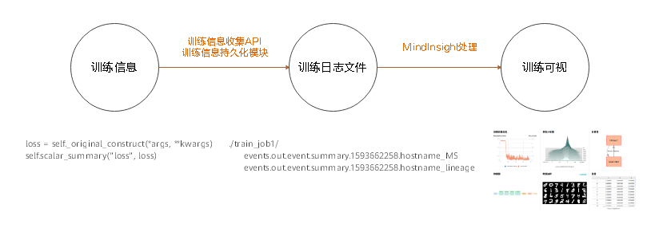
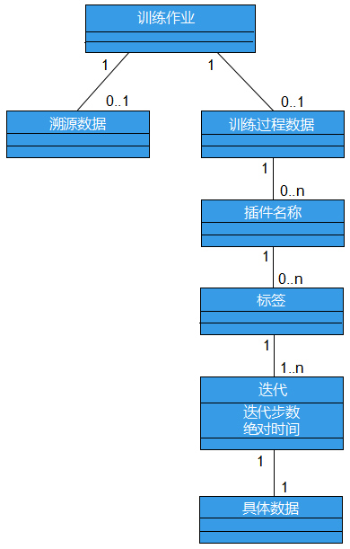

# 训练可视总体设计

<!-- TOC -->

- [训练可视总体设计](#训练可视总体设计)
    - [训练可视逻辑架构](#训练可视逻辑架构)
        - [训练信息收集架构](#训练信息收集架构)
        - [训练信息分析及展示架构](#训练信息分析及展示架构)
    - [代码组织](#代码组织)
    - [训练可视数据模型](#训练可视数据模型)
        - [训练信息数据流](#训练信息数据流)
        - [数据模型](#数据模型)
            - [训练作业](#训练作业)
            - [溯源数据](#溯源数据)
            - [训练过程数据](#训练过程数据)

<!-- /TOC -->

[MindInsight](https://gitee.com/mindspore/mindinsight)是MindSpore的可视化调试调优组件。通过MindInsight可以完成训练可视、性能调优、精度调优等任务。

训练可视功能主要包括训练看板、模型溯源、数据溯源等功能，训练看板中又包括标量、参数分布图、计算图、数据图、数据抽样、张量等子功能。

本文主要介绍MindInsight训练可视功能的逻辑架构、代码组织和数据模型。

## 训练可视逻辑架构

在架构上，训练可视功能的逻辑架构分为两部分：训练信息收集架构，训练信息分析及展示架构。

图1 MindInsight训练可视逻辑架构

### 训练信息收集架构

训练信息收集功能在MindSpore中，包括训练信息收集API模块和训练信息持久化模块。

训练信息收集API包括：

- 基于summary算子的训练信息收集API。这部分API主要包括4个summary算子，即用于记录标量数据的ScalarSummary算子，用于记录图片数据的ImageSummary算子，用于记录参数分布图（直方图）数据的HistogramSummary算子和用于记录张量数据的TensorSummary算子。请访问[算子支持列表](https://www.mindspore.cn/docs/note/zh-CN/master/operator_list.html)以获取关于这些算子的信息。

- 基于Python API的训练信息收集API。通过[SummaryRecord.add_value](https://www.mindspore.cn/docs/api/zh-CN/master/api_python/mindspore.train.html#mindspore.train.summary.SummaryRecord.add_value)方法，可以在Python代码中完成训练信息的收集。

- 易用的训练信息收集callback。通过[SummaryCollector](https://www.mindspore.cn/docs/api/zh-CN/master/api_python/mindspore.train.html#mindspore.train.callback.SummaryCollector)这一callback可以方便地收集常用训练信息到训练日志中。

训练信息持久化模块主要包括用于管理缓存的summary_record模块和用于并行处理数据、写入文件的write_pool模块。训练信息持久化后，存储在训练日志文件（summary文件中）。

### 训练信息分析及展示架构

训练信息分析及展示架构在MindInsight中，包括Web UI和后端两大部分。后端从下到上可以分为数据加载及缓存层、业务逻辑层、API 层。数据加载及缓存层主要由训练日志文件发现模块、训练日志文件解析模块及缓存管理模块组成。业务逻辑层主要由训练看板业务模块和溯源业务模块组成。API层主要由RESTful API模块组成。各模块的主要功能如下：

- 训练日志文件发现模块：用于在给定的训练日志根目录（summary-base-dir）中扫描并发现含有训练日志文件的训练日志目录。只有含有训练日志文件的目录会被识别为训练日志目录。

- 训练日志文件解析模块：用于解析训练日志文件。

- 缓存管理模块：用于管理训练日志解析任务，缓存训练日志解析结果。其会定期调用训练日志发现模块，扫描最新的训练日志目录列表；然后调用解析模块解析文件内容，将解析结果存储在缓存中以供UI查询。

- 训练看板模块：用于提供训练看板功能的业务逻辑，支撑UI查询训练看板数据。

- 溯源模块：用于提供模型溯源和数据溯源的业务逻辑，支撑UI查询溯源数据。

- RESTful API模块：用于将业务模块提供的接口包装为RESTful API。

## 代码组织

以下是MindInsight代码仓库中的部分重要目录及说明。

|一级目录|二级目录|三级目录|说明|
|---|---|---|---|
|build|||编译、构建相关代码。|
|mindinsight|||
||backend||RESTful API。|
|||datavisual|训练看板相关RESTful API。|
|||lineagemgr|溯源相关RESTful API。|
||datavisual||训练看板模块。当前数据加载及缓存层的代码也在此模块中。|
|||data_transform|数据加载及缓存层。|
||lineagemgr||溯源模块。|
||ui||MindInsight Web UI。|
|tests|||测试用例目录。|

## 训练可视数据模型

### 训练信息数据流

训练信息产生于用户训练的过程中。用户可以通过训练信息收集API将这些训练信息收集起来，并通过训练信息持久化模块将这些训练信息保存到磁盘上，产生训练日志文件（summary文件）。训练日志文件生成后，便可以使用MindInsight对其中的信息进行可视化。

图2 训练信息数据流

### 数据模型

MindInsight的简要数据模型如图3所示。一个训练日志目录会被MindInsight识别为一个训练作业。训练作业是MindInsight的最小管理单元。一个训练作业可以关联0-1个溯源数据，关联0-1个训练过程数据。训练过程数据内部有着丰富的结构，每一个具体的数据，可以通过给定的插件名称、标签和迭代唯一确定。下面将分别介绍这些概念。

图3 以UML类图表示的数据模型

#### 训练作业

MindInsight通过目录来区分不同的训练作业。为了方便用户区分不同训练作业的训练日志文件，`SummaryCollector`、`SummaryRecord`都要求用户指定存放训练日志文件的目录。相同目录中的训练日志文件会被认为是同一次训练作业中产生的训练数据，不同目录中的训练日志文件会被认为是不同训练作业中产生的文件。

在MindInsight的代码中，一次训练一般被称为一个TrainJob。TrainJob的id即该次训练的日志所在目录的目录名（例如 ./train_my_lenet_1）。

一次训练的过程中，一般会产生该次训练的溯源数据文件（文件名以_lineage结尾）和训练过程数据文件（文件名一般以_MS结尾）。其中溯源数据主要从全局出发描述该次训练的不变性质，例如训练所用的数据集路径、训练所用的优化器、以及用户自定义的溯源信息。这些信息最突出的特点是不会在训练过程中变化。而训练过程数据主要描述该次训练的变化情况，例如loss值、参数分布、一个迭代中送入模型的图片数据等。这些信息最突出的特点是每个迭代都会发生变化。

需要注意的是，关于训练信息是否发生变化的分类并不是绝对的。比如训练过程数据文件中会含有计算图数据，其一般在训练开始的时候就确定了。

#### 溯源数据

溯源数据主要从全局出发描述某次训练的不变性质。当MindInsight识别到多个训练日志目录时，这若干次训练的溯源数据会被组织成表格的形式展示，以方便对比和分析。

#### 训练过程数据

- 插件名称（plugin_name）

    对于训练过程数据，我们首先将这些训练数据按类型分为标量数据（scalar）、直方图数据（histogram）、图片数据（image）、张量数据（tensor）等类型，这些类型在MindInsight的中被称为插件名称（plugin_name），当前mindinsight支持的插件名称定义在`mindinsight.datavisual.common.enums.PluginNameEnum`中。

- 标签（tag）

    无论数据属于何种类型，其都会依照tag进一步被分为不同的序列。tag一般由用户命名，用于对数据进行区分。比如记录loss值的标量数据，其tag名可以为loss。需要说明的是，MindInsight在对数据进行处理时，会根据插件名称自动为tag附加后缀。例如tag为loss的数据为标量数据，则该tag会被自动重命名为loss/scalar。

- 迭代数（step）

    训练过程数据是在训练的每个迭代中产生的，为了区分这些数据，数据会被标记上该数据所对应的迭代数。

- 数据的查询和展示

    在展示数据时，用户常常希望看到某个标签下的数据随着训练过程的变化情况。因此，查询数据时，一般不会指定迭代数，而是直接指定训练作业、插件名称和标签，查询该标签下所有迭代的数据。
