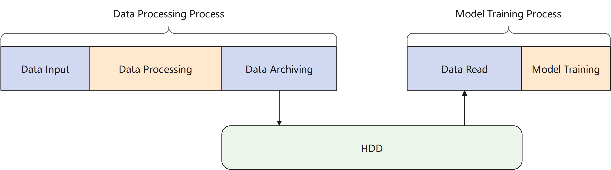
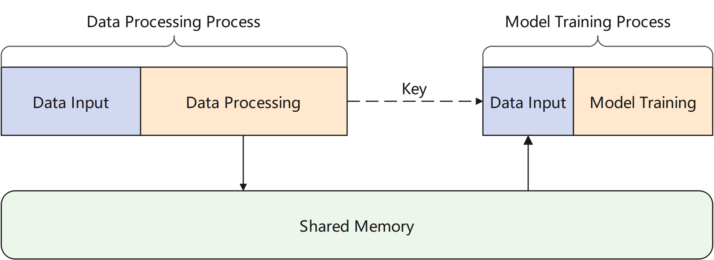
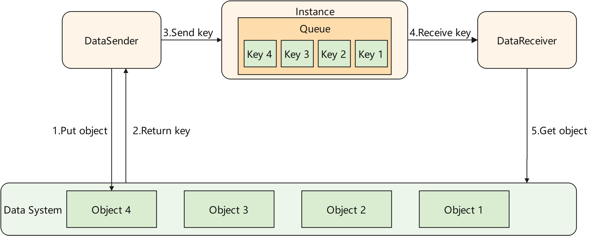
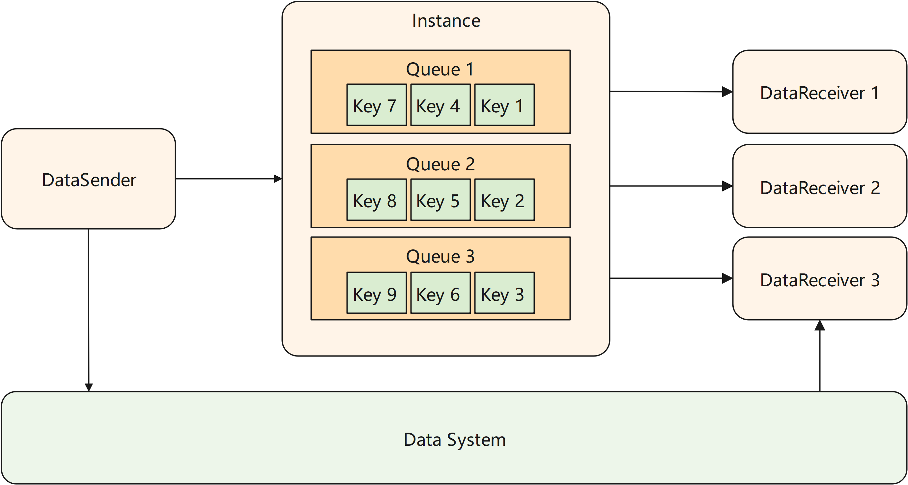

# Efficient Data Movement

In traditional machine learning scenarios, data processing is relatively independent of model training. As shown in the figure below, after the data is processed, the data needs to be persistently stored in disk. Data is read from disk again when used. As the data gets larger, io operations on hard disk will take a large amount of time. In scenarios that are sensitive to data timeliness, it will bring high latency.

The channel module of MindPandas provides a data movement scheme based on shared memory. The processed data is stored in a data system based on shared memory, which is essentially a key-value database. The user only needs to connect the data processing process and the model training process to the same data system, and after the data is processed, send the key corresponding to the data to the model training process. Then the model training process can obtain the data from the data system.

## Implementation

The channel module of MindPandas abstracts the data movement between processes as a pipe. As shown in the figure below, the transmitted data is managed by an instance in the distributed execution engine. The instance maintains one or more queues that store the keys of data that haven't been received by the receiver. The channel module provides users with two classes, DataSender and DataReceiver. When DataSender's `send` method is called, the key of the data will be appended to the end of a queue. When DataReceiver's `recv` method is called, it retrieves the key of the least recent data from the head of the queue. The DataReceiver then uses this key to fetch data from the data system.

### Multi-receiver Scenario

The channel of MindPandas supports multiple DataReceivers connect to a same DataSender, and each DataReceiver will get a shard of the data sent by the DataSender. In this scenario, the user needs to configure the `num_shards` parameter as the number of DataReceivers when initializing the DataSender. When sending data, DataSender will evenly split the data into `num_shards` shards. When initializing the DataReceiver, you need to configure the `shard_id` parameter to specify the shard number that current receiver will receive.

## Guide

Please refer to [mindpandas.channel](https://www.mindspore.cn/mindpandas/docs/en/master/mindpandas.channel.html).
