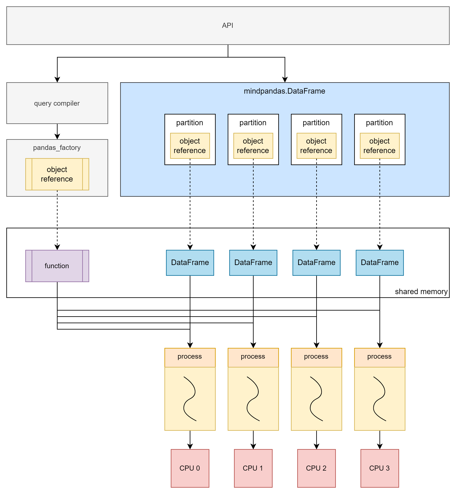

# MindSpore Pandas Execution Mode Introduction and Configuration Instructions

[](https://gitee.com/mindspore/docs/blob/master/docs/mindpandas/docs/source_en/mindpandas_configuration.md)

This article mainly introduces the principle and usage of MindSpore Pandas distributed parallel mode.

## MindSpore Pandas Implementation Principle

MindSpore Pandas accelerates Pandas data processing through parallelized computing. The principle is to first slice the original data into a bunch of partitions, then convert the API into a general computing paradigm (map, reduce, injective_map, etc.), and then parallelize the calculation by the backend. The current MindSpore Pandas backend has two execution modes, which are multi-threaded mode and multi-process mode.

### Data Slicing Principle

Slicing raw data is the basis of parallel computing. The following figure shows the process of converting `pandas.DataFrame` to `mindpandas.DataFrame`. According to the preset `partition_shape`, the original data is divided into a specified number of `partition` and `partition` will be used as the basic unit of subsequent parallel computing .


### The Principle of Multi-thread Mode

Multi-thread mode is implemented based on Python multi-thread. Each data partition and its corresponding computation function are executed in one thread.


Although Python's multi-thread has a global interpreter lock (GIL) limitation, multi-thread cannot effectively utilize multi-core. However, when the amount of data is small or when dealing with IO-intensive tasks, the multi-threaded backend can still bring significant performance gains.

### Principle of Multi-process Mode

The multi-process mode is not limited by Python's global interpreter lock (GIL) and can achieve real parallel computing. The principle of multi-process mode is similar to that of multi-thread mode. The difference is that after slicing the original data, the partitions are stored in the shared memory of the distributed compute engine, and the `mindpandas.DataFrame` stores the corresponding `object reference` of the partitions.

When computing is required, the computing function is also stored in the shared memory of the distributed compute engine, and then the `object reference` corresponding to the computing function and the `object reference` corresponding to the partition is submitted to the distributed compute engine as a task. All tasks will be uniformly scheduled by the distributed compute engine and executed asynchronous parallelism and in the form of multi-process.

#### Single-machine Multi-process Principle



The multi-process mode can make full use of multi-core, thereby achieving performance improvements ranging from several times to dozens of times. Therefore, the multi-process mode can efficiently deal with scenarios with a large amount of data. However, due to overhead such as process creation and scheduling, performance may be affected when the amount of data processed is small.

#### Multi-machine Multi-process Principle


In the multi-machine multi-process mode, computing is performed on a cluster composed of multiple servers, which can make full use of the resources of multiple machines to complete computing tasks and break through the resource limitations of single machine.

## MindSpore Pandas Execution Mode Configuration

### Data Partition Configuration

MindSpore Pandas supports users to configure the shape of the partition according to the actual usage. Users can use `set_partition_shape` to customize the number of rows and columns of the partition.

```python
import mindpandas as pd
pd.set_partition_shape((16, 2))

df = pd.read_csv('data.csv')
df_mean = df.mean()
```

### Multi-threaded Mode Configuration

MindSpore Pandas uses the multi-threaded mode as follows:

```python
import mindpandas as pd
pd.set_concurrency_mode('multithread') # MindSpore Pandas will use multithread as backend

df = pd.read_csv('data.csv')
df_mean = df.mean()
```

### Multi-process Mode Configuration

When MindSpore Pandas is installed, the built-in distributed compute engine has also been installed synchronously, which can be accessed using the command `yrctl` in the console.

> In multi-process mode, please make sure that the cluster you start is only for your personal use. Using a cluster together with others may lead to potential security risks.

```shell
$ yrctl
Usage: yrctl [OPTIONS] COMMAND [ARGS]...

  The distributed executor of MindSpore Pandas.

Options:
  --help  Show this message and exit.

Commands:
  start    used to start the fleeting cluster
  stop     used to stop the fleeting cluster
```

#### Single-machine Multi-process Mode Configuration

To use the distributed compute engine, we need to start the service through the command line to deploy a single-machine cluster. An example command to deploy a cluster is as follows:

```shell
yrctl start --master --address <address> --cpu <cpu> --datamem <datamem> --mem <mem> --tmp-dir <tmp-dir> --tmp-file-size-limit <tmp-file-size-limit>
```

Common parameters of the `yrctl start` command are:

- `--master`: Flag bit, set the current node as the master node. There is only one master node in the cluster. This flag must be set when deploying a single-machine cluster.
- `--address`: The ip address of the master node. Optional, uses "127.0.0.1" by default.
- `--cpu`: The number of CPU cores to use. Optional, uses all CPU cores by default.
- `--datamem`: The amount of memory used by datasystem (MB). Optional, uses 30% of total memory by default.
- `--mem`: The total memory (including datamem) used by MindSpore Pandas (MB). Optional, uses 90% of total memory by default.
- `--tmp-dir`: The temporary directory for the mindpandas process. Optional, uses "/tmp/mindpandas" by default.
- `--tmp-file-size-limit`: The temporary file size limit (MB). Optional, the default value is "None" which uses up to 95% of current free disk space.

To view the parameter usage instructions of `yrctl start`, you can view it through `yrctl start --help`.
Before starting the cluster, check the following:

- No other redis service on this machine occupies port 6379, otherwise it will cause port conflict. If there is a conflict between redis or other ports, please refer to [FAQ](https://www.mindspore.cn/mindpandas/docs/en/master/faq.html) to solve it.

If the cluster deployment is successful, the end of the console echo should show:

````text
Succeeded to start!
````

After the cluster is deployed, you need to set a multi-process backend to run in the Python script. The method is to call the `set_concurrency_mode` interface, set the `mode` to `"multiprocess"`.

> We recommend calling `set_concurrency_mode` immediately after `import mindpandas` to set the concurrency mode. Switching the parallel mode while the script is running may cause the program failure.

```python
import mindpandas as pd
pd.set_concurrency_mode(mode="multiprocess")
```

To stop the distributed compute engine, use the `yrctl stop` command:

```shell
$ yrctl stop --help
Usage: yrctl stop [OPTIONS]

  used to stop the fleeting cluster

Options:
  --help    Show this message and exit.
```

After successfully stopping the distributed compute engine, the end of the echo should show:

```text
Succeeded to stop!
```

#### Multi-machine Multi-process Mode Use

MindSpore Pandas' multi-process backend supports building clusters on multiple machines and performs distributed computing. The cluster consists of a master node and multiple worker nodes, and services need to be started separately on each machine in the cluster. The startup method is the same as the single-machine multi-process mode, but the master node must be started first, and then other worker nodes must be started.

Start the master node:

```shell
yrctl start --master --address <address>
```

where `address` is the IP address of the master node.

Start the worker node:

```shell
yrctl start --address=<address>
```

The `address` is the IP address of the master node. If the deployment fails during startup, please refer to [FAQ](https://www.mindspore.cn/mindpandas/docs/en/master/faq.html).

After the cluster is deployed, in the Python script, use the `"multiprocess"` backend as shown in the following code.

```python
import mindpandas as pd
pd.set_concurrency_mode("multiprocess")
```

The command to stop the cluster is as follows, which needs to be executed on the master node and each worker node separately:

```shell
yrctl stop
```

### Adaptive Concurrency Function

Because the performance of single-process computing is good enough when the amount of data is small. The parallel benefits of multi-process computing are often smaller than the extra overhead of using multi-processes, so MindSpore Pandas has added an adaptive concurrency function. When this function is enabled, MindSpore Pandas will adaptively switch the concurrency mode according to the data size to improve performance.

#### Enabling Adaptive Concurrency

The adaptive concurrency feature is set to off by default, and it can be turned on through the `set_adaptive_concurrency` interface in a Python script:

```python
import mindpandas as pd
pd.set_adaptive_concurrency(True)
```

#### Triggering Conditions

After the adaptive concurrency function is enabled, the conditions for automatically switching the parallel mode are as follows:

- Multi-threaded mode is used when reading csv files smaller than 18MB, and multi-process mode is used in other cases.
- `mindpandas.DataFrame` initialized by `pandas.DataFrame`. The one whose memory usage is less than 1GB will use multi-thread mode, and other cases use multi-process mode.
- `mindpandas.DataFrame` initialized by `numpy.ndarray`. The one whose memory usage is less than 1GB will use multi-thread mode, and other cases use multi-process mode.

#### Precautions

- After the adaptive concurrency function is activated, the parallel mode and partition shape are adjusted by MindSpore Pandas, and users cannot use `set_concurrency_mode` to modify the concurrency mode.
- `set_adaptive_concurrency(True)` should be called at the beginning of the Python script.
- After setting `set_adaptive_concurrency(True)`, users are not advised to switch adaptive concurrency back to `False` unless the Python script has finished running.

#### Usage Restrictions

- The adaptive concurrency feature currently does not support DataFrames created from operations such as `merge`, `concat` or `join`.
- The concurrency mode of the initialized or read DataFrame/Series before the adaptive concurrency function is enabled cannot be changed.
- The adaptive concurrency feature currently uses a specific partition shape, i.e. (2, 2) partition shape for multi-thread mode and (16, 16) partition shape for multiprocessing mode.
- Other I/O operations other than `read_csv`, such as `read_feather`, currently do not support adaptive concurrency.