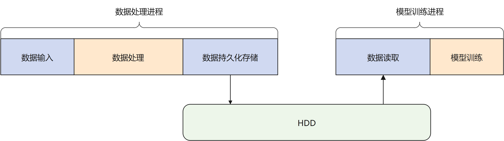
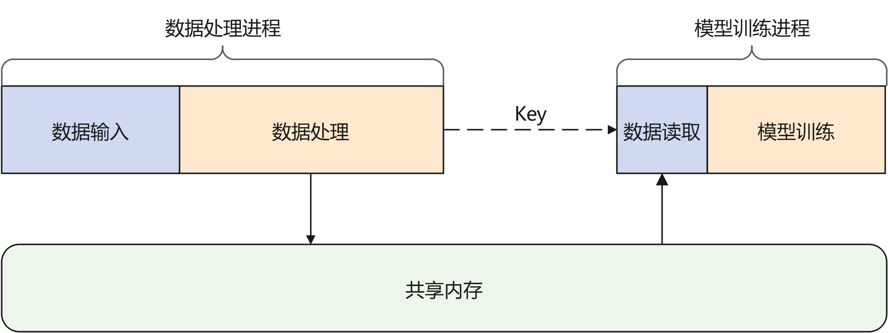
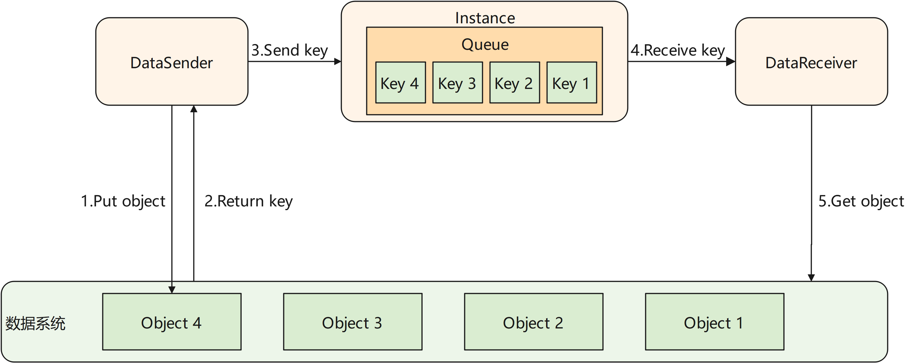
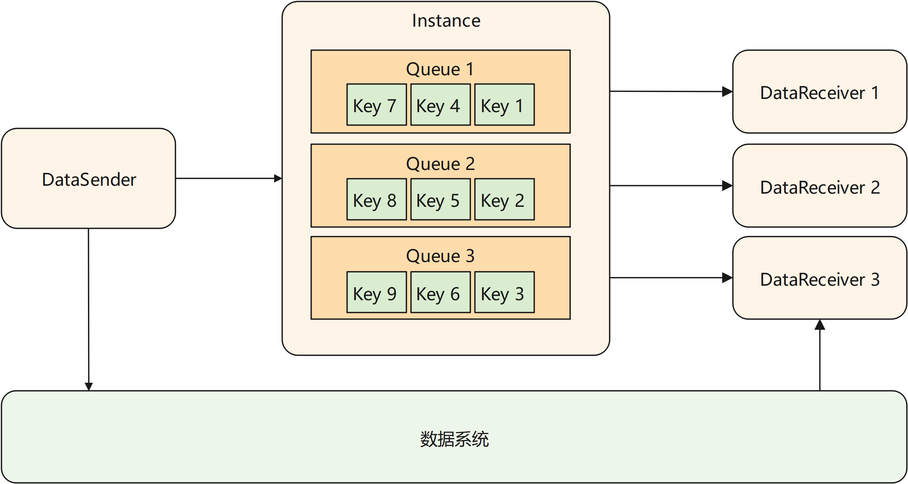

# 高效数据流转

在传统的机器学习场景中，数据处理与模型训练过程相对独立。如下图所示，数据处理过程后需要对数据进行持久化的存储，使用数据时再从磁盘中读取数据。当处理的数据量较大时，读写磁盘将会耗费大量的时间。在对数据使用时效性较高的场景中，会带来较高的时延。

MindPandas的channel模块提供了基于共享内存的数据流转方案。如下图所示，经过处理的数据被保存在基于共享内存的数据系统中，其本质上为一个key-value数据仓库。用户只需要将数据的处理进程和模型训练进程连接至同一数据系统，并且在数据处理后将数据所对应的键值发送给模型训练进程，后者就可以从数据系统中取得对应的数据。

## 实现原理

MindPandas的channel模块将进程间数据传送的过程抽象为一个管道。如下图所示，被传输的数据由分布式执行引擎中的一个Instance进程统一管理。Instance内部维护了一个或多个队列，用来保存尚未被接收端接收的数据的key。channel模块对用户提供DataSender和DataReceiver两个类。当DataSender的 `send` 接口被调用时，被发送的数据对应的key会被追加到对应队列的末尾。当DataReceiver的 `recv` 接口被调用时，它会从队列的头部取得最早被放入的数据的key。随后DataReceiver使用该key从数据系统的共享内存中取得数据。

### 多Receiver场景

MindPandas的channel支持一个DataSender对应多个DataReceiver，每个DataReceiver会取得DataSender发送的数据的一个分片。在此场景下，初始化DataSender时需要用户配置 `num_shards` 参数为DataReceiver的数量。在发送数据时，DataSender会均匀的将数据切分为 `num_shards` 个分片。在初始化DataReceiver时需要配置 `shard_id` 参数，指定当前接收端取得的分片编号。

## 使用说明

API说明请参考[mindpandas.channel](https://www.mindspore.cn/mindpandas/docs/zh-CN/r2.0.0-alpha/mindpandas.channel.html)。

使用样例请参考[在线学习](https://www.mindspore.cn/recommender/docs/zh-CN/r2.0.0-alpha/online_learning.html#%E4%BD%BF%E7%94%A8%E6%A0%B7%E4%BE%8B)。