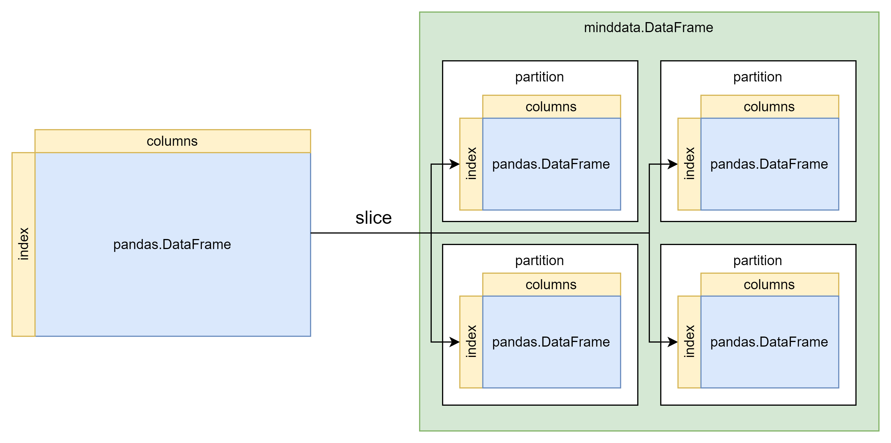
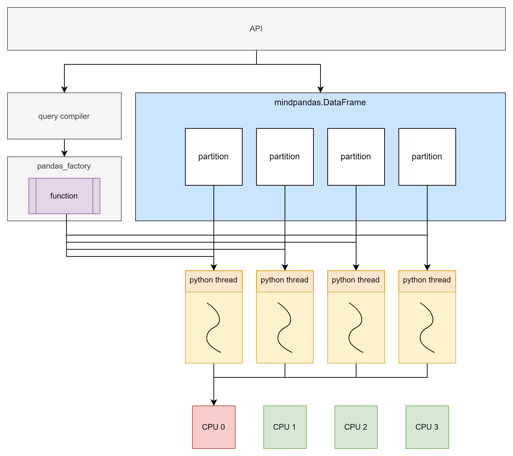
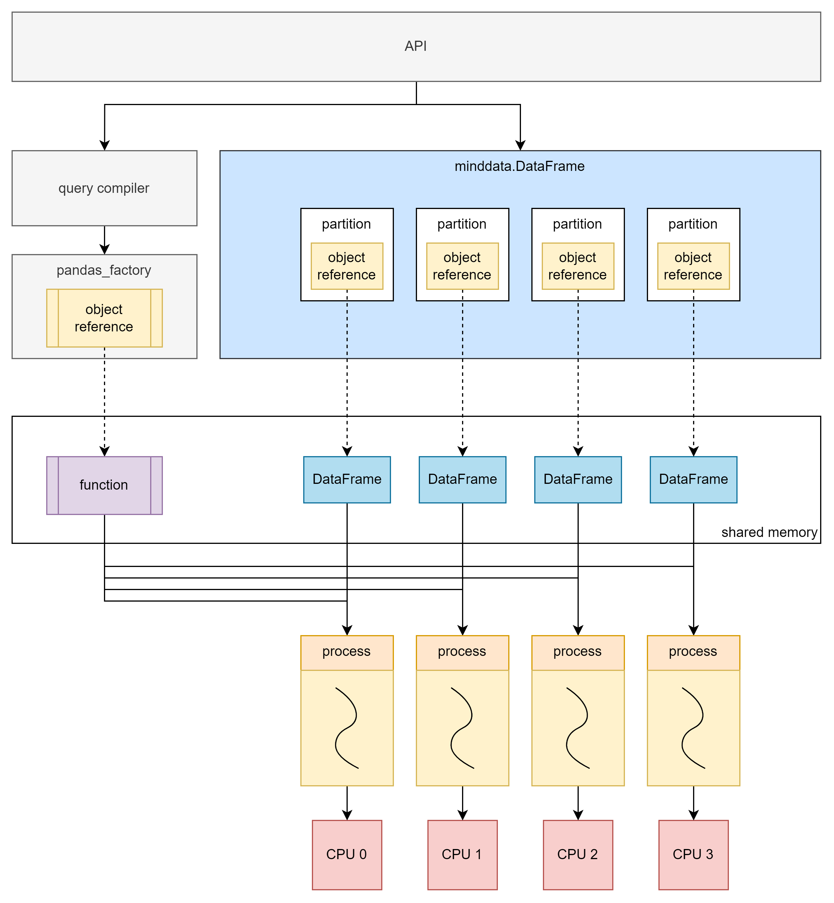
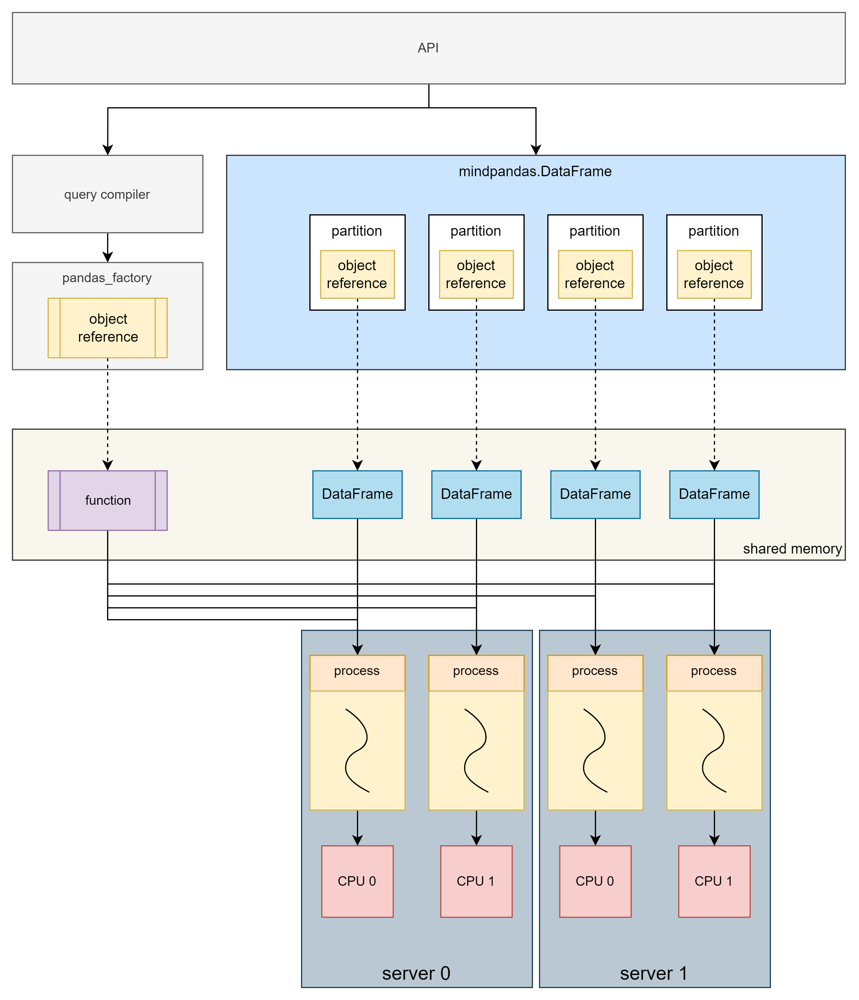

# MindSpore Pandas执行模式介绍及配置说明

[](https://gitee.com/mindspore/docs/blob/master/docs/mindpandas/docs/source_zh_cn/mindpandas_configuration.md)

本文主要介绍MindSpore Pandas分布式并行模式的原理和使用方法。

## MindSpore Pandas实现原理

MindSpore Pandas通过并行化的计算实现了对Pandas数据处理的加速。原理是首先对原始数据进行分片，再将API转化为通用计算范式（map、reduce、injective_map等），之后由后端并行化计算。当前MindSpore Pandas后端有两种执行模式，分别是多线程模式和多进程模式。

### 数据分片原理

将原始数据进行分片是并行计算的基础。下图展示了将`pandas.DataFrame`转换为`mindpandas.DataFrame`的过程，根据预设的`partition_shape`将原始数据分割为指定数量的`partition`，`partition`将作为后续并行计算的基本单位。



### 多线程模式原理

多线程模式基于Python多线程实现。每个数据分片和其对应的计算函数在一个线程中执行。



虽然Python的多线程存在全局解释器锁（GIL）限制，导致多线程无法有效利用多核。但数据量较小或处理IO密集型任务时，多线程后端仍能带来显著的性能提升。

### 多进程模式原理

多进程模式不受Python的全局解释器锁（GIL）限制，可以做到真正的并行计算。多进程模式与多线程模式原理类似，不同的是在对原始数据进行切片后，会将分片存入分布式计算引擎的共享内存中，`mindpandas.DataFrame`中存放的则是分片所对应的`object reference`。

当需要进行计算时，会将计算函数也存入分布式计算引擎的共享内存中，之后将计算函数对应的`object reference`与分片对应的`object reference`作为一个任务提交到分布式计算引擎，所有任务会由分布式计算引擎统一调度，以多进程的形式异步并行执行。

#### 单机多进程原理



多进程模式可以充分利用多核，从而实现数倍到数十倍不等的性能提升。因此多进程模式能够高效地应对数据量较大的场景。但由于进程创建、调度等开销，在处理的数据量较小时性能可能会受到影响。

#### 多机多进程原理



多机多进程模式下，计算在多台服务器组成的集群上执行，可以充分利用多机的资源完成计算任务，突破单机的资源限制。

## MindSpore Pandas执行模式配置

### 数据分片配置

MindSpore Pandas支持用户根据实际使用情况配置分片的shape，用户可以使用`set_partition_shape`自定义分片的行数与列数。

```python
import mindpandas as pd
pd.set_partition_shape((16, 2))

df = pd.read_csv('data.csv')
df_mean = df.mean()
```

### 多线程模式配置

MindSpore Pandas的多线程模式使用方法如下所示：

```python
import mindpandas as pd
pd.set_concurrency_mode('multithread') # MindSpore Pandas will use multithread as backend

df = pd.read_csv('data.csv')
df_mean = df.mean()
```

### 多进程模式配置

安装MindSpore Pandas时，内置的分布式计算引擎也已经同步安装完成，可以在控制台使用指令`yrctl`访问。

> 多进程模式下请确保您启动的集群仅由您个人使用，与他人共同使用一个集群可能导致潜在的安全风险。

```shell
$ yrctl
Usage: yrctl [OPTIONS] COMMAND [ARGS]...

  The distributed executor of MindSpore Pandas.

Options:
  --help  Show this message and exit.

Commands:
  start    used to start the fleeting cluster
  stop     used to stop the fleeting cluster
```

#### 单机多进程模式配置

要使用分布式计算引擎，我们需要通过命令行启动服务部署单机集群。部署集群的命令示例如下：

```shell
yrctl start --master --address <address> --cpu <cpu> --datamem <datamem> --mem <mem> --tmp-dir <tmp-dir> --tmp-file-size-limit <tmp-file-size-limit>
```

`yrctl start`命令常用参数有：

- `--master`：标志位，设置当前节点为master节点，集群中有且仅能有一个master节点，部署单机集群时必须设置此标志。
- `--address`：master节点的IP地址。可选，默认使用127.0.0.1。
- `--cpu`：用户设定使用的CPU核数。可选，默认使用当前节点的所有核。
- `--datamem`：共享内存的大小，单位是MB。可选，默认使用当前空闲内存的30%。
- `--mem`：MindSpore Pandas使用的总内存（包含共享内存），单位是MB。可选，默认使用当前空闲内存的90%。
- `--tmp-dir`：临时文件的存放路径。可选，默认使用'/tmp/mindpandas/'作为临时文件的存放路径。
- `--tmp-file-size-limit`：临时文件的大小限制，单位是MB。可选，默认上限为当前空闲磁盘空间的95%。

如需查看`yrctl start`的参数使用说明，可以通过`yrctl start --help`查看。  
在启动集群前，请检查下列事项：

- 本机没有其他的redis服务占用6379端口，否则会引起端口冲突。如有redis或其他端口冲突问题，请参考[FAQ](https://www.mindspore.cn/mindpandas/docs/zh-CN/master/faq.html)解决。

若集群部署成功，控制台回显的末尾应显示：

```text
Succeeded to start!
```

集群部署完成后，在Python脚本中需要设置使用多进程后端运行。方法是调用`set_concurrency_mode`接口，设置`mode`为`"multiprocess"`。

> 我们建议在`import mindpandas`之后马上调用`set_concurrency_mode`进行并行模式的设置。在脚本运行过程中切换并行模式将可能导致程序出错。

```python
import mindpandas as pd
pd.set_concurrency_mode(mode="multiprocess")
```

要停止分布式计算引擎，请使用`yrctl stop`命令：

```shell
$ yrctl stop --help
Usage: yrctl stop [OPTIONS]

  used to stop the fleeting cluster

Options:
  --help    Show this message and exit.
```

成功停止分布式计算引擎后，回显中末尾应显示：

```text
Succeeded to stop!
```

#### 多机多进程模式使用

MindSpore Pandas的多进程后端支持在多机上搭建集群，并进行分布式计算。集群由一个master节点和多个worker节点组成，集群中的每台机器上都需要单独启动服务。启动方式与单机多进程模式相同，但必须先启动master节点，然后再启动其他worker节点。

启动master节点：

```shell
yrctl start --master --address <address>
```

其中`address`为master节点的IP地址。

启动worker节点：

```shell
yrctl start --address=<address>
```

其中`address`为master节点的IP地址，若启动过程中遇到部署失败的问题，请参考[FAQ](https://www.mindspore.cn/mindpandas/docs/zh-CN/master/faq.html)。

集群部署完毕后，在Python脚本中，如下列代码所示设置使用`"multiprocess"`后端，`address`为集群中master节点的IP地址。

```python
import mindpandas as pd
pd.set_concurrency_mode("multiprocess")
```

停止集群的命令如下，需要在master节点和每个worker节点上分别执行：

```shell
yrctl stop
```

### 自适应并发功能

由于在数据量较小时，单进程计算的性能已经足够优秀。多进程计算的并行收益常常小于使用多进程的额外开销，所以MindSpore Pandas加入了自适应并发功能，此功能开启时，MindSpore Pandas会根据数据大小自适应切换并发模式以提升性能。

#### 开启自适应并发功能

自适应并发功能默认设置为关闭，可以在Python脚本中通过`set_adaptive_concurrency`接口开启该功能：

```python
import mindpandas as pd
pd.set_adaptive_concurrency(True)
```

#### 触发条件

自适应并发功能开启后，自动切换并行模式的条件如下：

- 读取小于18MB的csv文件时会采用多线程模式，其他情况使用多进程模式。
- 使用`pandas.DataFrame`初始化的`mindpandas.DataFrame`，内存占用小于1GB的将使用多线程模式，其他情况使用多进程模式。
- 使用`numpy.ndarray`初始化的`mindpandas.DataFrame`，内存占用小于1GB的将使用多线程模式，其他情况使用多进程模式。

#### 注意事项

- 自适应并发功能被启动后，并行模式和分片的shape均由MindSpore Pandas自主调整，用户无法再使用`set_concurrency_mode`对并发模式进行修改。
- `set_adaptive_concurrency(True)`应在Python脚本开头调用。
- 在设置`set_adaptive_concurrency(True)`后，除非Python脚本已运行完成，不建议用户将自适应并发功能切换回`False`。

#### 使用限制

- 自适应并发功能目前不支持来自`merge`、`concat`或`join`等操作所创建的DataFrame。
- 自适应并发功能开启前初始化或读入的DataFrame/Series的并发模式无法被更改。
- 自适应并发功能目前使用特定的分片形状，即多线程模式采用(2, 2)的分片，多进程模式采用(16, 16)的分片。
- 除`read_csv`之外的其他I/O操作，例如`read_feather`，目前不支持自适应并发功能。
