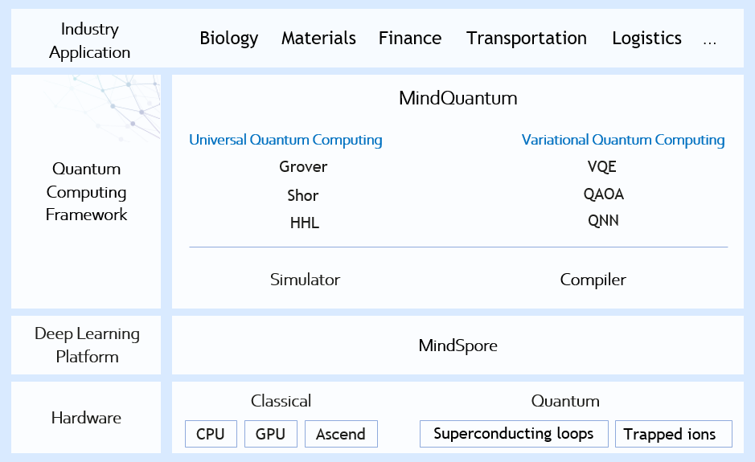

MindQuantum Documents
======================

MindQuantum is a general quantum computing framework developed by MindSpore and HiQ, that can be used to build and train different quantum neural networks. Thanks to the powerful algorithm of quantum software group of Huawei and High-performance automatic differentiation ability of MindSpore, MindQuantum can efficiently handle problems such as quantum machine learning, quantum chemistry simulation, and quantum optimization, which provides an efficient platform for researchers, teachers and students to quickly design and verify quantum machine learning algorithms.

Typical MindQuantum Application Scenarios
------------------------------------------

1. `Quantum Machine Learning <https://www.mindspore.cn/mindquantum/docs/en/master/qnn_for_nlp.html>`_

   Add the quantum neural network to the training process to improve the convergence accuracy.

2. `Quantum Chemical Simulation <https://www.mindspore.cn/mindquantum/docs/en/master/vqe_for_quantum_chemistry.html>`_

   Use VQE to solve the ground state energy of molecular system.

3. `Quantum Combinatorial Optimization <https://www.mindspore.cn/mindquantum/docs/en/master/quantum_approximate_optimization_algorithm.html>`_

   Use QAOA to solve the Max-Cut problem.

.. toctree::
   :glob:
   :maxdepth: 1
   :caption: Installation

   mindquantum_install

.. toctree::
   :glob:
   :maxdepth: 1
   :caption: Guide

   parameterized_quantum_circuit
   qnn_for_nlp
   vqe_for_quantum_chemistry
   quantum_approximate_optimization_algorithm

.. toctree::
   :maxdepth: 1
   :caption: API References

   mindquantum.core
   mindquantum.simulator
   mindquantum.framework
   mindquantum.algorithm
   mindquantum.io
   mindquantum.engine
   mindquantum.utils
