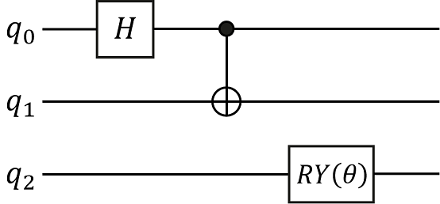
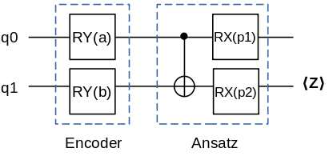

# Parameterized Quantum Circuit

Translator: [Wei_zz](https://gitee.com/wei-zz)

<!-- TOC -->

- [Parameterized Quantum Circuit](#parameterized-quantum-circuit)
    - [Summary](#summary)
    - [Preparing Environment](#preparing-environment)
    - [Quantum Gate](#quantum-gate)
    - [Quantum Circuit](#quantum-circuit)
        - [[HiQsimulator](https://hiq.huaweicloud.com/doc/index.html) Compatible Quantum Circuit Building Format](#hiqsimulatorhttpshiqhuaweicloudcomdocindexhtml-compatible-quantum-circuit-building-format)
        - [A More Convenient Circuit Generation](#a-more-convenient-circuit-generation)
    - [Simulate Quantum Circuit by MindSpore Operator](#simulate-quantum-circuit-by-mindspore-operator)

<!-- /TOC -->

<a href="https://gitee.com/mindspore/docs/blob/master/docs/mindquantum/docs/source_en/parameterized_quantum_circuit.md" target="_blank"></a>

## Summary

Parameterized quantum circuit(PQC), is an approach for Quantum Machine Learning. The MindQuantum (mixing framework of quantum and classic machine learning) can process parameterized quantum circuit and get the derivation of all observation to every parameter respectively by auto differentiating the circuit using quantum neural network.
The process of constructing a quantum circuit and circuit evolution by parameterized simulator operators is as follows:

1. Initialize a quantum circuit.
2. According to requirements, add parameterized quantum gates or non-parameterized quantum gates to the circuit.
3. Process gradient solution or state of evolution by PQC simulator operators.

## Preparing Environment

Import required modules.

```python
import numpy as np
import mindquantum as mq
from mindquantum.gate import H, X, Y, RY, RX
```

## Quantum Gate

A quantum gate is the basic logic unit to operate quantum bit. For a classic circuit, any logic circuit can consist of some basic logic gates, similarly, any quantum circuit can consist of some basic quantum gates like gates or C-NOT gates acting on a single bit. Commonly used quantum gates include $\text{X}$ gates, $\text{Y}$ gates, $\text{Z}$ gates, $\text{Hadamard}$ gates, $\text{CNOT}$ gates and some revolving gates. For example, the form of $\text{Y}$ gate is as follows:

```python
print('Gate name: ', Y)
print('Gate matrix: \n', Y.matrix())
```

```text
Gate name:  Y
Gate matrix:
[[ 0.+0.j -0.-1.j]
[ 0.+1.j  0.+0.j]]
```

The above $\text{Z}$ gate is a non-parametric gate, while some revolving gates (such as $\text{RY}$ gates) are parametric gates. By giving different rotation angles $\theta$, the revolving gate will have different effects on the qubit. For example, the expression of $\text{RY}$ gate matrix is:

$$
RY(\theta)=e^{-i\theta Y/2}=\left(\begin{matrix}\cos(\theta/2) & -\sin(\theta/2) \\\sin(\theta/2) & \cos(\theta/2)\end{matrix}\right)
$$

The $i$ is imaginary quantity basic unit. Quantum gate with parameters like above is an important component in constructing a quantum neural network. Then, we print the matrix formulation of gate $\text{RY}$ when the revolving angle is $0.5$.

```python
ry = RY('a')
ry.matrix({'a': 0.5})
```

```text
array([[ 0.96891242, -0.24740396],
       [ 0.24740396,  0.96891242]])
```

## Quantum Circuit

Quantum circuit is a structure used to effectively organize various quantum logic gates. We can initialize the quantum circuit through the list of quantum gates, or expand the quantum circuit by adding a quantum gate or circuit through addition(`+`), and multiplying by an integer through multiplication(`*`). Here we will construct the following quantum circuit and print the relevant information of the quantum circuit. In the following figure, `q0`, `q1` and `q2` represent three qubits respectively. The quantum circuit consists of three quantum gates, namely the Hadamard gate acting on `q0` bit, the $CNOT$ gate acting on `q1` bit  and controlled by `q0`bit, and the $\text{RY}$ revolving gate acting on `q2`bit.



### [HiQsimulator](https://hiq.huaweicloud.com/doc/index.html) Compatible Quantum Circuit Building Format

1. Constructing a quantum circuit by `CircuitEngine`

    We can use the operator "|" to act the quantum gate on the corresponding qubit.

    ```python
    eng = mq.engine.CircuitEngine()
    qubits = eng.allocate_qureg(3)
    H | qubits[0]
    X | (qubits[0], qubits[1])
    RY('p1') | qubits[2]
    encoder = eng.circuit
    print(encoder)
    encoder.summary()
    ```

    ```text
    H(0)
    X(1 <-: 0)
    RY(p1|2)
    ========Circuit Summary========
    |Total number of gates  : 3.  |
    |Parameter gates        : 1.  |
    |with 1 parameters are  : p1. |
    |Number qubit of circuit: 3   |
    ===============================
    ```

    The `X(1 <-: 0)` represents gate `X` is controlled by bit 0, and acts on bit 1, namely C-NOT gate. `RY(p1|2)` represents the revolving door around the Y axis acting on 2 bits, and `p1` is the rotation angle. From the summary information printed out, we can know that this quantum circuit is constructed by three quantum gates, where a quantum gate is parameterized quantum gate and the whole quantum circuit involves three quantum bits.

2. Constructing a quantum circuit by decorator

    Constructing quantum circuit by decorator can omit some repeat engine declaration.

    ```python
    from mindquantum.engine import circuit_generator

    @circuit_generator(3)
    def encoder(qubits):
        H | qubits[0]
        X | (qubits[0], qubits[1])
        RY('p1') | qubits[2]

    print(encoder)
    encoder.summary()
    ```

    ```text
    H(0)
    X(1 <-: 0)
    RY(p1|2)
    ========Circuit Summary========
    |Total number of gates  : 3.  |
    |Parameter gates        : 1.  |
    |with 1 parameters are  : p1. |
    |Number qubit of circuit: 3   |
    ===============================
    ```

    We can also input more parameters to the decorator for circuit generation. For example, you can input a character string and use this character string to add a prefix to each parameter when building a quantum circuit, which is helpful for generating quantum circuits under the same structure but with different parameter names.

    ```python
    @circuit_generator(3, prefix='encoder')
    def encoder(qubits, prefix):
        H | qubits[0]
        X | (qubits[0], qubits[1])
        RY(prefix + '_1') | qubits[2]

    print(encoder)
    encoder.summary()
    ```

    ```text
    H(0)
    X(1 <-: 0)
    RY(encoder_1|2)
    ===========Circuit Summary===========
    |Total number of gates  : 3.        |
    |Parameter gates        : 1.        |
    |with 1 parameters are  : encoder_1.|
    |Number qubit of circuit: 3         |
    =====================================
    ```

### A More Convenient Circuit Generation

By continuously adding quantum gates acting on different bits to the quantum circuit, the construction of the quantum circuit can be completed quickly.

```python
from mindquantum.circuit import Circuit

encoder = Circuit()
encoder += H.on(0)
encoder += X.on(1,0)
encoder += RY('p1').on(2)
print(encoder)
encoder.summary()
```

```text
H(0)
X(1 <-: 0)
RY(p1|2)
========Circuit Summary========
|Total number of gates  : 3.  |
|Parameter gates        : 1.  |
|with 1 parameters are  : p1. |
|Number qubit of circuit: 3   |
===============================
```

## Simulate Quantum Circuit by MindSpore Operator

A normal quantum neural network usually consists of three part as follow:

- one(or more) encoding circuit for encoding the classical data into quantum data
- one(or more) circuit for training(as we say Ansatz)
- one(or more) physical quantity to be measured

In the following, we will construct a quantum neural network, whose encoder consists of two $\text{RY}$ gates, and Ansatz circuit consist of a $\text{CNOT}$ gate and two $\text{RX}$ gates, where physical quantity to be measured is operator $\text{Z}$ acting on bit 1.



```python
from mindquantum.ops import QubitOperator

@circuit_generator(2)
def encoder(qubits):
    RY('a') | qubits[0]
    RY('b') | qubits[1]

@circuit_generator(2)
def ansatz(qubits):
    X | (qubits[0],qubits[1])
    RX('p1') | qubits[0]
    RX('p2') | qubits[1]

ham = mq.Hamiltonian(QubitOperator('Z1'))
encoder_names = ['a', 'b']
ansatz_names = ['p1', 'p2']
```

We generate an Encoder circuit and an Ansatz circuit through the decorator. We also generate a circuit simulation operator by `generate_pqc_operator`, and get the gradients of the quantum neural network output of each parameter respectively by processing simulation computation of quantum circuit. In `generate_pqc_operator`, we need to provide parameter names of the Encoder circuit and Ansatz circuit, the whole quantum circuit and physical quantity for measurement.

```python
from mindquantum.nn import generate_pqc_operator
from mindspore import Tensor
from mindspore import context
context.set_context(mode=context.GRAPH_MODE, device_target="CPU")

pqc = generate_pqc_operator(encoder_names, ansatz_names, encoder+ansatz, ham)
encoder_data = Tensor(np.array([[0.1,0.2]]).astype(np.float32))
ansatz_data = Tensor(np.array([0.3,0.4]).astype(np.float32))
measure_result, encoder_grad, ansatz_grad = pqc(encoder_data, ansatz_data)
print('Measurement result: ', measure_result.asnumpy())
print('Gradient of encoder parameters: ', encoder_grad.asnumpy())
print('Gradient of ansatz parameters: ', ansatz_grad.asnumpy())
```

```text
Measurement result:  [[0.89819133]]
Gradient of encoder parameters:  [[[-0.09011973 -0.1820724 ]]]
Gradient of ansatz parameters:  [[[-2.7755576e-17 -3.7974921e-01]]]
```

The above three results respectively represent the output value of the quantum neural network, the gradient value of the parameter in the encoding circuit, and the gradient value of the parameter in the Ansatz circuit with training. Sometimes, The quantum neural network is the first layer of the entire quantum classical hybrid neural network, so we don't need to take the derivative of the gradient in the encoding circuit. For this kind of circuit that does not need to calculate the gradient, the `no_grad` method can be used to specify that the quantum circuit that does not need to calculate the gradient is not to be derived.

```python
encoder.no_grad()
pqc = generate_pqc_operator(encoder_names, ansatz_names, encoder+ansatz, ham)
measure_result, encoder_grad, ansatz_grad = pqc(encoder_data, ansatz_data)
print('Measurement result: ', measure_result.asnumpy())
print('Gradient of encoder parameters: ', encoder_grad.asnumpy())
print('Gradient of ansatz parameters: ', ansatz_grad.asnumpy())
```

```text
Measurement result:  [[0.89819133]]
Gradient of encoder parameters:  [[[0. 0.]]]
Gradient of ansatz parameters:  [[[-2.7755576e-17 -3.7974921e-01]]]
```

As we know above, all the derivation of encoder circuit parameters in the quantum neural network are zero and we do not take the derivative in the actual simulation calculation.
