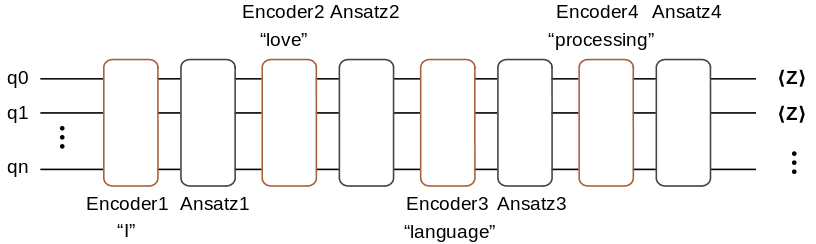
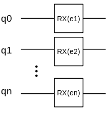
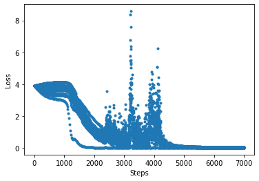

# The Application of Quantum Neural Network in NLP

<!-- TOC -->

- [The Application of Quantum Neural Network in NLP](#the-application-of-quantum-neural-network-in-nlp)
    - [Overview](#overview)
    - [Environment Preparation](#environment-preparation)
    - [Data Pre-processing](#data-pre-processing)
    - [Encoding Ccircuitircuit](#encoding-ccircuitircuit)
    - [Ansatz Circuicircuitt](#ansatz-circuicircuitt)
    - [Measurement](#measurement)
    - [Quantum Word Embedding Layer](#quantum-word-embedding-layer)
    - [Classical Word Embedding Layer](#classical-word-embedding-layer)
    - [Reference](#reference)

<!-- /TOC -->

<a href="https://gitee.com/mindspore/docs/blob/r1.5/docs/mindquantum/docs/source_en/qnn_for_nlp.md" target="_blank"></a>

## Overview

Word embedding plays a key role in natural language processing. It embeds a high-dimension word vector to lower dimension space. When more information is added to the neural network, the training task will become more difficult. By taking advantage of the characteristics of quantum mechanics (e.g., state superposition and entanglement), a quantum neural network can process such classical information during training, thereby improving the accuracy of convergence. In the following, we will build a simple mixed quantum neural network for completing word embedding task.

## Environment Preparation

Import relevant dependencies of the tutorial.

```python
import numpy as np
import time
from mindquantum.ops import QubitOperator
import mindspore.ops as ops
import mindspore.dataset as ds
from mindspore import nn
from mindspore.train.callback import LossMonitor
from mindspore import Model
from mindquantum.nn import MindQuantumLayer
from mindquantum.gate import Hamiltonian, RX, RY, X, H
from mindquantum.circuit import Circuit, UN
```

This tutorial implements a [CBOW model](https://blog.csdn.net/u010665216/article/details/78724856), which predicts a word based on its position. For example, "I love natural language processing", this sentence can be divided by five words, which are \["I", "love", "natural", "language", "processing"\]. When the selected window is 2, the task to be completed would be to predict the word "natural" given \[“I”, “love”, “language”, “processing”\]. In the following, we will build a quantum neural network for word embedding to deal with the this task.



Here, the encoding information of "I", "love", "language", and "processing" will be encoded to the quantum circuit. This quantum circuit to be trained consists of four Ansatz circuits. At last, we measure the qubit in the $\text{Z}$ base vector for the quantum circuit end. The number of measured qubits is determined by the embedded dimenson.

## Data Pre-processing

It is necessary to form a dictionary for the setence to be processed and determine the samples according to the size of the window.

```python
def GenerateWordDictAndSample(corpus, window=2):
    all_words = corpus.split()
    word_set = list(set(all_words))
    word_set.sort()
    word_dict = {w: i for i,w in enumerate(word_set)}
    sampling = []
    for index, word in enumerate(all_words[window:-window]):
        around = []
        for i in range(index, index + 2*window + 1):
            if i != index + window:
                around.append(all_words[i])
        sampling.append([around,all_words[index + window]])
    return word_dict, sampling
```

```python
word_dict, sample = GenerateWordDictAndSample("I love natural language processing")
print(word_dict)
print('word dict size: ', len(word_dict))
print('samples: ', sample)
print('number of samples: ', len(sample))
```

```text
{'I': 0, 'language': 1, 'love': 2, 'natural': 3, 'processing': 4}
    word dict size:  5
    samples:  [[['I', 'love', 'language', 'processing'], 'natural']]
    number of samples:  1
```

According to the above information, the size of the dictionary is 5 and it is enough to select a sample.

## Encoding Ccircuitircuit

For simplification, we use the RX revolving door to construct the encoding circuit. The structure is as follows.



We apply a $\text{RX}$ revolving door to each quantum.

```python
def GenerateEncoderCircuit(n_qubits, prefix=''):
    if len(prefix) != 0 and prefix[-1] != '_':
        prefix += '_'
    circ = Circuit()
    for i in range(n_qubits):
        circ += RX(prefix + str(i)).on(i)
    return circ
```

```python
GenerateEncoderCircuit(3,prefix='e')
```

```text
    RX(e_0|0)
    RX(e_1|1)
    RX(e_2|2)
```

$\left|0\right>$ and $\left|1\right>$ are used to mark the two states of a two-level qubit. According to the state superposition theory, qubit can also be in the superposition of these two states:

$$\left|\psi\right>=\alpha\left|0\right>+\beta\left|1\right>$$

For the quantum state of a $n$ bits, it can be in a $2^n$ Hilbert space. For the dictionary composed by the above 5 words, we only need $\lceil \log_2 5 \rceil=3$ qubits to complete the encoding task, which demonstrates the superiority of quantum computing.

For example. given the word "love" in the above dictionary, its corresponding label is 2, represented by `010` in the binary format. We only need to set `e_0`, `e_1`, and `e_2` to $0$, $\pi$, and $0$ respectively. In the following, we use the `Evolution` operator for verification.

```python
from mindquantum.nn import generate_evolution_operator
from mindspore import context
from mindspore import Tensor

n_qubits = 3 # number of qubits of this quantum circuit
label = 2 # label need to encode
label_bin = bin(label)[-1:1:-1].ljust(n_qubits,'0') # binary form of label
label_array = np.array([int(i)*np.pi for i in label_bin]).astype(np.float32) # parameter value of encoder
encoder = GenerateEncoderCircuit(n_qubits, prefix='e') # encoder circuit
encoder_para_names = encoder.para_name # parameter names of encoder

print("Label is: ", label)
print("Binary label is: ", label_bin)
print("Parameters of encoder is: \n", np.round(label_array, 5))
print("Encoder circuit is: \n", encoder)
print("Encoder parameter names are: \n", encoder_para_names)

context.set_context(mode=context.GRAPH_MODE, device_target="CPU")
# quantum state evolution operator
evol = generate_evolution_operator(param_names=encoder_para_names, circuit=encoder)
state = evol(Tensor(label_array))
amp = np.round(np.abs(state)**2, 3)

print("Amplitude of quantum state is: \n", amp)
print("Label in quantum state is: ", np.argmax(amp))
```

```text
    Label is:  2
    Binary label is:  010
    Parameters of encoder is:
     [0.      3.14159 0.     ]
    Encoder circuit is:
     RX(e_0|0)
    RX(e_1|1)
    RX(e_2|2)
    Encoder parameter names are:
     ['e_0', 'e_1', 'e_2']
    Amplitude of quantum state is:
     [0. 0. 1. 0. 0. 0. 0. 0.]
    Label in quantum state is:  2
```

Through the above verification, for the data with label 2, the position where the largest amplitude of the quantum state is finally obtained is also 2. Therefore, the obtained quantum state is exactly the encoding information of input label. We summarize the process of generating parameter values through data encoding information into the following function.

```python
def GenerateTrainData(sample, word_dict):
    n_qubits = np.int(np.ceil(np.log2(1 + max(word_dict.values()))))
    data_x = []
    data_y = []
    for around, center in sample:
        data_x.append([])
        for word in around:
            label = word_dict[word]
            label_bin = bin(label)[-1:1:-1].ljust(n_qubits,'0')
            label_array = [int(i)*np.pi for i in label_bin]
            data_x[-1].extend(label_array)
        data_y.append(word_dict[center])
    return np.array(data_x).astype(np.float32), np.array(data_y).astype(np.int32)
```

```python
GenerateTrainData(sample, word_dict)
```

```text
    (array([[0.       , 0.       , 0.       , 0.       , 3.1415927, 0.       ,
             3.1415927, 0.       , 0.       , 0.       , 0.       , 3.1415927]],
           dtype=float32),
     array([3], dtype=int32))
```

According to the above result, we merge the encoding information of these 4 input words into a longer vector for further usage of the neural network.

## Ansatz Circuicircuitt

There is a variety of selections for the Ansatz circuits. We select the below quantum circuit as the Ansatz circuit. A single unit of the Ansatz circuit consists of a $\text{RY}$ door and a $\text{CNOT}$ door. The full Ansatz circuit can be obtained by repeating $p$ times over this single unit.


The following function is defined to construct the Ansatz circuit.

```python
def GenerateAnsatzCircuit(n_qubits, layers, prefix=''):
    if len(prefix) != 0 and prefix[-1] != '_':
        prefix += '_'
    circ = Circuit()
    for l in range(layers):
        for i in range(n_qubits):
            circ += RY(prefix + str(l) + '_' + str(i)).on(i)
        for i in range(l % 2, n_qubits, 2):
            if i < n_qubits and i + 1 < n_qubits:
                circ += X.on(i + 1, i)
    return circ
```

```python
GenerateAnsatzCircuit(5, 2, 'a')
```

```text
    RY(a_0_0|0)
    RY(a_0_1|1)
    RY(a_0_2|2)
    RY(a_0_3|3)
    RY(a_0_4|4)
    X(1 <-: 0)
    X(3 <-: 2)
    RY(a_1_0|0)
    RY(a_1_1|1)
    RY(a_1_2|2)
    RY(a_1_3|3)
    RY(a_1_4|4)
    X(2 <-: 1)
    X(4 <-: 3)
```

## Measurement

We treat the measurements of different qubits as the data after dimension reduction. This process is similar to qubit encoding. For example, when we want to reduce the dimension of the word vector to 5, we can process the data in the 3rd dimension as follows:

- 3 in the binary format is 00011.
- Measure the expectation value of the Z0Z1 hams at the quantum circuit end.

The below function gives the hams to generate the data in all dimension, where n_qubits represents the number of qubits, dims represents the dimension of word embedding.

```python
def GenerateEmbeddingHamiltonian(dims, n_qubits):
    hams = []
    for i in range(dims):
        s = ''
        for j, k in enumerate(bin(i + 1)[-1:1:-1]):
            if k == '1':
                s = s + 'Z' + str(j) + ' '
        hams.append(Hamiltonian(QubitOperator(s)))
    return hams
```

```python
GenerateEmbeddingHamiltonian(5, 5)
```

```text
    [1.0 Z0, 1.0 Z1, 1.0 Z0 Z1, 1.0 Z2, 1.0 Z0 Z2]
```

## Quantum Word Embedding Layer

The quantum word embedding layer combines the above-mentioned encoding quantum circuit, the quantum circuit to be trained, and the measurement of hams. `num_embedding` words can be embedded into a word vector with `embedding_dim` dimension. Here, a Hadamard door is added at the beginning of the quantum circuit. The initialization state is set to average superposition state for improving the representation ability of the quantum neural network.

In the following, we define a quantum embedding layer and it returns a quantum circuit simulation operator.

```python
def QEmbedding(num_embedding, embedding_dim, window, layers, n_threads):
    n_qubits = int(np.ceil(np.log2(num_embedding)))
    hams = GenerateEmbeddingHamiltonian(embedding_dim, n_qubits)
    circ = Circuit()
    circ = UN(H, n_qubits)
    encoder_param_name = []
    ansatz_param_name = []
    for w in range(2 * window):
        encoder = GenerateEncoderCircuit(n_qubits, 'Encoder_' + str(w))
        ansatz = GenerateAnsatzCircuit(n_qubits, layers, 'Ansatz_' + str(w))
        encoder.no_grad()
        circ += encoder
        circ += ansatz
        encoder_param_name.extend(encoder.para_name)
        ansatz_param_name.extend(ansatz.para_name)
    net = MindQuantumLayer(encoder_param_name,
                           ansatz_param_name,
                           circ,
                           hams,
                           n_threads=n_threads)
    return net
```

The training model is similar to a classical network, composed by an embedded layer and two fully-connected layers. However, the embedded layer here is constructed by a quantum neural network. The following defines the quantum neural network CBOW.

```python
class CBOW(nn.Cell):
    def __init__(self, num_embedding, embedding_dim, window, layers, n_threads,
                 hidden_dim):
        super(CBOW, self).__init__()
        self.embedding = QEmbedding(num_embedding, embedding_dim, window,
                                    layers, n_threads)
        self.dense1 = nn.Dense(embedding_dim, hidden_dim)
        self.dense2 = nn.Dense(hidden_dim, num_embedding)
        self.relu = ops.ReLU()

    def construct(self, x):
        embed = self.embedding(x)
        out = self.dense1(embed)
        out = self.relu(out)
        out = self.dense2(out)
        return out
```

In the following, we use a longer sentence for training. Firstly, we define `LossMonitorWithCollection` to supervise the convergence process and record the loss.

```python
class LossMonitorWithCollection(LossMonitor):
    def __init__(self, per_print_times=1):
        super(LossMonitorWithCollection, self).__init__(per_print_times)
        self.loss = []

    def begin(self, run_context):
        self.begin_time = time.time()

    def end(self, run_context):
        self.end_time = time.time()
        print('Total time used: {}'.format(self.end_time - self.begin_time))

    def epoch_begin(self, run_context):
        self.epoch_begin_time = time.time()

    def epoch_end(self, run_context):
        cb_params = run_context.original_args()
        self.epoch_end_time = time.time()
        if self._per_print_times != 0 and cb_params.cur_step_num % self._per_print_times == 0:
            print('')

    def step_end(self, run_context):
        cb_params = run_context.original_args()
        loss = cb_params.net_outputs

        if isinstance(loss, (tuple, list)):
            if isinstance(loss[0], Tensor) and isinstance(loss[0].asnumpy(), np.ndarray):
                loss = loss[0]

        if isinstance(loss, Tensor) and isinstance(loss.asnumpy(), np.ndarray):
            loss = np.mean(loss.asnumpy())

        cur_step_in_epoch = (cb_params.cur_step_num - 1) % cb_params.batch_num + 1

        if isinstance(loss, float) and (np.isnan(loss) or np.isinf(loss)):
            raise ValueError("epoch: {} step: {}. Invalid loss, terminating training.".format(
                cb_params.cur_epoch_num, cur_step_in_epoch))
        self.loss.append(loss)
        if self._per_print_times != 0 and cb_params.cur_step_num % self._per_print_times == 0:
            print("\repoch: %+3s step: %+3s time: %5.5s, loss is %5.5s" % (cb_params.cur_epoch_num, cur_step_in_epoch, time.time() - self.epoch_begin_time, loss), flush=True, end='')

```

Next, embed a long setence by using the quantum `CBOW`. Please execute this command `export OMP_NUM_THREADS=4` in the terminal in advance. This command sets the thread of the quantum simulators to 4. When the number of qubits to be simulated is large, more threads can be set to improve the simulation efficiency.

```python
import mindspore as ms
from mindspore import context
from mindspore import Tensor
context.set_context(mode=context.GRAPH_MODE, device_target="CPU")
corpus = """We are about to study the idea of a computational process.
Computational processes are abstract beings that inhabit computers.
As they evolve, processes manipulate other abstract things called data.
The evolution of a process is directed by a pattern of rules
called a program. People create programs to direct processes. In effect,
we conjure the spirits of the computer with our spells."""

ms.set_seed(42)
window_size = 2
embedding_dim = 10
hidden_dim = 128
word_dict, sample = GenerateWordDictAndSample(corpus, window=window_size)
train_x,train_y = GenerateTrainData(sample, word_dict)

train_loader = ds.NumpySlicesDataset({
    "around": train_x,
    "center": train_y
},shuffle=False).batch(3)
net = CBOW(len(word_dict), embedding_dim, window_size, 3, 4, hidden_dim)
net_loss = nn.SoftmaxCrossEntropyWithLogits(sparse=True, reduction='mean')
net_opt = nn.Momentum(net.trainable_params(), 0.01, 0.9)
loss_monitor = LossMonitorWithCollection(500)
model = Model(net, net_loss, net_opt)
model.train(350, train_loader, callbacks=[loss_monitor], dataset_sink_mode=False)
```

```text
    epoch:  25 step:  20 time: 0.592, loss is 3.154
    epoch:  50 step:  20 time: 0.614, loss is 2.944
    epoch:  75 step:  20 time: 0.572, loss is 0.224
    epoch: 100 step:  20 time: 0.562, loss is 0.015
    epoch: 125 step:  20 time: 0.545, loss is 0.009
    epoch: 150 step:  20 time: 0.599, loss is 0.003
    epoch: 175 step:  20 time: 0.586, loss is 0.002
    epoch: 200 step:  20 time: 0.552, loss is 0.045
    epoch: 225 step:  20 time: 0.590, loss is 0.001
    epoch: 250 step:  20 time: 0.643, loss is 0.001
    epoch: 275 step:  20 time: 0.562, loss is 0.001
    epoch: 300 step:  20 time: 0.584, loss is 0.001
    epoch: 325 step:  20 time: 0.566, loss is 0.000
    epoch: 350 step:  20 time: 0.578, loss is 0.000
    Total time used: 206.29734826087952
```

Print the loss value during convergence:

```python
import matplotlib.pyplot as plt

plt.plot(loss_monitor.loss,'.')
plt.xlabel('Steps')
plt.ylabel('Loss')
plt.show()
```

The convergence figure is as follows



The method of printing the parameters of the quantum embedded layer is as follows:

```python
net.embedding.weight.asnumpy()
```

```text
    array([ 1.52044818e-01,  1.71521559e-01,  2.35021308e-01, -3.95286232e-01,
           -3.71680595e-03,  7.96886325e-01, -4.04954888e-02,  1.55393332e-01,
            4.11805660e-02,  7.79824018e-01,  2.96543002e-01, -2.21819162e-01,
           -4.67430688e-02,  4.66759771e-01,  2.75283188e-01,  1.35858059e-01,
           -3.23841363e-01, -2.31937021e-01, -4.68942285e-01, -1.96520030e-01,
            2.16065589e-02,  1.23866223e-01, -9.68078300e-02,  1.69127151e-01,
           -8.90062153e-01,  2.56734312e-01,  8.37369189e-02, -1.15734830e-01,
           -1.34410933e-01, -3.12207133e-01, -8.90189946e-01,  1.97006428e+00,
           -2.49193460e-02,  2.25960299e-01, -3.90179232e-02, -3.03875893e-01,
            2.02030335e-02, -7.07065910e-02, -4.81521547e-01,  5.04257262e-01,
           -1.32081115e+00,  2.83502758e-01,  2.80248702e-01,  1.63375765e-01,
           -6.91465080e-01,  6.82975233e-01, -2.67829001e-01,  2.29658693e-01,
            2.78859794e-01, -1.04206935e-01, -5.57148576e-01,  4.41706657e-01,
           -6.76973104e-01,  2.47751385e-01, -2.96468334e-03, -1.66827604e-01,
           -3.47717047e-01, -9.04396921e-03, -7.69433856e-01,  4.33617719e-02,
           -2.09145937e-02, -1.55236557e-01, -2.16777384e-01, -2.26556376e-01,
           -6.16374731e-01,  2.05871137e-03, -3.08128931e-02, -1.63372140e-02,
            1.46710426e-01,  2.31793106e-01,  4.16066934e-04, -9.28813033e-03],
          dtype=float32)
```

## Classical Word Embedding Layer

Here, we construct a classical CBOW neural network with the classical word embedding layer. This classical CBOW is compared with the quantum one.

Firstly, we construct the classical CBOW neural network and the parameters are similar to the ones in the quantum CBOW.

```python
class CBOWClassical(nn.Cell):
    def __init__(self, num_embedding, embedding_dim, window, hidden_dim):
        super(CBOWClassical, self).__init__()
        self.dim = 2 * window * embedding_dim
        self.embedding = nn.Embedding(num_embedding, embedding_dim, True)
        self.dense1 = nn.Dense(self.dim, hidden_dim)
        self.dense2 = nn.Dense(hidden_dim, num_embedding)
        self.relu = ops.ReLU()
        self.reshape = ops.Reshape()

    def construct(self, x):
        embed = self.embedding(x)
        embed = self.reshape(embed, (-1, self.dim))
        out = self.dense1(embed)
        out = self.relu(out)
        out = self.dense2(out)
        return out
```

Generate the dataset for the classical CBOW neural network.

```python
train_x = []
train_y = []
for i in sample:
    around, center = i
    train_y.append(word_dict[center])
    train_x.append([])
    for j in around:
        train_x[-1].append(word_dict[j])
train_x = np.array(train_x).astype(np.int32)
train_y = np.array(train_y).astype(np.int32)
print("train_x shape: ", train_x.shape)
print("train_y shape: ", train_y.shape)
```

```text
    train_x shape:  (58, 4)
    train_y shape:  (58,)
```

Train the classical CBOW network.

```python
train_loader = ds.NumpySlicesDataset({
    "around": train_x,
    "center": train_y
},shuffle=False).batch(3)
net = CBOWClassical(len(word_dict), embedding_dim, window_size, hidden_dim)
net_loss = nn.SoftmaxCrossEntropyWithLogits(sparse=True, reduction='mean')
net_opt = nn.Momentum(net.trainable_params(), 0.01, 0.9)
loss_monitor = LossMonitorWithCollection(500)
model = Model(net, net_loss, net_opt)
model.train(350, train_loader, callbacks=[loss_monitor], dataset_sink_mode=False)
```

```text
    epoch:  25 step:  20 time: 0.008, loss is 3.155
    epoch:  50 step:  20 time: 0.026, loss is 3.027
    epoch:  75 step:  20 time: 0.010, loss is 3.010
    epoch: 100 step:  20 time: 0.009, loss is 2.955
    epoch: 125 step:  20 time: 0.008, loss is 0.630
    epoch: 150 step:  20 time: 0.008, loss is 0.059
    epoch: 175 step:  20 time: 0.009, loss is 0.008
    epoch: 200 step:  20 time: 0.008, loss is 0.003
    epoch: 225 step:  20 time: 0.017, loss is 0.001
    epoch: 250 step:  20 time: 0.008, loss is 0.001
    epoch: 275 step:  20 time: 0.016, loss is 0.000
    epoch: 300 step:  20 time: 0.008, loss is 0.000
    epoch: 325 step:  20 time: 0.016, loss is 0.000
    epoch: 350 step:  20 time: 0.008, loss is 0.000
    Total time used: 5.06074857711792
```

Print the loss value during convergence:

```python
import matplotlib.pyplot as plt

plt.plot(loss_monitor.loss,'.')
plt.xlabel('Steps')
plt.ylabel('Loss')
plt.show()
```

The convergence figure is as follows


According to the above result, it can be seen that the quantum word embedding model generated by the quantum simulation can complete the word embedding task perfectly. When classical computers cannot handle the large quantity of data, the quantum computers can easily deal with large data.

## Reference

[1] Tomas Mikolov, Kai Chen, Greg Corrado, Jeffrey Dean. [Efficient Estimation of Word Representations in Vector Space](https://arxiv.org/pdf/1301.3781.pdf)
