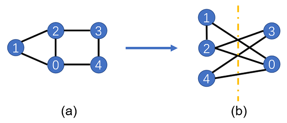
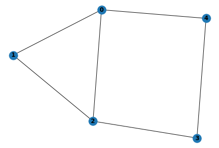
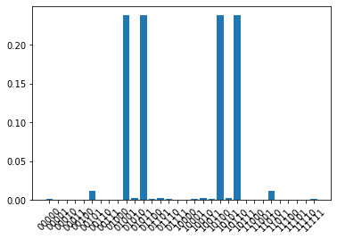

# Quantum Approximate Optimization Algorithm

<a href="https://gitee.com/mindspore/docs/blob/master/docs/mindquantum/docs/source_en/quantum_approximate_optimization_algorithm.md" target="_blank"></a>

## Overview

Quantum approximate optimization algorithm (QAOA) is a quantum algorithm that uses quantum computers to solve combination optimization problems. It was first proposed by Farhi et al. in 2014. In this tutorial, we will use QAOA to solve the Max-Cut problem and get familiar with the construction and training of quantum circuits in MindQuantum.

## Environment Preparation

This tutorial requires the following library:

- networkx

> `NetworkX` is a library for the creation, manipulation, and study of the structure, dynamics, and functions of complex networks. You can run the `pip3 install networkx` command to install it.

## Max-Cut Problem Description

The Max-Cut problem is an NP-complete problem in the graph theory. It needs to divide vertices of a graph into two parts and make the most edges be cut. As shown in the following figure (a), a graph consists of five vertices, and the interconnected edges are ```(0, 1), (0, 2), (1, 2), (2, 3), (3, 4), and (0, 4)```. To maximize the number of edges to be cut, we divide 1, 2, and 4 into one group, and 0 and 3 into another group, as shown in the figure (b). Therefore, five edges are to be cut. When the number of vertices in a graph increases, it is difficult to find an effective typical algorithm to solve the Max-Cut problem. The following describes how to transform the Max-Cut problem into a Hamiltonian ground state capability solution problem.



## Max-Cut Problem Quantization

Assign each vertex a quantum bit. If the vertex is allocated to the left side, its quantum bit is set to the $\left|0\right>$ state. If the vertex is on the right side, its quantum bit is set to the $\left|1\right>$ state. When two vertices are in different sets, the bits on the two vertices are in different quantum states. For the vertex 0 and the vertex 1, when their connection line is cut, quantum states corresponding to bits on the two vertices may be $\left|\psi\right>=\left|0_11_0\right>$ or $\left|\psi\right>=\left|1_10_0\right>$, where the subscript represents the vertex number. Select the Hamiltonian $H=(Z_1Z_0-1)/2$, where $Z$ is the Pauli $Z$ operator. You can find that:

$$\left<\psi\right|H\left|\psi\right>=-1$$

When vertices are in the same set, you can verify that:

$$\left<\psi\right|H\left|\psi\right>=0$$

Therefore, we only need to write the Hamiltonian $H$ corresponding to the graph according to the preceding rule, and obtain the ground state energy and the ground state of $H$ by using a quantum computer. Then, we can obtain the Max-Cut cutting solution and the maximum number of cut edges of the graph. Assuming that the set of all edges is $C$ and the number of all edges is $c$, the Hamiltonian can be written as follows:

$$H=\sum_{(i,j)\in C}(Z_iZ_j-1)/2$$

## Importing Dependencies

```python
from mindquantum.simulator import Simulator
from mindquantum.core import Circuit
from mindquantum.core import Hamiltonian, UN
from mindquantum.core import H, ZZ, RX
from mindquantum.framework import MQAnsatzOnlyLayer
from mindquantum.core import QubitOperator
import networkx as nx
import mindspore.nn as nn
import numpy as np
import matplotlib.pyplot as plt
```

## Building a Graph to Be Solved

Use `add_path` to add edges to a graph. Then, the graph structure is drawn.

```python
g = nx.Graph()
nx.add_path(g, [0,1])
nx.add_path(g, [1,2])
nx.add_path(g, [2,3])
nx.add_path(g, [3,4])
nx.add_path(g, [0,4])
nx.add_path(g, [0,2])
nx.draw(g,with_labels=True, font_weight='bold')
```



As shown in the preceding figure, a graph structure consisting of five vertices and six edges is obtained.

## Setting up a QAOA Circuit

### Circuit Setup

We use the quantum adiabatic approximation algorithm to evolve the quantum state from the eigenstate of $X^{\otimes n}$ to the ground state of Hamiltonian corresponding to the graph.

Build the time-dependent evolution circuit of Hamiltonian corresponding to the graph:

```python
def build_hc(g,para):
    hc = Circuit()
    for i in g.edges:
        hc += ZZ(para).on(i)
    return hc
```

Build the time-dependent quantum circuit for $X^{\otimes n}$:

```python

def build_hb(g, para):
    hc = Circuit()
    for i in g.nodes:
        hc += RX(para).on(i)
    return hc
```

To ensure that the final optimization result is accurate, the quantum circuit needs to be repeated for multiple times. Therefore, a multi-layer training network is built by using the following functions:

```python
def build_ansatz(g, p):
    c = Circuit()
    for i in range(p):
        c += build_hc(g,f'g{i}')
        c += build_hb(g,f'b{i}')
    return c
```

Build Hamiltonian corresponding to the graph:

```python
def build_ham(g):
    hc = QubitOperator()
    for i in g.edges:
        hc += QubitOperator(f'Z{i[0]} Z{i[1]}')
    return hc
```

### Generating a Complete Quantum Circuit and the Hamiltonian Corresponding to the Graph

In this example, `p = 4` is selected, indicating that the four-layer QAOA quantum circuit is used. `ansatz` is a quantum circuit for solving the problem, and `init_state_circ` is a quantum circuit for preparing a quantum state on a uniformly superposed state.

```python
p = 4
ham = Hamiltonian(build_ham(g))
ansatz = build_ansatz(g, p)
init_state_circ = UN(H, g.nodes)
```

### Building a Quantum Neural Network to Be Trained

This problem does not require a coding-layer quantum circuit, so we use `MQAnsatzOnlyLayer` as a quantum neural network to be trained and an `Adam` optimizer.

```python
import mindspore as ms
ms.context.set_context(mode=ms.context.PYNATIVE_MODE, device_target="CPU")

total_circuit = init_state_circ + ansatz
sim = Simulator('projectq', total_circuit.n_qubits)
grad_ops = sim.get_expectation_with_grad(ham, total_circuit)
net = MQAnsatzOnlyLayer(grad_ops)
opti = nn.Adam(net.trainable_params(), learning_rate=0.05)
train_net = nn.TrainOneStepCell(net, opti)
```

## Displaying Training Results

```python
for i in range(600):
    if i%10 == 0:
        print("train step:", i, ", cut:", (len(g.edges)-train_net())/2)
```

```bash
train step: 0 , cut: [[3.0059216]]
train step: 10 , cut: [[3.3262742]]
train step: 20 , cut: [[3.7228582]]
train step: 30 , cut: [[3.983411]]
train step: 40 , cut: [[4.135832]]
train step: 50 , cut: [[4.216693]]
train step: 60 , cut: [[4.2141833]]
train step: 70 , cut: [[4.2036085]]
train step: 80 , cut: [[4.260594]]
train step: 90 , cut: [[4.373112]]
train step: 100 , cut: [[4.4853263]]
train step: 110 , cut: [[4.5553446]]
train step: 120 , cut: [[4.587566]]
train step: 130 , cut: [[4.611128]]
train step: 140 , cut: [[4.637698]]
train step: 150 , cut: [[4.6584387]]
train step: 160 , cut: [[4.66508]]
train step: 170 , cut: [[4.663408]]
train step: 180 , cut: [[4.6678705]]
train step: 190 , cut: [[4.6875486]]
train step: 200 , cut: [[4.7206187]]
train step: 210 , cut: [[4.7580614]]
train step: 220 , cut: [[4.7893686]]
train step: 230 , cut: [[4.8074245]]
train step: 240 , cut: [[4.8116426]]
train step: 250 , cut: [[4.8077316]]
train step: 260 , cut: [[4.803544]]
train step: 270 , cut: [[4.8039436]]
train step: 280 , cut: [[4.8088512]]
train step: 290 , cut: [[4.8154163]]
train step: 300 , cut: [[4.821649]]
train step: 310 , cut: [[4.8281393]]
train step: 320 , cut: [[4.8366113]]
train step: 330 , cut: [[4.847317]]
train step: 340 , cut: [[4.858108]]
train step: 350 , cut: [[4.865946]]
train step: 360 , cut: [[4.8693476]]
train step: 370 , cut: [[4.869488]]
train step: 380 , cut: [[4.868954]]
train step: 390 , cut: [[4.8695197]]
train step: 400 , cut: [[4.8711824]]
train step: 410 , cut: [[4.8730283]]
train step: 420 , cut: [[4.874686]]
train step: 430 , cut: [[4.8768916]]
train step: 440 , cut: [[4.880748]]
train step: 450 , cut: [[4.8865013]]
train step: 460 , cut: [[4.8930907]]
train step: 470 , cut: [[4.898922]]
train step: 480 , cut: [[4.9031305]]
train step: 490 , cut: [[4.906122]]
train step: 500 , cut: [[4.9088955]]
train step: 510 , cut: [[4.9119415]]
train step: 520 , cut: [[4.9149566]]
train step: 530 , cut: [[4.9175825]]
train step: 540 , cut: [[4.920064]]
train step: 550 , cut: [[4.9228735]]
train step: 560 , cut: [[4.925872]]
train step: 570 , cut: [[4.9282985]]
train step: 580 , cut: [[4.929679]]
train step: 590 , cut: [[4.930426]]
```

Based on the above training results, we find that the number of cut edges corresponding to the ground state energy of Hamiltonian is close to 5.

### Displaying Quantum State

We have obtained the optimal values of the parameters in the quantum circuit through training. Next, we use the `final_state` of the `StateEvolution` class to output the quantum state of the quantum circuit in the case of optimal parameters. The `ket` parameter indicates whether to represent the final quantum state as the right vector.

```python
pr = dict(zip(ansatz.params_name, net.weight.asnumpy()))
print(total_circuit.get_qs(pr=pr, ket=True))
```

```bash
(0.017737679183483124-0.03180303797125816j)¦00000⟩
(-0.02683155983686447+0.0012889178469777107j)¦00001⟩
(0.011993971653282642+0.006973826792091131j)¦00010⟩
(-0.014608755707740784-0.003942559473216534j)¦00011⟩
(-0.02683155983686447+0.0012889178469777107j)¦00100⟩
(0.00725862430408597+0.10942266136407852j)¦00101⟩
(-0.014608755707740784-0.003942559473216534j)¦00110⟩
(0.008969870395958424-0.004171415697783232j)¦00111⟩
(0.00950924027711153-0.00026544960564933717j)¦01000⟩
(-0.37196943163871765-0.3156493902206421j)¦01001⟩
(-0.040885526686906815+0.037214867770671844j)¦01010⟩
(-0.37196943163871765-0.3156493902206421j)¦01011⟩
(-0.03160367161035538+0.009305878542363644j)¦01100⟩
(-0.040885526686906815+0.037214867770671844j)¦01101⟩
(-0.03160367161035538+0.009305878542363644j)¦01110⟩
(0.00950924027711153-0.00026544960564933717j)¦01111⟩
(0.00950924027711153-0.00026544960564933717j)¦10000⟩
(-0.03160367161035538+0.009305878542363644j)¦10001⟩
(-0.040885526686906815+0.037214867770671844j)¦10010⟩
(-0.03160367161035538+0.009305878542363644j)¦10011⟩
(-0.37196943163871765-0.3156493902206421j)¦10100⟩
(-0.040885526686906815+0.037214867770671844j)¦10101⟩
(-0.37196943163871765-0.3156493902206421j)¦10110⟩
(0.00950924027711153-0.00026544960564933717j)¦10111⟩
(0.008969870395958424-0.004171415697783232j)¦11000⟩
(-0.014608755707740784-0.003942559473216534j)¦11001⟩
(0.00725862430408597+0.10942266136407852j)¦11010⟩
(-0.02683155983686447+0.0012889178469777107j)¦11011⟩
(-0.014608755707740784-0.003942559473216534j)¦11100⟩
(0.011993971653282642+0.006973826792091131j)¦11101⟩
(-0.02683155983686447+0.0012889178469777107j)¦11110⟩
(0.017737679183483124-0.03180303797125816j)¦11111⟩
```

### Probabilistic Graph

We draw the probability distribution of the final quantum state under the calculated basis vector.

```python
def show_amp(state):
    amp = np.abs(state)**2
    n_qubits = int(np.log2(len(amp)))
    labels = [bin(i)[2:].zfill(n_qubits) for i in range(len(amp))]
    plt.bar(labels, amp)
    plt.xticks(rotation=45)
    plt.show()
state = total_circuit.get_qs(pr=pr)
show_amp(state)
```



According to the probability distribution diagram, the Max-Cut problem has four degenerate solutions, and the probability corresponding to each solution is about 25%.

## Summary

We use the quantum approximation optimization algorithm to solve the Max-Cut problem and obtain the Max-Cut solution corresponding to the graph in the case.

## References

[1] Edward Farhi, Jeffrey Goldstone, and Sam Gutmann. [A Quantum Approximate Optimization Algorithm](https://arxiv.org/pdf/1411.4028.pdf)
