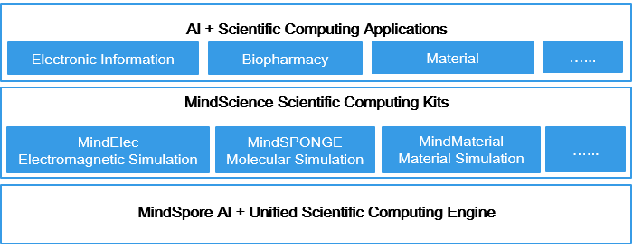

MindScience Documents
=======================

MindScience is scientific computing kits for various industries based on the converged MindSpore framework. It contains the industry-leading datasets, basic network structures, high-precision pre-trained models, and pre- and post-processing tools, accelerating the development of scientific computing applications. Currently, the MindElec kit for the electronic information industry and the MindSPONGE kit for the life science industry have been launched, improving the electromagnetic simulation performance by 10 times and the simulation efficiency of biopharmaceutical compounds by 50%.

Typical MindScience Application Scenarios
------------------------------------------

1. `Electromagnetic simulation <https://www.mindspore.cn/mindscience/docs/en/r0.2/mindelec/point_cloud.html>`_

   The efficient and easy-to-use AI electromagnetic simulation kit provides functions such as multimodality data transformation, high-dimensional data encoding, and innovative electromagnetic AI models. It has improved the performance by 10 times in scenarios such as mobile phone tolerance tests and achieved simulation precision comparable to conventional scientific computing.

2. `Molecular simulation <https://www.mindspore.cn/mindscience/docs/en/r0.2/mindsponge/ala.html>`_

   A high-performance and modular molecular simulation library that integrates AI and conventional molecular simulation, supporting typical molecular simulation cases such as ALA3, COVID-19, and Claisen Rearrangement.

.. toctree::
   :glob:
   :maxdepth: 1
   :caption: MindSPONGE

   mindsponge/intro_and_install
   mindsponge/ala

.. toctree::
   :glob:
   :maxdepth: 1
   :caption: MindElec

   mindelec/intro_and_install
   mindelec/physics_driven
   mindelec/data_driven
   mindelec/visualization

.. toctree::
   :maxdepth: 1
   :caption: API References

   mindsponge
   mindelec
