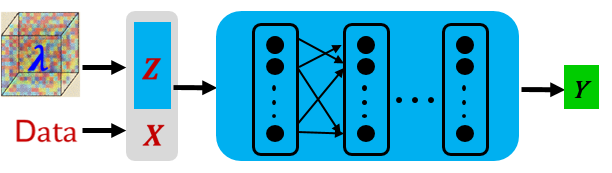
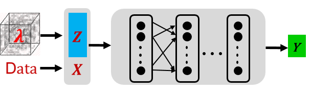
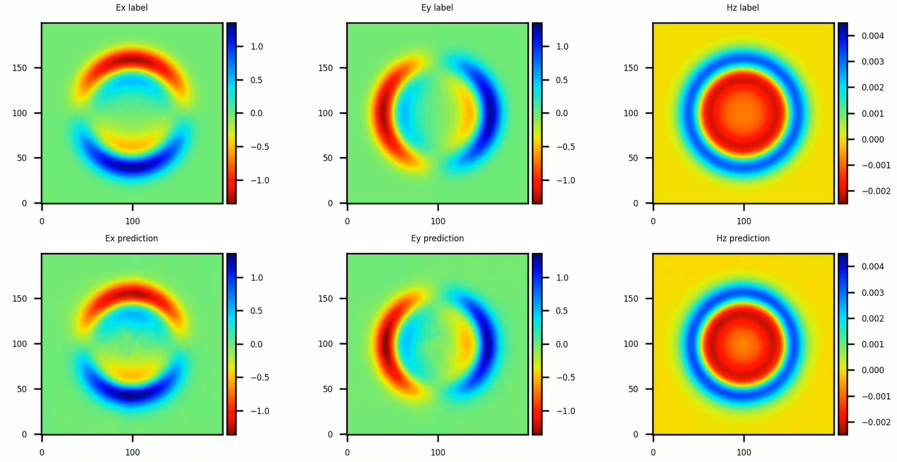

# Incremental Training for Solving a Family of Maxwell's Equation

<a href="https://gitee.com/mindspore/docs/blob/r1.6/docs/mindscience/docs/source_en/mindelec/incremental_learning.md" target="_blank"></a>&nbsp;&nbsp;

## Overview

The Physics-Informed Neural Networks (PINNs) is unable to solve parametric Partial Differential Equations (PDEs). When the parameters of PDEs (dielectric constants) change, the PINNs method needs to retrain a new neural network and it increases the total solving time.

This tutorial focuses on how to use Physics-Informed Auto-Decoder (PIAD) based on the MindElec toolkit to solve the parametric Maxwell’s equations with incremental training, which reduces the training time significantly.

> This current sample is for Ascend 910 AI processor. You can find the complete executable code at
> <https://gitee.com/mindspore/mindscience/tree/r0.2/MindElec/examples/physics_driven/incremental_learning>

## Problem Description

This tutorial deals with the generalization of the medium parameters for the point source Maxwell's equations. For the specific form of the governing equation, the domain and the configuration of the excitation source, please refer to the [tutorial of the point source Maxwell problem](https://www.mindspore.cn/mindscience/docs/en/r0.2/mindelec/time_domain_maxwell.html).

## Physics-Informed Auto-Decoder

In general, the distribution of variable parameter $\lambda$ forms a high-dimensional space. To reduce the model complexity and training costs, we first map the high-dimensional variable parameter space onto a low-dimensional manifold represented by a low-dimensional vector (Z). Then the characteristic parameter (Z) of the manifold and the input (X) of the equation are fused into the training of PINNs as the inputs of the point source problem solving network. The pre-trained model can be obtained. For the newly given variable parameter problem, the solution of the new equation can be obtained by fine-tuning the pre-trained model.

The process for MindElec to solve the problem based on Physics-Informed Auto-Decoder is as follows:

- Pre-train a series of equations based on the combination of latent vector and neural network. Different from solving a single PDE, the input of the neural network is the fusion of the sampling point (X) and the implicit vector (Z) in the pre-training step, as shown in the following figure.

    

- For the new equations, incrementally train latent vector and neural network to solve the new problems quickly. We provide two incremental training modes:
    - $\textit{finetune_latent_with_model}$: this mode updates the latent vector and network structure simultaneously and only needs to load the pre-trained model for incremental training.
    - $\textit{finetune_latent_only}$: as shown in the following figure, this mode freezes the network structure and updates the latent vector only.

    

### Importing dependency

Import the modules on which this tutorial depends.

```python
from mindelec.data import Dataset
from mindelec.geometry import Disk, Rectangle, TimeDomain, GeometryWithTime
from mindelec.loss import Constraints
from mindelec.solver import Solver, LossAndTimeMonitor
from mindelec.common import L2
from mindelec.architecture import MultiScaleFCCell, MTLWeightedLossCell

from src import get_test_data, create_random_dataset
from src import MultiStepLR
from src import Maxwell2DMur
from src import PredictCallback
from src import visual_result
```

### Creating a Dataset

Consistent with the point source Maxwell's problem, five uniform samplings need to be implemented inside the rectangular computational domain: samplings on the rectangular domain constrained by the control equation and on internal points near the source region; samplings on the rectangular domain constrained by the initial condition and on internal points near the source region; boundary sampling on rectangular domain controlled by boundary conditions. The integration of spatial and temporal sampling data constitutes a training sample.

```python
# src region
disk = Disk("src", disk_origin, disk_radius)
# no src region
rectangle = Rectangle("rect", coord_min, coord_max)
diff = rectangle - disk

# time info
time_interval = TimeDomain("time", 0.0, config["range_t"])

# geometry merge with time
no_src_region = GeometryWithTime(diff, time_interval)
no_src_region.set_name("no_src")
no_src_region.set_sampling_config(create_config_from_edict(no_src_sampling_config))
src_region = GeometryWithTime(disk, time_interval)
src_region.set_name("src")
src_region.set_sampling_config(create_config_from_edict(src_sampling_config))
boundary = GeometryWithTime(rectangle, time_interval)
boundary.set_name("bc")
boundary.set_sampling_config(create_config_from_edict(bc_sampling_config))

# final sampling fields
geom_dict = {src_region : ["domain", "IC"],
                 no_src_region : ["domain", "IC"],
                 boundary : ["BC"]}
```

The MindElec Dataset API combines different sampled data into a unified training dataset.

```python
# create dataset for train
elec_train_dataset = create_random_dataset(config)
train_dataset = elec_train_dataset.create_dataset(batch_size=config["batch_size"],
                                                  shuffle=True,
                                                  prebatched_data=True,
                                                  drop_remainder=True)
```

### Defining the Control Equation and Initial & Boundary Condition

Inherit the Problem class provided by MindElec, the core code of the PDE problem is defined as follows. Different from solving one specific PDE problem, we transfer parameters `eps_candidates` and `mu_candidates` to represent the relative dielectric constant and relative magnetic permeability of the medium. In this tutorial, the pre-trained model selects the following parameter settings: $(\epsilon_r, \mu_r)\in [1,3,5]*[1,3,5]$.

```python
class Maxwell2DMur(Problem):
    def __init__(self, network, config, domain_column=None, bc_column=None, ic_column=None):
        super(Maxwell2DMur, self).__init__()
        self.domain_column = domain_column
        self.bc_column = bc_column
        self.ic_column = ic_column
        self.network = network

        # operations
        self.gradient = Grad(self.network)
        self.reshape = ops.Reshape()
        self.cast = ops.Cast()
        self.mul = ops.Mul()
        self.cast = ops.Cast()
        self.split = ops.Split(1, 3)
        self.concat = ops.Concat(1)
        self.sqrt = ops.Sqrt()

        # gauss-type pulse source
        self.pi = Tensor(PI, ms_type.float32)
        self.src_frq = config.get("src_frq", 1e+9)
        self.tau = Tensor((2.3 ** 0.5) / (PI * self.src_frq), ms_type.float32)
        self.amp = Tensor(1.0, ms_type.float32)
        self.t0 = Tensor(3.65 * self.tau, ms_type.float32)

        # src space
        self.src_x0 = Tensor(config["src_pos"][0], ms_type.float32)
        self.src_y0 = Tensor(config["src_pos"][1], ms_type.float32)
        self.src_sigma = Tensor(config["src_radius"] / 4.0, ms_type.float32)
        self.src_coord_min = config["coord_min"]
        self.src_coord_max = config["coord_max"]

        input_scales = config.get("input_scales", [1.0, 1.0, 2.5e+8])
        output_scales = config.get("output_scales", [37.67303, 37.67303, 0.1])
        self.s_x = Tensor(input_scales[0], ms_type.float32)
        self.s_y = Tensor(input_scales[1], ms_type.float32)
        self.s_t = Tensor(input_scales[2], ms_type.float32)
        self.s_ex = Tensor(output_scales[0], ms_type.float32)
        self.s_ey = Tensor(output_scales[1], ms_type.float32)
        self.s_hz = Tensor(output_scales[2], ms_type.float32)

        # set up eps, mu candidates
        eps_candidates = np.array(config["eps_list"], dtype=np.float32) * EPS
        mu_candidates = np.array(config["mu_list"], dtype=np.float32) * MU
        self.epsilon_x = Tensor(eps_candidates, ms_type.float32).view((-1, 1))
        self.epsilon_y = Tensor(eps_candidates, ms_type.float32).view((-1, 1))
        self.mu_z = Tensor(mu_candidates, ms_type.float32).view((-1, 1))
        self.light_speed = 1.0 / ops.Sqrt()(ops.Mul()(self.epsilon_x, self.mu_z))

    # gaussian pulse with gaussian smooth technology
    def smooth_src(self, x, y, t):
        source = self.amp * ops.exp(- ((t - self.t0) / self.tau)**2)
        gauss = 1 / (2 * self.pi * self.src_sigma**2) * \
                ops.exp(- ((x - self.src_x0)**2 + (y - self.src_y0)**2) / (2 * (self.src_sigma**2)))
        return self.mul(source, gauss)

    @ms_function
    def governing_equation(self, *output, **kwargs):
        """maxwell equation of TE mode wave"""
        # net output and sampling input
        out = output[0]
        data = kwargs[self.domain_column]
        x = self.reshape(data[:, 0], (-1, 1))
        y = self.reshape(data[:, 1], (-1, 1))
        t = self.reshape(data[:, 2], (-1, 1))

        # get gradients
        dex_dxyt = self.gradient(data, None, 0, out)
        _, dex_dy, dex_dt = self.split(dex_dxyt)
        dey_dxyt = self.gradient(data, None, 1, out)
        dey_dx, _, dey_dt = self.split(dey_dxyt)
        dhz_dxyt = self.gradient(data, None, 2, out)
        dhz_dx, dhz_dy, dhz_dt = self.split(dhz_dxyt)

        # get equation residual
        loss_a1 = (self.s_hz * dhz_dy) / (self.s_ex * self.s_t * self.epsilon_x)
        loss_a2 = dex_dt / self.s_t

        loss_b1 = -(self.s_hz * dhz_dx) / (self.s_ey * self.s_t * self.epsilon_y)
        loss_b2 = dey_dt / self.s_t

        loss_c1 = (self.s_ey * dey_dx - self.s_ex * dex_dy) / (self.s_hz * self.s_t * self.mu_z)
        loss_c2 = - dhz_dt / self.s_t

        source = self.smooth_src(x, y, t) / (self.s_hz * self.s_t * self.mu_z)

        pde_res1 = loss_a1 - loss_a2
        pde_res2 = loss_b1 - loss_b2
        pde_res3 = loss_c1 - loss_c2 - source
        pde_r = ops.Concat(1)((pde_res1, pde_res2, pde_res3))
        return pde_r

    @ms_function
    def boundary_condition(self, *output, **kwargs):
        """2nd-order mur boundary condition"""
        # get net output and inputs
        u = output[0]
        data = kwargs[self.bc_column]

        # specify each boundary
        coord_min = self.src_coord_min
        coord_max = self.src_coord_max
        batch_size, _ = data.shape
        bc_attr = ms_np.zeros(shape=(batch_size, 4))
        bc_attr[:, 0] = ms_np.where(ms_np.isclose(data[:, 0], coord_min[0]), 1.0, 0.0)
        bc_attr[:, 1] = ms_np.where(ms_np.isclose(data[:, 0], coord_max[0]), 1.0, 0.0)
        bc_attr[:, 2] = ms_np.where(ms_np.isclose(data[:, 1], coord_min[1]), 1.0, 0.0)
        bc_attr[:, 3] = ms_np.where(ms_np.isclose(data[:, 1], coord_max[1]), 1.0, 0.0)

        dex_dxyt = self.gradient(data, None, 0, u)
        _, dex_dy, _ = self.split(dex_dxyt)
        dey_dxyt = self.gradient(data, None, 1, u)
        dey_dx, _, _ = self.split(dey_dxyt)
        dhz_dxyt = self.gradient(data, None, 2, u)
        dhz_dx, dhz_dy, dhz_dt = self.split(dhz_dxyt)

        bc_r1 = dhz_dx / self.s_x - dhz_dt / (self.light_speed * self.s_x) + \
                self.s_ex * self.light_speed * self.epsilon_x / (2 * self.s_hz * self.s_x) * dex_dy  # left boundary
        bc_r2 = dhz_dx / self.s_x + dhz_dt / (self.light_speed * self.s_x) - \
                self.s_ex * self.light_speed * self.epsilon_x / (2 * self.s_hz * self.s_x) * dex_dy  # right boundary
        bc_r3 = dhz_dy / self.s_y - dhz_dt / (self.light_speed * self.s_y) - \
                self.s_ey * self.light_speed * self.epsilon_y / (2 * self.s_hz * self.s_y) * dey_dx  # bottom boundary
        bc_r4 = dhz_dy / self.s_y + dhz_dt / (self.light_speed * self.s_y) + \
                self.s_ey * self.light_speed * self.epsilon_y / (2 * self.s_hz * self.s_y) * dey_dx  # top boundary

        bc_r_all = self.concat((bc_r1, bc_r2, bc_r3, bc_r4))
        bc_r = self.mul(bc_r_all, bc_attr)
        return bc_r

    @ms_function
    def initial_condition(self, *output, **kwargs):
        """initial condition: u = 0"""
        net_out = output[0]
        return net_out
```

The problem constraints are defined as follows:

```python
# define constraints
train_prob = {}
for dataset in elec_train_dataset.all_datasets:
    train_prob[dataset.name] = Maxwell2DMur(network=network, config=config,
                                            domain_column=dataset.name + "_points",
                                            ic_column=dataset.name + "_points",
                                            bc_column=dataset.name + "_points")
train_constraints = Constraints(elec_train_dataset, train_prob)
```

### Building a Neural Network

In the Physics-Informed Auto-Decoder, the input of the neural network is the fusion of sampling points (X) and latent vector (Z) in the pre-training step, and the main structure of the neural network is multi-channel residual network combined with the Sin activation function.

```python
# initialize latent vector
num_scenarios = config["num_scenarios"]
latent_size = config["latent_vector_size"]
latent_init = np.random.randn(num_scenarios, latent_size) / np.sqrt(latent_size)
latent_vector = Parameter(Tensor(latent_init, ms_type.float32), requires_grad=True)

network = MultiScaleFCCell(config["input_size"],
                           config["output_size"],
                           layers=config["layers"],
                           neurons=config["neurons"],
                           residual=config["residual"],
                           weight_init=HeUniform(negative_slope=math.sqrt(5)),
                           act="sin",
                           num_scales=config["num_scales"],
                           amp_factor=config["amp_factor"],
                           scale_factor=config["scale_factor"],
                           input_scale=config["input_scale"],
                           input_center=config["input_center"],
                           latent_vector=latent_vector
                           )
```

### Adaptive Weighted Loss Function for Accelerating Convergence

In this case, because the encrypted sampling near the source region is performed as an independent subdataset for network training, the composition of the loss function includes the following five items: a control equation and an initial condition of the source region, a control equation and an initial condition of the source-free region, and a boundary condition. Experiments show that the five items in the loss function differ greatly in magnitude, so the simple summation of the loss functions will lead to the failure of network training, and the manual adjustment of the weight information of each loss function is very cumbersome. MindElec develops a weighting algorithm based on uncertainty estimation of multi-task learning. By introducing trainable parameters and adaptively adjusting the weight of each loss function, MindElec can significantly improve the training speed and accuracy. The algorithm is implemented as follows:

```python
class MTLWeightedLossCell(nn.Cell):
    def __init__(self, num_losses):
        super(MTLWeightedLossCell, self).__init__(auto_prefix=False)
        self.num_losses = num_losses
        self.params = Parameter(Tensor(np.ones(num_losses), mstype.float32), requires_grad=True)
        self.concat = ops.Concat(axis=0)
        self.pow = ops.Pow()
        self.log = ops.Log()
        self.div = ops.RealDiv()

    def construct(self, losses):
        loss_sum = 0
        params = self.pow(self.params, 2)
        for i in range(self.num_losses):
            weighted_loss = 0.5 * self.div(losses[i], params[i]) + self.log(params[i] + 1.0)
            loss_sum = loss_sum + weighted_loss
        return loss_sum

# self-adaptive weighting
mtl = MTLWeightedLossCell(num_losses=elec_train_dataset.num_dataset)
```

### Model Evaluation

MindElec can use the user-defined callback function to implement training and inference at the same time. You can directly load the test dataset and set corresponding callback functions to implement inference and analyze the result.

```python
callbacks = [LossAndTimeMonitor(epoch_steps)]
if config.get("train_with_eval", False):
    input_data, label_data = get_test_data(config["test_data_path"])
    eval_callback = PredictCallback(network, input_data, label_data, config=config, visual_fn=visual_result)
    callbacks += [eval_callback]
```

### Model Pre-training

The Solver class provided by MindElec is an API for model training and inference. You can enter the optimizer, network model, PDE constraints (train_constraints), and optional parameters such as the adaptive weighting algorithm module to define the solver object. In this tutorial, the MindSpore + Ascend mixed precision mode is used to train the network to solve the Maxwell's equations.

```python
# mixed precision
model = model.to_float(mstype.float16)
model.input_scale.to_float(mstype.float32)

# optimizer
params = model.trainable_params() + mtl.trainable_params()
lr_scheduler = MultiStepLR(config["lr"], config["milestones"], config["lr_gamma"],
                           epoch_steps, config["train_epoch"])
optimizer = nn.Adam(params, learning_rate=Tensor(lr_scheduler.get_lr()))

# problem solver
solver = Solver(network,
                optimizer=optimizer,
                mode="PINNs",
                train_constraints=train_constraints,
                test_constraints=None,
                metrics={'l2': L2(), 'distance': nn.MAE()},
                loss_fn='smooth_l1_loss',
                loss_scale_manager=DynamicLossScaleManager(),
                mtl_weighted_cell=mtl_cell,
                latent_vector=latent_vector,
                latent_reg=config["latent_reg"]
                )
solver.train(config["train_epoch"], train_dataset, callbacks=callbacks, dataset_sink_mode=True)
```

### Model Fine-tuning

Given the new PDE parameter, for example, $(\epsilon_r, \mu_r)=(2,2)$, we need to load the pre-trained network weights and initialize a new latent vector (Z).

```python
# load pretrained ckpt
param_dict = load_checkpoint(config["load_ckpt_path"])
loaded_ckpt_dict = {}
latent_vector_ckpt = 0
for name in param_dict:
    if name == "model.latent_vector":
        latent_vector_ckpt = param_dict[name].data.asnumpy()
    elif "network" in name and "moment" not in name:
        loaded_ckpt_dict[name] = param_dict[name]

# initialize the new latent vector
num_scenarios = config["num_scenarios"]
latent_size = config["latent_vector_size"]
latent_norm = np.mean(np.linalg.norm(latent_vector_ckpt, axis=1))
latent_init = np.zeros((num_scenarios, latent_size))
latent_vector = Parameter(Tensor(latent_init, ms_type.float32), requires_grad=True)

# optimizer
if config.get("finetune_model"):
    model_params = model.trainable_params()
else:
    model_params = [param for param in model.trainable_params()
                    if ("bias" not in param.name and "weight" not in param.name)]

params = model_params + mtl.trainable_params()
lr_scheduler = MultiStepLR(config["lr"], config["milestones"], config["lr_gamma"],
                            steps_per_epoch, config["train_epoch"])
lr = lr_scheduler.get_lr()
optim = nn.Adam(params, learning_rate=Tensor(lr))
```

In this tutorial, we select the $\textit{finetune_latent_with_model}$ mode, namely, updating the latent vector and network weights simultaneously. The instantaneous electromagnetic fields compared with the reference labels are depicted in the following figure. Compared with solving a single PDE with the PINNs method, the PIAD method achieves a 10x speed-up at the same accuracy (6% relative error).


