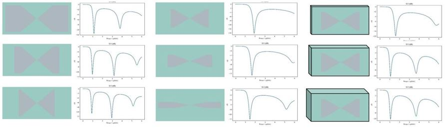

# AI Electromagnetic Simulation based on Parameterization Method

<a href="https://gitee.com/mindspore/docs/blob/master/docs/mindscience/docs/source_en/mindelec/parameterization.md" target="_blank"></a>&nbsp;&nbsp;

## Overview

Electromagnetic simulation is widely used in the product design process of antennas, chips, and mobile phones to obtain the transmission characteristics (such as scattering parameters and electromagnetic fields) of the target to be simulated. The scattering parameters (S-parameters) are network parameters based on the input wave and the reflected wave. It is used to analyze a microwave circuit and describe a circuit network based on the strength of a reflected signal of a component port and the strength of a signal transmitted from a port to another port.

At present, products such as antennas and mobile phones are usually simulated using commercial simulation software (such as CST and HFS) to obtain results such as the S-parameters. Currently, commercial software simulation mainly uses numerical algorithms (such as FDTD) to compute S-parameters. The simulation process mainly includes two steps: semi-automatic/automatic mesh division and numerical solution of the Maxwell equations. The two steps are time-consuming and computing-consuming.

MindElec use AI model to directly obtain the S-parameters of the target to be simulated without the iterative calculation of traditional numerical methods, and this can greatly save simulation time. MindElec provides two data-driven electromagnetic simulation solutions: parameterization solution and point cloud solution. The two solutions have the following characteristics:

- The parameterization solution directly maps parameters to simulation results. For example, the antenna width and angle are used as the network input, and the network output are the S-parameters. The direct mapping and simple network are the advantage of the parameterization solution.
- The point cloud solution implements the mapping from the sampling point cloud of the antenna/phone to the simulation result. In this solution, the structure file of the mobile phone is converted into the point cloud tensor data, and the convolutional neural network is used to extract the structure features. Then, the final simulation result (S-parameters) are obtained through the mapping of multiple full-connected layers. The advantage of this solution is that it is applicable to complex working conditions where the number or types of structural parameters may change.

> This current sample is for Ascend 910 AI processor. You can find the complete executable code at
> <https://gitee.com/mindspore/mindscience/tree/master/MindElec/examples/data_driven/parameterization>

## Target Scenario

In this tutorial, we use the parametric simulation method in the bowtie antenna scenario.

### Bowtie Antenna

The following figure shows the structure of a bowtie antenna.


The PEC metal plate is placed on a PCB cuboid with a certain thickness, presenting a left-right symmetrical butterfly shape. There is a gap between the two metal plates that are not completely in contact, and the excitation source (port) is located in the gap. Electromagnetic simulation is to add an excitation source to compute the electromagnetic field in the area and obtain the S-parameters (S11 is used in this tutorial because there is only one port).

During antenna design, the structure of the simulation object needs to be adjusted and optimized based on the simulation result. This tutorial also considers the generalization of the bowtie antenna structure. In this tutorial, the structural parameters changed by the bowtie antenna are the length (x) and height of the PEC plate, and thickness (z) of the PCB plate. The length ranges from 0 mm to 40 mm, the height ranges from 4 mm to 24 mm, and the thickness ranges from 2 mm to 18 mm.

In this tutorial, we will build the mapping of these structural parameters to S11 with MindElec, so that S11 can be quickly calculated based on the parameters of new structures.

### Dataset

There are 495 pairs of parameter-S11 samples. The training set and testing set are randomly divided based on 9:1. The following shows some antenna and S11 sample pairs.



The data have been provided as .npy files, which can be downloaded from the following address:

<https://gitee.com/mindspore/mindscience/tree/master/MindElec/examples/data_driven/parameterization/dataset>

## Parameterized Electromagnetic Simulation

The parameterized electromagnetic simulation consists of the following five steps:

1. Dataset Loading.
2. Model Building.
3. Model Training.
4. Model Testing.
5. Result Visualization.

### Dataset Loading

Use the MindElec dataset module to load the dataset of bowtie antennas. Currently, the parameterization solution supports local dataset training. You can use the `ExistedDataConfig` API to configure the dataset options. You need to specify the paths and types of the input and the S11 label dataset file.
Use the `Dataset` API to generate a dataset instance, and use the `create_dataset` function to build a data generator `dataloader` for model training and testing.

``` python
def create_dataset(opt):
    """
    load data
    """
    data_input_path = opt.input_path
    data_label_path = opt.label_path

    data_input = np.load(data_input_path)
    data_label = np.load(data_label_path)

    frequency = data_label[0, :, 0]
    data_label = data_label[:, :, 1]

    print(data_input.shape)
    print(data_label.shape)
    print("data load finish")

    data_input = custom_normalize(data_input)

    config_data_prepare = {}

    config_data_prepare["scale_input"] = 0.5 * np.max(np.abs(data_input), axis=0)
    config_data_prepare["scale_S11"] = 0.5 * np.max(np.abs(data_label))

    data_input[:, :] = data_input[:, :] / config_data_prepare["scale_input"]
    data_label[:, :] = data_label[:, :] / config_data_prepare["scale_S11"]

    permutation = np.random.permutation(data_input.shape[0])
    data_input = data_input[permutation]
    data_label = data_label[permutation]

    length = data_input.shape[0] // 10
    train_input, train_label = data_input[length:], data_label[length:]
    eval_input, eval_label = data_input[:length], data_label[:length]

    print(np.shape(train_input))
    print(np.shape(train_label))
    print(np.shape(eval_input))
    print(np.shape(eval_label))

    if not os.path.exists('./data_prepare'):
        os.mkdir('./data_prepare')
    else:
        shutil.rmtree('./data_prepare')
        os.mkdir('./data_prepare')

    train_input = train_input.astype(np.float32)
    np.save('./data_prepare/train_input', train_input)
    train_label = train_label.astype(np.float32)
    np.save('./data_prepare/train_label', train_label)
    eval_input = eval_input.astype(np.float32)
    np.save('./data_prepare/eval_input', eval_input)
    eval_label = eval_label.astype(np.float32)
    np.save('./data_prepare/eval_label', eval_label)

    electromagnetic_train = ExistedDataConfig(name="electromagnetic_train",
                                              data_dir=['./data_prepare/train_input.npy',
                                                        './data_prepare/train_label.npy'],
                                              columns_list=["inputs", "label"],
                                              data_format="npy")
    electromagnetic_eval = ExistedDataConfig(name="electromagnetic_eval",
                                             data_dir=['./data_prepare/eval_input.npy',
                                                       './data_prepare/eval_label.npy'],
                                             columns_list=["inputs", "label"],
                                             data_format="npy")
    train_batch_size = opt.batch_size
    eval_batch_size = len(eval_input)

    train_dataset = Dataset(existed_data_list=[electromagnetic_train])
    train_loader = train_dataset.create_dataset(batch_size=train_batch_size, shuffle=True)

    eval_dataset = Dataset(existed_data_list=[electromagnetic_eval])
    eval_loader = eval_dataset.create_dataset(batch_size=eval_batch_size, shuffle=False)

    data = {
        "train_loader": train_loader,
        "eval_loader": eval_loader,

        "train_data": train_input,
        "train_label": train_label,
        "eval_data": eval_input,
        "eval_label": eval_label,

        "train_data_length": len(train_label),
        "eval_data_length": len(eval_label),
        "frequency": frequency,
    }

    return data, config_data_prepare
```

### Model Building

The S11Predictor model is used as an example. This model is built using the MindSpore APIs, such as `nn.Dense` and `nn.Relu`. You can also build your own models.

``` python
class S11Predictor(nn.Cell):
    def __init__(self, input_dimension):
        super(S11Predictor, self).__init__()
        self.fc1 = nn.Dense(input_dimension, 128)
        self.fc2 = nn.Dense(128, 128)
        self.fc3 = nn.Dense(128, 128)
        self.fc4 = nn.Dense(128, 128)
        self.fc5 = nn.Dense(128, 128)
        self.fc6 = nn.Dense(128, 128)
        self.fc7 = nn.Dense(128, 1001)
        self.relu = nn.ReLU()

    def construct(self, x):
        x0 = x
        x1 = self.relu(self.fc1(x0))
        x2 = self.relu(self.fc2(x1))
        x3 = self.relu(self.fc3(x1 + x2))
        x4 = self.relu(self.fc4(x1 + x2 + x3))
        x5 = self.relu(self.fc5(x1 + x2 + x3 + x4))
        x6 = self.relu(self.fc6(x1 + x2 + x3 + x4 + x5))
        x = self.fc7(x1 + x2 + x3 + x4 + x5 + x6)
        return x
```

### Model Training

After the model is built, you can use the data generator `dataloader` defined in the preceding step to load data.

MindElec provides the Solver class for model training and testing. The input of the Solver class includes the optimizer, network, pattern, and loss function. In this tutorial, data-based supervised learning is used. Therefore, the mode is set to `Data`, and the network is trained using the mixed precision mode `solver.model.train`.

In addition, `EvalMetric` defines the evaluation mode and metrics of the validation set in the training process. This method uses the `metric` parameter of `Solver` to join the training, so that the metric changes can be monitored in real time during the training.

``` python
milestones, learning_rates = get_lr(data)

optim = nn.Adam(model_net.trainable_params(),
                learning_rate=nn.piecewise_constant_lr(milestones, learning_rates))

eval_error_mrc = EvalMetric(scale_s11=config_data["scale_S11"],
                            length=data["eval_data_length"],
                            frequency=data["frequency"],
                            show_pic_number=4,
                            file_path='./eval_res')

solver = Solver(network=model_net,
                mode="Data",
                optimizer=optim,
                metrics={'eval_mrc': eval_error_mrc},
                loss_fn=nn.MSELoss())

monitor_train = MonitorTrain(per_print_times=1,
                             summary_dir='./summary_dir_train')

monitor_eval = MonitorEval(summary_dir='./summary_dir_eval',
                           model=solver,
                           eval_ds=data["eval_loader"],
                           eval_interval=opt.print_interval,
                           draw_flag=True)

time_monitor = TimeMonitor()
callbacks_train = [monitor_train, time_monitor, monitor_eval]

solver.model.train(epoch=opt.epochs,
                   train_dataset=data["train_loader"],
                   callbacks=callbacks_train,
                   dataset_sink_mode=True)

if not os.path.exists(opt.checkpoint_dir):
    os.mkdir(opt.checkpoint_dir)
save_checkpoint(model_net, os.path.join(opt.checkpoint_dir, 'model.ckpt'))
```

### Model Testing

After the model training, the S11 parameters of the testing set can be obtained by the pretrained weight through the `solver.model.eval` interface.

``` python
data, config_data = create_dataset(opt)

model_net = S11Predictor(opt.input_dim)
model_net.to_float(mstype.float16)

param_dict = load_checkpoint(os.path.join(opt.checkpoint_dir, 'model.ckpt'))
load_param_into_net(model_net, param_dict)

eval_error_mrc = EvalMetric(scale_s11=config_data["scale_S11"],
                            length=data["eval_data_length"],
                            frequency=data["frequency"],
                            show_pic_number=4,
                            file_path='./eval_result')

solver = Solver(network=model_net,
                mode="Data",
                optimizer=nn.Adam(model_net.trainable_params(), 0.001),
                metrics={'eval_mrc': eval_error_mrc},
                loss_fn=nn.MSELoss())

res_eval = solver.model.eval(valid_dataset=data["eval_loader"], dataset_sink_mode=True)

loss_mse, l2_s11 = res_eval["eval_mrc"]["loss_error"], res_eval["eval_mrc"]["l2_error"]

print(f'Loss_mse: {loss_mse:.10f}  ', f'L2_S11: {l2_s11:.10f}')
```

### Result Visualization

During the training process, the `vision.MonitorTrain` and `vision.MonitorEval` modules in MindElec can be used to display the loss, relative error, and the comparison of the predicted and S11 values of the training set and testing set.

The following figure shows the loss and relative error.


The following figure shows the comparison between the predicted and S11 values.


You can also use the `vision.plot_s11` module in MindElec to draw the comparison chart of the predicted and true S11 values, as shown in the following figure.


The orange dashed line indicates the simulation of the bowtie antenna using the commercial software CST, and the blue solid line indicates the prediction of the MindElec model. The relative error between the two is 1.02%. The resonance frequency points, corresponding S11 amplitudes and bandwidths of the two curves are basically the same.

MindElec can quickly obtain the S-parameters of different structures and materials while ensuring that the error between MindElec and commercial software is small.
