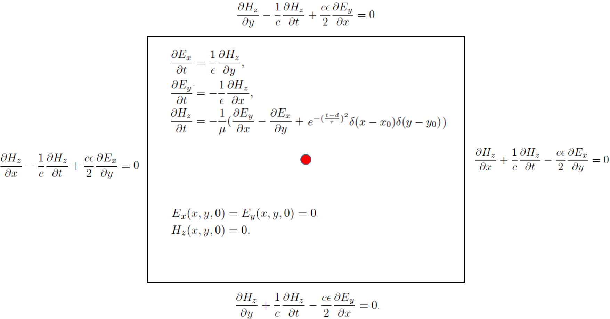

# AI Method for Solving Point Source Maxwell's Equations

<a href="https://gitee.com/mindspore/docs/blob/r1.5/docs/mindscience/docs/source_en/mindelec/time_domain_maxwell.md" target="_blank"></a>&nbsp;&nbsp;

## Overview

The rapid development of AI technology provides a new computing paradigm for scientific computing. The MindElec toolkit supports both data-driven and physics-driven AI methods to handle typical problems in the scientific computing field. The physics-driven AI method combines physical equations and initial boundary conditions to train the model. Compared with the data-driven method, the physics-driven method doesn’t require any labeled data. This tutorial focuses on physics-driven AI methods for solving point source time-domain Maxwell’s equations.
> This current sample is for Ascend 910 AI processor. You can find the complete executable code at
> <https://gitee.com/mindspore/mindscience/tree/r0.1/MindElec/examples/physics_driven/time_domain_maxwell>

## Maxwell's Equations

The Maxwell's equations with sources are classical control equations for electromagnetic simulation. They are a set of partial differential equations that describe how electric and magnetic fields are generated by charges and currents of the fields. The specific forms are described as follows:

$$
\nabla\times E=-\mu \dfrac{\partial H}{\partial t} - J(x, t),
$$
$$
\nabla\times H=\epsilon \dfrac{\partial E}{\partial t}
$$

where $\epsilon$ and $\mu$ are the absolute dielectric constant and the absolute magnetic permeability of the medium, respectively. $J(x, t)$ is the excitation source in the electromagnetic simulation process, and is usually represented in a form of a port pulse. This is mathematically approximated to the point source represented in the form of a Dirac delta function, and may be expressed as:
$$
J(x, t)=\delta(x - x_0)g(t)
$$

where $x_0$ is the position of the excitation source, and $g(t)$ is a function expression form of the pulse signal.

Because the spatial distribution of the point source is a non-continuous function, the physical field near the point source has a gradient that tends to infinity. In another aspect, the excitation source is usually a superposition of signals of multiple frequencies. The existing AI methods based on the physics-informed neural networks cannot converge to solve the multi-scale and singular problems. In MindElec, Gaussian distribution function smoothing, multi-channel residual network, sin activation function network structure and adaptive weighted multi-task learning strategy make the solution of this kind of problem superior to other frameworks and methods in terms of accuracy and performance. The following uses 2D TE wave simulation as an example to describe how MindElec solves the Maxwell's equations.

## Description

In this tutorial, the electromagnetic field distribution of 2D TE waves in the rectangular domain is simulated, and the Gaussian excitation source is located in the center of the rectangular domain. The control equation and initial and boundary conditions of the problem are shown in the following figure:



The process for MindElec to solve the problem is as follows:

1. Randomly sample the rectangular domain and the initial boundary conditions to create a training dataset.

2. Define the control equations and solution conditions, and establish the mapping relationship between datasets and constraints.

3. Build a neural network.

4. Perform network training and inference.

## Dependency

Import the modules on which this tutorial depends.

```python
from mindelec.data import Dataset
from mindelec.geometry import Disk, Rectangle, TimeDomain, GeometryWithTime
from mindelec.loss import Constraints
from mindelec.solver import Solver, LossAndTimeMonitor
from mindelec.common import L2
from mindelec.architecture import MultiScaleFCCell, MTLWeightedLossCell
from src import create_random_dataset, get_test_data
from src import Maxwell2DMur
from src import MultiStepLR, PredictCallback
from src import visual_result
```

## Creating a Dataset

In addition to loading dataset files in different formats, MindElec also supports online generation of sample datasets. The Geometry module allows you to create simple geometry, then create complex geometry through logical operations among the simple geometry, and implement sampling within the geometry and on the boundaries.

We implement uniform sampling inside the rectangular computational domain and implement encrypted sampling near the point source and then use it as a separate training dataset. To create a dataset required for training, five samplings need to be implemented: samplings on the rectangular domain constrained by the control equation and on internal points near the source region; samplings on the rectangular domain constrained by the initial condition and on internal points near the source region; boundary sampling on rectangular domain controlled by boundary conditions. The integration of spatial and temporal sampling data constitutes a training sample.

```python
# src region
disk = Disk("src", disk_origin, disk_radius)
# no src region
rectangle = Rectangle("rect", coord_min, coord_max)
diff = rectangle - disk

# time info
time_interval = TimeDomain("time", 0.0, config["range_t"])

# geometry merge with time
no_src_region = GeometryWithTime(diff, time_interval)
no_src_region.set_name("no_src")
no_src_region.set_sampling_config(create_config_from_edict(no_src_sampling_config))
src_region = GeometryWithTime(disk, time_interval)
src_region.set_name("src")
src_region.set_sampling_config(create_config_from_edict(src_sampling_config))
boundary = GeometryWithTime(rectangle, time_interval)
boundary.set_name("bc")
boundary.set_sampling_config(create_config_from_edict(bc_sampling_config))

# final sampling fields
geom_dict = {src_region : ["domain", "IC"],
                 no_src_region : ["domain", "IC"],
                 boundary : ["BC"]}
```

The MindElec Dataset API combines different sampled data into a unified training dataset. Therefore, data offloading needs to be performed only once in the training process, and there is no need to call a training network API for each subdataset.

```python
# create dataset for train
elec_train_dataset = Dataset(geom_dict)
train_dataset = elec_train_dataset.create_dataset(batch_size=config["train_batch_size"],
                                                  shuffle=True,
                                                  prebatched_data=True,
                                                  drop_remainder=True)
```

## Defining the Control Equation and Initial Boundary Value Condition

Inherit the Problem class provided by MindElec and allow you to quickly customize PDE problems. One implementation of this problem class can constrain multiple datasets. The member functions governing_equation, boundary_condition, initial_condition, and constraint_function correspond to the control equation, boundary condition, initial condition, and supervised label or function constraint, respectively. You can transfer the column name of the corresponding sample in the dataset in the constructor function to automatically compute the loss function of the sample set. The core code of the PDE problem is defined as follows. The first-order differential equation can be implemented by calling the Grad API, and the second-order differential equation can be implemented by calling the SecondOrderGrad API.

```python
# 2d TE-mode Maxwell's equation's with 2nd-order Mur boundary condition and static initial electromagnetic field
class Maxwell2DMur(Problem):
    def __init__(self, model, config, domain_name=None, bc_name=None, ic_name=None):
        super(Maxwell2DMur, self).__init__()
        self.domain_name = domain_name
        self.bc_name = bc_name
        self.ic_name = ic_name
        self.model = model
        # operators
        self.grad = Grad(self.model)
        self.reshape = ops.Reshape()
        self.cast = ops.Cast()
        self.mul = ops.Mul()
        self.cast = ops.Cast()
        self.split = ops.Split(1, 3)
        self.concat = ops.Concat(1)

        # constants
        self.pi = Tensor(PI, mstype.float32)
        self.eps_x = Tensor(EPS, mstype.float32)
        self.eps_y = Tensor(EPS, mstype.float32)
        self.mu_z = Tensor(MU, mstype.float32)
        self.light_speed = Tensor(LIGHT_SPEED, mstype.float32)

        # gauss-type pulse source
        self.src_frq = config.get("src_frq", 1e+9)
        self.tau = Tensor((2.3 ** 0.5) / (PI * self.src_frq), mstype.float32)
        self.amp = Tensor(1.0, mstype.float32)
        self.t0 = Tensor(3.65 * self.tau, mstype.float32)

        # src space
        self.x0 = Tensor(config["src_pos"][0], mstype.float32)
        self.y0 = Tensor(config["src_pos"][1], mstype.float32)
        self.sigma = Tensor(config["src_radius"] / 4.0, mstype.float32)
        self.coord_min = config["coord_min"]
        self.coord_max = config["coord_max"]

        input_scale = config.get("input_scale", [1.0, 1.0, 2.5e+8]) # scale of input data to improve accuracy
        output_scale = config.get("output_scale", [37.67303, 37.67303, 0.1]) # scale of output data to improve accuracy
        self.s_x = Tensor(input_scale[0], mstype.float32)
        self.s_y = Tensor(input_scale[1], mstype.float32)
        self.s_t = Tensor(input_scale[2], mstype.float32)
        self.s_ex = Tensor(output_scale[0], mstype.float32)
        self.s_ey = Tensor(output_scale[1], mstype.float32)
        self.s_hz = Tensor(output_scale[2], mstype.float32)

    def smooth_src(self, x, y, t):
        """Incentive sources and Gaussian smoothing of Dirac function"""
        source = self.amp * ops.exp(- ((t - self.t0) / self.tau)**2)
        gauss = 1 / (2 * self.pi * self.sigma**2) * \
                ops.exp(- ((x - self.x0)**2 + (y - self.y0)**2) / (2 * (self.sigma**2)))
        return self.mul(source, gauss)

    @ms_function
    def governing_equation(self, *output, **kwargs):
        """maxwell equation of TE mode wave"""
        u = output[0]
        # input data
        data = kwargs[self.domain_name]
        x = self.reshape(data[:, 0], (-1, 1))
        y = self.reshape(data[:, 1], (-1, 1))
        t = self.reshape(data[:, 2], (-1, 1))

        # get gradients
        dex_dxyt = self.grad(data, None, 0, u)
        _, dex_dy, dex_dt = self.split(dex_dxyt)
        dey_dxyt = self.grad(data, None, 1, u)
        dey_dx, _, dey_dt = self.split(dey_dxyt)
        dhz_dxyt = self.grad(data, None, 2, u)
        dhz_dx, dhz_dy, dhz_dt = self.split(dhz_dxyt)

        # residual of each equation
        loss_a1 = (self.s_hz * dhz_dy) / (self.s_ex * self.s_t * self.eps_x)
        loss_a2 = dex_dt / self.s_t

        loss_b1 = -(self.s_hz * dhz_dx) / (self.s_ey * self.s_t * self.eps_y)
        loss_b2 = dey_dt / self.s_t

        loss_c1 = (self.s_ey * dey_dx - self.s_ex * dex_dy) / (self.s_hz * self.s_t * self.mu_z)
        loss_c2 = - dhz_dt / self.s_t

        src = self.smooth_src(x, y, t) / (self.s_hz * self.s_t * self.mu_z)

        pde_r1 = loss_a1 - loss_a2
        pde_r2 = loss_b1 - loss_b2
        pde_r3 = loss_c1 - loss_c2 - src
        # total residual
        pde_r = ops.Concat(1)((pde_r1, pde_r2, pde_r3))
        return pde_r

    @ms_function
    def boundary_condition(self, *output, **kwargs):
        """2nd-order mur boundary condition"""
        # network input and output
        u = output[0]
        data = kwargs[self.bc_name]

        # specify each boundary
        coord_min = self.coord_min
        coord_max = self.coord_max
        batch_size, _ = data.shape
        attr = ms_np.zeros(shape=(batch_size, 4))
        attr[:, 0] = ms_np.where(ms_np.isclose(data[:, 0], coord_min[0]), 1.0, 0.0)
        attr[:, 1] = ms_np.where(ms_np.isclose(data[:, 0], coord_max[0]), 1.0, 0.0)
        attr[:, 2] = ms_np.where(ms_np.isclose(data[:, 1], coord_min[1]), 1.0, 0.0)
        attr[:, 3] = ms_np.where(ms_np.isclose(data[:, 1], coord_max[1]), 1.0, 0.0)

        # get gradients
        dex_dxyt = self.grad(data, None, 0, u)
        _, dex_dy, _ = self.split(dex_dxyt)
        dey_dxyt = self.grad(data, None, 1, u)
        dey_dx, _, _ = self.split(dey_dxyt)
        dhz_dxyt = self.grad(data, None, 2, u)
        dhz_dx, dhz_dy, dhz_dt = self.split(dhz_dxyt)

        # residual of each boundary
        bc_r1 = dhz_dx / self.s_x - dhz_dt / (self.light_speed * self.s_x) + \
                self.s_ex * self.light_speed * self.eps_x / (2 * self.s_hz * self.s_x) * dex_dy  # left boundary
        bc_r2 = dhz_dx / self.s_x + dhz_dt / (self.light_speed * self.s_x) - \
                self.s_ex * self.light_speed * self.eps_x / (2 * self.s_hz * self.s_x) * dex_dy  # right boundary
        bc_r3 = dhz_dy / self.s_y - dhz_dt / (self.light_speed * self.s_y) - \
                self.s_ey * self.light_speed * self.eps_y / (2 * self.s_hz * self.s_y) * dey_dx  # lower boundary
        bc_r4 = dhz_dy / self.s_y + dhz_dt / (self.light_speed * self.s_y) + \
                self.s_ey * self.light_speed * self.eps_y / (2 * self.s_hz * self.s_y) * dey_dx  # upper boundary
        bc_r_all = self.concat((bc_r1, bc_r2, bc_r3, bc_r4))
        bc_r = self.mul(bc_r_all, attr)
        return bc_r

    @ms_function
    def initial_condition(self, *output, **kwargs):
        """initial condition: u = 0"""
        u = output[0]
        return u
```

It should be noted that adjusting the input and output of the network to a proper value range (for example, [0,1]) during the experiment can significantly improve the training speed and accuracy of the model. In the preceding code, input_scale and output_scale are scale coefficients for optimization. Therefore, the corresponding Maxwell's equations and initial boundary condition are also in this form after coordinate scaling. In order to simulate the point source problem effectively, the Dirac function in the equation is approximated by the smooth Gaussian probability distribution. In the preceding code, the excitation source and the function form of Gaussian smoothing approximation are implemented in smooth_src, and a variance of Gaussian smoothing is 0.0025, which produces a very good result.

The Constraint API establishes a mapping between the unified dataset and user-defined problems (for example, Maxwell2DMur inherited from the Problem class). In this way, a constraint condition corresponding to each subdataset is obtained in the network to automatically compute the loss function. To complete this step, a dictionary is created by initializing the corresponding Problem for each subdataset. The dictionary key corresponds to the subdataset, and the key value corresponds to the problem class. The loss function is automatically computed based on the constraint_type attribute of each dataset. The constraint_type supports five forms: control equation, initial condition, boundary condition, label, and function. You need to explicitly define the corresponding control condition in the problem class based on the specific form. For example, for the sampling points in the source-free region, the constraint_type of the dataset is Equation. In this case, you must define the governing_equation function in the problem class Maxwell2DMur to restrict the dataset. You can pass the dataset and problem dictionary to the Constraints API to complete the mapping between the dataset and constraint conditions.

```python
# define constraints
train_prob = {}
for dataset in elec_train_dataset.all_datasets:
    train_prob[dataset.name] = Maxwell2DMur(model=model, config=config,
                                            domain_name=dataset.name + "_points",
                                            ic_name=dataset.name + "_points",
                                            bc_name=dataset.name + "_points")
print("check problem: ", train_prob)
train_constraints = Constraints(elec_train_dataset, train_prob)
```

## Building a Neural Network

In this example, the multi-channel residual network and Sin activation function are used to obtain higher accuracy than other methods in the simulation of the problem. The following figure shows the structure of the neural network.


The basic structure of a single-scale network consists of multi-layer residual full-connection networks. The multi-scale network of exponential channels is implemented as follows:

```python
class MultiScaleFCCell(nn.Cell):
    def __init__(self,
                 in_channel,
                 out_channel,
                 layers,
                 neurons,
                 residual=True,
                 act="sin",
                 weight_init='normal',
                 has_bias=True,
                 bias_init="default",
                 num_scales=4,
                 amp_factor=1.0,
                 scale_factor=2.0,
                 input_scale=None,
                 input_center=None,
                 latent_vector=None
                 ):
        super(MultiScaleFCCell, self).__init__()
        _check_type(num_scales, "num_scales", int)

        self.cell_list = nn.CellList()
        self.num_scales = num_scales
        self.scale_coef = [amp_factor * (scale_factor**i) for i in range(self.num_scales)]

        self.latent_vector = latent_vector
        if self.latent_vector is not None:
            _check_type(latent_vector, "latent_vector", Parameter)
            self.num_scenarios = latent_vector.shape[0]
            self.latent_size = latent_vector.shape[1]
            in_channel += self.latent_size
        else:
            self.num_scenarios = 1
            self.latent_size = 0

        # full-connect network
        for _ in range(self.num_scales):
            self.cell_list.append(FCSequential(in_channel=in_channel,
                                               out_channel=out_channel,
                                               layers=layers,
                                               neurons=neurons,
                                               residual=residual,
                                               act=act,
                                               weight_init=weight_init,
                                               has_bias=has_bias,
                                               bias_init=bias_init))
        if input_scale:
            self.input_scale = InputScaleNet(input_scale, input_center)
        else:
            self.input_scale = ops.Identity()

        self.cast = ops.Cast()
        self.concat = ops.Concat(axis=1)

    def construct(self, x):
        """running multi-scale net"""
        x = self.input_scale(x)
        if self.latent_vector is not None:
            batch_size = x.shape[0]
            latent_vectors = self.latent_vector.view(self.num_scenarios, 1, \
                self.latent_size).repeat(batch_size // self.num_scenarios, axis=1).view((-1, self.latent_size))
            x = self.concat((x, latent_vectors))
        out = 0
        for i in range(self.num_scales):
            x_s = x * self.scale_coef[i]
            out = out + self.cast(self.cell_list[i](x_s), mstype.float32)
        return out

model = MultiScaleFCCell(config["input_size"],
                         config["output_size"],
                         layers=config["layers"],
                         neurons=config["neurons"],
                         input_scale=config["input_scale"],
                         residual=config["residual"],
                         weight_init=HeUniform(negative_slope=math.sqrt(5)),
                         act="sin",
                         num_scales=config["num_scales"],
                         amp_factor=config["amp_factor"],
                         scale_factor=config["scale_factor"]
                         )
```

## Adaptive Weighted Loss Function for Accelerating Convergence

The Physics-Informed Neural Networks (PINNs) directly uses the governing equations for network training. The loss function of the network usually includes residuals of the governing equation, the boundary condition, and the initial condition. In this case, because the encrypted sampling near the source region is viewed as an independent subdataset for network training, the composition of the loss function includes the following five parts: a control equation and an initial condition of the source region, a control equation and an initial condition of the source-free region, and a boundary condition. Experiments show that the five components in the loss function differ greatly in magnitude, so the simple summation of the loss functions will lead to the failure of network training, and the manual adjustment of the weight information of each loss function is very cumbersome. MindElec develops a weighting algorithm based on uncertainty estimation of multi-task learning. By introducing trainable parameters and adaptively adjusting the weight of each loss function, MindElec can significantly improve the training speed and accuracy. The algorithm is implemented as follows:

```python
class MTLWeightedLossCell(nn.Cell):
    def __init__(self, num_losses):
        super(MTLWeightedLossCell, self).__init__(auto_prefix=False)
        self.num_losses = num_losses
        self.params = Parameter(Tensor(np.ones(num_losses), mstype.float32), requires_grad=True)
        self.concat = ops.Concat(axis=0)
        self.pow = ops.Pow()
        self.log = ops.Log()
        self.div = ops.RealDiv()

    def construct(self, losses):
        loss_sum = 0
        params = self.pow(self.params, 2)
        for i in range(self.num_losses):
            weighted_loss = 0.5 * self.div(losses[i], params[i]) + self.log(params[i] + 1.0)
            loss_sum = loss_sum + weighted_loss
        return loss_sum

# self-adaptive weighting
mtl = MTLWeightedLossCell(num_losses=elec_train_dataset.num_dataset)
```

## Model Testing

MindElec can use the user-defined callback function to implement training and inference at the same time. You can directly load the test dataset and implement the user-defined callback function to implement inference and analyze the result.

```python
loss_time_callback = LossAndTimeMonitor(steps_per_epoch)
callbacks = [loss_time_callback]
if config.get("train_with_eval", False):
    inputs, label = get_test_data(config["test_data_path"])
    predict_callback = PredictCallback(model, inputs, label, config=config, visual_fn=visual_result)
    callbacks += [predict_callback]
```

## Model Training

The Solver class provided by MindElec is an API for model training and inference. You can set the optimizer, network model, PDE constraints (train_constraints), and optional parameters such as the adaptive weighting algorithm module to define the solver object. In this tutorial, the MindSpore + Ascend mixed precision mode is used to train the network to solve the Maxwell's equations.

```python
# mixed precision
model = model.to_float(mstype.float16)
model.input_scale.to_float(mstype.float32)

# optimizer
params = model.trainable_params() + mtl.trainable_params()
lr_scheduler = MultiStepLR(config["lr"], config["milestones"], config["lr_gamma"], steps_per_epoch, config["train_epoch"])
lr = lr_scheduler.get_lr()
optim = nn.Adam(params, learning_rate=Tensor(lr))

# define solver
solver = Solver(model,
                optimizer=optim,
                mode="PINNs",
                train_constraints=train_constraints,
                test_constraints=None,
                metrics={'l2': L2(), 'distance': nn.MAE()},
                loss_fn='smooth_l1_loss',
                loss_scale_manager=DynamicLossScaleManager(init_loss_scale=2 ** 10, scale_window=2000),
                mtl_weighted_cell=mtl,
                )

solver.train(config["train_epoch"], train_dataset, callbacks=callbacks, dataset_sink_mode=True)
```

The instantaneous electromagnetic fields compared with the reference labels are depicted in the following figure.


