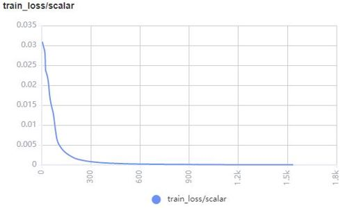
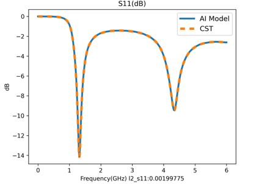
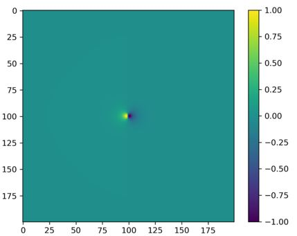
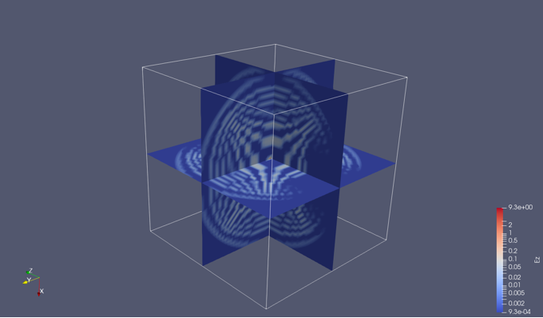

# Visualizing Electromagnetic Simulation Results

<a href="https://gitee.com/mindspore/docs/blob/r1.6/docs/mindscience/docs/source_en/mindelec/visualization.md" target="_blank"></a>&nbsp;&nbsp;

## Overview

Electromagnetic simulation results usually include physical parameters such as the electromagnetic field, and S-parameters in the simulation area. The visualized simulation result can directly reflect the strength and distribution of the concerned physical parameters and assist the designers in debugging and optimization. MindElec provides the visualization module `mindelec.vision` for the training process, testing process and simulation results (electromagnetic field and S-parameters). The following cases show how to use `mindelec.vision` for visualization.

## Visualized Training and Testing Process

MindElec calls MindInsight APIs to visualize the metrics and results during the training and testing process. The visualization file is generated by the Callback function Callback function that is defined as follows. The dataset and network definition can refer to the parameterization tutorial for details.

``` python
solver = Solver(network=model_net,
                mode="Data",
                optimizer=optim,
                loss_fn=nn.MSELoss())

monitor_train = MonitorTrain(per_print_times=1,
                             summary_dir='./summary_dir_train')

monitor_eval = MonitorEval(summary_dir='./summary_dir_eval',
                           model=solver,
                           eval_ds=data["eval_loader"],
                           eval_interval=opt.print_interval,
                           draw_flag=True)

callbacks_train = [monitor_train, monitor_eval]
```

Use the callbacks parameter to transfer the solver to draw the loss curve and relative error cure during training.

``` python
solver.model.train(epoch=opt.epochs,
                   train_dataset=data["train_loader"],
                   callbacks=callbacks_train,
                   dataset_sink_mode=True)
```

The following figure shows an example of the loss curve of the training set drawn on the MindInsight interface:



The following is an example of the loss curve and relative error curve of the testing set drawn on the MindInsight interface:


The S11 prediction results of the testing set are drawn as the training progresses.



## S11 Visualization

MindElec provides the `plot_s11` function to visualize the results for the S11 curve. The following code shows the call of the visualization tool:

``` python
s11_tensor = s11
path_image_save = './result'
legend = 's11'
dpi = 300
plot_s11(s11_tensor, path_image_save, legend, dpi)
```

Visualization Result (Comparison Between MindElec and Commercial Software CST Results)


## 2D Electromagnetic Field Visualization

MindElec provides the `plot_eh` function to visualize the 2D profile result of electromagnetic waves. The following code shows the call of the visualization tool:

``` python
simu_res_tensor = result_eh
path_image_save = './result'
z_index = 5
dpi = 300
plot_eh(simu_res_tensor, path_image_save, z_index, dpi)
```

The following shows the Ex 2D visualization results at different time:




The continuous dynamic graph of Ex is as follows:


## 3D Result Visualization

MindElec provides the `vtk_structure` function to generate 3D electromagnetic field visualization files. The software can read and display 3D effects through ParaView.

Run the following code to generate a 3D visualization `.vts` file at different time for the simulation results:

``` python
grid_tensor = result_grid
eh_tensor = result_eh
path_res = './result_vtk'
vtk_structure(grid_path, eh_path, path_res)
```

The grid_tensor indicates the 3D mesh grid coordinates. The dimensions are (t_dim, x_dim, y_dim, z_dim, 4). The last axis stores the mesh point space and time information(x, y, z, t). The eh_tensor is 3D grid electromagnetic field. The dimensions are (t_dim, x_dim, y_dim, z_dim, 6). The last axis stores the mesh point electromagnetic field value (Ex, Ey, Ez, Hx, Hy, Hz).

The following shows the Ez 3D visualization results at different time:




The continuous dynamic graph of Ez is as follows:


