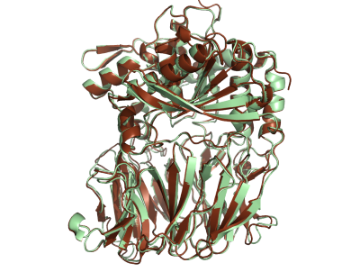

# Data-driven model MEGA-Protein

<a href="https://gitee.com/mindspore/docs/blob/master/docs/mindscience/docs/source_en/mindsponge/MEGAProtein.md" target="_blank"></a>

The process of obtaining protein spatial structure using computer efficiently is called protein structure prediction. Until 2020, Google DeepMind team proposed [AlphaFold2](https://www.nature.com/articles/s41586-021-03819-2) [1,2]. Compared with traditional tools, the prediction accuracy of this model has been greatly improved, and the error between the obtained structure and the real structure is close to the experimental method. However, there are still some problems such as too long data preprocessing, inaccurate prediction accuracy in the absence of MSA, and lacking of general tools for evaluating structural quality. To solve these problems, Gao Yiqin's team and MindSpore scientific computing team have carried out a series of innovative research and developed a more accurate and efficient protein structure prediction tool **MEGA-Protein**.

MEGA-Protein mainly consists of three parts：

- **Protein Structure Prediction Tool MEGA-Fold**，The network model is the same as AlphaFold2, and the multi sequence comparison link of data preprocessing adopts [MMseqs2](https://www.biorxiv.org/content/10.1101/2021.08.15.456425v1.full.pdf) [3]. Sequence retrieval, 2-3 times faster than the original end-to-end; At the same time, memory reuse greatly improves the efficiency of memory utilization, and supports longer sequence reasoning under the same hardware conditions (the Ascend910 runtime based on 32GB memory supports 3072 long sequence reasoning at most).
- **MSA Generation Tool MEGA-EvoGen**，It can significantly improve the prediction speed of single sequences, and can help MEGA Fold/AlphaFold2 and other models maintain or even improve the reasoning accuracy when there is little or no MSA (zero shot, i.e. single sequence), breaking through the limitation that accurate prediction cannot be made in the MSA deficient scenarios such as "orphan sequence", highly heterovariant sequence and artificial protein.
- **Protein structure scoring tool MEGA-Assessment**，The tool can evaluate the accuracy of each residue of protein structure and the distance error between residues and residues, and further optimize the protein structure based on the evaluation results.

## Available Models and Datasets

| Module  | file name               | size              | description                                             | Model URL                                                                                         |
| --------- | -------------------- | ----------------- | ------------------------------------------------ | ------------------------------------------------------------------------------------------------- |
| MEGA-Fold | `MEGA_Fold_1.ckpt` | 356MB             | MEGA-Fold's database of PSP dataset training is linked to the checkpoint | [Download link](https://download.mindspore.cn/model_zoo/research/hpc/molecular_dynamics/MEGA_Fold_1.ckpt) |
| PSP       | `PSP`              | 1.6TB(25TB after decompression) | PSP protein structure data set, which can be used for MEGA-Fold training         | [Download link](http://ftp.cbi.pku.edu.cn/psp/)                                                           |

## Environment configuration

### Hardware environment and framework

This tool is based on [MindSPONGE](https://gitee.com/mindspore/mindscience/tree/master/MindSPONGE) Biocomputing library and [MindSpore](https://www.mindspore.cn/en) AI Framework Development, MindSpore 1.8 and later versions can run, and MindSpore installation and configuration can refer to [MindSpore Installation Page](https://www.mindspore.cn/install/en) .This tool can be run on the Ascend 910 or GPU with more than 32G of memory. By default, full precision reasoning is used. Mixed precision needs to be called when running based on Ascend.

Protein Structure Prediction Tool MEGA-Fold Depends on Multiple Sequence Alignment (MSA,multiple sequence alignments) Co evolution and template information provided by traditional database search tools such as template retrieval generation, and configuration of database search needs **2.5T hard disk** (SSD is recommended) and CPU with the same performance as Kunpeng920.

### Configure database retrieval

- Configure MSA retrieval

    Install the MSA Search Tool first **MMseqs2**, The installation and use of this tool can refer to [MMseqs2 User Guide](https://mmseqs.com/latest/userguide.pdf), run the following command to configure environment variables after installation:

    ```shell
    export PATH=$(pwd)/mmseqs/bin/:$PATH
    ```

    Then download the database required by MSA:

    - [uniref30_2103](http://wwwuser.gwdg.de/~compbiol/colabfold/uniref30_2103.tar.gz) : Compressed package 68G, 375G after decompression
    - [colabfold_envdb_202108](http://wwwuser.gwdg.de/~compbiol/colabfold/colabfold_envdb_202108.tar.gz) : 110G compressed package, 949G after decompression

    After downloading, decompress and use MMseqs2 to process the database. For data processing, refer to [colabfold](http://colabfold.mmseqs.com) , the main commands are as follows:

    ```bash
    tar xzvf "uniref30_2103.tar.gz"
    mmseqs tsv2exprofiledb "uniref30_2103" "uniref30_2103_db"
    mmseqs createindex "uniref30_2103_db" tmp1 --remove-tmp-files 1

    tar xzvf "colabfold_envdb_202108.tar.gz"
    mmseqs tsv2exprofiledb "colabfold_envdb_202108" "colabfold_envdb_202108_db"
    mmseqs createindex "colabfold_envdb_202108_db" tmp2 --remove-tmp-files 1
    ```

- Configure Template Retrieval

    Install the template search tool first [**HHsearch**](https://github.com/soedinglab/hh-suite) and [**kalign**](https://msa.sbc.su.se/downloads/kalign/current.tar.gz) , and then download the template to retrieve the required database:

    - [pdb70](http://wwwuser.gwdg.de/~compbiol/data/hhsuite/databases/hhsuite_dbs/old-releases/pdb70_from_mmcif_200401.tar.gz) : Compressed package 19G, decompressed 56G
    - [mmcif database](https://ftp.rcsb.org/pub/pdb/data/structures/divided/mmCIF/) : Fragmented compressed file:50G, decompressed file:200G, and downloaded by script. After downloading, decompress all mmcif files and put them in the same folder.
    - [obsolete_pdbs](http://ftp.wwpdb.org/pub/pdb/data/status/obsolete.dat) ：140K

    *The database download websites are all foreign websites, and the download speed may be slow*。

    - Configuration database retrieval config

    Configure according to the database installation `config/data.yaml`Configuration related to database search in `database_search`, the meanings of relevant parameters are as follows:

    ```bash
    # configuration for template search
    hhsearch_binary_path   HHsearch Executable Path
    kalign_binary_path     kalign Executable Path
    pdb70_database_path    pdb70 File Path
    mmcif_dir              mmcif File Path
    obsolete_pdbs_path     PDB IDs Mapping file path
    max_template_date      The deadline for template search. Templates after this time point will be filtered out. The default value is "2100-01-01"
    # configuration for Multiple Sequence Alignment
    mmseqs_binary          MMseqs2 Executable Path
    uniref30_path          uniref30 File Path
    database_envdb_dir     colabfold_envdb_202108 File Path
    a3m_result_path        mmseqs2 Save path of search results (msa), default"./a3m_result/"
    ```

## Code Example

Available in MindSPONGE code warehouse [MEGA-Protein related codes](https://gitee.com/mindspore/mindscience/tree/master/MindSPONGE/applications/MEGAProtein) .

Code directory:

```bash
├── MEGA-Protein
    ├── main.py                         // MEGA-Protein Main Script
    ├── README.md                       // MEGA-Protein Relevant English description
    ├── README_CN.md                    // MEGA-Protein Relevant Chinese description
    ├── config
        ├── data.yaml                   //Data processing parameter configuration
        ├── model.yaml                  //Model parameter configuration
    ├── data
        ├── dataset.py                  // Asynchronous data read script
        ├── hhsearch.py                 // Python Encapsulated HHsearch Tool
        ├── kalign.py                   // Python Encapsulated Kaligan Tool
        ├── msa_query.py                // Python Encapsulated MSA Search and Processing Tool
        ├── msa_search.sh               // Call the shell script of MMseqs2 to search for MSA
        ├── multimer_pipeline.py        // Complex data preprocessing script
        ├── parsers.py                  // Mmcif file read script
        ├── preprocess.py               // Data preprocessing script
        ├── protein_feature.py          // MSA and template feature search and integration script
        ├── templates.py                // Template Search Script
        ├── utils.py                    // Function required for data processing
    ├── examples
        ├── pdb                         //Sample input data (. pkl file)
        ├── pkl                         //Sample output data (. pdb file)
    ├── model
        ├── fold.py                     //MEGA Fold master model script
    ├── module
        ├── evoformer.py                // Evoform feature extraction module
        ├── fold_wrapcell.py            // Training iteration packaging module
        ├── head.py                     // MEGA Fold additional output module
        ├── loss_module.py              // MEGA Fold training loss module
        ├── structure.py                // 3D structure generation module
        ├── template_embedding.py       // Template information extraction module
    ├── scripts
        ├── run_fold_infer_gpu.sh       // Example of GPU running MEGA Fold reasoning
        ├── run_fold_train_ascend.sh    // Ascend running MEGA Fold reasoning example
```

### MEGA-Fold Protein Structure Prediction Reasoning

Configure Database Search and `config/data.yaml`Related parameters，Download the trained model weights [MEGA_Fold_1.ckpt](https://download.mindspore.cn/model_zoo/research/hpc/molecular_dynamics/MEGA_Fold_1.ckpt) , run the following command to start reasoning.

```bash
usage：python main.py --data_config ./config/data.yaml --model_config ./config/model.yaml --run_platform PLATFORM
            --input_path INPUT_FILE_PATH --checkpoint_path CHECKPOINT_PATH

Options：
--data_config        Data preprocessing parameter configuration
--model_config       Model Hyperparameter Configuration
--input_path         The input file directory can contain multiple. fasta/. pkl files
--checkpoint_path    Model weight file path
--use_pkl            Use pkl data as input. The default is False
--run_platform       Run backend, Ascend or GPU, default Ascend
--mixed_precision    Call mixed precision inference, default 0, full precision inference
```

For multiple sequence inference, MEGA-Fold will automatically select the compilation configuration based on the longest length of all sequences to avoid repeated compilation. If there are many sequences to be reasoned, it is recommended to classify them according to the sequence length and put them into different folders for batch reasoning. Because of the high hardware requirements for database search, MEGA Bold supports database search generation first `raw_feature`and save it as a pkl file, and then use `raw_feature`as input to the forecasting tool.At this time `use_pkl`option is set to true,`examples`The folder provides a sample pkl file and the corresponding real structure for test run and test command reference `scripts/run_fold_infer_gpu.sh`.

The reasoning results are saved in `./result/` contentsThe results of each sequence are stored in an independent folder named after the sequence name. There are two files in the folder. The pdb file is the protein structure prediction result, and the penultimate column is the prediction confidence of amino acid residues; The timings file stores the time information at different stages of reasoning and the overall confidence of reasoning results.

```log
{"pre_process_time": 0.61, "model_time": 87.5, "pos_process_time": 0.02, "all_time ": 88.12, "confidence ": 93.5}
```

Comparison between MEGA-Fold prediction results and real results:

7VGB_A, length711, lDDT 92.3：



### MEGA-Fold Protein Structure Prediction Training

Download the open source structure training dataset [PSP dataset](http://ftp.cbi.pku.edu.cn/psp/) , use the following command to start the workout:

```bash
usage：python main.py --data_config ./config/data.yaml --model_config ./config/model.yaml --is_training True
            --input_path INPUT_PATH --pdb_path PDB_PATH --run_platform PLATFORM

options：
--data_config        Data preprocessing parameter configuration
--model_config       Model Hyperparameter Configuration
--is_training        Set to Training Mode
--input_path         Training input data (pkl file, including MSA and template information) path
--pdb_path           Path of training label data (pdb file, real structure or knowledge distillation structure)
--run_platform       Run backend, Ascend or GPU, default Ascend
```

By default, the weight is saved every 50 iterations in the code `./ckpt`contents.Data Set Download and Test Command Reference `scripts/run_fold_train.sh`。

## Reference

[1] Jumper J, Evans R, Pritzel A, et al. Applying and improving AlphaFold at CASP14[J]. Proteins: Structure, Function, and Bioinformatics, 2021.

[2] Jumper J, Evans R, Pritzel A, et al. Highly accurate protein structure prediction with AlphaFold[J]. Nature, 2021, 596(7873): 583-589.

[3] Mirdita M, Ovchinnikov S, Steinegger M. ColabFold-Making protein folding accessible to all[J]. BioRxiv, 2021.

## Acknowledgement

MEGA Fold uses or refers to the following open source tools:

- [AlphaFold2](https://github.com/deepmind/alphafold)
- [Biopython](https://biopython.org)
- [ColabFold](https://github.com/sokrypton/ColabFold)
- [HH Suite](https://github.com/soedinglab/hh-suite)
- [Kalign](https://msa.sbc.su.se/cgi-bin/msa.cgi)
- [ML Collections](https://github.com/google/ml_collections)
- [NumPy](https://numpy.org)
- [OpenMM](https://github.com/openmm/openmm)

Thanks to all the contributors and maintainers of these open source tools!
