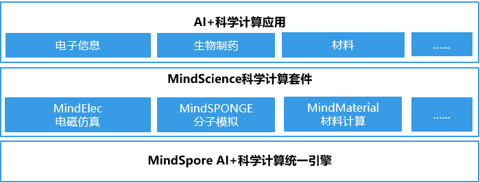

MindScience 文档
===================

MindScience是基于昇思MindSpore融合架构打造的科学计算行业套件，包含了业界领先的数据集、基础模型、预置高精度模型和前后处理工具，加速了科学行业应用开发。目前已推出面向电子信息行业的MindElec套件和面向生命科学行业的MindSPONGE套件，分别实现了电磁仿真性能提升10倍和生物制药化合物模拟效率提升50%。

使用MindScience的典型场景
------------------------------

1. `电磁仿真 <https://www.mindspore.cn/mindscience/docs/zh-CN/r0.2/mindelec/point_cloud.html>`_

   高效、易用的AI电磁仿真套件，提供了多模数据转换、高维数据编码以及创新的AI电磁仿真模型等功能，已在手机容差等场景中实现性能提升10倍、仿真精度媲美传统科学计算的技术突破。

2. `分子模拟 <https://www.mindspore.cn/mindscience/docs/zh-CN/r0.2/mindsponge/ala.html>`_

   AI与传统分子模拟相融合的高性能、模块化的分子模拟库，支持丙氨酸三肽水溶液、新冠病毒、AI力场克莱森重排等分子模拟经典案例。

.. toctree::
   :glob:
   :maxdepth: 1
   :caption: MindSPONGE

   mindsponge/intro_and_install
   mindsponge/ala
   mindsponge/claisen
   mindsponge/covid

.. toctree::
   :glob:
   :maxdepth: 1
   :caption: MindElec

   mindelec/intro_and_install
   mindelec/physics_driven
   mindelec/data_driven
   mindelec/visualization
 
.. toctree::
   :maxdepth: 1
   :caption: API参考

   mindsponge
   mindelec
