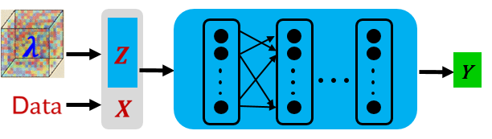
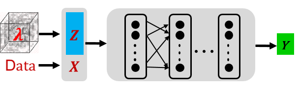
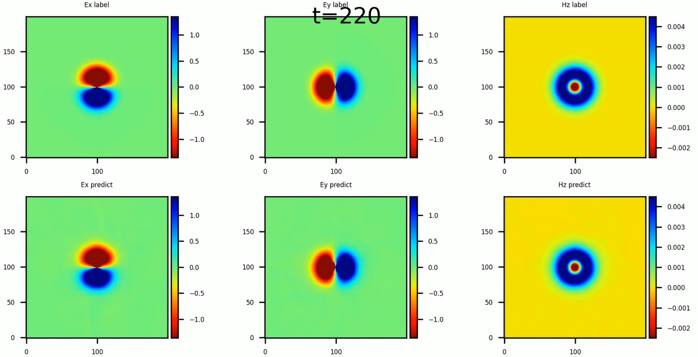

# 增量训练求解麦克斯韦方程族

<a href="https://gitee.com/mindspore/docs/blob/r1.5/docs/mindelec/docs/mindscience/docs/source_zh_cn/mindelec/incremental_learning.md" target="_blank"></a>&nbsp;&nbsp;

## 概述

原始的PINNs（Physics-Informed Neural Networks, PINNs)方法不具备求解一类方程的能力。当方程中的特征参数（如介电系数等）发生变化时需要重新训练，增加了求解时间。

本教程重点介绍基于MindElec套件的物理信息自解码器（Physics-Informed Auto-Decoder）增量训练方法，该方法可以快速求解同一类方程，极大减少重新训练的时间。

> 本例面向Ascend 910 AI处理器，你可以在这里下载完整的样例代码：
> <https://gitee.com/mindspore/mindscience/tree/r1.5/MindElec/examples/physics_driven/incremental_learning>

## 问题描述

本案例处理点源麦克斯韦方程的介质参数泛化求解问题。控制方程的具体形式以及求解域和激励源配置可以参考[点源问题的求解教程](https://www.mindspore.cn/mindscience/docs/zh-CN/r0.1/mindelec/time_domain_maxwell.html)。

## 基于物理信息的自解码器

通常情况下，待求解方程中的可变参数$\lambda$ 的分布构成高维空间。为了降低模型复杂度以及训练成本，我们提出了基于物理信息的自解码器来求解同一类的方程族。该方法首先将高维可变参数空间映射到由低维向量表征的低维流形上，然后将流形的特征参数与方程的输入融合作为点源问题求解网络的输入一起参与到PINNs的训练中，由此可以得到预训练模型。针对新给定的可变参数问题，对预训练模型进行微调即可以得到新方程的解。

MindElec基于物理信息的自解码器求解该问题的具体流程如下：

- 基于隐向量和神经网络的结合对一系列方程组进行预训练。与求解单个问题不同，预训练步骤中，神经网络的输入为采样点（X）与隐向量（Z）的融合，具体如下图所示：

    

- 针对新的方程组，对隐向量和神经网络进行增量训练，快速求解新问题。这里我们提供了两种增量训练模式：
    - finetune_latent_with_model: 该方式同时更新隐向量和网络结构，只需要加载预训练的模型进行增量训练即可。
    - finetune_latent_only: 如下图所示，该方式固定网络结构，在增量训练中只更新隐向量。

    

### 导入依赖

导入本教程依赖的模块与接口：

``` python
from mindelec.data import Dataset
from mindelec.geometry import Disk, Rectangle, TimeDomain, GeometryWithTime
from mindelec.loss import Constraints
from mindelec.solver import Solver, LossAndTimeMonitor
from mindelec.common import L2
from mindelec.architecture import MultiScaleFCCell, MTLWeightedLossCell

from src import get_test_data, create_random_dataset
from src import MultiStepLR
from src import Maxwell2DMur
from src import PredictCallback
from src import visual_result
```

### 创建数据集

与点源麦克斯韦方程的方式一致，我们在矩形计算域进行5次均匀采样，即由控制方程所约束的矩形域和源区附近的内部点采样；由初始条件所约束的矩形域和源区附近的内部点采样；以及由边界条件所控制的矩形域边界采样。空间采样与时间采样数据组合构成了训练样本。

```python
# src region
disk = Disk("src", disk_origin, disk_radius)
# no src region
rectangle = Rectangle("rect", coord_min, coord_max)
diff = rectangle - disk

# time info
time_interval = TimeDomain("time", 0.0, config["range_t"])

# geometry merge with time
no_src_region = GeometryWithTime(diff, time_interval)
no_src_region.set_name("no_src")
no_src_region.set_sampling_config(create_config_from_edict(no_src_sampling_config))
src_region = GeometryWithTime(disk, time_interval)
src_region.set_name("src")
src_region.set_sampling_config(create_config_from_edict(src_sampling_config))
boundary = GeometryWithTime(rectangle, time_interval)
boundary.set_name("bc")
boundary.set_sampling_config(create_config_from_edict(bc_sampling_config))

# final sampling fields
geom_dict = {src_region : ["domain", "IC"],
                no_src_region : ["domain", "IC"],
                boundary : ["BC"]}
```

MindElec提供了将不同的采样数据合并为统一训练数据集的Dataset接口。

```python
# create dataset for train
elec_train_dataset = create_random_dataset(config)
train_dataset = elec_train_dataset.create_dataset(batch_size=config["batch_size"],
                                                shuffle=True,
                                                prebatched_data=True,
                                                drop_remainder=True)
```

### 定义控制方程及初边值条件

继承MindElec提供的Problem类，我们定义该偏微分方程（partial differential equation，PDE）问题的核心代码如下。与求解单个点源问题不同，这里还传入了不同的参数`eps_candidates`， `mu_candidates`代表相对介电常数和相对磁导率。本案例中我们的预训练的参数选择为$(\epsilon_r, \mu_r)\in [1,3,5]*[1,3,5]$。

```python
class Maxwell2DMur(Problem):
    def __init__(self, network, config, domain_column=None, bc_column=None, ic_column=None):
        super(Maxwell2DMur, self).__init__()
        self.domain_column = domain_column
        self.bc_column = bc_column
        self.ic_column = ic_column
        self.network = network

        # operations
        self.gradient = Grad(self.network)
        self.reshape = ops.Reshape()
        self.cast = ops.Cast()
        self.mul = ops.Mul()
        self.cast = ops.Cast()
        self.split = ops.Split(1, 3)
        self.concat = ops.Concat(1)
        self.sqrt = ops.Sqrt()

        # gauss-type pulse source
        self.pi = Tensor(PI, ms_type.float32)
        self.src_frq = config.get("src_frq", 1e+9)
        self.tau = Tensor((2.3 ** 0.5) / (PI * self.src_frq), ms_type.float32)
        self.amp = Tensor(1.0, ms_type.float32)
        self.t0 = Tensor(3.65 * self.tau, ms_type.float32)

        # src space
        self.src_x0 = Tensor(config["src_pos"][0], ms_type.float32)
        self.src_y0 = Tensor(config["src_pos"][1], ms_type.float32)
        self.src_sigma = Tensor(config["src_radius"] / 4.0, ms_type.float32)
        self.src_coord_min = config["coord_min"]
        self.src_coord_max = config["coord_max"]

        input_scales = config.get("input_scales", [1.0, 1.0, 2.5e+8])
        output_scales = config.get("output_scales", [37.67303, 37.67303, 0.1])
        self.s_x = Tensor(input_scales[0], ms_type.float32)
        self.s_y = Tensor(input_scales[1], ms_type.float32)
        self.s_t = Tensor(input_scales[2], ms_type.float32)
        self.s_ex = Tensor(output_scales[0], ms_type.float32)
        self.s_ey = Tensor(output_scales[1], ms_type.float32)
        self.s_hz = Tensor(output_scales[2], ms_type.float32)

        # set up eps, mu candidates
        eps_candidates = np.array(config["eps_list"], dtype=np.float32) * EPS
        mu_candidates = np.array(config["mu_list"], dtype=np.float32) * MU
        self.epsilon_x = Tensor(eps_candidates, ms_type.float32).view((-1, 1))
        self.epsilon_y = Tensor(eps_candidates, ms_type.float32).view((-1, 1))
        self.mu_z = Tensor(mu_candidates, ms_type.float32).view((-1, 1))
        self.light_speed = 1.0 / ops.Sqrt()(ops.Mul()(self.epsilon_x, self.mu_z))

    # gaussian pulse with gaussian smooth technology
    def smooth_src(self, x, y, t):
        source = self.amp * ops.exp(- ((t - self.t0) / self.tau)**2)
        gauss = 1 / (2 * self.pi * self.src_sigma**2) * \
                ops.exp(- ((x - self.src_x0)**2 + (y - self.src_y0)**2) / (2 * (self.src_sigma**2)))
        return self.mul(source, gauss)

    @ms_function
    def governing_equation(self, *output, **kwargs):
        """maxwell equation of TE mode wave"""
        # net output and sampling input
        out = output[0]
        data = kwargs[self.domain_column]
        x = self.reshape(data[:, 0], (-1, 1))
        y = self.reshape(data[:, 1], (-1, 1))
        t = self.reshape(data[:, 2], (-1, 1))

        # get gradients
        dex_dxyt = self.gradient(data, None, 0, out)
        _, dex_dy, dex_dt = self.split(dex_dxyt)
        dey_dxyt = self.gradient(data, None, 1, out)
        dey_dx, _, dey_dt = self.split(dey_dxyt)
        dhz_dxyt = self.gradient(data, None, 2, out)
        dhz_dx, dhz_dy, dhz_dt = self.split(dhz_dxyt)

        # get equation residual
        loss_a1 = (self.s_hz * dhz_dy) / (self.s_ex * self.s_t * self.epsilon_x)
        loss_a2 = dex_dt / self.s_t

        loss_b1 = -(self.s_hz * dhz_dx) / (self.s_ey * self.s_t * self.epsilon_y)
        loss_b2 = dey_dt / self.s_t

        loss_c1 = (self.s_ey * dey_dx - self.s_ex * dex_dy) / (self.s_hz * self.s_t * self.mu_z)
        loss_c2 = - dhz_dt / self.s_t

        source = self.smooth_src(x, y, t) / (self.s_hz * self.s_t * self.mu_z)

        pde_res1 = loss_a1 - loss_a2
        pde_res2 = loss_b1 - loss_b2
        pde_res3 = loss_c1 - loss_c2 - source
        pde_r = ops.Concat(1)((pde_res1, pde_res2, pde_res3))
        return pde_r

    @ms_function
    def boundary_condition(self, *output, **kwargs):
        """2nd-order mur boundary condition"""
        # get net output and inputs
        u = output[0]
        data = kwargs[self.bc_column]

        # specify each boundary
        coord_min = self.src_coord_min
        coord_max = self.src_coord_max
        batch_size, _ = data.shape
        bc_attr = ms_np.zeros(shape=(batch_size, 4))
        bc_attr[:, 0] = ms_np.where(ms_np.isclose(data[:, 0], coord_min[0]), 1.0, 0.0)
        bc_attr[:, 1] = ms_np.where(ms_np.isclose(data[:, 0], coord_max[0]), 1.0, 0.0)
        bc_attr[:, 2] = ms_np.where(ms_np.isclose(data[:, 1], coord_min[1]), 1.0, 0.0)
        bc_attr[:, 3] = ms_np.where(ms_np.isclose(data[:, 1], coord_max[1]), 1.0, 0.0)

        dex_dxyt = self.gradient(data, None, 0, u)
        _, dex_dy, _ = self.split(dex_dxyt)
        dey_dxyt = self.gradient(data, None, 1, u)
        dey_dx, _, _ = self.split(dey_dxyt)
        dhz_dxyt = self.gradient(data, None, 2, u)
        dhz_dx, dhz_dy, dhz_dt = self.split(dhz_dxyt)

        bc_r1 = dhz_dx / self.s_x - dhz_dt / (self.light_speed * self.s_x) + \
                self.s_ex * self.light_speed * self.epsilon_x / (2 * self.s_hz * self.s_x) * dex_dy  # 左边界
        bc_r2 = dhz_dx / self.s_x + dhz_dt / (self.light_speed * self.s_x) - \
                self.s_ex * self.light_speed * self.epsilon_x / (2 * self.s_hz * self.s_x) * dex_dy  # 右边界
        bc_r3 = dhz_dy / self.s_y - dhz_dt / (self.light_speed * self.s_y) - \
                self.s_ey * self.light_speed * self.epsilon_y / (2 * self.s_hz * self.s_y) * dey_dx  # 下边界
        bc_r4 = dhz_dy / self.s_y + dhz_dt / (self.light_speed * self.s_y) + \
                self.s_ey * self.light_speed * self.epsilon_y / (2 * self.s_hz * self.s_y) * dey_dx  # 上边界

        bc_r_all = self.concat((bc_r1, bc_r2, bc_r3, bc_r4))
        bc_r = self.mul(bc_r_all, bc_attr)
        return bc_r

    @ms_function
    def initial_condition(self, *output, **kwargs):
        """initial condition: u = 0"""
        net_out = output[0]
        return net_out
```

对问题约束条件的定义如下：

```python
# define constraints
train_prob = {}
for dataset in elec_train_dataset.all_datasets:
    train_prob[dataset.name] = Maxwell2DMur(network=network, config=config,
                                            domain_column=dataset.name + "_points",
                                            ic_column=dataset.name + "_points",
                                            bc_column=dataset.name + "_points")
train_constraints = Constraints(elec_train_dataset, train_prob)
```

### 构建神经网络

在基于物理信息的自解码器中，神经网络的输入为采样点（X）与隐向量（Z）的融合，神经网络的主体结构采用多通道残差网络并结合Sin激活函数。

```python
# initialize latent vector
num_scenarios = config["num_scenarios"]
latent_size = config["latent_vector_size"]
latent_init = np.random.randn(num_scenarios, latent_size) / np.sqrt(latent_size)
latent_vector = Parameter(Tensor(latent_init, ms_type.float32), requires_grad=True)

network = MultiScaleFCCell(config["input_size"],
                        config["output_size"],
                        layers=config["layers"],
                        neurons=config["neurons"],
                        residual=config["residual"],
                        weight_init=HeUniform(negative_slope=math.sqrt(5)),
                        act="sin",
                        num_scales=config["num_scales"],
                        amp_factor=config["amp_factor"],
                        scale_factor=config["scale_factor"],
                        input_scale=config["input_scale"],
                        input_center=config["input_center"],
                        latent_vector=latent_vector
                        )
```

### 自适应加权损失函数加速收敛

在本案例中，由于源区附近区域的加密采样并作为独立子数据集进行网络训练，因此损失函数的构成包含如下五项：有源区域的控制方程和初始条件、无源区域的控制方程和初始条件以及边界条件。实验表明，这五项损失函数量级差异明显，因此简单的损失函数求和会导致网络训练失败，而手动调节每项损失函数的权重信息极为繁琐。MindElec发展了一种基于多任务学习不确定性估计的加权算法，通过引入可训的参数，自适应地调节每项损失函数的权重，可以显著地提升训练速度和精度。该算法的实现具体如下：

```python
class MTLWeightedLossCell(nn.Cell):
    def __init__(self, num_losses):
        super(MTLWeightedLossCell, self).__init__(auto_prefix=False)
        self.num_losses = num_losses
        self.params = Parameter(Tensor(np.ones(num_losses), mstype.float32), requires_grad=True)
        self.concat = ops.Concat(axis=0)
        self.pow = ops.Pow()
        self.log = ops.Log()
        self.div = ops.RealDiv()

    def construct(self, losses):
        loss_sum = 0
        params = self.pow(self.params, 2)
        for i in range(self.num_losses):
            weighted_loss = 0.5 * self.div(losses[i], params[i]) + self.log(params[i] + 1.0)
            loss_sum = loss_sum + weighted_loss
        return loss_sum

# self-adaptive weighting
mtl = MTLWeightedLossCell(num_losses=elec_train_dataset.num_dataset)
```

### 模型测试

MindElec可以通过自定义的callback函数，利用边训练边推理的功能。用户可以直接加载测试数据集，然后实现自定义的callback函数实现推理并分析结果。

```python
callbacks = [LossAndTimeMonitor(epoch_steps)]
if config.get("train_with_eval", False):
    input_data, label_data = get_test_data(config["test_data_path"])
    eval_callback = PredictCallback(network, input_data, label_data, config=config, visual_fn=visual_result)
    callbacks += [eval_callback]
```

### 模型预训练

MindElec提供的Solver类是模型训练和推理的接口。输入优化器和网络模型以及PDE的约束（train_constraints），以及可选参数如自适应加权算法模块，即可定义求解器对象solver。在该案例中利用MindSpore + Ascend混合精度模式训练网络，从而完成求解麦克斯韦方程。

```python
# mixed precision
model = model.to_float(mstype.float16)
model.input_scale.to_float(mstype.float32)

# optimizer
params = model.trainable_params() + mtl.trainable_params()
lr_scheduler = MultiStepLR(config["lr"], config["milestones"], config["lr_gamma"],
                        epoch_steps, config["train_epoch"])
optimizer = nn.Adam(params, learning_rate=Tensor(lr_scheduler.get_lr()))

# problem solver
solver = Solver(network,
                optimizer=optimizer,
                mode="PINNs",
                train_constraints=train_constraints,
                test_constraints=None,
                metrics={'l2': L2(), 'distance': nn.MAE()},
                loss_fn='smooth_l1_loss',
                loss_scale_manager=DynamicLossScaleManager(),
                mtl_weighted_cell=mtl_cell,
                latent_vector=latent_vector,
                latent_reg=config["latent_reg"]
                )
solver.train(config["train_epoch"], train_dataset, callbacks=callbacks, dataset_sink_mode=True)
```

### 模型增量训练

针对于新的问题参数，以$（\epsilon_r, \mu_r）=（2,2）$为例，我们需要加载预训练的网络权重和初始化一个新的隐向量（Z）。

```python
# load pretrained ckpt
param_dict = load_checkpoint(config["load_ckpt_path"])
loaded_ckpt_dict = {}
latent_vector_ckpt = 0
for name in param_dict:
    if name == "model.latent_vector":
        latent_vector_ckpt = param_dict[name].data.asnumpy()
    elif "network" in name and "moment" not in name:
        loaded_ckpt_dict[name] = param_dict[name]

# initialize the new latent vector
num_scenarios = config["num_scenarios"]
latent_size = config["latent_vector_size"]
latent_norm = np.mean(np.linalg.norm(latent_vector_ckpt, axis=1))
latent_init = np.zeros((num_scenarios, latent_size))
latent_vector = Parameter(Tensor(latent_init, ms_type.float32), requires_grad=True)

# optimizer
if config.get("finetune_model"):
    model_params = model.trainable_params()
else:
    model_params = [param for param in model.trainable_params()
                    if ("bias" not in param.name and "weight" not in param.name)]

params = model_params + mtl.trainable_params()
lr_scheduler = MultiStepLR(config["lr"], config["milestones"], config["lr_gamma"],
                            steps_per_epoch, config["train_epoch"])
lr = lr_scheduler.get_lr()
optim = nn.Adam(params, learning_rate=Tensor(lr))
```

在本教程中，我们采用finetune_latent_with_model的增量训练模式，即同时更新隐向量和网络结构。电磁场的瞬时分布与参考标签数据的对比结果如下图所示。相较于PINNs直接求解单个问题，在达到同等精度（相对误差6%）的情况下，增量训练的方法得到了10倍以上的加速。


