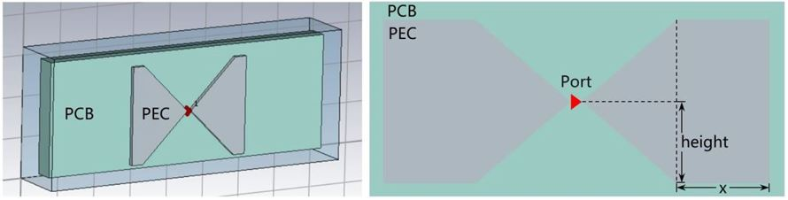
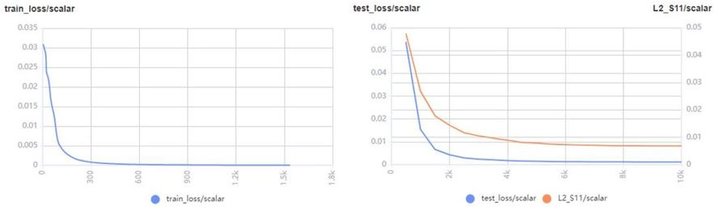
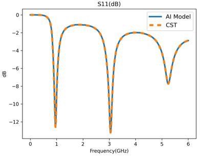

# 基于参数化方案的AI电磁仿真

<a href="https://gitee.com/mindspore/docs/blob/r1.6/docs/mindscience/docs/source_zh_cn/mindelec/parameterization.md" target="_blank"></a>&nbsp;&nbsp;

## 概述

电磁仿真在天线、芯片和手机等产品设计过程中应用广泛，主要目的是获取待仿真目标的传输特性（散射参数、电磁场等）。散射参数（S参数）是建立在输入波、反射波基础上的网络参数，用于微波电路分析，以器件端口的反射信号强度以及从该端口传向另一端口的信号的强度来描述电路网络。

目前天线、手机等产品通常依靠商业仿真软件（CST、HFS等）进行仿真，得到S参数等结果。当前商业软件仿真多通过数值算法（FDTD等）计算S参数，仿真流程主要包括半自动/自动的网格剖分和数值求解麦克斯韦方程这两个步骤，耗时较长，同时算力消耗十分庞大。

MindElec通过AI方法跳过传统数值方法的迭代计算直接得到待仿真目标的S参数，极大节省仿真时长。MindElec提供两种数据驱动的电磁仿真方案：参数化方案和点云方案，这两种方案有以下特点：

- 参数化方案实现的是参数到仿真结果的直接映射，例如天线的宽度、角度作为网络输入，网络输出为S参数。参数化方案的优点是直接映射且网络简单。
- 点云方案实现的是从天线/手机的采样点云到仿真结果的映射，该方案先将手机结构文件转化为点云张量数据，（压缩后）使用卷积神经网络提取结构特征，再通过数层全连接层映射到最终的仿真结果（S参数），该方案的优点是适用于结构参数数量或种类可能发生变化的复杂工况。

> 本例面向Ascend 910 AI处理器，你可以在这里下载完整的样例代码：
> <https://gitee.com/mindspore/mindscience/tree/r0.2/MindElec/examples/data_driven/parameterization>

## 目标场景

在本教程中，我们将在蝶形天线场景中应用参数化仿真的方法。

### 蝶形天线

蝶形天线结构如下图所示：



PEC金属板置于一定厚度的PCB长方体之上，呈现为左右对称蝶形，两块金属板间未完全接触存在缝隙，激励源（端口）处于该缝隙处。电磁仿真即通过添加激励源，计算该区域内的电磁场，进而得到S参数（本教程只有一个端口，因此S参数只有S11）。

在天线设计过程中，常需要根据仿真结果，调节和优化仿真物体的结构。在本教程中，蝶形天线改变的结构参数为PEC板的长度（x）、高度（height），以及PCB板厚度（z），其中长度变化范围是0mm-40mm，高度变化范围是4mm-24mm，厚度变化范围是2mm-18mm。

在本教程中，我们将通过MindElec建立结构参数到S11的映射，面对新的结构可以快速根据结构参数计算S11。

### 数据集

共495个参数-S11样本对，按照9:1随机划分训练集和测试集，部分天线和S11样本对可视化如下：


该数据已经提供为.npy文件，可从以下地址下载。

<https://gitee.com/mindspore/mindscience/tree/r0.2/MindElec/examples/data_driven/parameterization/dataset>

## 参数化电磁仿真

参数化电磁仿真分为以下5个步骤：

1. 数据集加载
2. 模型构建
3. 模型训练
4. 模型测试
5. 结果可视化

### 数据集加载

首先通过MindElec dataset模块加载蝶形天线数据集。参数化方法目前支持使用本地数据集训练，通过`ExistedDataConfig`接口可以配置相应数据集选项，需要指定输入和S11 label数据集文件位置、类型。
随后通过`Dataset`接口生成数据集实例，并通过`create_dataset`函数构造数据生成器`dataloader`用于模型后续的训练和测试。

``` python
def create_dataset(opt):
    """
    load data
    """
    data_input_path = opt.input_path
    data_label_path = opt.label_path

    data_input = np.load(data_input_path)
    data_label = np.load(data_label_path)

    frequency = data_label[0, :, 0]
    data_label = data_label[:, :, 1]

    print(data_input.shape)
    print(data_label.shape)
    print("data load finish")

    data_input = custom_normalize(data_input)

    config_data_prepare = {}

    config_data_prepare["scale_input"] = 0.5 * np.max(np.abs(data_input), axis=0)
    config_data_prepare["scale_S11"] = 0.5 * np.max(np.abs(data_label))

    data_input[:, :] = data_input[:, :] / config_data_prepare["scale_input"]
    data_label[:, :] = data_label[:, :] / config_data_prepare["scale_S11"]

    permutation = np.random.permutation(data_input.shape[0])
    data_input = data_input[permutation]
    data_label = data_label[permutation]

    length = data_input.shape[0] // 10
    train_input, train_label = data_input[length:], data_label[length:]
    eval_input, eval_label = data_input[:length], data_label[:length]

    print(np.shape(train_input))
    print(np.shape(train_label))
    print(np.shape(eval_input))
    print(np.shape(eval_label))

    if not os.path.exists('./data_prepare'):
        os.mkdir('./data_prepare')
    else:
        shutil.rmtree('./data_prepare')
        os.mkdir('./data_prepare')

    train_input = train_input.astype(np.float32)
    np.save('./data_prepare/train_input', train_input)
    train_label = train_label.astype(np.float32)
    np.save('./data_prepare/train_label', train_label)
    eval_input = eval_input.astype(np.float32)
    np.save('./data_prepare/eval_input', eval_input)
    eval_label = eval_label.astype(np.float32)
    np.save('./data_prepare/eval_label', eval_label)

    electromagnetic_train = ExistedDataConfig(name="electromagnetic_train",
                                              data_dir=['./data_prepare/train_input.npy',
                                                        './data_prepare/train_label.npy'],
                                              columns_list=["inputs", "label"],
                                              data_format="npy")
    electromagnetic_eval = ExistedDataConfig(name="electromagnetic_eval",
                                             data_dir=['./data_prepare/eval_input.npy',
                                                       './data_prepare/eval_label.npy'],
                                             columns_list=["inputs", "label"],
                                             data_format="npy")
    train_batch_size = opt.batch_size
    eval_batch_size = len(eval_input)

    train_dataset = Dataset(existed_data_list=[electromagnetic_train])
    train_loader = train_dataset.create_dataset(batch_size=train_batch_size, shuffle=True)

    eval_dataset = Dataset(existed_data_list=[electromagnetic_eval])
    eval_loader = eval_dataset.create_dataset(batch_size=eval_batch_size, shuffle=False)

    data = {
        "train_loader": train_loader,
        "eval_loader": eval_loader,

        "train_data": train_input,
        "train_label": train_label,
        "eval_data": eval_input,
        "eval_label": eval_label,

        "train_data_length": len(train_label),
        "eval_data_length": len(eval_label),
        "frequency": frequency,
    }

    return data, config_data_prepare
```

### 模型构建

这里以S11Predictor模型作为示例，该模型通过MindSpore的模型定义接口，如`nn.Dense`、`nn.Relu`构建。您也可以构建自己的模型。

``` python
class S11Predictor(nn.Cell):
    def __init__(self, input_dimension):
        super(S11Predictor, self).__init__()
        self.fc1 = nn.Dense(input_dimension, 128)
        self.fc2 = nn.Dense(128, 128)
        self.fc3 = nn.Dense(128, 128)
        self.fc4 = nn.Dense(128, 128)
        self.fc5 = nn.Dense(128, 128)
        self.fc6 = nn.Dense(128, 128)
        self.fc7 = nn.Dense(128, 1001)
        self.relu = nn.ReLU()

    def construct(self, x):
        x0 = x
        x1 = self.relu(self.fc1(x0))
        x2 = self.relu(self.fc2(x1))
        x3 = self.relu(self.fc3(x1 + x2))
        x4 = self.relu(self.fc4(x1 + x2 + x3))
        x5 = self.relu(self.fc5(x1 + x2 + x3 + x4))
        x6 = self.relu(self.fc6(x1 + x2 + x3 + x4 + x5))
        x = self.fc7(x1 + x2 + x3 + x4 + x5 + x6)
        return x
```

### 模型训练

模型构建完成后即可使用步骤1定义的数据生成器`dataloader`载入数据。

MindElec提供Solver类用于模型训练和推理，Solver类输入为优化器、网络模型、模式和loss函数。本教程为基于数据的监督学习，因此模式设置为`Data`，通过`solver.model.train`混合精度模式训练网络。

同时我们还通过`EvalMetric`定义了训练过程中验证集的评测方式和指标，该方法将通过`Solver`的`metric`参数加入训练，从而在训练过程中实时监控指标变化情况。

``` python
milestones, learning_rates = get_lr(data)

optim = nn.Adam(model_net.trainable_params(),
                learning_rate=nn.piecewise_constant_lr(milestones, learning_rates))

eval_error_mrc = EvalMetric(scale_s11=config_data["scale_S11"],
                            length=data["eval_data_length"],
                            frequency=data["frequency"],
                            show_pic_number=4,
                            file_path='./eval_res')

solver = Solver(network=model_net,
                mode="Data",
                optimizer=optim,
                metrics={'eval_mrc': eval_error_mrc},
                loss_fn=nn.MSELoss())

monitor_train = MonitorTrain(per_print_times=1,
                             summary_dir='./summary_dir_train')

monitor_eval = MonitorEval(summary_dir='./summary_dir_eval',
                           model=solver,
                           eval_ds=data["eval_loader"],
                           eval_interval=opt.print_interval,
                           draw_flag=True)

time_monitor = TimeMonitor()
callbacks_train = [monitor_train, time_monitor, monitor_eval]

solver.model.train(epoch=opt.epochs,
                   train_dataset=data["train_loader"],
                   callbacks=callbacks_train,
                   dataset_sink_mode=True)

if not os.path.exists(opt.checkpoint_dir):
    os.mkdir(opt.checkpoint_dir)
save_checkpoint(model_net, os.path.join(opt.checkpoint_dir, 'model.ckpt'))
```

### 模型测试

模型训练结束后即可通过`solver.model.eval`接口调用预训练权重推理获得测试集的S11参数。

``` python
data, config_data = create_dataset(opt)

model_net = S11Predictor(opt.input_dim)
model_net.to_float(mstype.float16)

param_dict = load_checkpoint(os.path.join(opt.checkpoint_dir, 'model.ckpt'))
load_param_into_net(model_net, param_dict)

eval_error_mrc = EvalMetric(scale_s11=config_data["scale_S11"],
                            length=data["eval_data_length"],
                            frequency=data["frequency"],
                            show_pic_number=4,
                            file_path='./eval_result')

solver = Solver(network=model_net,
                mode="Data",
                optimizer=nn.Adam(model_net.trainable_params(), 0.001),
                metrics={'eval_mrc': eval_error_mrc},
                loss_fn=nn.MSELoss())

res_eval = solver.model.eval(valid_dataset=data["eval_loader"], dataset_sink_mode=True)

loss_mse, l2_s11 = res_eval["eval_mrc"]["loss_error"], res_eval["eval_mrc"]["l2_error"]

print(f'Loss_mse: {loss_mse:.10f}  ', f'L2_S11: {l2_s11:.10f}')
```

### 结果可视化

训练过程可通过MindElec中`vision.MonitorTrain`和`vision.MonitorEval`模块展现训练集、测试集的loss、相对误差和预测/真值S11对比图。

loss和相对误差图如下：



预测/真值S11对比图如下：


测试结果也可以通过MindElec中`vision.plot_s11`模块绘制预测/真值S11对比图，如下：



橙色虚线为商业软件CST对蝶形天线的仿真结果，蓝色实线是MindElec模型的预测结果，两者相对误差1.02%。两条曲线的谐振频点、及相应的S11幅值以及带宽基本一致。

MindElec在保证与商业软件之间误差较小的前提下，快速得到不同手机结构、材料的散射参数。
