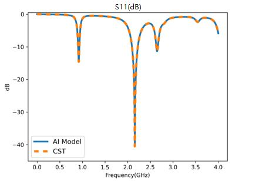

# 基于点云方案的AI电磁仿真

<a href="https://gitee.com/mindspore/docs/blob/master/docs/mindscience/docs/source_zh_cn/mindelec/point_cloud.md" target="_blank"></a>&nbsp;&nbsp;

## 概述

本教程介绍MindElec提供的基于点云方案的AI电磁仿真方法，引导您快速使用MindElec。

传统电磁仿真计算通常使用基于有限元或有限差分的方法计算电磁场，这些方法需要复杂的网格剖分与迭代计算，整体流程耗时长，影响产品研发效率。MindElec提供一种新的电磁场端到端AI计算方法，该方法基于点云数据，跳过网格剖分与迭代求解，直接计算仿真区域内电磁场，大幅提升整体仿真速度，助力产品高效研发。

> 本例面向Ascend 910 AI处理器，你可以在这里下载完整的样例代码：
> <https://gitee.com/mindspore/mindscience/tree/master/MindElec/examples/data_driven/pointcloud>

## 整体流程

基于点云数据的电磁仿真整体流程如下：

1. 从CST文件导出几何/材料信息
2. 点云数据生成
3. 数据压缩
4. 电磁仿真计算

## 从CST文件导出几何/材料信息

MindElec提供两种自动化执行脚本，用于将cst格式文件转换为Python可读取的stp文件，使用该脚本可以实现数据批量转换，实现大规模电磁仿真：

- **基于CST的VBA接口自动调用导出json文件和stp文件**：打开CST软件的VBA Macros Editor， 导入`generate_pointcloud`目录下的`export_stp.bas`文件，将json文件和stp文件路径更改为想要存放的位置，然后点击`Run`即可导出json文件和stp文件。其中，json文件中包含了模型的端口位置以及stp文件对应的材料信息。
- **对于CST2019或更新的版本，支持使用Python直接调用CST**：直接调用`generate_pointcloud`目录下的`export_stp.py`文件即可。

### 示例

``` shell
python export_stp.py --cst_path CST_PATH
                     --stp_path STP_PATH
                     --json_path JSON_PATH
```

其中，`cst_path`用来指定需要导出stp的cst文件的路径，`stp_path`和`json_path`分别用来指定导出的stp和json文件存放路径。

## 点云数据生成

stp文件无法直接作为神经网络的输入，需要先转换为规则的张量数据，MindElec提供将stp文件高效转化为点云张量数据的接口，`generate_pointcloud`目录下的`generate_cloud_point.py`文件提供该接口调用示例。

调用时，通过配置`stp_path`和`json_path`可以指定用来生成点云的stp和json文件的路径；`material_dir`指定stp对应的材料信息的路径，材料信息直接在cst软件中导出；`sample_nums`指定x、y、z三个维度分别生成多少个点云数据；`bbox_args`用来指定生成点云数据的区域，即（x_min, y_min, z_min, x_max, y_max, z_max）。

调用命令示例如下：

``` shell
python generate_cloud_point.py --stp_path STP_PATH
                               --json_path JSON_PATH
                               --material_dir MATERIAL_DIR
                               --sample_nums (500, 2000, 80)
                               --bbox_args (-40., -80., -5., 40., 80., 5.)
```

## 数据压缩

如果点云分辨率设置较高，仅单条点云数据的后处理就需巨大的内存和计算量，因此MindElec提供数据压缩功能。用户可以调用`data_compression`目录下的脚本，压缩原始点云数据，该压缩过程分两步：

- 首次使用时需要调用`train.py`训练压缩模型，若已有压缩模型检查点可以跳过该步。
- 模型训练结束后即可调用`data_compress.py`进行数据压缩。

### 压缩模型训练（可选）

#### 训练数据准备

压缩模型使用的训练数据是分块的点云数据。用户生成点云数据后，调用`data_compression/src/dataset.py`中的`generate_data`函数即可生成训练与推理所需数据。分块大小与数据输入输出路径通过该脚本中以下参数配置

``` python
PATCH_DIM = [25, 50, 25]
NUM_SAMPLE = 10000
INPUT_PATH = ""
DATA_CONFIG_PATH = "./data_config.npy"
SAVE_DATA_PATH = "./"
```

训练数据准备生成过程中会对数据做归一化，为保证模型的有效性，在推理压缩时需要使用相同的归一化参数，这些参数会保存在`data_config.npy`文件中。

#### 构建压缩模型

参照`data_compression/src/model.py`构建压缩模型，该模型使用自监督学习方式训练。模型分为编码器与解码器两部分，训练时需要网络重建数据（`decoding=True`），推理压缩数据时略去解压缩器（`decoding=False`）。

对于不同大小的数据块尺寸，需要相应地修改编码器部分代码，确保编码器`Encoder`部分输出空间尺寸为`[1,1,1]`。

``` python
class EncoderDecoder(nn.Cell):
    def __init__(self, input_dim, target_shape, base_channels=8, decoding=False):
        super(EncoderDecoder, self).__init__()
        self.decoding = decoding
        self.encoder = Encoder(input_dim, base_channels)
        if self.decoding:
            self.decoder = Decoder(input_dim, target_shape, base_channels)

    def construct(self, x):
        encoding = self.encoder(x)
        if self.decoding:
            output = self.decoder(encoding)
        else:
            output = encoding
        return output

class Encoder(nn.Cell):
    ...

class Decoder(nn.Cell):
    ...
```

#### 模型训练

压缩模型训练时，首先根据`config.py`中定义的输入特征数、数据块大小、基础特征数等初始化自编码器`EncoderDecoder`：

``` python
model_net = EncoderDecoder(config["input_channels"], config["patch_shape"], config["base_channels"], ecoding=True)
```

其次调用MindElec的数据接口读取数据集，该接口可以自动打乱数据并分批次：

```python
train_dataset = create_dataset(input_path=opt.train_input_path,
                               label_path=opt.train_input_path,
                               batch_size=config["batch_size"],
                               shuffle=True)
eval_dataset ...
```

为提升模型的精度，设定如下学习率衰减策略：

``` python
milestones, learning_rates = step_lr_generator(step_size,
                                               config["epochs"],
                                               config["lr"],
                                               config["lr_decay_milestones"])
```

MindElec的训练接口`Solver`可定义训练参数，包括优化器、度量标准、损失函数等：

``` python
solver = Solver(model_net,
                train_input_map={'train': ['train_input_data']},
                test_input_map={'test': ['test_input_data']},
                optimizer=optimizer,
                metrics={'evl_mrc': evl_error_mrc,},
                amp_level="O2",
                loss_fn=loss_net)
```

最后使用`Solver.model.train`和`Solver.model.eval`训练和测试压缩模型，同时定期存储压缩模型检查点：

``` python
for epoch in range(config["epochs"] // config["eval_interval"]):
    solver.model.train(config["eval_interval"],
                        train_dataset,
                        callbacks=[LossMonitor(), TimeMonitor()],
                        dataset_sink_mode=True)
    res_test = solver.model.eval(eval_dataset, dataset_sink_mode=True)
    error_mean_l1_error = res_test['evl_mrc']['mean_l1_error']
    save_checkpoint(model_net, os.path.join(opt.checkpoint_dir, 'model_last.ckpt'))
```

### 推理数据压缩

数据压缩时需要传入原始点云与模型检查点文件的路径，同时根据`config.py`文件定义压缩模型并导入模型检查点：

``` python
encoder = EncoderDecoder(config["input_channels"], config["patch_shape"], decoding=False)
load_checkpoint(opt.model_path, encoder)
```

数据压缩脚本会自动将点云数据切分成适应压缩模型的数据块，同时使用训练数据准备时生成的`data_config.npy`对数据做归一化。切分完成后自动调用MindSpore推理对数据进行压缩，压缩后数据块编码结果按原始分块空间位置重新排列，得到最后的压缩结果。

## 电磁仿真计算

点云数据准备完毕后即可调用MindElec `full_em`和`S_parameter`目录下的电磁仿真模型，实现全量电磁场和S参数的仿真计算，每个仿真过程均可以分为如下两步：

- 调用`train.py`训练仿真模型。
- 模型训练结束后调用`eval.py`进行全量电磁场或S参数的仿真计算。

### 全量电磁场仿真

#### 构建全量电磁场仿真模型

参照`full_em/src/maxwell_model.py`构建电磁场仿真模型，该模型使用监督学习方式训练，模型分为特征提取与电磁场计算两部分。

``` Python
class Maxwell3D(nn.Cell):
    """maxwell3d"""
    def __init__(self, output_dim):
        super(Maxwell3D, self).__init__()

        self.output_dim = output_dim
        width = 64
        self.net0 = ModelHead(4, width)
        self.net1 = ModelHead(4, width)
        self.net2 = ModelHead(4, width)
        self.net3 = ModelHead(4, width)
        self.net4 = ModelHead(4, width)
        self.fc0 = nn.Dense(width+33, 128)
        self.net = ModelOut(128, output_dim, (2, 2, 1), (2, 2, 1))
        self.cat = P.Concat(axis=-1)

    def construct(self, x):
        """forward"""
        x_location = x[..., :4]
        x_media = x[..., 4:]
        out1 = self.net0(x_location)
        out2 = self.net1(2*x_location)
        out3 = self.net2(4*x_location)
        out4 = self.net3(8*x_location)
        out5 = self.net4(16.0*x_location)
        out = out1 + out2 + out3 + out4 + out5
        out = self.cat((out, x_media))
        out = self.fc0(out)
        out = self.net(out)
        return out


class ModelHead(nn.Cell):
    ...
```

#### 模型训练

电磁场仿真模型训练时，首先通过`Maxwell3D`初始化仿真模型，网络输出为6维：

``` python
model_net = Maxwell3D(6)
```

调用`src/dataset.py`中定义的的数据读取接口加载数据集，该接口的实现基于MindElec的数据接口，在加载数据的同时可以自动打乱数据并分批次：

``` python
dataset, _ = create_dataset(opt.data_path, batch_size=config.batch_size, shuffle=True)
```

设定学习率衰减策略：

``` python
lr = get_lr(config.lr, step_size, config.epochs)
```

其次调用MindElec的训练接口`Solver`定义训练参数，包括优化器、度量标准、损失函数等：

``` python
solver = Solver(model_net,
                optimizer=optimizer,
                loss_scale_manager=loss_scale,
                amp_level="O2",
                keep_batchnorm_fp32=False,
                loss_fn=loss_net)
```

最后使用`Solver.model.train`和`Solver.model.eval`训练和测试模型，同时定期存储模型检查点：

``` python
ckpt_config = CheckpointConfig(save_checkpoint_steps=config["save_checkpoint_epochs"] * step_size,
                               keep_checkpoint_max=config["keep_checkpoint_max"])
ckpt_cb = ModelCheckpoint(prefix='Maxwell3d', directory=opt.checkpoint_dir, config=ckpt_config)
solver.model.train(config.epochs, dataset, callbacks=[LossMonitor(), TimeMonitor(), ckpt_cb],
                   dataset_sink_mode=False)
```

#### 模型推理

传入推理输入数据与模型检查点文件的路径，同时根据`config.py`文件定义模型并导入模型检查点：

``` python
model_net = Maxwell3D(6)
param_dict = load_checkpoint(opt.checkpoint_path)
```

调用MindElec的推理接口可以实现自动推理：

``` python
solver = Solver(model_net, optimizer=optimizer, loss_fn=loss_net, metrics={"evl_mrc": evl_error_mrc})
res = solver.model.eval(dataset, dataset_sink_mode=False)
l2_s11 = res['evl_mrc']['l2_error']
print('test_res:', f'l2_error: {l2_s11:.10f} ')
```

以手机电磁仿真为例，通过该流程计算出的电磁场分布与变化情况如下图：


### S参数仿真

#### 构建S参数仿真模型

参照`S_parameter/src/model.py`构建S参数仿真模型，该模型同样通过监督学习方式训练，分为特征提取与S参数计算两部分。

``` Python
class S11Predictor(nn.Cell):
    """S11Predictor architecture for MindElec"""
    def __init__(self, input_dim):
        super(S11Predictor, self).__init__()
        self.conv1 = nn.Conv3d(input_dim, 512, kernel_size=(3, 3, 1))
        self.conv2 = nn.Conv3d(512, 512, kernel_size=(3, 3, 1))
        self.conv3 = nn.Conv3d(512, 512, kernel_size=(3, 3, 1))
        self.conv4 = nn.Conv3d(512, 512, kernel_size=(2, 1, 3), pad_mode='pad', padding=0)
        self.down1 = ops.MaxPool3D(kernel_size=(2, 3, 1), strides=(2, 3, 1))
        self.down2 = ops.MaxPool3D(kernel_size=(2, 3, 1), strides=(2, 3, 1))
        self.down3 = ops.MaxPool3D(kernel_size=(2, 3, 1), strides=(2, 3, 1))
        self.down_1_1 = ops.MaxPool3D(kernel_size=(1, 13, 1), strides=(1, 13, 1))
        self.down_1_2 = nn.MaxPool2d(kernel_size=(10, 3))
        self.down_2 = nn.MaxPool2d((5, 4*3))
        self.fc1 = nn.Dense(1536, 2048)
        self.fc2 = nn.Dense(2048, 2048)
        self.fc3 = nn.Dense(2048, 1001)
        self.concat = ops.Concat(axis=1)
        self.relu = nn.ReLU()


    def construct(self, x):
        """forward"""
        bs = x.shape[0]
        x = self.conv1(x)
        x = self.relu(x)
        x = self.down1(x)
        x_1 = self.down_1_1(x)
        x_1 = self.down_1_2(x_1.view(bs, x_1.shape[1], x_1.shape[2], -1)).view((bs, -1))
        x = self.conv2(x)
        x = self.relu(x)
        x = self.down2(x)
        x_2 = self.down_2(x.view(bs, x.shape[1], x.shape[2], -1)).view((bs, -1))
        x = self.conv3(x)
        x = self.relu(x)
        x = self.down3(x)
        x = self.conv4(x)
        x = self.relu(x).view((bs, -1))
        x = self.concat([x, x_1, x_2])
        x = self.relu(x).view(bs, -1)
        x = self.relu(self.fc1(x))
        x = self.relu(self.fc2(x))
        x = self.fc3(x)
        return x
```

#### 模型训练

S参数仿真模型训练时，首先通过`S11Predictor`初始化仿真模型，网络输入张量channel维度在`Config.py`中配置：

``` python
model_net = S11Predictor(config["input_channels"])
```

其次调用`src/dataset.py`中定义的的数据读取接口加载数据集：

``` python
dataset = create_dataset(input_path, label_path, config.batch_size, shuffle=True)
```

设定学习率衰减策略：

``` python
milestones, learning_rates = step_lr_generator(step_size, epochs, lr, lr_decay_milestones)
```

调用MindElec的训练接口`Solver`定义训练参数：

``` python
solver = Solver(model_net,
                train_input_map={'train': ['train_input_data']},
                test_input_map={'test': ['test_input_data']},
                optimizer=optimizer,
                amp_level="O2",
                loss_fn=loss_net)
```

最后使用`Solver.model.train`训练模型，训练完成后存储模型检查点：

``` python
solver.model.train(config["epochs"],
                   train_dataset,
                   callbacks=[LossMonitor(), TimeMonitor()],
                   dataset_sink_mode=True)

save_checkpoint(model_net, os.path.join(opt.checkpoint_dir, 'model_best.ckpt'))
```

#### 模型推理

根据`config.py`文件定义模型并导入模型检查点文件：

``` python
model_net = S11Predictor(input_dim=config["input_channels"])
load_checkpoint(opt.model_path, model_net)
```

调用MindElec的`solver.model.eval`接口进行推理：

``` python
solver = Solver(network=model_net,
                mode="Data",
                optimizer=nn.Adam(model_net.trainable_params(), 0.001),
                metrics={'eval_mrc': eval_error_mrc},
                loss_fn=nn.MSELoss())

res_eval = solver.model.eval(valid_dataset=eval_dataset, dataset_sink_mode=True)

loss_mse, l2_s11 = res_eval["eval_mrc"]["loss_error"], res_eval["eval_mrc"]["l2_error"]
print('Loss_mse: ', loss_mse, ' L2_S11: ', l2_s11)
```

以手机S参数为例，通过该流程计算出的S参数如下图：


