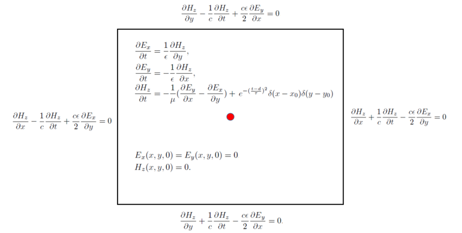
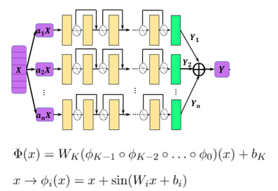
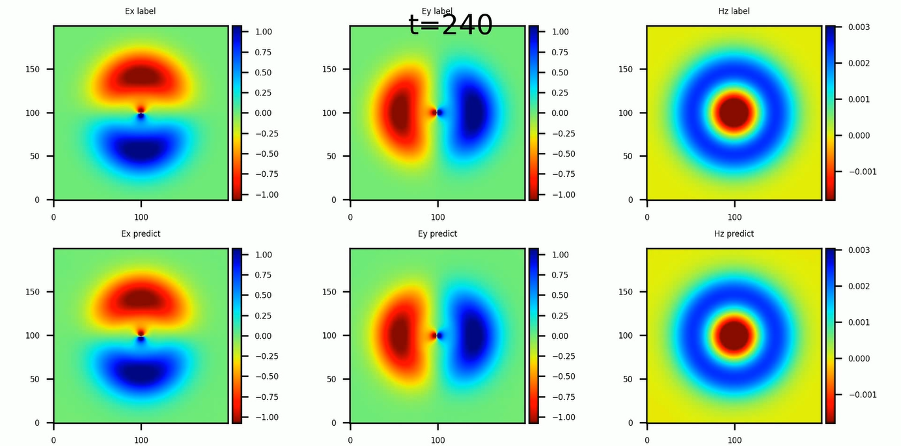

# 点源时域麦克斯韦方程AI求解

<a href="https://gitee.com/mindspore/docs/blob/r1.5/docs/mindscience/docs/source_zh_cn/mindelec/time_domain_maxwell.md" target="_blank"></a>&nbsp;&nbsp;

## 概述

人工智能技术的蓬勃发展为科学计算提供了新的范式。MindElec套件提供了物理驱动和数据驱动的AI方法。物理驱动的AI方法结合物理方程和初边界条件进行模型的训练，相比于数据驱动而言，其优势在于无需监督数据。本案例教程重点介绍物理驱动的AI方法求解点源时域麦克斯韦方程。

> 本例面向Ascend 910 AI处理器，你可以在这里下载完整的样例代码：
> <https://gitee.com/mindspore/mindscience/tree/r0.1/MindElec/examples/physics_driven/time_domain_maxwell>

## 麦克斯韦方程组

有源麦克斯韦方程是电磁仿真的经典控制方程，它是一组描述电场、磁场与电荷密度、电流密度之间关系的偏微分方程组，具体形式如下：

$$
\nabla\times E=-\mu \dfrac{\partial H}{\partial t} + J(x, t),
$$

$$
\nabla\times H=\epsilon \dfrac{\partial E}{\partial t}
$$

其中$\epsilon,\mu$分别是介质的绝对介电常数、绝对磁导率。$J(x, t)$是电磁仿真过程中的激励源，通常表现为端口脉冲的形式。这在数学意义上近似为狄拉克函数形式所表示的点源，可以表示为：

$$
J(x, t)=\delta(x - x_0)g(t)
$$

其中$x_0$为激励源位置，$g(t)$为脉冲信号的函数表达形式。

由于点源的空间分布是非连续的函数，使得源附近的物理场具有趋于无穷大的梯度。另外一个方面，激励源通常是多种频率信号的叠加。已有的基于物理信息神经网络的AI方法求解这种多尺度和奇异性问题通常无法收敛。在MindElec中，通过高斯分布函数平滑、多通道残差网络结合sin激活函数的网络结构以及自适应加权的多任务学习策略，使得针对该类问题的求解在精度和性能方面均明显优于其他框架及方法。下面将以模拟2D TE波为例，介绍MindElec求解麦克斯韦方程的具体流程。

## 问题描述

本案例模拟2维的TE波在矩形域的电磁场分布，高斯激励源位于矩形域的中心。该问题的控制方程以及初始和边界条件如下图所示:



MindElec求解该问题的具体流程如下：

1. 对求解域以及初边值条件进行随机采样，创建训练数据集。

2. 定义控制方程以及定解条件，建立数据集与约束条件的映射关系。

3. 构建神经网络。

4. 网络训练与推理。

## 导入依赖

导入本教程所依赖模块与接口:

```python
from mindelec.data import Dataset
from mindelec.geometry import Disk, Rectangle, TimeDomain, GeometryWithTime
from mindelec.loss import Constraints
from mindelec.solver import Solver, LossAndTimeMonitor
from mindelec.common import L2
from mindelec.architecture import MultiScaleFCCell, MTLWeightedLossCell
from src import create_random_dataset, get_test_data
from src import Maxwell2DMur
from src import MultiStepLR, PredictCallback
from src import visual_result
```

### 创建数据集

除了支持加载不同格式的数据集文件以外，MindElec同样支持在线生成采样数据集。Geometry模块支持创建简单几何体，然后通过不同几何体之间的逻辑运算创建复杂几何构型，并实现在几何体内部以及边界的采样。

在上述问题中，我们在矩形计算域内部均匀采样，并且在点源附近进行加密采样然后作为独立的训练数据集。因此为创建训练所需的数据集，需要实现5次采样，即由控制方程所约束的矩形域和点源附近区域的内部点采样；由初始条件所约束的矩形域和点源附近区域的内部点采样；以及由边界条件所控制的矩形域边界采样。空间采样与时间采样数据的集成构成了训练样本。

```python
# src region
disk = Disk("src", disk_origin, disk_radius)
# no src region
rectangle = Rectangle("rect", coord_min, coord_max)
diff = rectangle - disk

# time info
time_interval = TimeDomain("time", 0.0, config["range_t"])

# geometry merge with time
no_src_region = GeometryWithTime(diff, time_interval)
no_src_region.set_name("no_src")
no_src_region.set_sampling_config(create_config_from_edict(no_src_sampling_config))
src_region = GeometryWithTime(disk, time_interval)
src_region.set_name("src")
src_region.set_sampling_config(create_config_from_edict(src_sampling_config))
boundary = GeometryWithTime(rectangle, time_interval)
boundary.set_name("bc")
boundary.set_sampling_config(create_config_from_edict(bc_sampling_config))

# final sampling fields
geom_dict = {src_region : ["domain", "IC"],
                 no_src_region : ["domain", "IC"],
                 boundary : ["BC"]}
```

MindElec的Dataset接口实现了将不同的采样数据合并为统一训练数据集。因此在训练过程中只需要进行一次数据下沉，无需针对每个子数据集分别调用训练网络接口。

```python
# create dataset for train
elec_train_dataset = Dataset(geom_dict)
train_dataset = elec_train_dataset.create_dataset(batch_size=config["train_batch_size"],
                                                  shuffle=True,
                                                  prebatched_data=True,
                                                  drop_remainder=True)
```

### 定义控制方程及初边值条件

继承MindElec提供的Problem类，用户可以快速自定义Partial differential equation（PDE）问题。该问题类的一次实现即可以约束多个数据集。成员函数governing_equation、boundary_conditon、initial_condition以及constraint_function分别对应于控制方程、边界条件、初始条件以及有监督的标签或者函数约束。用户在构造函数中传入对应样本在数据集中的列名就可以自动实现对该类样本集的损失函数计算。以该问题为例，我们定义的PDE问题核心代码如下, 其中对于方程中的一阶微分可以调用梯度接口Grad来实现，相应的二阶微分可以调用接口SecondOrderGrad来完成。

```python
# 2d TE-mode Maxwell equation with 2nd-order Mur boundary condition and static initial electromagnetic field
class Maxwell2DMur(Problem):
    def __init__(self, model, config, domain_name=None, bc_name=None, ic_name=None):
        super(Maxwell2DMur, self).__init__()
        self.domain_name = domain_name
        self.bc_name = bc_name
        self.ic_name = ic_name
        self.model = model
        # operators
        self.grad = Grad(self.model)
        self.reshape = ops.Reshape()
        self.cast = ops.Cast()
        self.mul = ops.Mul()
        self.cast = ops.Cast()
        self.split = ops.Split(1, 3)
        self.concat = ops.Concat(1)

        # constants
        self.pi = Tensor(PI, mstype.float32)
        self.eps_x = Tensor(EPS, mstype.float32)
        self.eps_y = Tensor(EPS, mstype.float32)
        self.mu_z = Tensor(MU, mstype.float32)
        self.light_speed = Tensor(LIGHT_SPEED, mstype.float32)

        # gauss-type pulse source
        self.src_frq = config.get("src_frq", 1e+9)
        self.tau = Tensor((2.3 ** 0.5) / (PI * self.src_frq), mstype.float32)
        self.amp = Tensor(1.0, mstype.float32)
        self.t0 = Tensor(3.65 * self.tau, mstype.float32)

        # src space
        self.x0 = Tensor(config["src_pos"][0], mstype.float32)
        self.y0 = Tensor(config["src_pos"][1], mstype.float32)
        self.sigma = Tensor(config["src_radius"] / 4.0, mstype.float32)
        self.coord_min = config["coord_min"]
        self.coord_max = config["coord_max"]

        input_scale = config.get("input_scale", [1.0, 1.0, 2.5e+8]) # scale of input data to improve accuracy
        output_scale = config.get("output_scale", [37.67303, 37.67303, 0.1]) # scale of output data to improve accuracy
        self.s_x = Tensor(input_scale[0], mstype.float32)
        self.s_y = Tensor(input_scale[1], mstype.float32)
        self.s_t = Tensor(input_scale[2], mstype.float32)
        self.s_ex = Tensor(output_scale[0], mstype.float32)
        self.s_ey = Tensor(output_scale[1], mstype.float32)
        self.s_hz = Tensor(output_scale[2], mstype.float32)

    def smooth_src(self, x, y, t):
        """Incentive sources and Gaussian smoothing of Dirac function"""
        source = self.amp * ops.exp(- ((t - self.t0) / self.tau)**2)
        gauss = 1 / (2 * self.pi * self.sigma**2) * \
                ops.exp(- ((x - self.x0)**2 + (y - self.y0)**2) / (2 * (self.sigma**2)))
        return self.mul(source, gauss)

    @ms_function
    def governing_equation(self, *output, **kwargs):
        """maxwell equation of TE mode wave"""
        u = output[0]
        # input data
        data = kwargs[self.domain_name]
        x = self.reshape(data[:, 0], (-1, 1))
        y = self.reshape(data[:, 1], (-1, 1))
        t = self.reshape(data[:, 2], (-1, 1))

        # get gradients
        dex_dxyt = self.grad(data, None, 0, u)
        _, dex_dy, dex_dt = self.split(dex_dxyt)
        dey_dxyt = self.grad(data, None, 1, u)
        dey_dx, _, dey_dt = self.split(dey_dxyt)
        dhz_dxyt = self.grad(data, None, 2, u)
        dhz_dx, dhz_dy, dhz_dt = self.split(dhz_dxyt)

        # residual of each equation
        loss_a1 = (self.s_hz * dhz_dy) / (self.s_ex * self.s_t * self.eps_x)
        loss_a2 = dex_dt / self.s_t

        loss_b1 = -(self.s_hz * dhz_dx) / (self.s_ey * self.s_t * self.eps_y)
        loss_b2 = dey_dt / self.s_t

        loss_c1 = (self.s_ey * dey_dx - self.s_ex * dex_dy) / (self.s_hz * self.s_t * self.mu_z)
        loss_c2 = - dhz_dt / self.s_t

        src = self.smooth_src(x, y, t) / (self.s_hz * self.s_t * self.mu_z)

        pde_r1 = loss_a1 - loss_a2
        pde_r2 = loss_b1 - loss_b2
        pde_r3 = loss_c1 - loss_c2 - src
        # total residual
        pde_r = ops.Concat(1)((pde_r1, pde_r2, pde_r3))
        return pde_r

    @ms_function
    def boundary_condition(self, *output, **kwargs):
        """2nd-order mur boundary condition"""
        # network input and output
        u = output[0]
        data = kwargs[self.bc_name]

        # specify each boundary
        coord_min = self.coord_min
        coord_max = self.coord_max
        batch_size, _ = data.shape
        attr = ms_np.zeros(shape=(batch_size, 4))
        attr[:, 0] = ms_np.where(ms_np.isclose(data[:, 0], coord_min[0]), 1.0, 0.0)
        attr[:, 1] = ms_np.where(ms_np.isclose(data[:, 0], coord_max[0]), 1.0, 0.0)
        attr[:, 2] = ms_np.where(ms_np.isclose(data[:, 1], coord_min[1]), 1.0, 0.0)
        attr[:, 3] = ms_np.where(ms_np.isclose(data[:, 1], coord_max[1]), 1.0, 0.0)

        # get gradients
        dex_dxyt = self.grad(data, None, 0, u)
        _, dex_dy, _ = self.split(dex_dxyt)
        dey_dxyt = self.grad(data, None, 1, u)
        dey_dx, _, _ = self.split(dey_dxyt)
        dhz_dxyt = self.grad(data, None, 2, u)
        dhz_dx, dhz_dy, dhz_dt = self.split(dhz_dxyt)

        # residual of each boundary
        bc_r1 = dhz_dx / self.s_x - dhz_dt / (self.light_speed * self.s_x) + \
                self.s_ex * self.light_speed * self.eps_x / (2 * self.s_hz * self.s_x) * dex_dy  # 左边界
        bc_r2 = dhz_dx / self.s_x + dhz_dt / (self.light_speed * self.s_x) - \
                self.s_ex * self.light_speed * self.eps_x / (2 * self.s_hz * self.s_x) * dex_dy  # 右边界
        bc_r3 = dhz_dy / self.s_y - dhz_dt / (self.light_speed * self.s_y) - \
                self.s_ey * self.light_speed * self.eps_y / (2 * self.s_hz * self.s_y) * dey_dx  # 下边界
        bc_r4 = dhz_dy / self.s_y + dhz_dt / (self.light_speed * self.s_y) + \
                self.s_ey * self.light_speed * self.eps_y / (2 * self.s_hz * self.s_y) * dey_dx  # 上边界
        bc_r_all = self.concat((bc_r1, bc_r2, bc_r3, bc_r4))
        bc_r = self.mul(bc_r_all, attr)
        return bc_r

    @ms_function
    def initial_condition(self, *output, **kwargs):
        """initial condition: u = 0"""
        u = output[0]
        return u
```

值得注意的是，在实验过程中将网络的输入输出调整到合适数值范围（比如[0,1]）可以显著提升模型的训练速度和精度。上述代码中的input_scale和output_scale是调优的缩放系数，因此对应的麦克斯韦方程以及初边值条件也是坐标缩放之后的形式。为了有效的模拟点源问题，方程中的Dirac函数通过光滑的高斯概率分布来逼近。激励源以及高斯平滑逼近的函数形式在上述代码的smooth_src中实现，高斯平滑的方差为0.0025可以很好的结果。

Constraint接口在统一后的数据集和用户自定义的问题（如上述继承自Problem类的Maxwell2DMur）之间建立映射关系，以此在网络中获取对应每个子数据集的约束条件从而自动完成相应损失函数的计算。为了完成此步骤，针对每个子数据集初始化相应的Problem从而建立一个字典，其中字典的key对应子数据集，键值为对应的问题类。constraint_type属性用于自动获取每个数据集所对应的损失函数的计算方式，该属性支持控制方程、初始条件、边界条件、标签、函数五种形式。用户需要针对具体的形式在问题类中显式定义相应的控制条件。比如对于无源区域的采样点，该部分数据集的constrain_type为`Equation`，那么用户在问题类Maxwell2DMur中必须定义governing_equation函数来对应该数据集的约束。将数据集和问题字典传入Constraints接口即可完成数据集与约束条件的映射。

```python
# define constraints
train_prob = {}
for dataset in elec_train_dataset.all_datasets:
    train_prob[dataset.name] = Maxwell2DMur(model=model, config=config,
                                            domain_name=dataset.name + "_points",
                                            ic_name=dataset.name + "_points",
                                            bc_name=dataset.name + "_points")
print("check problem: ", train_prob)
train_constraints = Constraints(elec_train_dataset, train_prob)
```

### 构建神经网络

本例中所使用多通道残差网络并结合Sin激活函数，在该问题的模拟中取得了相比其他方法更高的精度。该神经网络的结构如下图所示：



单尺度网络的基础结构由多层残差全连接网络构成，指数通道的多尺度网络实现如下：

```python
class MultiScaleFCCell(nn.Cell):
    def __init__(self,
                 in_channel,
                 out_channel,
                 layers,
                 neurons,
                 residual=True,
                 act="sin",
                 weight_init='normal',
                 has_bias=True,
                 bias_init="default",
                 num_scales=4,
                 amp_factor=1.0,
                 scale_factor=2.0,
                 input_scale=None,
                 input_center=None,
                 latent_vector=None
                 ):
        super(MultiScaleFCCell, self).__init__()
        _check_type(num_scales, "num_scales", int)

        self.cell_list = nn.CellList()
        self.num_scales = num_scales
        self.scale_coef = [amp_factor * (scale_factor**i) for i in range(self.num_scales)]

        self.latent_vector = latent_vector
        if self.latent_vector is not None:
            _check_type(latent_vector, "latent_vector", Parameter)
            self.num_scenarios = latent_vector.shape[0]
            self.latent_size = latent_vector.shape[1]
            in_channel += self.latent_size
        else:
            self.num_scenarios = 1
            self.latent_size = 0

        # full-connect network
        for _ in range(self.num_scales):
            self.cell_list.append(FCSequential(in_channel=in_channel,
                                               out_channel=out_channel,
                                               layers=layers,
                                               neurons=neurons,
                                               residual=residual,
                                               act=act,
                                               weight_init=weight_init,
                                               has_bias=has_bias,
                                               bias_init=bias_init))
        if input_scale:
            self.input_scale = InputScaleNet(input_scale, input_center)
        else:
            self.input_scale = ops.Identity()

        self.cast = ops.Cast()
        self.concat = ops.Concat(axis=1)

    def construct(self, x):
        """running multi-scale net"""
        x = self.input_scale(x)
        if self.latent_vector is not None:
            batch_size = x.shape[0]
            latent_vectors = self.latent_vector.view(self.num_scenarios, 1, \
                self.latent_size).repeat(batch_size // self.num_scenarios, axis=1).view((-1, self.latent_size))
            x = self.concat((x, latent_vectors))
        out = 0
        for i in range(self.num_scales):
            x_s = x * self.scale_coef[i]
            out = out + self.cast(self.cell_list[i](x_s), mstype.float32)
        return out

model = MultiScaleFCCell(config["input_size"],
                         config["output_size"],
                         layers=config["layers"],
                         neurons=config["neurons"],
                         input_scale=config["input_scale"],
                         residual=config["residual"],
                         weight_init=HeUniform(negative_slope=math.sqrt(5)),
                         act="sin",
                         num_scales=config["num_scales"],
                         amp_factor=config["amp_factor"],
                         scale_factor=config["scale_factor"]
                         )
```

### 自适应加权损失函数加速收敛

物理信息神经网络直接利用控制方程进行网络训练。相应的该网络的损失函数通常包含控制方程、边界条件以及初始条件这三项的残差。在本案例中，由于点源附近区域的加密采样并作为独立子数据集进行网络训练，因此损失函数的构成包含如下五项：有源区域的控制方程和初始条件、无源区域的控制方程和初始条件以及边界条件。实验表明，这五项损失函数量级差异明显，因此简单的损失函数求和会导致网络训练失败，而手动调节每项损失函数的权重信息极为繁琐。MindElec发展了一种基于多任务学习不确定性估计的加权算法，通过引入可训的参数，自适应的调节每项损失函数的权重，可以显著的提升训练速度和精度。该算法的实现具体如下：

```python
class MTLWeightedLossCell(nn.Cell):
    def __init__(self, num_losses):
        super(MTLWeightedLossCell, self).__init__(auto_prefix=False)
        self.num_losses = num_losses
        self.params = Parameter(Tensor(np.ones(num_losses), mstype.float32), requires_grad=True)
        self.concat = ops.Concat(axis=0)
        self.pow = ops.Pow()
        self.log = ops.Log()
        self.div = ops.RealDiv()

    def construct(self, losses):
        loss_sum = 0
        params = self.pow(self.params, 2)
        for i in range(self.num_losses):
            weighted_loss = 0.5 * self.div(losses[i], params[i]) + self.log(params[i] + 1.0)
            loss_sum = loss_sum + weighted_loss
        return loss_sum

# self-adaptive weighting
mtl = MTLWeightedLossCell(num_losses=elec_train_dataset.num_dataset)
```

### 模型测试

MindElec可以通过自定义的callback函数，实现边训练边推理的功能。用户可以直接加载测试数据集，然后实现自定义的callback函数实现推理并分析结果。

```python
loss_time_callback = LossAndTimeMonitor(steps_per_epoch)
callbacks = [loss_time_callback]
if config.get("train_with_eval", False):
    inputs, label = get_test_data(config["test_data_path"])
    predict_callback = PredictCallback(model, inputs, label, config=config, visual_fn=visual_result)
    callbacks += [predict_callback]
```

### 模型训练

MindElec提供的Solver类是模型训练和推理的接口。输入优化器、网络模型、PDE的约束（train_constraints）和可选参数（如自适应加权算法模块），即可定义求解器对象solver。在该案例中利用MindSpore + Ascend混合精度模式，训练网络，从而完成求解麦克斯韦方程。

```python
# mixed precision
model = model.to_float(mstype.float16)
model.input_scale.to_float(mstype.float32)

# optimizer
params = model.trainable_params() + mtl.trainable_params()
lr_scheduler = MultiStepLR(config["lr"], config["milestones"], config["lr_gamma"], steps_per_epoch, config["train_epoch"])
lr = lr_scheduler.get_lr()
optim = nn.Adam(params, learning_rate=Tensor(lr))

# define solver
solver = Solver(model,
                optimizer=optim,
                mode="PINNs",
                train_constraints=train_constraints,
                test_constraints=None,
                metrics={'l2': L2(), 'distance': nn.MAE()},
                loss_fn='smooth_l1_loss',
                loss_scale_manager=DynamicLossScaleManager(init_loss_scale=2 ** 10, scale_window=2000),
                mtl_weighted_cell=mtl,
                )

solver.train(config["train_epoch"], train_dataset, callbacks=callbacks, dataset_sink_mode=True)
```

基于上述方法求解得到的瞬时电磁场分布与参考标签数据的对比结果如下图所示。


