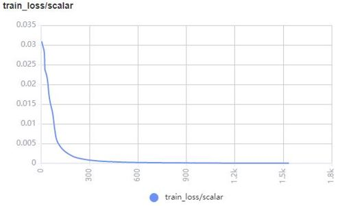
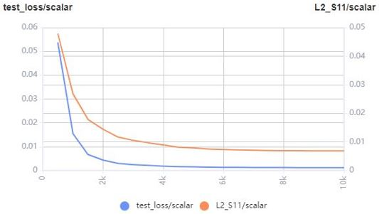
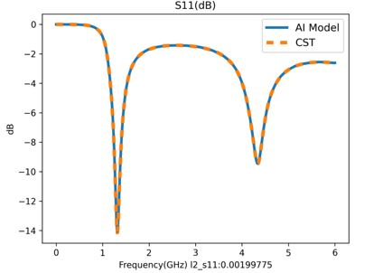
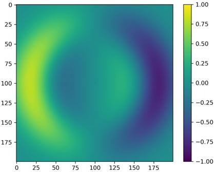
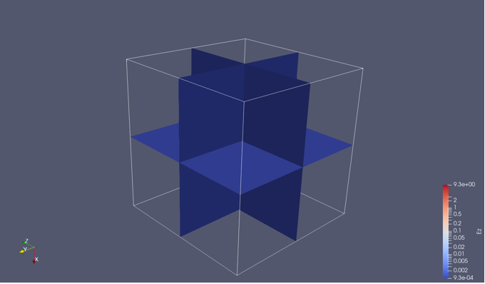
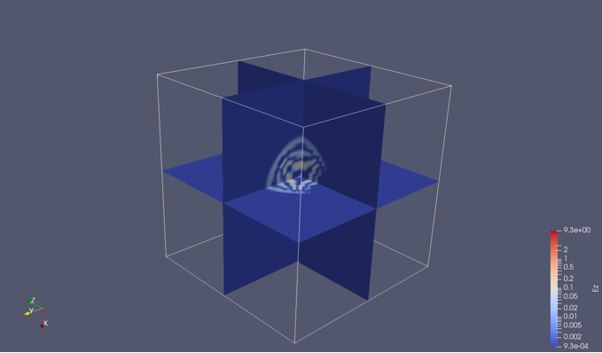
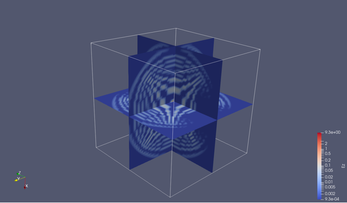

# 电磁仿真结果可视化

<a href="https://gitee.com/mindspore/docs/blob/r1.5/docs/mindscience/docs/source_zh_cn/mindelec/visualization.md" target="_blank"></a>&nbsp;&nbsp;

## 概述

电磁仿真结果通常包含仿真区域内的电磁场、S参数等物理量。仿真结果的可视化能够直观反映所关心物理量的大小和分布，辅助设计人员调试调优。MindElec提供了对训练/测试过程，以及仿真结果（电磁场、S参数）的可视化模块`mindelec.vision`，下面的案例将介绍如何通过`mindelec.vision`进行可视化。

## 训练/测试过程可视化

MindElec主要通过调用MindInsight的接口可视化训练/测试过程中的各项指标和结果，可视化文件通过回调函数Callback函数生成，其中数据集和网络定义具体可参照参数化教程。

``` python
solver = Solver(network=model_net,
                mode="Data",
                optimizer=optim,
                loss_fn=nn.MSELoss())

monitor_train = MonitorTrain(per_print_times=1,
                             summary_dir='./summary_dir_train')

monitor_eval = MonitorEval(summary_dir='./summary_dir_eval',
                           model=solver,
                           eval_ds=data["eval_loader"],
                           eval_interval=opt.print_interval,
                           draw_flag=True)

callbacks_train = [monitor_train, monitor_eval]
```

通过callbacks参数传入solver即可绘制训练过程中的loss曲线，以及测试集的相对误差曲线。

``` python
solver.model.train(epoch=opt.epochs,
                   train_dataset=data["train_loader"],
                   callbacks=callbacks_train,
                   dataset_sink_mode=True)
```

以下是通过该方法绘制的训练集的loss曲线示例：



以下是通过该方法绘制的测试集的loss曲线和相对误差曲线示例：



绘制随着训练的进行，测试集的S11预测结果



## S11可视化

MindElec提供了`plot_s11`函数可视化S11曲线，该可视化工具调用代码如下：

``` python
s11_tensor = s11
path_image_save = './result'
legend = 's11'
dpi = 300
plot_s11(s11_tensor, path_image_save, legend, dpi)
```

可视化结果（MindElec和商业软件CST结果对比）


## 二维电磁场可视化

MindElec提供了`plot_eh`函数可视化电磁波的二维剖面，该可视化工具调用代码如下：

``` python
simu_res_tensor = result_eh
path_image_save = './result'
z_index = 5
dpi = 300
plot_eh(simu_res_tensor, path_image_save, z_index, dpi)
```

不同时刻的Ex二维可视化结果




Ex的连续动图如下：


## 三维结果可视化

MindElec 提供`vtk_structure`函数，用于生成三维电磁场的可视化文件，该软件可以通过ParaView读取展示三维效果。

运行以下代码为仿真结果生成每个时刻的三维可视化`.vts`文件。

``` python
grid_tensor = result_grid
eh_tensor = result_eh
path_res = './result_vtk'
vtk_structure(grid_path, eh_path, path_res)
```

其中grid_tensor为三维网格坐标文件，维度通常为：（t_dim, x_dim, y_dim, z_dim, 4），最后一轴存储网格点空间时间信息（x, y, z, t）。eh_tensor为生成的电磁场三维网格文件，维度通常为：（t_dim, x_dim, y_dim, z_dim, 6），最后一轴存储网格点电磁场值（Ex, Ey, Ez, Hx, Hy, Hz）。

不同时刻的Ez三维可视化结果







Ez的连续动图如下：


