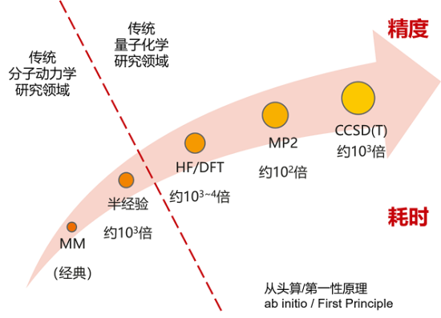
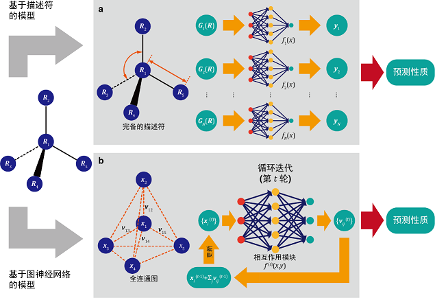
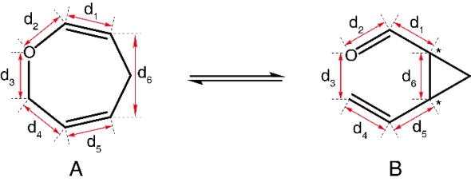
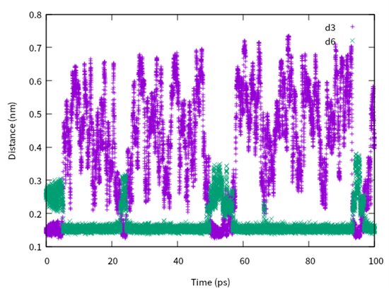
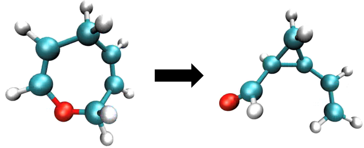

# 基于AI分子力场模拟分子动力学

<a href="https://gitee.com/mindspore/docs/blob/r1.6/docs/mindscience/docs/source_zh_cn/mindsponge/claisen.md" target="_blank"></a>

## 概述

本教程将展示如何通过Cybertron架构的AI分子力场进行分子动力学模拟, 模拟经典的克莱森重排反应。

## 准备环节

实践前，确保已经正确安装最新版本的MindSpore与MindSPONGE。如果没有，可以通过：

- [MindSpore安装页面](https://www.mindspore.cn/install)安装MindSpore。
- [MindSPONGE安装页面](https://gitee.com/mindspore/mindscience/tree/r0.2/MindSPONGE)安装MindSPONGE。

教程中的体系结构文件建模由AmberTools中自带的tleap工具（下载地址<http://ambermd.org/GetAmber.php>， 遵守GPL协议）完成。

## 背景介绍

在分子动力学MD（molecular dynamics）模拟中，分子力场（force field）用于描述分子不同的构型和构象所产生的能量和力，通常将体系的势能（potential）U(R)描述为关于体系中各个原子的坐标R的函数，而每个原子所受到的力F(R)等于势能U(R)对原子坐标R偏导数的负数：

$$ F(R) = -\frac{\partial U}{\partial R}$$

在传统的MD模拟中，体系的势能函数通常使用两种方法获得：

第一种方法称为量子力学QM（quantum mechanics），是通过求解体系的薛定谔方程（Schrödinger Equation）获得体系的势能，使用这种方式进行的MD模拟称为“从头算分子动力学AIMD（ab initio molecular dynamics）”。这种方式虽然理论上可以精确求解体系的势能函数，然而现实却是对于粒子数大于二的体系，薛定谔方程是无法精确求解的，只能使用各种手段进行近似求解。而根据近似的方法不同，求解所需要的计算量差别非常大。而且即便是计算量最小的HF（Hartree Fock）或DFT（(density functional theory）方法，所需要的计算量也是巨大的。

第二种方法则称为分子力学MM（molecular mechanics）方法，即将体系的总势能按照分子的不同结构和性质拆分成不同的相互作用项，每一项都使用简单的数学函数对量子力学计算或者实验数据进行拟合。相较于QM方法，使用MM方法计算体系的势能要快的多，所以绝大多数经典分子动力学（classical molecular dynamics）都是使用的这种方法。但是通常MM方法计算的精度要小于QM方法，而且由于体系的相互作用项是预先设定好的，所以通常无法模拟发生化学反应时的情况（比如化学键的生成和断裂）。

除了QM方法和MM方法之外，还有一种介于两者之间的半经验（semi-empirical），其速度和精度处于也介于这两者之间。



*图1: 势能函数获取方法*

可以说在传统的计算化学（computational chemistry）领域，“速度”和“精度”总是一对矛盾体，选择更高精度的算法必然意味着计算速度的急剧下降。而通过使用深度学习（deep learning）技术则有可能突破“速度”和“精度”的矛盾，由于人工神经网络（artificial neural network）具备强大的拟合能力，如果使用其用于拟合高精度QM方法计算得到的势能，就有可能以相对较低的计算代价实现较高精度的分子力场。

目前已经有了几种可以根据分子构象预测分子势能的神经网络模型，按照工作原理这些模型大致可以分成两类，即基于描述符（descriptor）的模型和基于图神经网络GNN（graph neural network）模型：

- 基于描述符（descriptor）的模型将体系按照不同类型的中心原子及其周围的环境分成不同的“描述符”，每个的描述符根据其类型使用一套神经网络预测其局部的势能，最终将所有的预测势能进行加和以获得体系的总势能。此类模型的代表有2007年的Behler-Parrinello（BP）模型，2017年的ANI-1模型以及2018年的DPMD模型等。

- 基于GNN的模型则将分子体系看作一张图（graph），每个原子作为点（vertex），原子间的相对距离座位边（edge）。在GNN模型中，每个点和变都用向量进行表示，之后对原子根据其周围的点向量和边向量对中心原子的点向量进行更新，通过几次更新迭代后得到每个原子所感受到的势能，最终将所有原子上的势能进行加和从而得到体系的总势能。相对于基于描述符的模型对于不同类型的描述符使用不同的神经网络进行处理，基于GNN的模型在每次更新迭代的时候，对所有原子都是用相同参数的神经网络进行处理。这类模型有2017年MPNN模型，2018年的SchNet模型，2019年的PhysNet模型，2021年的DeepMoleNet模型以及2021年北京大学和深圳湾实验室高毅勤教授课题组同华为合作开发的“分子CT”（molecular configuration transformer）模型。



*图2: 模型结构图*

2021年8月，高毅勤教授课题组开源了基于MindSpore的GNN深度分子模型框架Cybertron，支持分子CT模型、SchNet模型以及PhysNet模型，且用户可以基于该架构实现自己的GNN深度分子模型。而MindSPONGE则是高毅勤教授课题组同华为MindSpore团队合作开发的全新一代人工智能分子动力学模拟软件， 其原生支持基于深度学习的相关算法。MindSPONGE和Cybertron相配合，可以使用Cybertron训练分子力场，在MindSPONGE中进行分子动力学模拟。

下面我们将以有机化学中经典的克莱森重排（Claisen rearrangement）反应为例，介绍如何使用Cybertron训练高精度的分子力场，并使用MindSPONGE进行分子动力学模拟。

## 分子构象的抽样



*图3: 分子内可逆克莱森重排反应*

如上图所示，该反应是一个典型的在分子内可逆克莱森重排反应，体系可以在七元环（以下简称A分子）和三元环（以下简称B分子）之间进行转化。如果要建立该反应的分子力场，首先需要对该体系的构象进行充足的抽样。在这里我们选择使用半经验的DFTB方法，对该体系进行快速地构想搜索。由于目前版本的MindSPONGE中暂时不支持基于QM的方法，这里我们使用免费的分子动力学模拟软件包`AmberTools`中的`sander`程序运行基于DFTB的MD模拟。运行该程序需要的参数文件为`cba.prmtop`，坐标文件为`cba.rst7`，输入文件为：

```text
MD simulation
 &cntrl
  imin = 0, nstlim = 50000000, dt = 0.001,
  ntx = 5, irest=1,
  cut = 999.0, rgbmax = 999.0
  tempi = 800, ntt = 3, temp0 = 800, gamma_ln = 5.0,
  ntc = 2, ntf = 2, tol = 1.0d-8,
  ntb = 0,
  ntpr = 500, ntwx = 10, ntwr = 500,
  ioutfm = 1, ifqnt=1,
  plumed = 1, plumedfile='plumed.dat'
 /
 &qmmm
  qmmask=':1',
  qmcharge=0,
  qm_theory='DFTB',
  qmcut=10.0,
  qmshake=0,
  printcharges=1,
  qm_ewald=1, qm_pme=1
 /
```

然而该反应的势垒大约在100 kJ/mol（A分子到B分子）和60 kJ/mol （B分子到A分子）左右，如果使用普通的MD进行模型，即使是使用模拟速度较快的半经验方法，在目前可以达到的模拟时间之内几乎无法观察到反应。所以这里我们需要使用增强抽样（enhanced sampling）方法加速反应的发生，在这里我们选择使用[埋拓动力学Metadynamics方法](https://people.sissa.it/~laio/Research/Res_metadynamics.php)。

埋拓动力学是一类基于集成变量CV（collective variables）的增强抽样方法。CV有时也被称为“反应坐标”（reaction coordinate）或者“序参量”（order parameter），通常是描述体系中所感兴趣的慢自由度所对应的物理量。例如在本次要研究的克莱森重排反应体系中，可以选择d3和d6两个距离的差作为CV。在MD中使用埋拓动力学，会不断地在体系当前状态所对应CV的位置添加高斯形式的偏向势（bias potential），从而将体系推离当前CV所在的位置，从而加快体系对于CV空间的搜索。

这里我们使用[PLUMED2](https://www.plumed.org/)来实现埋拓动力学的功能。PLUMED2是一种分子动力学插件库，使用其可以在多个MD软件中实现增强抽样效果。在这里我们使用的PLUMED2输入脚本为：

```bash
MOLINFO STRUCTURE=./cba.pdb
WHOLEMOLECULES STRIDE=1 ENTITY0=1-15

d1: DISTANCE ATOMS=1,3
d2: DISTANCE ATOMS=1,15
d3: DISTANCE ATOMS=12,15
d4: DISTANCE ATOMS=12,10
d5: DISTANCE ATOMS=8,10
d6: DISTANCE ATOMS=3,8

cv: COMBINE ARG=d3,d6, COEFFICIENTS=-1,1 PERIODIC=NO

METAD ...
 CALC_RCT
 WALKERS_MPI
 LABEL=metad
 ARG=cv
 PACE=50
 HEIGHT=2.5
 SIGMA=0.01
 GRID_MIN=-0.7
 GRID_MAX=0.3
 GRID_BIN=1000
 TEMP=300
 BIASFACTOR=100
... METAD

PRINT ...
 ARG=cv,d1,d2,d3,d4,d5,d6
 STRIDE=10
 FILE=colvar.info.data
... PRINT

PRINT ...
 ARG=metad.*
 STRIDE=10
 FILE=colvar.bias.data
... PRINT
```

这里我们为了提高采样的效率，使用多重行走（multiple walker）算法，即同时运行多条轨迹，埋拓动力学根据所有的轨迹更新偏向势，并将更新后的偏向势运用到所有的轨迹。这里我们同时运行四条MD轨迹，执行命令为：

```bash
mpirun -np 4 sander.MPI -groupfile group.dat -ng 4
```

其中group.dat文件的内容为：

```text
-O -i md.in -o cba_metad_mw0.out  -p cba.prmtop  -c cba_md_mw0.rst7  -r cba_metad_mw0.rst7  -x cba_metad_mw0.nc  -inf cba_metad_mw0.info
-O -i md.in -o cba_metad_mw1.out  -p cba.prmtop  -c cba_md_mw1.rst7  -r cba_metad_mw1.rst7  -x cba_metad_mw1.nc  -inf cba_metad_mw1.info
-O -i md.in -o cba_metad_mw2.out  -p cba.prmtop  -c cba_md_mw2.rst7  -r cba_metad_mw2.rst7  -x cba_metad_mw2.nc  -inf cba_metad_mw2.info
-O -i md.in -o cba_metad_mw3.out  -p cba.prmtop  -c cba_md_mw3.rst7  -r cba_metad_mw3.rst7  -x cba_metad_mw3.nc  -inf cba_metad_mw3.info
```

使用该方法可以让体系在A分子和B分子之间实现快速的转变。在`colvar.info.data`文件中记录了体系中各个距离的分布，我们可以用绘图软件查看MD模拟过程中相关原子距离的变化。例如下图展示了其中一条轨迹中的d3和d6两个距离随模拟时间的变化，可以看到仅仅在前100ps的模拟中两者数值的相对大小就发生了若干次转变，每次转变都意味着发生了化学反应，说明这种方法可以对该体系进行有效地增强抽样。



*图4: d3和d6两个距离随模拟时间的变化*

## 高精度量子化学计算

在对分子构象进了充分的抽样之后，就可以在其中随机抽取若干构象进行高精度量子化学计算。sander程序得到的轨迹文件后缀名是.nc，使用[MDAnalysis](https://www.mdanalysis.org)这个工具包，就可以在Python中读取对应的坐标文件。例如，使用下面的脚本就可以将nc文件中的坐标转换为numpy数组：

```python
import numpy as np
import MDAnalysis as mda

parmfile = 'cba.prmtop'
nfile = 4
xyz = []
for idx in range(nfile):
    ncfile = 'cba_metad_mw' + str(idx)+'.nc'
    print(ncfile)
    u = mda.Universe(parmfile,ncfile)
    print(u.trajectory)
    for ts in u.trajectory:
        r = ts.positions
        xyz.append(r.copy())
xyz = np.array(xyz)
np.savez('cba_metad.npz',R=xyz)
```

之后我们需要随机抽取一定数量的构象，我们用Python脚本随机选取一定的数量的构象并保存为xyz格式：

```python
import os
import numpy as np

dataname = 'cba_metad.npz'
data = np.load(dataname)
R = data['R']
atypes = ['C','H','C','H','C','H','H','C','H','C','H','C','H','H','O',]
num = 132096
n = R.shape[0]
idx = np.arange(n)
np.random.shuffle(idx)
idx = idx[0:num]
R = R[idx]
fname = 'cba'
for i in range(n):
    xyzfile = 'xyz/' + fname + '_pos' + str(i) + '.xyz'
    xyz = R[i]
    with open(xyzfile,'w') as ofile:
        ofile.write(str(atypes.shape[0])+os.linesep)
        ofile.write(' CBA'+os.linesep)
        for ia,a in enumerate(xyz):
            line = atypes[ia]
            line += '{:>16.8f}'.format(a[0])
            line += '{:>16.8f}'.format(a[1])
            line += '{:>16.8f}'.format(a[2])
            ofile.write(line+os.linesep)
```

这里为了训练方便，我们选择1024*128个构象作为训练集，1024个构象作为验证集，总共需要生成132096个构象。接下来我们需要使用量子化学软件计算每个构象的单点能及梯度。这里我们选择用面向学术用户免费的量子化学软件[ORCA](https://orcaforum.kofo.mpg.de)，使用DFT中的B3LYP方法，基组选择`6-31+G**`。使用ORCA计算单个构象的单点能和能量的脚本文cba_pos0.inp件为：

```text
! B3LYP 6-31+G**
%base "output/cba_pos0"
%pal nprocs 1 end
%maxcore 4000
%method RunTyp Gradient end
* xyzfile 0 1 xyz/cba_pos0.xyz
```

脚本运行命令为：

```bash
orca cba_pos0.inp > cba_pos.out
```

计算结束之后会生成后缀名为engrad文件，里面记录了构象的单点能、梯度以及坐标。计算单个构象所需要的时间大约为两分钟，如果在超算集群上使用64个核心进行批量运算的话，总计算时间大约需要两天左右。

## 模型训练

所有的量化计算结束之后，可以通过读取`engrad`文件，获得所需要的数据集。这里可以通过我们提供的`load_engrad.py`脚本将engrad文件中的信息存储为一个numpy数值文件：

```bash
python load_engrad.py --i output/cba_pos --n 132096 --o cba_orca.npz
```

这里output/cba_pos为engrad文件的前缀名，132096为文件数目，cba_orca.npz为存储numpy数组的文件名。

在训练之前需要对数据集进行预处理，主要涉及基准能量的扣除和单位转换，由于量子化学计算所获得单点能的数值较大，不便于训练，所以通常需要先对其扣除一个基准能量。基准能量的通常是相同方法下单个原子的单点能的加。同样使用B3LYP方法和6-31+G**基组，计算得到单个C、H以及O原子的能量分别为-0.496862052688，-37.762005387953和-74.935438100380，我们需要在单点能中扣除相应的能量。另一方面，ORCA中默认能量为Hartree，长度单位为Bohr，而通常MD中使用的能量单位为kJ/mol或kcal/mol，长度单位为nm或Angstrom，因此我们需要对此进行预处理。这里我们用Python脚本将其单位转换为kcal/mol和Angstrom：

```python
import numpy as np

filename = 'cba_orca.npz'
data = np.load(filename)
R = data['R']
F = data['F']
E = data['E']
ref_H = -0.496862052688
ref_C = -37.762005387953
ref_O = -74.935438100380
ref_E = ref_C *6 + ref_H* 8 + ref_O
A = 0.529177
kcal = 627.5096080305927
E = E - ref_E
R = R *A
E = E* kcal
F = F * kcal / A
np.savez('cba_kcal_mol_A.npz',R=R,F=F,E=E)
```

预处理之后的便可以进行数据集的标准化和切分。主要除了要对能量E进行标准化之外，也需要用同样的scale对力F进行处理：

```python
import numpy as np

filename = 'cba_kcal_mol_A.npz'
data = np.load(filename)
R = data['R']
F = data['F']
E = data['E']
Z = np.array([[6,1,6,1,6,1,1,6,1,6,1,6,1,1,8],]).astype(np.int32)
avg = np.mean(E)
avg2 = np.mean(E*E)
std = np.sqrt(avg2-avg*avg)
scale = std / Z.size
shift = avg
E = (E - shift) / scale
F = F / scale
ff = np.linalg.norm(F,axis=-1)
favg = np.mean(ff)
force_scale = 1.0 / favg
R = R.astype(np.float32)
F = F.astype(np.float32)
E = E.astype(np.float32)
num_train = 1024 * 128
num_valid = 1024
num = num_train + num_valid
idx = np.arange(num)
np.random.shuffle(idx)
id_begin = 0
id_end = id_begin + num_train
train_idx = idx[id_begin:id_end]
id_begin = id_end
id_end = id_begin + num_valid
valid_idx = idx[id_begin:id_end]
dataname = 'cba_kcal_mol_A_train_'+str(num_train)+'.npz'
print(dataname)
np.savez(dataname,scale=scale,shift=shift,force_scale=force_scale,Z=Z,R=R[train_idx],F=F[train_idx],E=E[train_idx])
dataname = 'cba_kcal_mol_A_valid_'+str(num_valid)+'.npz'
print(dataname)
np.savez(dataname,scale=scale,shift=shift,force_scale=force_scale,Z=Z,R=R[valid_idx],F=F[valid_idx],E=E[valid_idx])
```

现在，就可以是使用[训练脚本](https://gitee.com/mindspore/mindscience/tree/r0.2/MindSPONGE/examples/claisen_rearrangement/src)进行训练了。

## 脚本介绍

```text
|-- claisen_rearrangement
|-- README_CN.md
|   |-- data
|   |-- src
|       |-- main.py
|       |-- simulation_cybertron.py
```

训练命令如下：

```bash
python main.py
```

## 结果可视化

模拟过程中，步骤的计算如下所示：

```text
_steps_ _TEMP_ _TOT_POT_ENE_ _CVariable_ _Bias_Potential_
   1    0.000    464.834        1.449         0.222
   ...
```

模拟完成后，可以通过可视化软件观察得到重排反应的变化的过程，可以看到体系在七元环和三元环之间进行转化。可视化结果如下图所示：



*图5: 分子内可逆克莱森重排反应仿真结果*
