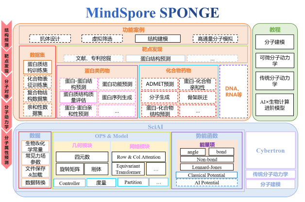

# MindSPONGE介绍

MindSpore SPONGE(Simulation Package tOwards Next GEneration molecular modelling)是基于[昇思MindSpore](https://www.mindspore.cn/)的计算生物领域套件，支持分子动力学、蛋白质折叠等常用功能，旨在于为广大的科研人员、老师及学生提供高效易用的AI计算生物软件。



## 安装教程

### 硬件支持情况

| 硬件平台      | 操作系统        | 状态 |
| :------------ | :-------------- | :--- |
| Ascend 910    | Ubuntu-x86      | ✔️ |
|               | Ubuntu-aarch64  | ✔️ |
|               | EulerOS-aarch64 | ✔️ |
|               | CentOS-x86      | ✔️ |
|               | CentOS-aarch64  | ✔️ |
| GPU CUDA 10.1 | Ubuntu-x86      | ✔️ |

### 前置依赖

- Python>=3.7
- MindSpore>=1.8

MindSpore安装教程请参考[MindSpore官网](https://www.mindspore.cn/install)。

### 源码安装

```bash
git clone https://gitee.com/mindspore/mindscience.git
cd mindscience/MindSPONGE
```

- 安装依赖

    ```bash
    pip install -r requirements.txt
    ```

- 昇腾后端

    ```bash
    bash build.sh -e ascend
    ```

- GPU后端

    若使用Cybetron，开启编译选项 `c`。

    若使用传统分子动力学sponge，开启编译选项 `t`。

    ```bash
    export CUDA_PATH={your_cuda_path}
    bash build.sh -e gpu -j32 -t on -c on
    ```

- 安装编译所得whl包

    ```bash
    cd output/
    pip install mindscience_sponge*.whl
    pip install mindscience_cybertron*.whl
    ```

## 案例初体验

### 蛋白质 violation 计算

蛋白质推理模型预测的pdb虽然在绝大多数原子上都准确预测出理想的键长和键角，然而原子间是否存在冲突以及肽键信息对于真实结构也尤为重要，violation 则计算了预测pdb的总原子间冲突程度以及肽键键长键角是否满足一定的限制条件。该计算数值对于评估预测蛋白质结构是否合理以及后续做蛋白质relax尤其重要。

violation计算公式如下:

\begin{align}
\mathcal L_{viol} = \mathcal L_{bondlength }+\mathcal L_{bondangle }+\mathcal L_{clash } .
\end{align}

```bash
import mindspore as ms
from mindspore import context
from mindspore import Tensor
from mindsponge.common.utils import get_pdb_info
from mindsponge.metrics.structure_violations import get_structural_violations

# set which gpu to use, in default use 0 card
ms.set_context(mode=ms.GRAPH_MODE, device_target="GPU", device_id=0)
input_pdb = "xxx.pdb"

# extract features from pdb
features = get_pdb_info(input_pdb)

violations = get_structural_violations(Tensor(features.get("atom14_gt_exists")).astype(ms.float32),
                                       Tensor(features.get("residue_index")).astype(ms.float32),
                                       Tensor(features.get("aatype")).astype(ms.int32),
                                       Tensor(features.get("residx_atom14_to_atom37")).astype(ms.int32),
                                       Tensor(features.get("atom14_gt_positions")).astype(ms.float32))
violation_all = violations[-1]
```

### 四元数与旋转矩阵转换

geometry模块提供基础四元数、旋转矩阵、向量操作。

```bash
from mindsponge.common.geometry import initial_affine
from mindsponge.common.geometry import quat_to_rot, rot_to_quat
# quaternion is a mindspore tensor
# rotation_matrix is a tuple of mindspore tensor, length is 9
# translation is a tuple of mindsproe tensor, length is 3
quat, rot, trans = initial_affine(128) # 128 is the num of residues
transformed_rot = quat_to_rot(quat)
transformed_quat = rot_to_quat(rot)
```

### 一个简单的分子动力学模拟案例

```bash
import numpy as np
from mindspore import context
from mindsponge import Sponge
from mindsponge import Molecule
from mindsponge import ForceFieldBase
from mindsponge import DynamicUpdater
from mindsponge.potential import BondEnergy, AngleEnergy
from mindsponge.callback import WriteH5MD, RunInfo
from mindsponge.function import VelocityGenerator
from mindsponge.control import LeapFrog

context.set_context(mode=context.GRAPH_MODE, device_target="GPU")

system = Molecule(
    atoms=['O', 'H', 'H'],
    coordinate=[[0, 0, 0], [0.1, 0, 0], [-0.0333, 0.0943, 0]],
    bond=[[[0, 1], [0, 2]]],
)

bond_energy = BondEnergy(
    index=system.bond,
    force_constant=[[345000, 345000]],
    bond_length=[[0.1, 0.1]],
)

angle_energy = AngleEnergy(
    index=[[1, 0, 2]],
    force_constant=[[383]],
    bond_angle=[[109.47 / 180 * np.pi]],
)

energy = ForceFieldBase(energy=[bond_energy, angle_energy])

velocity_generator = VelocityGenerator(300)
velocity = velocity_generator(system.coordinate.shape, system.atom_mass)

opt = DynamicUpdater(
    system,
    integrator=LeapFrog(system),
    time_step=1e-3,
    velocity=velocity,
)

md = Sponge(system, energy, opt)

run_info = RunInfo(10)
cb_h5md = WriteH5MD(system, 'test.h5md', save_freq=10, write_velocity=True, write_force=True)

md.run(1000, callbacks=[run_info, cb_h5md])
```

## SIG小组介绍

MindSpore SPONGE SIG(Special Interesting Group)是由一群有兴趣，有使命，旨在AI×生物计算领域做出一番成就的人组成的团队。

MindSpore SPONGE SIG小组为广大科研人员，老师和学生提供高效易用的AI计算生物软件的同时，为在这个领域有着强大的能力或者浓厚的兴趣的人们提供了一个能够共同交流合作的平台。

在SIG小组中，我们还会发布众智任务和开源实习任务，欢迎大家来认领。