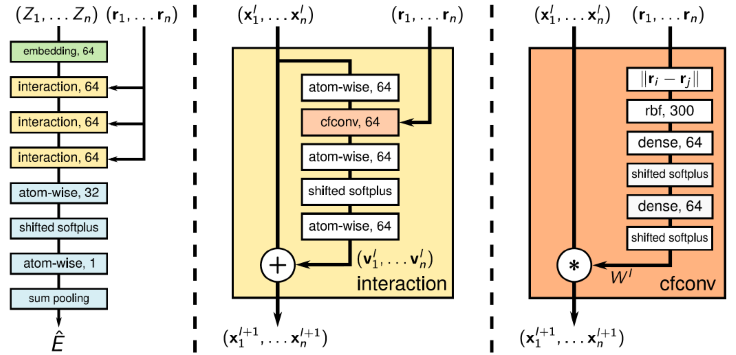
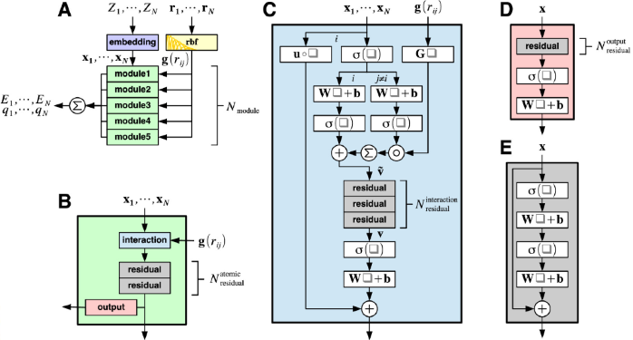
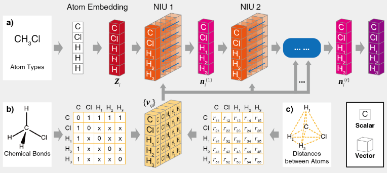

# Hybrid approaches that involve both the physics and data assimilation

<a href="https://gitee.com/mindspore/docs/blob/master/docs/mindsponge/docs/source_en/cybertron.md" target="_blank"></a>

MindSPONGE software package includes MindSpot based depth molecular model general architecture Cybertron, which can support graph neural network (GNN) based depth molecular model.

Three GNN molecular models are built in Cybertron: SchNet [1], PhysNet [2] and MolCT [3].

## Three GNN Molecular Models

- SchNet Model architecture

  

- PhysNet Model architecture

  

- MolCT Model architecture

  

The three GNN molecular models can be directly called from Cybertron.

## Install

Please refer to [MindSPONGE Installation Tutorial](https://www.mindspore.cn/mindsponge/docs/en/master/index.html#installation)，Ensure that the pre dependency installation is complete.

Cybertron installation can be compiled and installed using source code.

```bash
git clone https://gitee.com/mindspore/mindscience.git
cd {PATH}/mindscience/MindSPONGE
```

When using Cybertron, turn on the compilation option 'c'.

```bash
bash build.sh -e gpu -j32 -t on -c on
```

Install the compiled whl package.

```bash
cd {PATH}/mindscience/MindSPONGE/output
pip install mindscience_sponge*.whl
pip install mindscience_cybertron*.whl
```

Cybertron installation is complete.

## Initialization

Cybertron network consists of a model and a Readout function. The initialization of the network can be directly called by a string, using the default super parameter, or can be defined separately and then transferred to the network.

- Call directly with string

  ```bash
  net = Cybertron(model='schnet', readout='graph'. dim_output=1, num_atoms=num_atom)
  ```

- The model and parameters are defined separately and then transferred to Cybertron

  ```bash
  mod = MolCT(cutoff=1. n_interaction=3, dim_feature=128, activation='swish')
  readout = AtomwiseReadout(model=mod, dim_output=1)
  net=Cybertron(model=mod, readout=readout, dim_output=1, num_atoms=num_atom)
  ```

## Course

Please refer to the [Cybertron Tutorial](https://gitee.com/mindspore/mindscience/tree/master/MindSPONGE/tutorials/cybertron) in the code warehouse.

Data set required by Cybertron tutorials：

- download [dataset_qm9.npz](http://gofile.me/6Utp7/tJ5hoDIAo)

- download [ethanol_dft.npz](http://gofile.me/6Utp7/hbQBofAFM)

To obtain the checkpoint of the last case, run the following instructions at the terminal.

```bash
wget https://download.mindspore.cn/mindscience/mindsponge/ckpts/Cybertron/checkpoint_c10.ckpt
```

## Reference

[1] Kristof T. Schütt, et al. [SchNet: A continuous-filter convolutional neural network for modeling quantum interactions](https://arxiv.org/abs/1706.08566).

[2] Oliver T. Unke, et al. [PhysNet: A Neural Network for Predicting Energies, Forces, Dipole Moments and Partial Charges](https://arxiv.org/abs/1902.08408).

[3] Jun Zhang, et al. [Molecular CT: Unifying Geometry and Representation Learning for Molecules at Different Scales](https://arxiv.org/abs/2012.11816).
