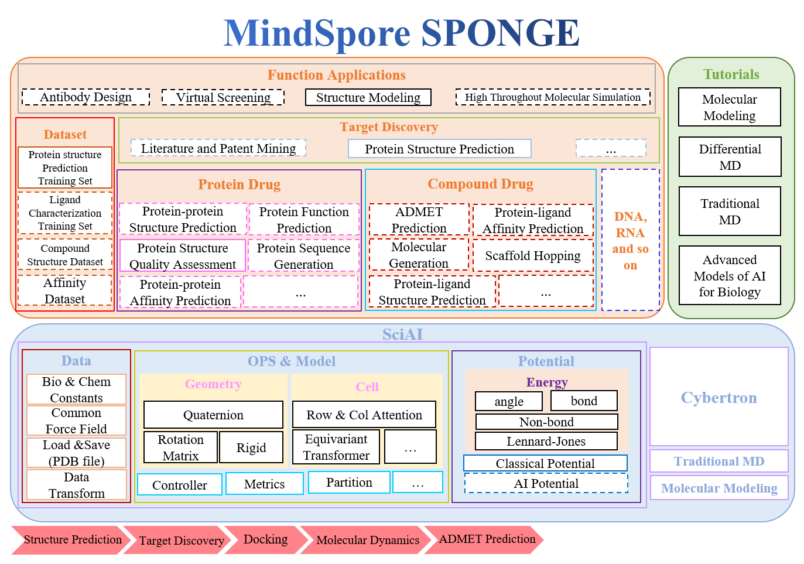

MindSPONGE Documents
====================

The molecular simulation or modeling process has a high degree
of logic consistency with the AI model training/inferring process,
so the molecular simulation can in principle be unified with the
AI training/inferring mode. MindSPONGE is a molecular simulation
library based on AI framework. It integrates molecular simulation
and AI training/inferring under the same programming structure.
The overall structure view is as follows:

   MindSPONGE Architecture

Different from traditional molecular simulation software,
AI molecular simulation library has completely new features, such as:

1. Instead of manual derivative programming, automatic differential
   technology provides a unified programming paradigm for different
   energy functions or the construction of complex scoring functions;
2. Fully compatible with neural network models, supporting AI inferring
   within molecular simulation, or simulation as an engine for AI training;
3. The end-to-end differentiable modeling method can realize
   the meta-optimization of the physical model;
4. Hierarchical code architecture, using efficient language operator
   at the bottom; Provide users with object-oriented Python API
   to facilitate user customization;
5. Automatic adaptation of multiple back-end. Users only need to write
   a simple Python code to accelerate execution on multiple back-end,
   such as GPU and NPU;
6. High-throughput simulation supported by automatic parallel. Users
   do not need to distinguish between single or multi-machine execution
   of code, can concurrently simulate multiple systems on a single
   hardware unit, without special MPI programming.

Combined with these new features, the unified framework of molecular
simulation and AI can support a wide range of molecular modeling
and application scenarios, such as:

- Molecular simulation based on AI improved force field or enhanced sampling;
- Data-driven & physics-driven molecular docking;
- Protein structure prediction and force field optimization;
- High throughput molecular simulation;
- Molecular design, etc.

Installation
------------

Recommended Hardware
~~~~~~~~~~~~~~~~~~~~

+---------------+-----------------+--------+
| Hardware      | os              | Status |
+===============+=================+========+
| Ascend 910    | Ubuntu-x86      | ✔️     |
+---------------+-----------------+--------+
|               | Ubuntu-aarch64  | ✔️     |
+---------------+-----------------+--------+
|               | EulerOS-aarch64 | ✔️     |
+---------------+-----------------+--------+
|               | CentOS-x86      | ✔️     |
+---------------+-----------------+--------+
|               | CentOS-aarch64  | ✔️     |
+---------------+-----------------+--------+
| GPU CUDA 10.1 | Ubuntu-x86      | ✔️     |
+---------------+-----------------+--------+

Dependency
~~~~~~~~~~

-  Python>=3.7
-  MindSpore>=2.0

Please refer to `MindSpore installation
tutorial <https://www.mindspore.cn/install/en>`__.

source code install
~~~~~~~~~~~~~~~~~~~

.. code:: 

    git clone https://gitee.com/mindspore/mindscience.git
    cd mindscience/MindSPONGE

-  dependency install

   .. code:: bash

      pip install -r requirements.txt

-  Ascend backend

   Enable ``c`` if you want to use Cybertron.

   .. code:: bash

      bash build.sh -e ascend -c on

-  GPU backend

   Enable ``c`` if you want to use Cybertron.

   Enable ``t`` if you want to use traditional MD.

   .. code:: bash

      export CUDA_PATH={your_cuda_path}
      bash build.sh -e gpu -j32 -t on -c on

-  Install whl package

   .. code:: bash

      cd output/
      pip install mindsponge*.whl
      pip install cybertron*.whl # if "-c on" is used

SIG
---

CO-CHAIR
~~~~~~~~

-  Shenzhen Bay Laboratory `Yi Isaac
   Yang <https://gitee.com/helloyesterday>`__
-  Chang Ping Laboratory `Jun Zhang <https://gitee.com/jz_90>`__
-  Chang Ping Laboratory `Sirui Liu <https://gitee.com/sirui63>`__

Special Interesting Group
~~~~~~~~~~~~~~~~~~~~~~~~~~~~~~

MindSpore SPONGE SIG (Special Interesting Group) is a team composed of a
group of people who are interested and have a mission to make
achievements in the field of AI × biological computing.

MindSpore SPONGE SIG group provides efficient and easy-to-use AI
computational biology software for researchers, teachers and students,
and provides a platform for people with strong abilities or strong
interests in this field to communicate and cooperate together.

At present, the SIG group has six core teachers. After members joining
the SIG group, our teachers will lead the team to carry out scientific
research and develop the software function development. Of course,
members are also welcome to do research on their own topics using
MindSPONGE.

In the SIG group, we will hold various activities, including summer
school, public lecture, technology communication meeting and other
large-scale activities. Small-scale activities like weekly meetings,
blogs writing will also be held in the group. By joining the activities,
there will be lots of chances to communicate with our experts. During
the summer school program ended on August 15th, we invited 13 teachers
to have a five-day lecture mainly including three themes of MindSpore
basics, molecular dynamics and advanced AI × Science courses. You can
get the replay
`here <https://www.bilibili.com/video/BV1pB4y167yS?spm_id_from=333.999.0.0&vd_source=94e532d8ff646603295d235e65ef1453>`__.

In the SIG group, we will also release the public intelligence task and
`open source internship
task <https://gitee.com/mindspore/community/issues/I561LI?from=project-issue>`__,
welcome everyone to claim it.

Core Contributor
~~~~~~~~~~~~~~~~

-  `Yi Qin Gao Research Group <https://www.chem.pku.edu.cn/gaoyq/>`__:
   `Yi Isaac Yang <https://gitee.com/helloyesterday>`__, `Jun
   Zhang <https://gitee.com/jz_90>`__, `Sirui
   Liu <https://gitee.com/sirui63>`__, `Yijie
   Xia <https://gitee.com/xiayijie>`__, `Diqing
   Chen <https://gitee.com/dechin>`__, `Yu-Peng
   Huang <https://gitee.com/gao_hyp_xyj_admin>`__.

Contribution Guide
------------------

-  Please click here to see how to contribute your code:\ `Contribution
   Guide <https://gitee.com/mindspore/mindscience/blob/master/CONTRIBUTION.md#>`__

.. toctree::
   :glob:
   :maxdepth: 1
   :caption: Molecular Simulation Introduction

   intro/physics_driven
   intro/data_driven
   intro/physics_plus_data_driven

.. toctree::
   :glob:
   :maxdepth: 1
   :caption: User Guide

   user/simulation
   user/structure_prediction
   user/property_prediction
   user/design
   user/basic

.. toctree::
   :maxdepth: 1
   :caption: API References

   mindsponge.cell
   mindsponge.common
   mindsponge.data
   mindsponge.metrics
   constant