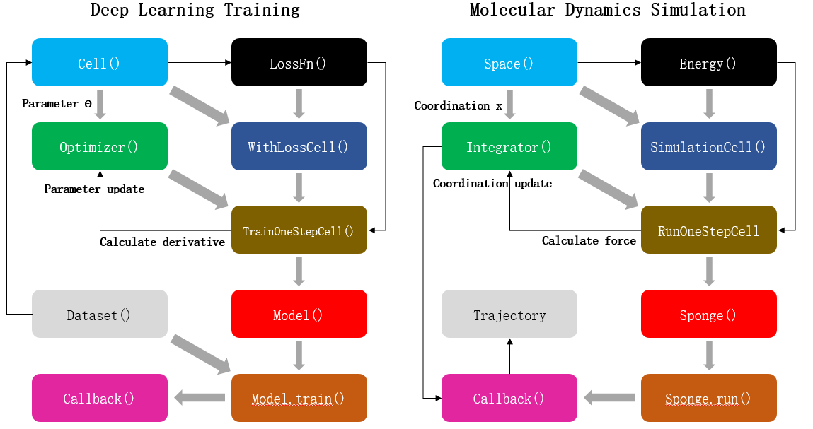

# Physics Data Fusion

The following table shows some of the most popular molecular dynamics simulation software.

|         | Prototype/First Version | Language      | Host Country of Team |
| :------ | :-------- | :------------ | :------------- |
| CHARMM  | 1969/1983 | Fortran       | America           |
| AMBER   | 1975/2002 | Fortran/C/C++ | America           |
| GROMOS  | 1978/1996 | Fortran/C++   | Switzerland           |
| GROMACS | 1991      | C             | Netherlands/Sweden      |
| LAMMPS  | 1995      | C++           | America           |
| NAMD    | 1995      | C++           | America           |
| OpenMM  | 2009      | C++/Python    | America           |

With the development of IT technology, the field of scientific computing is also changing. This is reflected in the launch of a variety of new hardware, such as GPU chip-based acceleration devices have been widely used in scientific computing, greatly speeding up the speed of scientific computing. On the other hand, the emergence of various new algorithms, especially the algorithms based on artificial intelligence (AI) represented by AlphaFold, shows that AI can achieve many previously impossible or inaccessible goals in scientific computing.

Compared with the rapid evolution of IT technology, the architecture of the aforementioned mainstream MD simulation software has hardly changed significantly. Today, these "old" MD simulation software had a number of birth defects, for example:

- The program framework is old and inflexible. If you want to add new algorithms to the original program, you often need to make significant changes to the program code.
- Most programs are written based on CPU. If you want to run these programs on computing acceleration devices such as GPU and achieve effective acceleration, you must make overall changes to the programs. Not only is the amount of work huge, but it often leads to the failure of algorithms previously developed by third-party personnel.
- The program is mostly written in C/C++or even Fortran language, which is difficult to be compatible with the current mainstream AI framework with Python as the front-end language.

These problems seriously restrict the development of MD simulation. In particular, it hinders the integration of MD simulation and AI framework. Professor Gao Yiqin's research group from Peking University, Shenzhen Bay Laboratory and Changping Laboratory cooperated with Huawei to develop a new generation of intelligent MD simulation software based on Huawei's full scene AI framework MindSpore. Compared with traditional MD simulation software, MindSPONGE based on the MindSpore framework has the following advantages:

First, with MindSpore’s "automatic differentiation" function, the code form of molecular force field can be greatly simplified. Mathematically, MD simulations use the potential energy function given by the molecular force field to calculate the force on each atom and thus simulate the trajectory of the molecule. However, code for potential functions written in a normal programming language cannot be used directly to calculate the atomic force, that is, the negative gradient of the potential function with respect to the atomic coordinates, so this part of the code must be written separately. Therefore, the traditional MD simulation software not only needs to write the code of the potential function, but also needs to solve the derivative of the potential function with respect to atomic coordinates in advance, that is, the analytical expression of the atomic force, and then write this part of the formula into the program code. This increases the amount of work, both at the theoretical level and at the coding level, and also makes the program more complex, which is one of the difficulties of writing traditional MD simulations. In addition, the need to solve the potential function manually also greatly restricts the molecular force field to adopt more complex potential function in mathematical form, otherwise the derivative of the function will be difficult to solve, which also restricts the development of the molecular force field. However, the "automatic differentiation" function of MindSpore can be used to calculate the derivative of the function directly. Therefore, it only needs to write the code of potential energy function to compile molecular force field in Mindspore. Atomic force, namely the negative gradient of potential energy function to atomic coordinates, can be calculated directly through automatic differentiation without any need to write separate code. This not only greatly reduces the coding workload, but also greatly simplifies the complexity of MD simulation program structure, and greatly broadens the range of mathematical models that can be used for molecular force field.

Secondly, it can greatly simplify the adaptation of software to different hardware devices. MD simulation software is a kind of scientific computation program with a large amount of computation, so in practice, it often needs to carry out parallel computation, or use GPU and other computing acceleration equipment for calculation. For traditional MD simulation programs, in addition to the "scientific" functions, the "engineering" work such as parallelizing the program or porting the GPU device is the most complex and difficult part of the entire software project. This forces developers to be both scientists and engineers, resulting in a long and difficult learning cycle to become a qualified MD simulation programmer. The MindSpore itself supports a variety of hardware devices, enabling the MindSPONGE to run on a CPU, GPU and Huawei's Ascend chip and be portable to different hardware devices with just one line of code change. In addition, because of its "automatic parallelism" capability, MindSpore allows the sponge to implement parallel calculations of programs with a simple change of code. So the researchers used the MindSPONGE to develop their algorithms, allowing them to focus more on the "scientific" function of the program.

Finally, "end-to end differentiable" enabling MD simulations can do a lot of things that traditional MD simulations simply can't. "End to end Differentiable" MD simulation means that the whole process of MD simulation from input coordinates to calculation force and update coordinates is differentiable, which is a revolutionary technology for MD simulation. Using traditional MD simulation, the relationship between the final simulation results and input coordinates or parameters cannot be directly known. Once the simulation results do not meet expectations, researchers can only adjust the initial coordinates or program parameters through personal experience, and then repeat the simulation until the ideal results are obtained. In the "end-to-end differentiable" MD simulation, because the derivative of the output results relative to the input coordinates or parameters can be directly solved, researchers can directly optimize the MD simulation process itself just like the general AI optimization algorithm, so as to obtain ideal results and avoid the "trial and error" process. This is a kind of "meta-optimization" process. For example, in the famous protein structure prediction program AlphaFold2, the optimization algorithm of protein scoring function is a kind of "meta-optimization" algorithm.

Therefore, compared with traditional MD simulation software, AI-based MD simulation is simpler, more efficient in development and more "intelligent" in use. We also designed a unique program architecture for MindSPONGE that completely turns MD simulation into a special AI training process, enabling a truly "intelligent" molecular dynamics simulation. Before introducing this unique program architecture, let's consider the question: Is MD simulation similar to AI training? At first glance, it may seem like there is no direct relationship between AI and MD, but if you think about it carefully, you'll see that both are actually doing some kind of "optimization":

*FIG. 1 Comparison between deep learning training and molecular dynamics simulation. Left: Schematic diagram of neural network parameter training process based on MindSpore artificial intelligence framework. Right: Schematic diagram of molecular dynamics simulation process based on MindSPONGE. Each block represents a program module, the gray arrows represent the module composition process, and the black arrows represent the data update process.*

As shown in the figure above, the process of AI training is that the optimizer takes loss function as the optimization objective and updates the parameters of the network model by calculating the gradient of neural network parameters. The MD simulation is an integrator to calculate the atomic force according to the potential function, that is, the negative gradient of the potential function to the atomic coordinate, so as to update the atomic coordinate of the system. Therefore, MD simulation can be regarded as a special AI training process. The only difference between this process and general AI training is that training dataset does not need to be provided separately during MD simulation. In other words, the atomic coordinates of the system themselves are both "parameters" and "training datasets". Therefore, MD simulation can be regarded as a special AI training process to some extent. MD simulation software written using this "AI-like" architecture can not only be compatible with various operators and functional modules of AI framework to the greatest extent, but also have the following advantages:

1. Fully modular programming. Each of MindSPONGE's functional modules can be replaced and developed separately, making it easy for developers to add their own algorithms to their programs. At the same time, it also allows users to assemble modules freely according to their own needs, so as to achieve a variety of different functions.
2. High throughput simulation can be realized. mini-batch training is one of the most basic functions of AI framework. MindSPONGE, which adopts the "AI-like" framework, can also achieve the "mass" of MD simulation, that is, high-throughput calculation.
3. Natural "end-to-end differentiable" processes. "End-to-end differentiable" MD simulation is a revolutionary MD simulation method, which can realize many functions that traditional MD cannot provide, such as force field optimization.