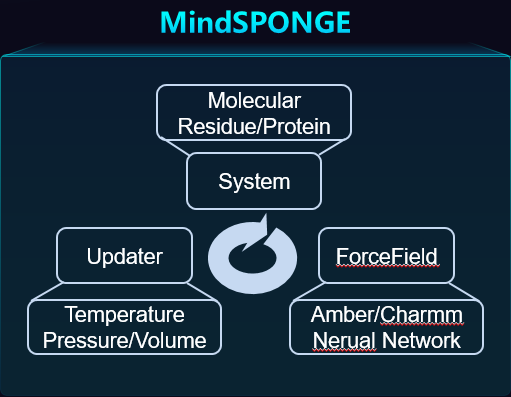

# Why We Need Next Generation Molecular Simulation Software

## Molecular dynamics simulation

Molecular Dynamics is a scientific computing tool to simulate the microscopic movement of molecules according to the potential energy function described by the molecular force field, so as to calculate the physical and chemical properties of the molecular system. At present, MD simulation is widely used in chemistry, biology, physics, pharmacy, materials, environment and other fields.

As early as the 1960s and 1970s, MD simulation programs for specific systems have appeared. After decades of development, there are many general-purpose MD simulation software on the market. Most of them have decades of development history and mature products. Most of these software are developed by western developed countries, especially the software developed by the United States accounts for more than half.

The number of domestic MD simulation software is very small, and the user group is basically limited to a small range. It can be said that there is still a big gap with these "popular" MD simulation software.

## Congenital defects of "popular" MD simulation software

- The program framework is old and inflexible. If you want to add new algorithms to the original program, you often need to make significant changes to the program code.

- Most programs are written based on CPU. If you want to run these programs on computing acceleration devices such as GPU and achieve effective acceleration, you must make overall changes to the programs. Not only is the amount of work huge, but it often leads to the failure of algorithms previously developed by third-party personnel.

- The program is mostly written in C/C++or even Fortran language, which is difficult to be compatible with the current mainstream AI framework with Python as the front-end language.

These problems seriously restrict the development of MD simulation. In particular, the compatibility of the last item with the AI framework is a technical barrier that seriously hinders AI technology from "intelligentizing" the transformation of MD simulation.

## MD simulation software completely based on AI framework

In order to fundamentally solve the inherent defects of MD simulation software, it is necessary to develop MD simulation software completely based on AI framework to realize the seamless combination of AI algorithm and MD simulation.

Over the past few decades, the development of IT technology is changing rapidly, and the scientific computing field is also changing. On the one hand, it is reflected in the introduction of various new hardware. For example, GPU based acceleration devices have been widely used in scientific computing, greatly accelerating the speed of scientific computing. On the other hand, the emergence of various new algorithms, especially those based on AI (artificial intelligence) represented by AlphaFold, shows that AI can achieve many goals that were once unattainable or unattainable in scientific computing.

In China, Huawei worked with Professor Gao Yiqin to develop a new generation of intelligent MD simulation software MindSPONGE based on Huawei's full scene AI framework MindSpot.

Compared with traditional MD simulation software, MindSPONGE, an "intelligent" MD simulation software based on AI framework MindSpot, has several advantages:

- With MindSpot's "automatic differentiation" function, the code form of molecular force field can be greatly simplified.

- The program based on MindSpot can greatly simplify the adaptation of software to different hardware devices.

- "End to end differentiable" MD simulation program.

## Simplifying the code form of molecular force field based on automatic differentiation

Mathematically, MD simulation calculates the force on each atom through the potential energy function given by the molecular force field, so as to simulate the molecular trajectory. However, the potential energy function code written in general programming language cannot be directly used to calculate the atomic force, that is, the negative gradient of atomic coordinates relative to the potential energy function.

Therefore, the traditional MD simulation software not only needs to write the code of the potential energy function, but also needs to solve the derivative of the potential energy function to the atomic coordinates in advance, that is, the analytical expression of the atomic force. Therefore, the workload of both theoretical derivation and code writing will increase significantly, and the program will become more complex, which is also one of the difficulties in writing traditional MD simulation programs.

In addition, the need to solve the potential energy function manually also greatly restricts the molecular force field to use the potential energy function with more complex mathematical form, otherwise the derivative of its function will be difficult to solve, which also restricts the development of the molecular force field.

MindSpot's "automatic differentiation" function can directly calculate the derivative of the function. Therefore, it is only necessary to write the code of the potential energy function to write the molecular force field based on MindSpot. The atomic force, that is, the negative gradient of the atomic coordinate to the potential energy function, can be directly calculated through "automatic differentiation", which not only greatly reduces the workload of code writing, but also greatly simplifies the complexity of the MD simulation program structure, At the same time, it greatly broadens the range of mathematical models that can be used for molecular force field.

## Simplify software adaptation to different hardware devices

MD simulation software is a kind of scientific computing program with huge amount of computation. Therefore, it is often necessary to perform parallel computing or use computing acceleration devices such as GPU in practical use.

For the traditional MD simulation program, after realizing the "scientific" function of the program, the "engineering" work such as parallelizing the program or porting GPU devices is the most complex and difficult part in the entire software project.

MindSpot can run on CPU, GPU and Ascend AI acceleration chip. Programs written with MindSpot can be ported to different hardware devices with only one line of code modified. In addition, MindSpot also has the ability of "automatic parallelism", which can automatically realize the parallel calculation of programs by simply modifying the code.

Therefore, the development of MD simulation program based on MindSpot can enable scientists to focus on the "scientific" function of the program, while leaving the "engineering" problems to MindSpot itself to deal with.

## "End to end differentiable" MD simulation program

MindSpot has the ability of "high-order automatic differentiation", can automatically solve the high-order derivatives of functions, and can write "end-to-end differentiable" MD simulation program.

"End to end differentiable" MD simulation means that the whole process of MD simulation is differentiable from input coordinates to computing forces to updating coordinates, which is a revolutionary technology for MD simulation. In the "end-to-end differentiable" MD simulation, because the derivative of the output results relative to the input coordinates or parameters can be directly solved, researchers can directly optimize the MD simulation process itself like running the general AI optimization algorithm, so as to obtain ideal results and avoid the process of "repeated attempts". This is a "meta optimization" process.

"End to end differentiability" is considered as an important feature of the next generation of MD simulation.

## MD simulation software written with "AI like" architecture

Compared with traditional software, MD simulation software based on AI framework is simpler in architecture, more efficient in development, and more "intelligent" in use. It can also achieve many functions that traditional software cannot achieve. After careful consideration, we will find that there are many similarities between AI training and MD simulation, which seem to be completely different processes.

As shown in the figure, the AI training process is that the optimizer takes the loss function as the optimization objective, calculates the gradient of neural network parameters through the training dataset provided, and updates the parameters of the network model. In MD simulation, the integrator calculates the atomic force according to the potential energy function, that is, the negative gradient of the potential energy function relative to the atomic coordinates, so as to update the atomic coordinates. Therefore, MD simulation can be regarded as a special AI training process to some extent. This kind of MD simulation program written according to the AI training process is called "AI like" framework MD simulation program.

The MD simulation program of this "AI like" framework also has the advantages of modularity, high throughput, and "end-to-end differentiability". At present, MindSPONGE, developed by Huawei and Professor Gao Yiqin, is a next-generation intelligent MD simulation software based on this architecture.

