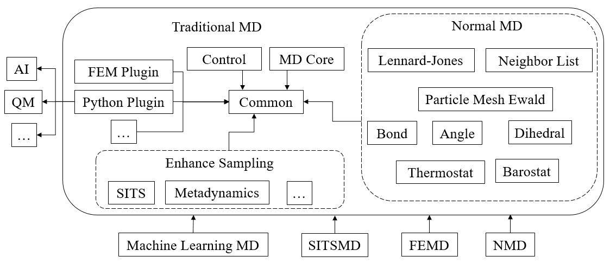
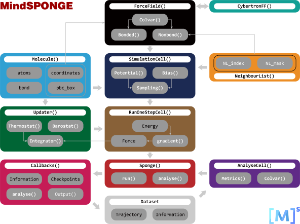

# Physics-driven

<a href="https://gitee.com/mindspore/docs/blob/master/docs/mindsponge/docs/source_en/sponge.md" target="_blank"></a>

Two kinds of molecular dynamics simulation software are built in MindSPONGE software package. The first is a traditional molecular dynamics simulation software based on C++/CUDA, and the second is a micro molecular dynamics simulation software based on traditional molecular dynamics and completed by MindSpot.

## Traditional Molecular Dynamics

Traditional molecular dynamics is a molecular dynamics simulation program based on C++/CUDA. Unlike other traditional molecular dynamics simulation software, traditional molecular dynamics has the characteristics of modular programming, strong readability of code, and easy for developers and users to make personalized modifications. The structure of traditional molecular dynamics is shown in the figure below:



### Install

Please refer to [MindSPONGE Installation Tutorial](https://www.mindspore.cn/mindsponge/docs/en/master/intro.html#installation).

Traditional molecular dynamics installation can be compiled and installed using source code.

```bash
git clone https://gitee.com/mindspore/mindscience.git
cd {PATH}/mindscience/MindSPONGE
```

Turn on the compile option when using traditional molecular dynamics `t`。

```bash
bash build.sh -e gpu -j32 -t on
```

Install the compiled whl package.

```bash
cd {PATH}/mindscience/MindSPONGE/output
pip install mindscience_sponge*.whl
```

### Basic usage

The basic process of traditional molecular dynamics is:

1. The terminal outputs the initialization information used by each module first.

2. The program formally starts to run the simulation.

3. Output energy, temperature and other system information according to a certain number of simulation iteration steps.

4. After running, output the running time and estimated calculation speed.

The tip4p water model in traditional molecular dynamics can be directly run by inputting the simplest command.

```bash
./SPONGE
```

"mdin.txt"file renamed to"mdin.txt1"。

```bash
./SPONGE -mdin mdin.txt1
```

The regulation parameter A=B in the XXX file of - mdin XXX is equivalent to adding the instruction - A B on the command line. For example:

```bash
./SPONGE -mdin mdin.txt -dt 2e-3
```

In the command file

```bash
{
    A=B
    C=D
}
```

the format of this, equivalent to:

```bash
XXX_A=B
XXX_C=D
```

Basic input and output file parameters of molecular simulation system:

```bash
mdout=mdout.txt     #Record various parameters such as energy and temperature
mdinfo=mdinfo.txt   #Record various parameter information files of the whole simulation at initialization and completion
box=box.txt         #Document recording the periodic box size information of the system
crd=mdcrd.dat       #Document recording atomic coordinates of the system
rst=restart         #Document recording the current speed and coordinates of the system

# Initial coordinate and velocity of the system
coordinate_in_file = tip4p_2880_system/Ih_coordinate.txt
velocity_in_file = tip4p_2880_system/Ih_velocity.txt

# Various basic topology information of the system
residue_in_file = tip4p_2880_system/Ih_residue.txt
mass_in_file = tip4p_2880_system/Ih_mass.txt
charge_in_file = tip4p_2880_system/Ih_charge.txt
LJ_in_file = tip4p_2880_system/Ih_lj.txt
exclude_in_file = tip4p_2880_system/Ih_exclude.txt
virtual_atom_in_file = tip4p_2880_system/Ih_vatom.txt
bond_in_file = tip4p_2880_system/Ih_bond.txt
```

The force field topology information and coordinate velocity information can also be obtained from Amber format files.

```bash
-amber_parm7
-amber_rst7
```

### Case

Get in the code warehouse [Traditional Molecular Dynamics Course](https://gitee.com/mindspore/mindscience/tree/master/MindSPONGE/applications/molecular_dynamics/tradition) .

## Micromolecular dynamics

Micromolecular dynamics is a modular, high-throughput, end-to-end differentiable next-generation intelligent molecular simulation library based on MindSpot. As mentioned at the beginning, AI training and MD simulation, which seem to be completely different processes, have many similarities. Micromolecular dynamics software is a molecular dynamics simulation software derived from the "AI like" framework completed by the idea.

The structure of micromolecular dynamics is shown in the figure below:



### Install

The installation process of micromolecular dynamics is consistent with that of MindSPONGE. Please refer to [MindSPONGE Installation Tutorial](https://www.mindspore.cn/mindsponge/docs/en/master/intro.html#installation).

### Basic usage

The basic application methods of micromolecular dynamics can be referred to [Initial experience of the case](https://www.mindspore.cn/mindsponge/docs/en/master/intro.html#examples) and subsequent API introduction documents [MindSPONGE APIs](https://www.mindspore.cn/mindsponge/docs/zh-CN/master/mindsponge.callback.html).

### Case

Available in the code warehouse [Course in Micromolecular Dynamics](https://gitee.com/mindspore/mindscience/tree/master/MindSPONGE/tutorials/basic) .
