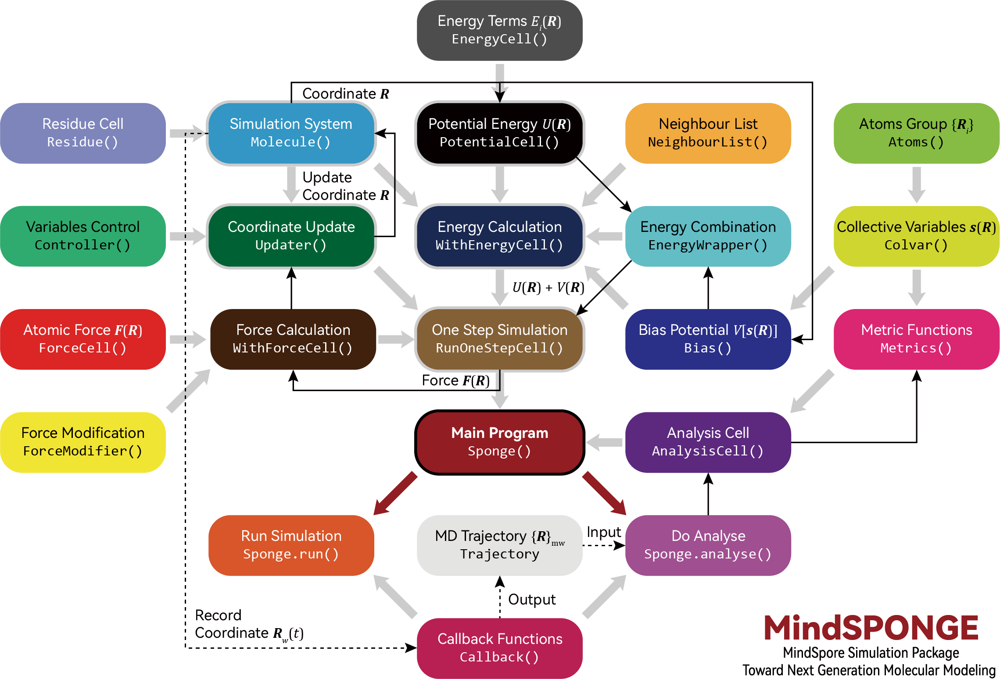

# Molecular Simulation

<a href="https://gitee.com/mindspore/docs/blob/r2.0.0-alpha/docs/mindsponge/docs/source_en/user/simulation.md" target="_blank"></a>

MindSPONGE has adopted a unique "AI-like" molecular simulation program architecture:



The feature of the architecture is that it turns molecular simulation into a special AI training process, which allows MindSPONGE perform molecular dynamics simulations in the same way that MindSpore can for training network models.

Firstly, both MindSpore and MindSPONGE require three basic cells or function modules, and there is a one-to-one correspondence between them:

| MindSpore | | MindSPONGE | |
| :-------- | :--------- | :--------- | :--------- |
| Model | network | System | system |
| Loss Function | loss_fn | Potential Function | potential |
| Optimizer | optimizer | Updater | updater |

Once the three functional modules are set up, they need to be encapsulated so that training or simulation can be performed.

For example, the code for a typical MindSpore training network would be:

```python
from mindspore.nn import WithLossCell
from mindspore.train import Model
from mindspore.train import LossMonitor
from mindspore.train import ModelCheckpoint, CheckpointConfig
# Combination Method 1:
model = Model(network, loss_fn, optimizer)
# Combination Method 2:
loss_net = WithLossCell(network, loss_fn)
model = Model(loss_net, optimizer=optimizer)
# Set Callback function：
monitor_cb = LossMonitor(16)
ckpoint_cb = ModelCheckpoint('network', config=CheckpointConfig(32))
# Perform training process：
model.train(1024, dataset, callbacks=[monitor_cb, ckpoint_cb])
```

The code for molecular dynamics simulations using MindSPONGE is very similar to the code above:

```python
from mindsponge import SimulationCell
from mindsponge import Sponge
from mindsponge.callback import RunInfo
from mindsponge.callback import WriteH5MD
# Combination Method 1:
md = Sponge(system, potential, updater)
# Combination Method 2:
sim = SimulationCell(system, potential, cutoff=1.0)
md = Sponge(sim, optimizer= updater)
# Set Callback function：
run_info = RunInfo(10)
cb_h5md = WriteH5MD(system, 'traj.h5md', save_freq=10)
# Perform training process：
md.run(1000, callbacks=[run_info, cb_h5md])
```

It can be seen that there are two encapsulation methods in MindSpore. One is to directly use the top-level module Model of MindSpore to encapsulate the network model, loss function loss_fn and optimizer, which is suitable for the simplest training of supervised learning. The other encapsulation method is to first use the WithLossCell module to wrap the network Model and loss function loss_fn, and then use the Model module to wrap the wrapped WithLossCell module and optimizer. This situation applies to more complex training. For example, the training of generative adversarial networks (GANs) using MindSpore can be implemented through the heavy-load mode of WithLossCell.

Sponge is the top module used by MindSPONGE to encapsulate the three functional modules. There are also two ways to encapsulate the three basic units. The first one is to directly encapsulate the simulation system, potential energy function and updater with Sponge, which is also suitable for the most common simulation. In the other one, SimulationCell is used to encapsulate the simulation system and potential function, and then the encapsulated SimulationCell and updater are wrapped in Sponge. In this case, some complex simulation functions can be realized by adjusting SimulationCell parameters, such as adjusting cutoff radius and setting bias potential, etc.

After encapsulating the three basic units, MindSpore executes the training process by calling the train() function of the Model module, while MindSPONGE executes the simulation process by calling the run() function of the Sponge module. In MindSpore, different callback functions can be used to process the information in the training process (without changing the calculation diagram). For example, LossMonitor() function can be used to monitor the parameter changes in the training process, and ModelCheckpoint() function can be used to save network parameters. However, MindSPONGE can also use a callback function to process information during simulation. For example, RunInfo() function is used to print parameter information during training, and WriteH5MD() is used to record the changes of system coordinates during simulation as a simulation trajectory.

## System(Molecule) Module

The system (molecular) module is used to describe the chemical properties of the molecular system, such as chemical composition, topological information, spatial coordinates, etc. System simulation of the basic class (parent) is mindsponge system. The Molecule, it contains the main parameters are:

- atom_name: Indicate the atom name of each atom in the system, which is used to distinguish different atoms
- atom_type: Specify the atom type of each atom in the system, which is used to set force field parameters
- Atomic mass (atom_mass) : Specify the mass of each atom in the system
- atom_charge: Point charge of each atom in the system
- coordinate: The space coordinate of the atom of the system
- Periodic box (pbc_box) : Size of periodic boundary condition "protocell" box
- bond: Bond connection between atoms (single and double bonds are not distinguished)
- residue: Used to distinguish between molecular fragments in macromolecules or different molecules in the system. (The concept of residue in Molecule is similar to that of residue in the PDB document. Each residue can be used to represent not only a single amino acid residue but also a single small molecule, such as water and inorganic salt ions.)

The Molecule class can be initialized by passing in the above arguments artificially:

```python
from mindsponge import Molecule

system = Molecule(
    atom_name=['O', 'H1', 'H2'],
    atom_type=['OW', 'HW', 'HW'],
    atom_mass=[16, 1.008, 1.008],
    coordinate=[
        [0, 0, 0],
        [0.1, 0, 0],
        [-0.0333, 0.0943, 0]
        ],
    bond=[[[0, 1], [0, 2]]],
)
```

For Protein molecules, the protein class, a subclass of Molecule, can be initialized by reading the PDB file:

```bash
    from mindsponge import Protein
    system = Protein(pdb='protein.pdb')
```

## Potential (Force Field) Module

Simulation module is used to describe the potential energy function used in simulation process. The basic class (parent) of potential energy is mindsponge.potential.PotentialCell. However, in the classical molecular simulation, force field is used as the potential energy function, and in MindSPONGE, it is a force field module. Force field module is the basic class for mindsponge.potential.ForceFieldBase, it's a subclass for PotentialCell. The classical molecular force field generally contains different energy terms, the common energy terms include bond length, bond angles, dihedral angles, Coulomb interaction, van der Waals interaction and so on. Some of the commonly used energy are embedded in mindsponge.potential.energy, these energy terms can be put into ForceFieldBase as a list to initialize the class:

```python
from mindsponge import ForceFieldBase
from mindsponge.potential.energy import *
bond_energy = BondEnergy(bond_index, force_constant=rk_init, bond_length=req_init)
angle_energy = AngleEnergy(angle_index, force_constant=tk_init, bond_angle=teq_init)
dihedral_energy = DihedralEnergy(dihedral_index, force_constant=pk_init, periodicity=pn_init, phase=phase_init)
ele_energy = CoulombEnergy(atom_charge=system.atom_charge)
vdw_energy = LennardJonesEnergy(sigma=sigma, epsilon=epsilon)
potential = ForceFieldBase(
    energy=[bond_energy,
            angle_energy,
            dihedral_energy,
            ele_energy,
            vdw_energy],
)
```

For the complete set of molecular force field, ForceField class, a subclass of ForceFieldBase, can also be used to initialize by passing system module and force field parameter file, such as establishing a potential function of AMBER FF14SB force field:

```bash
    from mindsponge import ForceField
    potential = ForceField(system, 'AMBER.FF14SB')
```

The string 'AMBER.FF14SB' here is essentially the filename of a YAML format force field parameter file. The rules of MindSPONGE reading the force field parameters is that, first of all, in the current directory to find whether there is a file with the same name. If there exists the file, read it. If there is no file, it will continue to search in MindSPONGE.data.forcefield directory and read the same file.

Note that if ForceField class is used to build a potential function, then its initialization process will reconstruct force-related parameters such as the atom type of the incoming system (molecular) module system. This is because atom types of different molecular force fields are often different. However, when using system modules for modeling, MindSPONGE does not require specifying molecular force field before modeling like most traditional MD simulation software. Therefore, in many cases, the system (molecular) module does not set atom_type when initializing, so when ForceField is used to create a potential function, The atomtype (atom_type), charge (atom_charge), and mass (atom_mass) are automatically set according to the atom name (atom_name) in the system (molecule) module.

## Updater (Optimizer) Module

In MindSPONGE, the Updater is used to update the atomic coordinates of the simulation system during the simulation process. The Updater is essentially an optimizer. Its basic class mindsponge.optimizer.Updater is also a subclass of mindspore.nn.Optimizer. In fact, MindSpore optimizers such as Adam can be used directly as the upgrader of MindSPONGE, and the simulation process is equivalent to energy minimization of the simulation system.

And MindSPONGE's Updater allows for fine-tuning of the simulation using different controllers. The controller, whose basic class is mindsponge.control.Controller, can be used to adjust and update seven variables of coordinate, velocity, force, energy, kinetic energy, virial and PBC box in the simulation process. Common controllers include the Integrator, Thermostat, Barostat, and Constraint. The Updater of the base class can be initialized by accepting a list of controller classes and updating the parameters in the order of the controllers in the list during the simulation:

```python
from mindsponge import Updater
from mindsponge.control import VelocityVerlet
from mindsponge.control import Langevin
from mindsponge.control import BerendsenBarostat
from mindsponge.control import Lincs

integrator = VelocityVerlet(system, thermostat=Langevin(system, 300))

opt = Updater(
    system,
    controller=[
    integrator,
        Lincs(system, 'h-bonds’),
        BerendsenBarostat(system, 1)
    ],
velocity=velocity,
time_step=1e-3,
)
```

For general molecular dynamics simulations, you can use a subclass of the Updater, mindsponge.control.MolecularDynamics as an update and set up an integrator, thermostat, barostat, and constraint to initialize it:

```python
from mindsponge import MolecularDynamics
from mindsponge.control import VelocityVerlet
from mindsponge.control import Langevin
from mindsponge.control import BerendsenBarostat
from mindsponge.control import Lincs

opt = MolecularDynamics (
    system,
    integrator=VelocityVerlet(system),
    thermostat=Langevin(system, 300),
    barostat=BerendsenBarostat(system, 1),
    constraint=Lincs(system, 'h-bonds'),
    velocity=velocity,
    time_step=1e-3,
)
```

## SimulationCell

s mentioned above, in addition to directly using the top module Sponge of MindSPONGE to encapsulate three functional modules, namely system (molecule) module, potential energy (force field) module and refresher (optimizer) module, SimulationCell can also be used to encapsulate the system (molecular) module and potential energy (force field) module. Besides encapsulating two modules, SimulationCell can also set neighbour list, bias potential and post-processing mode of potential energy (wrapper) when initializing:

```python
from mindsponge import SimulationCell
from mindsponge.partition import NeighbourList
from mindsponge.potential.bias import MetaD
from mindsponge.core.wrapper import ReplicaExchange

neighbour_list = NeighbourList(system, cutoff=1, use_grids=True)

simulation = SimulationCell(
    system=system,
    potential=potential,
    neighbour_list=neighbour_list,
    bias=MetaDynamics(colvar=colvar),
    wrapper=ReplicaExchange(steps=100),
    )
```

## Callback

In the AI framework, callback function is used to carry out some operations without changing the calculation graph, such as monitoring and recording the change of the loss function in the training process, verifying whether the parameters in the training process are up to standard, and stopping the training process according to the verification result. In MindSPONGE, Callback can also be used to implement operations that do not affect the simulation process, such as monitoring important simulation parameters, recording simulation tracks, calculating physical quantities and CVs (collective variables) in the simulation process, etc.

Currently, MindSPONGE has two built-in Callback functions:

- RunInfo: Used to print intermediate quantities of the simulation process, such as energy, temperature, pressure, etc.

- WriteH5MD: Output simulation track in H5MD format.

## Simulation Track File: H5MD

MindSPONGE uses H5MD as the default file format for recording analog tracks. H5MD (HDF5 Molecular Data) is a MD simulation trajectory file Format based on HDF5 (Hierarchical Data Format 5) format proposed by Dr Pierre de Buyl and others from the Free University of Brussels in Belgium in 2014 (de Buyl, P.; Colberg, P. H.; Höfling, F. H5MD: A Structured, Efficient, and Portable File Format for Molecular Data [J]. Comput Phys Commun 2014, 185(6): 1546-1553.).

Jonas Landsgesell and Sascha Ehrhardt of the University of Stuttgart, Germany, have developed an [VMD plug-in](https://github.com/h5md/VMD-h5mdplugin) that allows us to view a simulation trace file in the H5MD format. However, this plugin is buggy and has not been updated since 2019. We forked the [original repository](https://gitee.com/helloyesterday/VMD-h5mdplugin), fixed bugs, and made some minor changes to the original program, adding functions such as unit conversion of coordinates, and changing the default file extension from.h5 to.h5MD. [MDAnalysis](https://www.mdanalysis.org/) can also be used to read the simulated trajectory information of the H5MD file.

Thanks to the multi-tiered data structure of HDF5, H5MD itself is highly scalable, in addition to recording simulation tracks, and can record relevant data during simulation. MindSPONGE recorded potential energy, kinetic energy, temperature, pressure and other information in the simulation process in the observables directory of H5MD file. This information can be viewed using some HDF5 readers, such as the [Silx Viewer](https://www.silx.org/doc/silx/latest/):


## Tutorial

A tutorial on molecular dynamics simulations using the MindSPONGE is available at [MindScience](https://gitee.com/mindspore/mindscience/tree/r0.2.0-alpha/MindSPONGE/tutorials/basic).