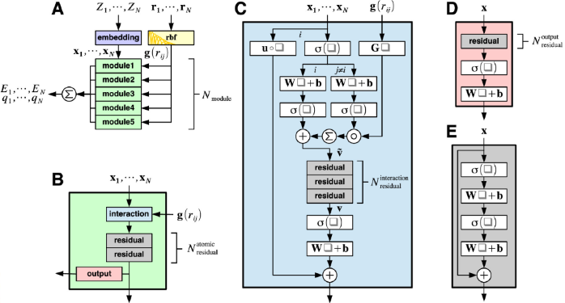
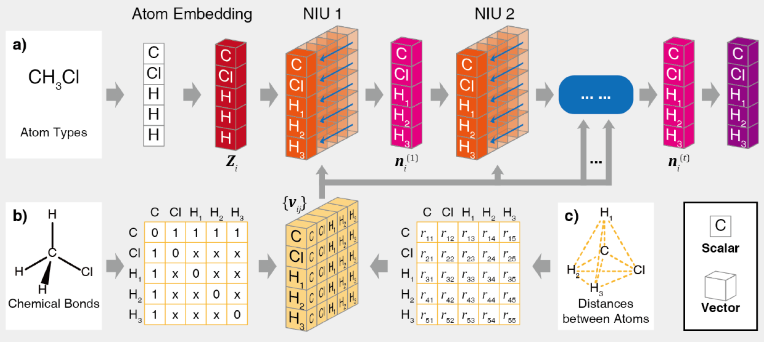

# 物理+数据驱动

<a href="https://gitee.com/mindspore/docs/blob/master/docs/mindsponge/docs/source_zh_cn/cybertron.md" target="_blank"></a>

MindSPONGE软件包中包含基于MindSpore的深度分子模型通用架构Cybertron，可以支持基于图神经网络(GNN)的深度分子模型。

Cybertron中内置三种GNN分子模型： SchNet[1]、 PhysNet[2]以及MolCT[3]。

## 三种GNN分子模型

- SchNet模型架构

  

- PhysNet模型架构

  

- MolCT模型架构

  

三种GNN分子模型均可从Cybertron中直接调用。

## 安装

请参考[MindSPONGE安装教程](https://www.mindspore.cn/mindsponge/docs/zh-CN/master/intro.html#%E5%AE%89%E8%A3%85%E6%95%99%E7%A8%8B)，确保前置依赖已安装完成。

Cybertron安装可使用源码编译安装。

```bash
git clone https://gitee.com/mindspore/mindscience.git
cd {PATH}/mindscience/MindSPONGE
```

在使用Cybertron时，开启编译选项`c`。

```bash
bash build.sh -e gpu -j32 -t on -c on
```

安装编译所得whl包。

```bash
cd {PATH}/mindscience/MindSPONGE/output
pip install mindscience_sponge*.whl
pip install mindscience_cybertron*.whl
```

Cybertron安装完成。

## 初始化

Cybertron网络由模型和Readout函数两部分组成，网络的初始化可以直接由字符串进行调用，使用默认超参数，或者也可以单独定义后传入网络中。

- 直接使用字符串调用

  ```bash
  net = Cybertron(model='schnet', readout='graph'. dim_output=1, num_atoms=num_atom)
  ```

- 单独定义模型和参数后再传入Cybertron

  ```bash
  mod = MolCT(cutoff=1. n_interaction=3, dim_feature=128, activation='swish')
  readout = AtomwiseReadout(model=mod, dim_output=1)
  net=Cybertron(model=mod, readout=readout, dim_output=1, num_atoms=num_atom)
  ```

## 教程

请参考代码仓中的[Cybertron教程](https://gitee.com/mindspore/mindscience/tree/master/MindSPONGE/tutorials/cybertron)。

Cybertron tutorials所需数据集：

- 下载[dataset_qm9.npz](http://gofile.me/6Utp7/tJ5hoDIAo)

- 下载[ethanol_dft.npz](http://gofile.me/6Utp7/hbQBofAFM)

如需获取最后一个案例的checkpoint，可在终端运行如下指令。

```bash
wget https://download.mindspore.cn/mindscience/mindsponge/ckpts/Cybertron/checkpoint_c10.ckpt
```

## 参考文献

[1] Kristof T. Schütt, et al. [SchNet: A continuous-filter convolutional neural network for modeling quantum interactions](https://arxiv.org/abs/1706.08566).

[2] Oliver T. Unke, et al. [PhysNet: A Neural Network for Predicting Energies, Forces, Dipole Moments and Partial Charges](https://arxiv.org/abs/1902.08408).

[3] Jun Zhang, et al. [Molecular CT: Unifying Geometry and Representation Learning for Molecules at Different Scales](https://arxiv.org/abs/2012.11816).
